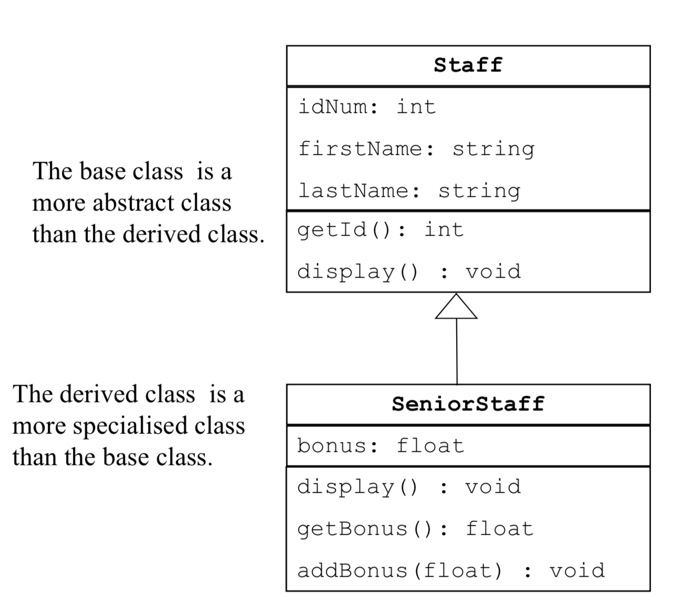
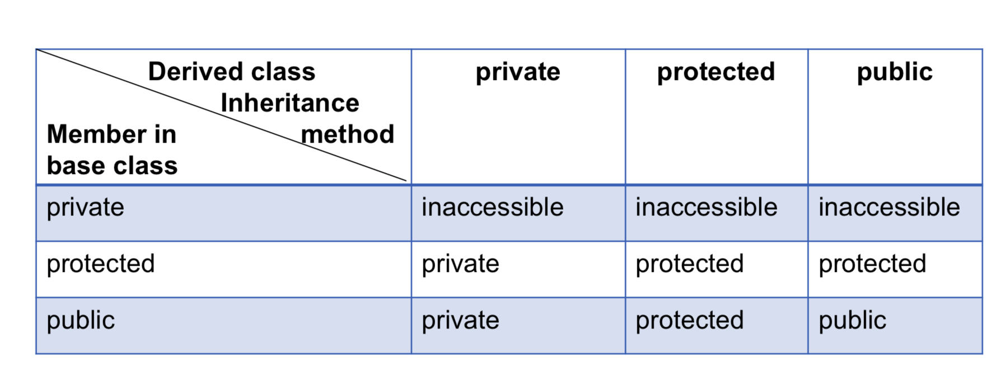
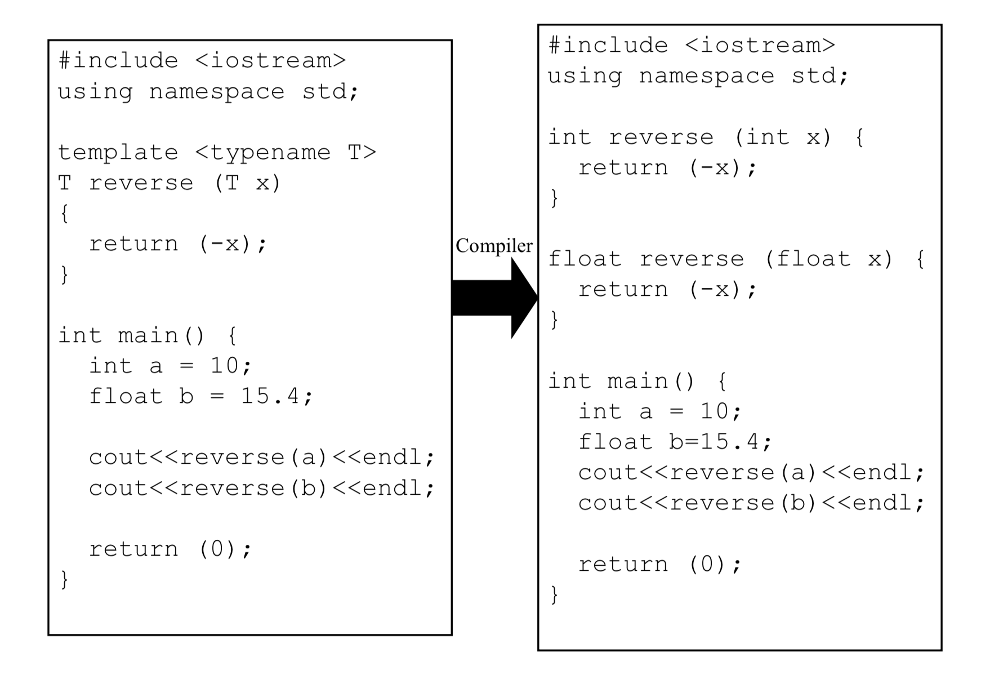

# System ReView For C++

- [A System Review For C++](#a-system-review-for-c)
  - [内存分区](#%E5%86%85%E5%AD%98%E5%88%86%E5%8C%BA)
  - [指针 Pointer](#%E6%8C%87%E9%92%88-pointer)
  - [引用 Ref](#%E5%BC%95%E7%94%A8-ref)
  - [数组 Array](#%E6%95%B0%E7%BB%84-array)
  - [智能类型 Auto](#%E6%99%BA%E8%83%BD%E7%B1%BB%E5%9E%8B-auto)
  - [New](#new)
- [Abstract Data Type](#abstract-data-type)
  - [Struct](#struct)
  - [Union](#union)
  - [Class](#class)
    - [构造函数 Constructor](#%E6%9E%84%E9%80%A0%E5%87%BD%E6%95%B0-constructor)
    - [析构函数 destructors](#%E6%9E%90%E6%9E%84%E5%87%BD%E6%95%B0-destructors)
    - [拷贝构造函数 Copy Construstor](#%E6%8B%B7%E8%B4%9D%E6%9E%84%E9%80%A0%E5%87%BD%E6%95%B0-copy-construstor)
    - [拷贝赋值运算符 重载 Copy assignment operator](#%E6%8B%B7%E8%B4%9D%E8%B5%8B%E5%80%BC%E8%BF%90%E7%AE%97%E7%AC%A6-%E9%87%8D%E8%BD%BD-copy-assignment-operator)
    - [浅拷贝 Shallow Copy](#%E6%B5%85%E6%8B%B7%E8%B4%9D-shallow-copy)
    - [深拷贝 Deep Copy](#%E6%B7%B1%E6%8B%B7%E8%B4%9D-deep-copy)
- [Overload 重载](#overload-%E9%87%8D%E8%BD%BD)
  - [函数重载](#%E5%87%BD%E6%95%B0%E9%87%8D%E8%BD%BD)
  - [operator (运算符) 重载](#operator-%E8%BF%90%E7%AE%97%E7%AC%A6-%E9%87%8D%E8%BD%BD)
    - ['+' overload](#-overload)
    - ['=' overload](#-overload)
    - ['<<' overload ( ">>" 同理)](#-overload---%E5%90%8C%E7%90%86)
- [C++ OOP的相关的概念](#c-oop%E7%9A%84%E7%9B%B8%E5%85%B3%E7%9A%84%E6%A6%82%E5%BF%B5)
    - [1. 类访问的修饰符](#1-%E7%B1%BB%E8%AE%BF%E9%97%AE%E7%9A%84%E4%BF%AE%E9%A5%B0%E7%AC%A6)
    - [2.类的系统函数](#2%E7%B1%BB%E7%9A%84%E7%B3%BB%E7%BB%9F%E5%87%BD%E6%95%B0)
    - [3.类的继承](#3%E7%B1%BB%E7%9A%84%E7%BB%A7%E6%89%BF)
    - [4. C++多态](#4-c%E5%A4%9A%E6%80%81)
- [Class Relationships and Features](#class-relationships-and-features)
  - [Nested classes](#nested-classes)
  - [继承 Inheritance / Generalisation](#%E7%BB%A7%E6%89%BF-inheritance--generalisation)
  - [polymorphism 多态](#polymorphism-%E5%A4%9A%E6%80%81)
  - [多继承](#%E5%A4%9A%E7%BB%A7%E6%89%BF)
- [Exception](#exception)
- [Design](#design)
  - [Design Patterns](#design-patterns)
    - [singleton 单例](#singleton-%E5%8D%95%E4%BE%8B)
  - [Design Principle](#design-principle)
    - [Coupling 耦合](#coupling-%E8%80%A6%E5%90%88)
    - [Cohesion 内聚](#cohesion-%E5%86%85%E8%81%9A)
    - [observer and mutator](#observer-and-mutator)
- [泛化 Generic](#%E6%B3%9B%E5%8C%96-generic)
  - [函数模版 function template](#%E5%87%BD%E6%95%B0%E6%A8%A1%E7%89%88-function-template)
  - [类模版 class template](#%E7%B1%BB%E6%A8%A1%E7%89%88-class-template)
- [STL](#stl)
  - [STL container](#stl-container)
  - [STL 适配器](#stl-%E9%80%82%E9%85%8D%E5%99%A8)
    - [ostream_iterator](#ostream_iterator)
  - [STL 迭代器类型](#stl-%E8%BF%AD%E4%BB%A3%E5%99%A8%E7%B1%BB%E5%9E%8B)
- [IO](#io)
- [转化函数](#%E8%BD%AC%E5%8C%96%E5%87%BD%E6%95%B0)

# A System Review For C++


#Memory

## 内存分区

~~~
/* c++ 5大内存区域 *

- stack 区 : 里面的变量通常是局部变量、函数参数等, 分配在函数的运行栈中, 随着函数的结束而被释放

- heap 堆区: new 语句动态申请的内存区域, 释放由 coder 手动delete, 否则会泄露. 

- 自由存储区: 和 heap 区即为相似, 是malloc申请的内存, 但是删除要用 free

- 全局/静态区 : 用于放 全局/静态变量

- 常量区 : 放只读常量
~~~


## 指针 Pointer

* **指针并不是 alias, 它们是真实的 objects !**
* 指针可以不被初始化 (虽然可以不被强制初始化, 但是使用一个未初始化的指针会抛出异常)

~~~c++
/* 定义指针 */
/* '*' called the dereference operator */
int *intPtr;

/* 赋值 */
int v = 10;
intPtr = &v;

/* 通过pointer 改变值 */
*intPtr = 100;
~~~


~~~c++
/* 初始化指针 */

/-----------------------/
/* 初始化 空指针 */
/* 三种方式其实是一样的 */
/* NULL id defined as 0 in cstdlib */
/*  注意 : 
	nullptr is always a pointer type , 且为 -std=c++11 提出的标准
	NULL 只是一个 Integer type (0)
*/
int *ptr = 0;
int *ptr1 = NULL;
int *ptr2 = nullptr;

/* ❌ */
*ptr = 10 

/-----------------------/

/* 一个未初始化的指针, 叫 野指针, wild pointer */
/* 野指针 */
int *p;

/* 不管是野追针, 还是空指针, 都不能直接用*运算法符号复制 */
/* ❌ */
*p = 10 
   
    
    
/-----------------------/
    
/* 使用 new 初始化指针, 且分配内存 */
int *p = new int;
/* ✅ */
*p = 10;
~~~


* 函数指针 :

  我们可以用指针指向一个函数. 从而实现, 函数调用等操作

  ~~~c++
  /* 少了括号, 并不是函数指针的定义 */
  int  *f(int);
  
  /* g是一个指向 pass int, return char 的函数的指针*/
  char (*g)(int);
  
  /* h是一个指向 pass int,int,  return char 的函数的指针*/
  char (*h)(int, int);
  
  
  /* for example */
  int (*Compare)(const char*, const char*) = strcmp;
  
  /* 以下三种情况相同 */
  strcmp("cat", "bat");
  (*Compare)("cat", "bat");
  Compare("cat", "bat");
  ~~~

* Void 指针, c++独有, 用于定义一个目前还不知道类型的指针, 且此时取内容符号* 失效

  但是我们可以通过 **cast operation (类型转化)** 重新为 void pointer 定义类型

  ~~~c++
  int i = 5;
  int *ip;
  void *vp;
  ip = &i;
  vp = ip;
  cout << *vp << endl;			/* doesn't work */
  cout << *((int*)vp )<< endl;	/* work */
  ~~~

* **c++ 不允许在函数内部返回局部变量的地址, 除非变量陪设置为 `static` **

  ~~~c++
  #include <iostream>
  using namespace std;
  
  int *testPointer (){
      
      /* 返回局部变量的地址的时候, 需要设置为 static */
      static int a = 10;
      return &a;
  }
  
  int main(){
      cout << *testPointer();
  }
  
  ~~~


## 引用 Ref

~~~c++
// 取地址符号定义引用
int value = 10;
int &refInt = value;
int &refInt2 = refInt;

// 此后改变 refInt, refInt2 的值 即相当于改变了 value 的值
refInt = 100; // value == 100 true

// 注意 引用必须要初始化
~~~


**Different with point, 引用 Ref 最终只是一个 alias, 它不是 object, 每当发生对它的操作, 那么就会被转移到被它绑定的元素上**


## 数组 Array 

* 多个相同类型的 ele 的集合. 

* **它的大小需要在编译器就被定义**, (constant 而非 variable) !!!

  ~~~c++
  /* size */
  const int size = 4;
  
  /* 仅仅被分配内存, 而未初始化 */
  int intArr[size];
  
  /* 全部被初始化为 0 */
  int intArr2[size] = {0};
  
  
  /* ----------------- */
  
  /* char 数组较为特殊, 它们一般以 ‘\0’ 结尾 */
  char a1[] = {'C', '+', '+'};
  
  /* 报错, 因为需要长度为 7 的 char数组 */
  char 2[6] = "123456";
  ~~~

* **数组的名字, 即为第一个元素的指针**


## 智能类型 Auto

可以由编译器转化为任何类型, 而不需要我们定义 :

~~~c++
/* a is integer , b is double*/
auto a = 10;
auto b = 10.1;

const int ci = 10, &cr = ci;
auto b = ci; // int 
auto c = cr; // 注意此中亦为 int
auto d = &integer; // d is int* pointer
auto e = &ci;	// e is const int* pointer 
~~~


## New

~~~c++
/* impact */

- 使用 new 关键词, 会在 heap 区声明一块内存 (否则在栈区), 所以 new 出来的都需要 手动 delete


/* 比如 : 如下情况需要删除 */

	/* i指向一个int变量 */
 - int *i = new int;
   delete i;
   
   /* i指向一个 int数组 */ 
 - int *i = new int[10];
   delete []i;
  
 
 - struct Student{
     char * name;
 }
- Student *t = new Student();

	/* 先删除内部指针 */
   delete t->name;
   
   /* 再删除自己 */
   delete t
~~~


这个关键字在创建一个对象, 且分配空间的同时, **返回一个对象的指针**

~~~c++
/* p 以及被初始化了 */
int *p = new int;

/* new 的时候调用了 person 的构造函数 */
int *personPtr = new person("fz");

🌟 /* delete 的时候, 才会调用 person的析构函, 否则在生命期结束, 程序并不会自动调用对象的析构 */
delete personPtr;

/* 不同于 直接定义的对象 */
🌟 /* fz在生命期结束了便调用 析构函数*/
Person fz("fz");
~~~

**利用 New 定义的对象, 在其生命周期结束后, 并不自动的调用析构函数 !!!**

~~~c++
#include <iostream>
using namespace std;

class A{
    
    public :
    int a;
    A(int _a){
        a = _a;
        cout << a <<" say hello world"<<endl;
    }
    ~A(){
        cout << a <<" is being destoried " << endl;
    }
    
};

int main ()
{
    A *p1 = new A(1);
    A *p2 = new A(2);
    
}

~~~

~~~
1 say hello world
2 say hello world
~~~


# Abstract Data Type


## Struct

是一种特殊的 class 结构

1. 和 c++ class 的区别仅仅在于, 在不定义成员访问修饰符的情况下 : 

   **Struct 默认为 public**

   **Class 默认为 private**

2. 当然 struct 也可以拥有成员函数, 但是默认的也是 public. 且定义的方式和 class 一样


## Union

union 的定义类似于 struct :

 ~~~c++
union myUnion{
    int i;
    float f;
}
 ~~~

**联合的特点是, 所有的成员变量共享一块内存**, 所以当给 f 赋值的时候, i 的值便会被覆盖. 

从而, 一个 union 的大小, 取决于最大的成员变量, 而 struct 的大小为所有的成员变量之和


## Class

### 构造函数 Constructor

创建一个对象的函数, 无返回值, 如果不自己定义, 则编译器会定义一个默认无参的构造函数

当然也可以 overload 多个构造函数. 

~~~c++
/* for example */
class energyBill{
    public : 
    energyBill();
    energyBill(double, double, int, string, int); 
    energyBill(const energyBill &);
}
~~~


### 析构函数 destructors

对象被销毁的时候调用, 程序运行到作用域外调用, 无传参, 无return

调用顺序 :

**The last created is the first destroyed!** 也就是说, 先创建的对象, 后被销毁 !!!

~~~c++
#include <iostream>
using namespace std;

class A{
    
    public :
    
    int a;
    
    A(int _a){
        a = _a;
        cout << a <<" say hello world"<<endl;
    }
    ~A(){
        cout << a <<" is being destoried " << endl;
    }
    
};

int main ()
{
    A a1(1);
    A a2(2);
}

~~~

~~~
1 say hello world
2 say hello world
2 is being destoried 
1 is being destoried 
~~~


### 拷贝构造函数 Copy Construstor

`X(X const&);`

~~~c++
/* 以下的情况需要用到 拷贝构造函数*/

/* 1. 通过一个 object 显示的定义另一个 object */
Point pointA(pointB);
/* 注意这里并没有用 = 运算符重载, 因为是直接在类名后面赋值的, 区别见下*/
Point pointA = pointB; 

/* 2. 在函数中按值传递一个object */
float getDistance(point pointA);

/* 3. 在函数中按值返回一个object */
return pointA;
~~~

默认的拷贝构造即就是 一个一个成员的 copy (member by member). 


### 拷贝赋值运算符 重载 Copy assignment operator

即为 等于号重载

`X& operator=(const X&);`

~~~c++
/* 不同于之前的构造函数, 赋值拷贝是由返回值的 */
/* 当在class 中使用 = 号进行赋值的时候, 比如 */

/* 注意为先定义, 再赋值 */
point pointA,pointB;
pointA = pointB;
~~~


### 浅拷贝 Shallow Copy

在默认的拷贝构造函数中, 我们是按member. 一个一个复制的.

如果此时的 member 是一个 pointer, 那么复制过去的值会指向那个相同的地址, 从而叫做 **浅拷贝**


### 深拷贝 Deep Copy

相对于 浅拷贝, **我们深拷贝会先复制一份 pointer 指向的内容, 然后再将指针指向.**

* 对于类似 array 的成员变量, 我们便需要 deep copy 去复制我们的 array 成员


# Overload 重载


## 函数重载

相同的函数名, 提供不同的功能. 重载函数要求 :

* 参数列表 argurment list 不同 :

  ~~~c++ 
  int getMax( int x, int y );
  char getMax( char first, char second ); double getMax( double red, double blue ); 
  string getMax( string first, string second );
  ~~~

* ❌ 参数列表相同, 返回值不同也不行

* ❌ 参数列表不同, 但是都带有默认值, 也不行


## operator (运算符) 重载

 c ++ 提供运算符重载的功能, 绝大部分 c++ 运算符都可以重载, 例如 : + ,- ,* ,/ ,% ,> ,< , ! , ++ ,-- , & , -> , etc.

**但是以下情况的运算符不能被重载 : **

1. memer access operator : `.`
2. pointer operatir : `*`
3. scope resolution operator : `::`
4. conditional operator : `? :`
5. 不能重载 c++ 没有定义的符号
6. 不能重载 c++ 基础类型的运算符


### '+' overload

~~~c++
/* 提供两种重载方式 */

/* 1. class 内部函数重载功能 */
ComplexNumber ComplexNumber::operator+(const ComplexNumber& arg) const{
 	// code ... 
    // 注意此时的 arg 也可以访问它的私有变量, 虽然是以 instance 的形式传递进来的
    return result;
}
/* call */
a.operator+(b);

/* 2. class 友元重载, 友元函数不是class 成员函数, 但是可以访问class private 变量 */
friend ComplexNumber operator+(const ComplexNumber&, const ComplexNumber&){
    // code ...
    
    return result;
}
/* call */
operator+(a, b);

a + b;
~~~


### '=' overload

~~~c++
className& operator=(const className& _object) const{
	
    // ...code
    
    return object;
}
~~~


### '<<' overload ( ">>" 同理)

~~~c++
/* << 的重载最好定义为友元函数, 否则看着别扭 */
friend ostream& operator<<(ostream& sOut, const className & object){
    
	sOut << object.name << end;
    return sOut;
    
}

/* call */
cout << _object << endl;
~~~


# C++ OOP的相关的概念

### 1. 类访问的修饰符

- public (C默认情况下)
- Private (C++默认情况下)
- protected (保护类型的成员, 只能被类内部的函数和友元函数访问)

### 2.类的系统函数

- 构造函数 : 无返回值, 也不返回void, 创建新的对象class 时自动调用

```c++
//初始化列表的方式给成员赋值
Class_name::Class_name(int the_age): age(the_age){
    
}
```

- 析构函数 : 无返回值, 无传递的参数 ,在删除所创建的对象时执行(对象的生命周期结束时)
- 拷贝构造函数: 利用一个类之前创建的一个对象, 来初始化一个新对象

```c++
Class_name::Class_name(const Class_name& obj){
	code...
}
//e.g. 以下两种情况, 都会调用拷贝构造函数
Class_name new_Class = old_Class 
//or
Class_name new_Class(old_Class)   
```

- 赋值运符重载 : 利用赋值运算符 = , 将一个对象赋值给 另一个对象, 注意 , 这两个对象都不是新创建的

```c++
Class_name & Class_name::operator = (const Class_name& obj){
    code ...
}
//e.g.
Class_Name C1 = new Class_Name();
C1 = old_one;
```

 

### 3.类的继承

- 派生类可以访问基类中的所有非 private 成员 
- 一个派生类继承了所有的基类的方法, 除了, 基类的构造函数, 析构函数, 拷贝构造函数,运算符号重载函数, 友元函数


### 4. C++多态

- C++ 的对象调用成员函数的时候, 会根据调用该成员函数的对象的不同来执行不同的函数.

- 一般的运用场合是在, 两个派生类继承了同一个基类

  ```c++
  class audi : public car{
      ...
          public virtual space(){
          	code ...
      }
  }
  class bwm  : public car{
      ...
          public virtual space(){
  			code ...
      }
  }
  
  //指向基类的指针, 亦可以指向派生类
  //此时一个指针 my_car, 根据指向对象的不同, 导致行为不同
  car *my_car;
  my_car = &audi;
  my_car -> space();
  my_car = &bwm;
  my_car -> space();
  ```

  注意在需实现多态的函数加入 virtual (虚函数)关键字 : 告诉编译器**不要静态连接**该函数, 从而实现的动态连接

  **纯虚函数** : 在基类里面便定义某个函数, 基类不去实现它, 而是留给子类去实现. 


# Class Relationships and Features

## Nested classes

类嵌套: 在一个类里面定义一个类

嵌套类拥有外部类的成员所有的访问权限


## 继承 Inheritance / Generalisation

1. 尊从 **is-a** 的类之间关系. 子类叫 : child(derived) class 父类叫 : parent(base) class

2. UML 中利用 **空心三角** 从子类指向父类 :

    

3. 在声明(instantiation)一个子类的时候 : `Customer cust1;`
   会现调用 **base class 的默认构造函数**, 然后调用 **derived class 的默认构造函数**

   ~~~c++
   #include <iostream>
   
   using namespace std;
   
   class A {
       
       private :
       string name;
       
       public :
       
       A(string _name) {
           name = _name;
       }
       
       string getName(){
           return name;
       }
       
   };
   
   class B : public A {
       private :
       int age;
       
       public :
       /* 如果此时父类的构造函数必须有传递参数, 那么需要用这种方式传递 */
       B(int _age, string _name) : A(_name){
           age = _age;
       }
   };
   
   int main(){
       B b(12, "fz");
       // cout << b.name;  compile error, 子类没有对父类 private 成成员的访问权限
   	// 但是可以调用 父类的 getter 函数获得成员变量
       cout << b.getName();
   }
   
   ~~~

4. 🌟 **继承限制, 以下的方法不会被子类继承 : **

   构造函数

   析构函数

   友元函数

   重载的 new 操作符

   重载的 = 操作符

5. **访问修饰符 : ** 

   列为 base class 的访问修饰符

   在子类内部访问父类成员, 只和父类成员修饰符有关. 和继承方法无关.

   |           | 子类内部访问 |
   | --------- | ------------ |
   | public    | ✅            |
   | protected | ✅            |
   | private   | ❌            |

6. **继承方法**

   `class A : public B` , `class A : protected B` , `class A : private B`

   

   根据继承方法的不同,  会将 base class 转化为不同 权限的成员


## polymorphism 多态

顾名思义, 多态即为多种形态, 一般是一个相同的函数, 根据子类的不同表现出不同行为 :

~~~c++
#include <iostream> 
using namespace std;
 
class Shape {
   protected:
      int width, height;
   public:
      Shape( int a=0, int b=0)
      {
         width = a;
         height = b;
      }
      int area()
      {
         cout << "Parent class area :" <<endl;
         return 0;
      }
};
class Rectangle: public Shape{
   public:
      Rectangle( int a=0, int b=0):Shape(a, b) { }
    
      /* 这种情况实际上是 override base class的 area 函数 */
      int area ()
      { 
         cout << "Rectangle class area :" <<endl;
         return (width * height); 
      }
};
class Triangle: public Shape{
   public:
      Triangle( int a=0, int b=0):Shape(a, b) { }
    
      /* 这种情况实际上是 override base class的 area 函数 */
      int area ()
      { 
         cout << "Triangle class area :" <<endl;
         return (width * height / 2); 
      }
};
// 程序的主函数
int main( )
{
   Shape *shape;
   Rectangle rec(10,7);
   Triangle  tri(10,5);
 
   // 存储矩形的地址
   shape = &rec;
   // 调用矩形的求面积函数 area
   shape->area();
 
   // 存储三角形的地址
   shape = &tri;
   // 调用三角形的求面积函数 area
   shape->area();
   
   return 0;
}
~~~

**注意此时会输出 : **

~~~
Parent class area
Parent class area
~~~

并不是预期的结果, 是因为在开始的时候, area函数即被绑定 (静态绑定)

导出 **Virtual : ** virtual 的引出, 就是为了解决这个问题.

在函数的前面声明为 virtual 函数 : 

~~~c++
class Shape {
   protected:
      int width, height;
   public:
      Shape( int a=0, int b=0)
      {
         width = a;
         height = b;
      }
	  /* =0 告诉编译器为纯虚函数 */
      /* 只有 virture 关键字会展现c++的多态特性 */
      /* 注意 纯虚函数的类是不能被实例化的 */
      virtual int area() = 0
};


/* 此时再像如上调用, 便可以显出多态特性 */
~~~

**virtual 关键字可以告诉编译器不要静态链接该函数, 而需要在后面进行动态链接 (dynamic, or run-time, binding), 从而实现多态的特性**

有以下的几种特性 : 

* 除了构造函数, 任何 non-static 都可以是虚函数

* Base class 有纯虚函数被继承后, 如果没有被定义,  那么子类也会变成 纯虚类

* **virtual destructor : 通常让子类定义自己的析构函数, 从而可以让子类删除自己的成员 指针, 防止内存 leak**

  ~~~C++
  /* virtual destructor */
  class Base {
        char *array;
  public:
  Base() { array = new char[100]; } virtual ~Base() { delete [] array; }
  class Derived : public Base {
        int *array;
  public:
    Derived() { array = new int[200]; }
       ~Derived() { delete [] array; }
  };
  int main() {
  Base *obj = new Derived; // . . .
  delete obj; // both ~Derived and then ~Base are called
  return 0; }
  ~~~


## 多继承

unlike Java, c++ 允许多继承的存在

~~~c++
class A : public B, public C{
	// code ...
}
~~~

A 同时继承 B 和 C

但是多继承会遇到 **diammaond problem**


# Exception

异常就是一个程序不能 deal 的一种情况. c++ 的异常可以抛出. string, int , 以及自定义的对象

~~~c++
#include <iostream>
using namespace std;
 
double division(int a, int b)
{
   if( b == 0 )
   {	
      /* throw a string */
      /* 同时 throw 的类型可以包括 int, float, 以及自定义class都可以 */
      throw "Division by zero condition!";
   }
   return (a/b);
}
 
int main ()
{
   int x = 50;
   int y = 0;
   double z = 0;
 
   try {
     z = division(x, y);
     cout << z << endl;
       
   /* catch 的时候, 要 catch 对应的对象 */
   }catch (const char* msg) {
     cerr << msg << endl;
   }
 
   return 0;
~~~

~~~

/* 抛出类及 catch 方法*/


/* 1. 字符串类型 */
- throw "it is a errror";
  /* 必须用char* catch */
  catch(const char * s){cout << s;}


- 
~~~


**当然我们可以自定义一个类抛出 :**

~~~c++
#include <iostream>
using namespace std;
class dividebyzero {
public:
dividebyzero();
        void printmessage();
private:
const char* message;
};
dividebyzero::dividebyzero() : message("Divide by Zero"){}
void dividebyzero::printmessage()
{
    cout << message << endl;
}


float quotient(int num1, int num2){
    if (num2 == 0)
            /* 利用这个定义的class 抛出 */
          throw dividebyzero();
    return (float) num1 / num2;
}
~~~

**我们也可以使用 c++ 的标准异常类 \<exception>**

~~~c++
/* 自定义异常, 继承 c++ 标准异常类 */
struct MyException : public exception
{
  const char * what () const throw ()
  {
    return "C++ Exception";
  }
};
~~~


**对于 c++ 标准异常, 定义如下**

| **std::exception**     | 该异常是所有标准 C++ 异常的父类。                            |
| ---------------------- | ------------------------------------------------------------ |
| std::bad_alloc         | 使用 new 分配内存失败时候抛出                                |
| std::bad_cast          | 该异常可以通过 **dynamic_cast** 抛出。                       |
| std::bad_exception     | 这在处理 C++ 程序中无法预期的异常时非常有用。                |
| std::bad_typeid        | 该异常可以通过 **typeid** 抛出。                             |
| **std::logic_error**   | 理论上可以通过读取代码来检测到的异常。                       |
| std::domain_error      | 当使用了一个无效的数学域时，会抛出该异常。                   |
| std::invalid_argument  | 当使用了无效的参数时，会抛出该异常。                         |
| std::length_error      | 当创建了太长的 std::string 时，会抛出该异常。                |
| std::out_of_range      | 该异常可以通过方法抛出，例如 std::vector 和 std::bitset<>::operator[]()。 |
| **std::runtime_error** | 理论上不可以通过读取代码来检测到的异常。                     |
| std::overflow_error    | 当发生数学上溢时，会抛出该异常。                             |
| std::range_error       | 当尝试存储超出范围的值时，会抛出该异常。                     |
| std::underflow_error   | 当发生数学下溢时，会抛出该异常。                             |


**理论上, 每一个 func 都可以抛出异常, 我们也可以在一个函数后显示的定义可能抛出的异常类型 :**

~~~c++

/* 该函数可能排出 char, double, Employee 类型的异常 */
int dataEntry() throw(char, double, Employee)
    
/* 以下三种情况函数都表示没有异常抛出 */
/* 这种形式表示 函数没有异常抛出, 但是在 std=c++11被移除, 直到c++17 回归 */
int dataEntry() throw()
int dataEntry() noexcept /* noexcept(dataEntry()) == true */
int dataEntry() noexcept(true)
~~~

**如果 没有 catch 处理函数, 那么这个 program 便会被终止, 为了避免这种情况, 我需要使用一个 default handler 取 捕获所有的 异常**


# Design


## Design Patterns 

### singleton 单例


## Design Principle

### Coupling 耦合

is the strength of the connection, or the level of dependency, between two modules.

就是函数或者模块之间的联系程度

松耦合的设计非常有利于代码的扩展, 但是初期开发效率会降低


### Cohesion 内聚

Describes how well the operations in a function relate to one another.

就是一个函数只完成一个任务 

where all function operations contribute to the performance of only one task.


### observer and mutator

~~~
/* */
就是 getter , setter 函数

observer => getter

mutator  => setter

通过这两个函数对私用变量进行操作
~~~


# 泛化 Generic 


## 函数模版 function template

~~~c++
template <class T>
T reverse(T x){
	return -x;    
}

/* same as */

template <typename T>
T reverse(T x){
	return -x;    
}


/* 模版可以接受多个类 */
/* T, E 是不同的类*/
template <typename T, typename E>
void func(T x, E y){
	// code ...
}
~~~


函数模版是编译期行为  :




## 类模版 class template

类似于 函数模版

~~~C++
template <class T>
    class Stack { 
        private: 
        vector<T> elems;     // 元素 

        public: 
        void push(T const&);  // 入栈
        void pop();               // 出栈
        T top() const;            // 返回栈顶元素
        bool empty() const{       // 如果为空则返回真。
            return elems.empty(); 
        } 
    }; 
~~~


# STL

The Standard Template Library for C++. STL 包括 **six major kinds of components**

* Containers
* Iterators
* Generic algorithm 
* Funcion object
* Adaptors
* Allocators


## STL container

**Sequential container**

~~~
/* STL Container 可以包含以下 : */

// 动态数组
- vector : lexible-size array. Supports fast random access. Inserting/deleting other than 	at the back may be slow.


// 双端队列 
- deque : Double-ended queue. Supports fast random access. Fast insert/delete at front or back.
  双端队列中的元素可以从两端弹出，相比list增加[]运算符重载
  

// 双向链表
- list : Doubly linked list. Supports only bidirectional sequential access. Fast insert/delete at any point.


/------------------------ 关联容器 (Associative container) ---------------------------/


// 集合/多重集合
- set : 底层实现是一种高效的平衡二叉树，即红黑树（Red-Black Tree）, 其中元素不允许重复, 插入便自动排序

- multset : 和 set 完全类似, 唯一区别就是, 运行重复值


// 散列表

- map : <key, value> 形式存储数据

~~~

~~~
/* 重要特性 */
/* ----------------------------- vector ------------------------------*/

/* ---- 非成员函数 -----*/
- remove 函数 : 
  template<class ForwardIterator, class T>
  ForwardIterator remove(ForwardIterator first, ForwardIterator last, const T& value);
  * 也就是说, rermove 函数有三个参数, 前两个分别是容器的迭代器表示的区间, 最后表示一个需要被删除的值
  * remove 不会改变容器的长度
  * remove 的作用是, 将需要删除值移动到容器的底部, 然后返回一个新的迭代器终点, 完成逻辑删除
	

- remove_if() 函数 :
  * 三个参数, 前两个为迭代器区间, 最后为一个自定义函数, bool 返回值表示要删除的元素
  * 类似于 remove 函数, 返回一个新的逻辑终点
  
  
  for example : 
  vector<int> charList = {'a', 'A', 'B'};
  
  /* "删除"vector 里面值为'A' 的元素 */
  vector<int>::iterator newEnd = remove_if(charList.begin(), charList.end(), isA);
  
 
  /* 自定义函数 */
  bool isA(const char & obj){

        if(obj == 'A'){
            return true;
        }

        return false;
    }


/* ---- 成员函数 -----*/
- earse() 函数 : 
  删除一个元素, 接受一个元素的迭代器
  


- 构造函数
  for exmaple :
  /* one 表示包含了 7 个 "one" 的vector */
  vector<string> one(7, "one");
  	
  /* two 表示包含 2 个 "one" 的vector */
  vector<string> two(one.begin()+2, one.end()-3);
  
  
  
  

/* ----------------------------- list ------------------------------*/
双向链表, 可以实现快速的插入, 删除操作

/* ---- 成员函数 -----*/

- push_front(T ele)
  向 list 的头插入元素
  
  
- push_back(T ele)
  想 list 尾插入元素
  
  
  
/* ----------------------------- deque ------------------------------*/

/* ---- 非成员函数 -----*/

- front_inserter(container)
  在 container 采用头插法插入元素


/* ---- 成员函数 -----*/

- push_front(T ele);
  双端队列头插入
  
- push_back(T ele);
  双端队列尾插入

- pop_front();

- pop_back();


/* ----------------------------- multiset ------------------------------*/

/* ---- 成员函数 -----*/

- insert(T ele)
  插入一个元素
  
  
- count(T ele)
  统计 multiset 中 ele 的数量

- lower_bound(T ele)
  返回的是第一个大于等于给定元素key的位置

- upper_bound(T ele)
  返回的是第一个大于给定元素key的位置

- equal_range(T ele)
  返回一个 pair 对象 
  其first和second成员都成为迭代器，且分别指向输入序列中所有值等于 val 的元素所组成的子序列的起始及末尾

  即最后一个元素之后的位置 (之后的位置按查找顺序算, 而不是插入顺序)

~~~


## STL 适配器

### ostream_iterator

~~~
/* def */
- 属于I/O流STL适配器，用于获取一个元素，同时保存在缓冲器中，可以供Cout输出

- 那么在Cout对象当中存在一片用于数据存储的区域。ostream_iterator在STL中一般配合copy函数一起使用


/* 用法 */

// template => 设置要输出的类型
// 关联cout，设置分隔符, 及输出结果中间将会间隔 " "
ostream_iterator<char> output(cout, " "); 

/* 注意这里的传递参数为迭代器变量 */
copy(ivec.begin(), ivec.end(), output); //元素拷贝到ostream_iterator所指向的对象cout

cout; //显示cout的值
~~~


## STL 迭代器类型

~~~
/* STL的迭代器可以做如下的分类 */
/* 不同的container 支持的迭代器类型也有差异 */

- 输入迭代器
  只能向容器读元素, 但是不能写元素

- 输出迭代器
  只能向容器写元素, 但是不能读元素
  

/ ---------------- 常用三个 ------------------- /
/* 下面三类迭代器都对 i/o 跌代器做了整合 */

- 前向迭代器 (forward iterator):
  可以对指向容器多次读写. 但只能前向传播.
  即只能做形如 it++ 的操作, 且一次只能加1
  for exmaple : 单向链表的迭代器

- 双向迭代器 (bidirectional iterator)
  在前向迭代器的功能更近一步, 可以支持 向前, 向后操作
  即可以 it++, it--, 但是一次只能 +, - 1
  for exmaple : 双向链表的迭代器
  
- 随机存取迭代器 (randon access iterator)
  在双向更近一步, 在支持前后的同时, 可以支持随机数值的 +, -
  即可以 : it+=n;
  for exmaple : 动态数组的迭代器

~~~


# IO

~~~
/* 库 */
- c++ 文件操作使用标准lib : <fstream>

/* 常用类型 */

- ofstream : 输出流 

- ifstream : 输入流

🌟 - fstream : 同时具有输出输入的功能 

~~~

文件打开模式 : 

| 模式标志    | 描述                                                         |
| ----------- | ------------------------------------------------------------ |
| ios::app    | 追加模式。所有写入都追加到文件末尾。                         |
| ios::ate    | 文件打开后定位到文件末尾。                                   |
| ios::in     | 打开文件用于读取。                                           |
| ios::out    | 打开文件用于写入。                                           |
| ios::trunc  | 如果该文件已经存在，其内容将在打开文件之前被截断，即把文件长度设为 0。 |
| ios::binary | Binary mode 打开                                             |

~~~c++
/* example */
ofstream outfile;
outfile.open("file.dat", ios::out | ios::trunc );
~~~


~~~c++
/* example */

// 创建流对象
fstream outfile;

// 打开文件
// 传入文件名可以为 char[], 也可以为 string 类型
outfile.open("test.dat", ios::binary);

outfile << "hello world";

outfile.close();
~~~


# 转化函数

~~~c++
/* string to char* */	
char ch[20];
string s = "123";
strcpy(ch,s.c_str());

/* char* to string */
char *ch = {"123"};
string s = ch;
~~~


