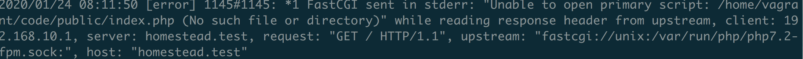

[TOC]

# Laravel 环境搭建

> [参考步骤](<https://learnku.com/docs/laravel-development-environment/6.x/development-environment-macos/5517>)

# 一. 需要的软件

* `VirtualBox`
* `Vagrant`
* `Homestead Box`

这三种的结合运用可以保证在不同主机下的应用的 **应用环境的一致** 和 **轻易的部署.**

## Virtual box

`Virtual Box` 为一个 虚拟机环境, 主要为我们的程序运行提供环境 (Ubuntu).

## Vagrant

`Vagrant`  是用来管理虚拟机的工具. Vagrant 的主要作用是提供一个可配置、可移植和复用的软件环境. 同时可以通过编写一个 **Vagrantfile 文件** 来控制虚拟机的启动、虚拟机网络环境的配置、虚拟机与主机间的文件共享

**关于 Vagrant 的命令说明如下 :**

| 命令行            | 说明                                                         |
| ----------------- | ------------------------------------------------------------ |
| vagrant init      | 初始化 vagrant                                               |
| vagrant up        | 启动 vagrant, 一般与Homestead一起使用, 需要进入 Homestead 后使用 vagrant up, 也可以使用 && 命令 如: `cd ~/Homestesd && vagrant up` |
| vagrant halt      | 关闭 vagrant                                                 |
| vagrant ssh       | 通过 SSH 登录 vagrant（需要先启动 vagrant）                  |
| vagrant provision | 重新应用更改 vagrant 配置, **在修改 Homestead.yaml 文件** 后需要使用这个命令使得修改生效 |
| vagrant destroy   | 删除 vagrant                                                 |
| vagrant reload    | 重启 vagrant                                                 |

* 修改 Homestead.yaml 文件后重启 vagrant :

   ~~~shell
   # && 表示命令连续操作
   # vagrant provision 表示使得 Homestead.yaml 文件生效
   # vagrant reload 重启
   > cd ~/Homestead && vagrant provision && vagrant reload
   ~~~

* `vagrant` 虚拟机的账号密码 : 

  ~~~
  account : vagrant 
  password: vagrant
  ~~~

## Homestead

`Homestead` 利用了 vagrantfile 制了一整套的可配置、可移植和复用的 Laravel 开发环境. Homestead 虚拟机包含了 Nginx, php, MySQL, Redis 等等 Laravel 运行必备的程序.

`Virtual Box + Vagrant + Homestead Box` 共同形成了一个移植性高的开发环境

* Homestead 中预安装的 mysql的账号和密码 :

  ~~~
  - account : homestead
  - password: secret
  ~~~

# 二. 遇到的问题

## 1. Vagrant 2.2.6 无法使用 VirtualBox 6.1 解决办法

>[解决博客](https://hacpai.com/article/1576163288162)

我们安装的 `VirtualBox` 已经在 6.1 版本, 此时已经无法被 `vagrant` 兼容, 从而报错如下

## 2. 配置完成后浏览器端显示 No input file specified.

1. 首先去 Nginx log file 中查看错误的由来 :

   Nginx log 目录为 `\var\log\nginx`

   ~~~shell
   # 虚拟机中查看 homestead.test-error.log 尾端记录
   $ tail homestead.test-error.log
   ~~~

   

   由错误日志可以看到, 不存在 `/home/vagrant/code/public/index.php` 这个文件

2. 也就是说我们的 Nginx 映射文件出现了问题, 此时查看 Nginx 的映射文件夹 :

   ~~~shell
   # 查看 域名为 homestead.test 的映射路径
   $ vim /etc/nginx/sites-available/homestead.test
   ~~~

3. 可以推断此时是映射目录出现了问题, 此时我们需要退出虚拟机, 更改我们的 `Homestead.yaml` 文件

    ~~~shell
    # 主机中修改映射文件
    > vim ~/Homestead/Homestead.yaml
    ~~~

    ~~~
    # 这个对应了 主机中的文件夹(map), 对应的虚拟机中的文件夹(to), 这个文件夹就是我们将来放源文件的地方
    folders:
    - map: ~/Code/php-laravel/Laravel
    to: /home/vagrant/code

    # 在虚拟机开启的生活, 我们的 homestead.test 域名对应了虚拟机中的根目录
    sites:
    - map: homestead.test
    to: /home/vagrant/code/public
    ~~~

4. 在修改后确定映射正确.可以重启我们的 vagrant

    ~~~shell
    > vagrant reload		
    ~~~

5. 重新启动再访问即可

    ~~~
    > cd ~/Homestead && vagrant up
    ~~~

