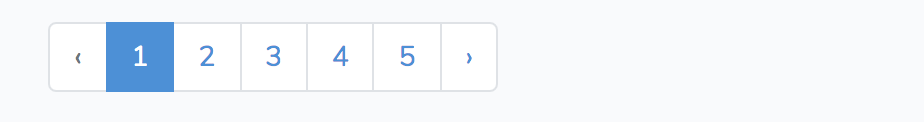

- [Laravel](#laravel)
- [基础功能](#%E5%9F%BA%E7%A1%80%E5%8A%9F%E8%83%BD)
  - [表单验证](#%E8%A1%A8%E5%8D%95%E9%AA%8C%E8%AF%81)
  - [中间件](#%E4%B8%AD%E9%97%B4%E4%BB%B6)
    - [Auth 中间件自动验证是否登陆](#auth-%E4%B8%AD%E9%97%B4%E4%BB%B6%E8%87%AA%E5%8A%A8%E9%AA%8C%E8%AF%81%E6%98%AF%E5%90%A6%E7%99%BB%E9%99%86)
    - [Guest 中间件自动验证只对游客开发的操作](#guest-%E4%B8%AD%E9%97%B4%E4%BB%B6%E8%87%AA%E5%8A%A8%E9%AA%8C%E8%AF%81%E5%8F%AA%E5%AF%B9%E6%B8%B8%E5%AE%A2%E5%BC%80%E5%8F%91%E7%9A%84%E6%93%8D%E4%BD%9C)
  - [记录日志](#%E8%AE%B0%E5%BD%95%E6%97%A5%E5%BF%97)
  - [发送邮件](#%E5%8F%91%E9%80%81%E9%82%AE%E4%BB%B6)
  - [密码重置](#%E5%AF%86%E7%A0%81%E9%87%8D%E7%BD%AE)
  - [分页](#%E5%88%86%E9%A1%B5)
- [Route 层](#route-%E5%B1%82)
  - [GET 方法映射](#get-%E6%96%B9%E6%B3%95%E6%98%A0%E5%B0%84)
    - [调用 route with get 传参](#%E8%B0%83%E7%94%A8-route-with-get-%E4%BC%A0%E5%8F%82)
  - [DELETE 方法映射](#delete-%E6%96%B9%E6%B3%95%E6%98%A0%E5%B0%84)
  - [RESTful 接口全映射](#restful-%E6%8E%A5%E5%8F%A3%E5%85%A8%E6%98%A0%E5%B0%84)
- [控制器](#%E6%8E%A7%E5%88%B6%E5%99%A8)
  - [控制器传递参](#%E6%8E%A7%E5%88%B6%E5%99%A8%E4%BC%A0%E9%80%92%E5%8F%82)
- [数据库](#%E6%95%B0%E6%8D%AE%E5%BA%93)
  - [数据库迁移](#%E6%95%B0%E6%8D%AE%E5%BA%93%E8%BF%81%E7%A7%BB)
    - [添加字段](#%E6%B7%BB%E5%8A%A0%E5%AD%97%E6%AE%B5)
    - [新增数据表](#%E6%96%B0%E5%A2%9E%E6%95%B0%E6%8D%AE%E8%A1%A8)
  - [数据填充](#%E6%95%B0%E6%8D%AE%E5%A1%AB%E5%85%85)
- [View 层](#view-%E5%B1%82)
  - [View 层赋值](#view-%E5%B1%82%E8%B5%8B%E5%80%BC)
- [Model 层](#model-%E5%B1%82)
  - [模型操作 CRUD](#%E6%A8%A1%E5%9E%8B%E6%93%8D%E4%BD%9C-crud)
    - [查询](#%E6%9F%A5%E8%AF%A2)
  - [新增模型](#%E6%96%B0%E5%A2%9E%E6%A8%A1%E5%9E%8B)
  - [Model REPL - tinker](#model-repl---tinker)
    - [新增记录](#%E6%96%B0%E5%A2%9E%E8%AE%B0%E5%BD%95)
      - [Fillable Property error](#fillable-property-error)
    - [查询记录](#%E6%9F%A5%E8%AF%A2%E8%AE%B0%E5%BD%95)
  - [模型事件](#%E6%A8%A1%E5%9E%8B%E4%BA%8B%E4%BB%B6)
    - [利用 观察者模式为模型制定 event 逻辑](#%E5%88%A9%E7%94%A8-%E8%A7%82%E5%AF%9F%E8%80%85%E6%A8%A1%E5%BC%8F%E4%B8%BA%E6%A8%A1%E5%9E%8B%E5%88%B6%E5%AE%9A-event-%E9%80%BB%E8%BE%91)
  - [模型关联](#%E6%A8%A1%E5%9E%8B%E5%85%B3%E8%81%94)
    - [一对多逻辑 hasMany](#%E4%B8%80%E5%AF%B9%E5%A4%9A%E9%80%BB%E8%BE%91-hasmany)
    - [多对一逻辑 belongsTo](#%E5%A4%9A%E5%AF%B9%E4%B8%80%E9%80%BB%E8%BE%91-belongsto)
    - [多对多逻辑 belongsToMany](#%E5%A4%9A%E5%AF%B9%E5%A4%9A%E9%80%BB%E8%BE%91-belongstomany)
- [安全相关](#%E5%AE%89%E5%85%A8%E7%9B%B8%E5%85%B3)
  - [用户认证](#%E7%94%A8%E6%88%B7%E8%AE%A4%E8%AF%81)
    - [设置当前用户到 Auth](#%E8%AE%BE%E7%BD%AE%E5%BD%93%E5%89%8D%E7%94%A8%E6%88%B7%E5%88%B0-auth)
    - [注销当前用户](#%E6%B3%A8%E9%94%80%E5%BD%93%E5%89%8D%E7%94%A8%E6%88%B7)
  - [用户授权 与 策略授予](#%E7%94%A8%E6%88%B7%E6%8E%88%E6%9D%83-%E4%B8%8E-%E7%AD%96%E7%95%A5%E6%8E%88%E4%BA%88)
    - [关于策略方法第一个参数的问题](#%E5%85%B3%E4%BA%8E%E7%AD%96%E7%95%A5%E6%96%B9%E6%B3%95%E7%AC%AC%E4%B8%80%E4%B8%AA%E5%8F%82%E6%95%B0%E7%9A%84%E9%97%AE%E9%A2%98)
    - [关于策略方法第二个参数的问题](#%E5%85%B3%E4%BA%8E%E7%AD%96%E7%95%A5%E6%96%B9%E6%B3%95%E7%AC%AC%E4%BA%8C%E4%B8%AA%E5%8F%82%E6%95%B0%E7%9A%84%E9%97%AE%E9%A2%98)
    - [策略方法对非当前登陆用户的权限检测](#%E7%AD%96%E7%95%A5%E6%96%B9%E6%B3%95%E5%AF%B9%E9%9D%9E%E5%BD%93%E5%89%8D%E7%99%BB%E9%99%86%E7%94%A8%E6%88%B7%E7%9A%84%E6%9D%83%E9%99%90%E6%A3%80%E6%B5%8B)
  - [CSRF 攻击](#csrf-%E6%94%BB%E5%87%BB)
- [附录](#%E9%99%84%E5%BD%95)
  - [gravatar 生成用户头像](#gravatar-%E7%94%9F%E6%88%90%E7%94%A8%E6%88%B7%E5%A4%B4%E5%83%8F)
  - [Faker 生成假数据](#faker-%E7%94%9F%E6%88%90%E5%81%87%E6%95%B0%E6%8D%AE)
  - [diffForHumans 友好的时间显示](#diffforhumans-%E5%8F%8B%E5%A5%BD%E7%9A%84%E6%97%B6%E9%97%B4%E6%98%BE%E7%A4%BA)

# Laravel 

[Laravel 6 中文文档 ](https://learnku.com/docs/laravel/6.x)

[Laravel项目入门实战](https://learnku.com/courses/laravel-essential-training/6.x)

# 基础功能

## 表单验证

> [表单验证](https://learnku.com/docs/laravel/6.x/validation/5144)

表单验证是一个接受表单数据的常用功能, 一般在 `Controller`层进行验证. 在 Laravel 中, 验证表单的方法如下 :

~~~php
public function signin(Request $request){
    // Request 即为 HTTP 请求封装类, 调用其 validate 方法便可以完成验证
    $this->validate($request, [
        'name' => 'required|max:50',
        'email' => 'required|email|unique:users|max:255',
        'password' => 'required|confirmed|min:6'
    ]);
}
~~~

* 验证成功 : Controller 继续正确执行
* 验证失败 : HTTP Get 请求则进行一个重定向响应, 如果为 AJAX 则返回错误的 Json 信息

## 中间件

> [手册中的中间件](https://learnku.com/docs/laravel/5.6/middleware/1364)

Laravel 中的中间件 MiddleWare 有很多用法, 比较广泛的是用来过滤 HTTP请求.

### Auth 中间件自动验证是否登陆

`Auth` 类的中间件同样为我们提供非常方面的验证是否登陆机制, 我们使用的时候, 只需要:

~~~php
class UsersController extends Controller
{

    public function __construct()
    {
        // 表示除了这三个方法， 其他在执行前都需要调用中间件 auth
        $this->middleware('auth', [
            'except' => ['create', 'store', 'show']
        ]);
        
        // Or
        
        // only 为 except 的反方法
        $this->middleware('auth', [
            'only' => ['create', 'store', 'show']
        ]);
        
    }
    
    // ...
    
}
~~~

我们怎么知道 auth对应的是哪个中间件呢.

位于 `\App\Http\Kernel.php`中给予了配置 :

~~~php
    protected $routeMiddleware = [
        'auth' => \App\Http\Middleware\Authenticate::class,
        'auth.basic' => \Illuminate\Auth\Middleware\AuthenticateWithBasicAuth::class,
        'bindings' => \Illuminate\Routing\Middleware\SubstituteBindings::class,
        // ...
    ];
~~~

我们看到 `auth` 对应的是 `\App\Http\Middleware\Authenticate::class`

而这个类并没有给出具体的逻辑 (中间件逻辑必须时间在 `handle` 方法🀄实现): 

~~~php
namespace App\Http\Middleware;

use Illuminate\Auth\Middleware\Authenticate as Middleware;

class Authenticate extends Middleware
{
    /**
     * Get the path the user should be redirected to when they are not authenticated.
     *
     * @param  \Illuminate\Http\Request  $request
     * @return string|null
     */
    protected function redirectTo($request)
    {
        if (! $request->expectsJson()) {
            return route('login');
        }
    }
}
~~~

真正的验证逻辑在基类 `Illuminate\Auth\Middleware\Authenticate`中实现

~~~php
class Authenticate
{
    // ...
    
    // 验证是否登陆
    public function handle($request, Closure $next, ...$guards)
    {
        $this->authenticate($request, $guards);

        return $next($request);
    }
    
    // ...
}
~~~

### Guest 中间件自动验证只对游客开发的操作

有些操作只会对游客开发, 比如登陆功能. 和 auth 类似, guest 也是 laravel提供的一个中间件, 对于游客才授权, 用法如下:

~~~php
namespace App\Http\Controllers;

use Illuminate\Http\Request;
use Illuminate\Support\Facades\Auth;

class SessionsController extends Controller
{

    public function __construct()
    {
        // 表示 只有未登录的用户才能访问 login 页面
        $this->middleware('guest',
            ['only' => ['create']]
        );

    }
	
    
    // ...
}
~~~

##  记录日志

> [手册中日志功能](https://learnku.com/docs/laravel/5.6/logging/1374)

~~~php
### 写入日志信息

// 记录的日志一般位于 /storage/logs 下

// 你可以使用 `Log` [门面](http://laravelacademy.org/post/8708.html)记录日志信息，如上所述，日志系统提供了定义在 [RFC 5424 规范](https://tools.ietf.org/html/rfc5424)中的八种日志级别：**emergency**、**alert**、**critical**、**error**、**warning**、 **notice**、**info** 和 **debug**：

Log::emergency($error);
Log::alert($error);
Log::critical($error);
Log::error($error);
Log::warning($error);
Log::notice($error);
Log::info($error);
Log::debug($error);

// 上下文信息

// 上下文数据也会以数组形式传递给日志方法，然后和日志信息一起被格式化和显示：

Log::info('User failed to login.', ['id' => $user->id]);
// 写入指定频道
// 有时候你可能希望将日志信息记录到某个频道而不是应用的默认频道。要实现这个目的，你可以使用 Log 门面上的 // channel 方法来获取配置文件定义的频道并将日志写入进去：

Log::channel('slack')->info('Something happened!');
// 如果你想要创建一个由多个频道组成的按需日志堆栈，可以使用 stack 方法：

Log::stack(['single', 'slack'])->info('Something happened!');
~~~

## 发送邮件

实现邮件的发送, 我们首先需要配置 `.env` 文件

~~~
// 使用 qq 邮箱的服务发送邮件
MAIL_DRIVER=smtp
MAIL_HOST=smtp.qq.com
MAIL_PORT=25
MAIL_USERNAME=522500442@qq.com
MAIL_PASSWORD=nkgrxqznbounbidd			// 通过 qq 邮箱生成的验证码
MAIL_ENCRYPTION=tls
MAIL_FROM_ADDRESS=522500442@qq.com
MAIL_FROM_NAME=WeiboApp

// log 的形式发送邮件 (for debug)
MAIL_DRIVER=log 
~~~

**调用 Mail::send() 发送邮件**

~~~php
$view = 'emails.confirm';
$data = compact('user');
$to = $user->email;
$subject = "感谢注册 Weibo 应用！请确认你的邮箱。";

Mail::send($view, $data, function ($message) use ($to, $subject) {
$message->to($to)->subject($subject);
});
~~~

**编辑视图文件 :**

~~~html
<!DOCTYPE html>
<html>
<head>
  <meta charset="UTF-8">
  <title>注册确认链接</title>
</head>
<body>
<h1>感谢您在 Weibo App 网站进行注册！</h1>

  请点击下面的链接完成注册：
  <a href="{{ route('confirm_email', $user->activation_token) }}">
    {{ route('confirm_email', $user->activation_token) }}
  </a>

  如果这不是您本人的操作，请忽略此邮件。

</body>
</html>
~~~

## 密码重置

`Laravel` 自动提供了关于密码重置的控制器和数据表

- 关于密码重置的数据表 : password_resets 位于原始的迁移文件中字段如下

  email | token | created_at 

  分别记录了收取 token 令牌的邮箱, token令牌, 以及时间

- 关于密码重置的控制器都是自带的位于 `\App\Http\Controller\Auth` 下

  忘记密码控制器 : `ForgotPasswordController `

  重置密码控制器 : `ResetPasswordController`

- 关于 laravel 自带的密码重置步骤如下 :
  1. 用户对密码忘记页面发起GET请求, 对应的路由为 :

    ~~~php
    Route::get('/password/reset', 'Auth\ForgotPasswordController@showLinkRequestForm')->name('password.request');
    ~~~

    **但是我们需要自定义视图** : `\Auth\Passwords\email.blade.php`

  2. 用户通过 POST 请求给 Laravel 发送接收 token 的邮箱

     我们接受这个 POST 请求的路由为 :

     ~~~php
     Route::post('password/email', 'Auth\ForgotPasswordController@sendResetLinkEmail')->name('password.email');
     ~~~

  3. Laravel 发送 token 到制定的邮箱

  4. 用户到邮箱中点击相应带 Token 的链接到我们的重置页面

     这个 Get 请求对应的路由为:

     ~~~php
     Route::get('password/reset/{token}', 'Auth\ResetPasswordController@showResetForm')->name('password.reset');
     ~~~

  5. 最后即为我们的重置页面 

     对应的 POST 路由为 :

     ~~~php
     pRoute::post('password/reset', 'Auth\ResetPasswordController@reset')->name('password.update');
     ~~~

     我们也需要自定义视图 : `Auth\Passwords\reset.blade.php`

## 分页

数据分页是一个很常用的功能 `Laravel` 中的分页功能实现如下:

~~~php
// 分页功能读取数据, 一页10条数据
$users = User::paginate(10);

return view('users.index', compact('users'));
~~~

前端用 :

~~~html
{!! $users->render() !!}
~~~

便可以算是页码, 如下效果 :

对应的访问 url 为 : `/users?page=2`

# Route 层

路由层, 将 http 请求映射到相应的控制器中. 注意处理 http 路由的位于 `routes/web.php` 中

>Laravel 遵从 RESTful 架构的设计原则，将数据看做一个资源，由 URI 来指定资源。对资源进行的获取、创建、修改和删除操作，分别对应 HTTP 协议提供的 GET、POST、PATCH 和 DELETE 方法

## GET 方法映射

在路由映射中, 我们同样利用 RESTful 设计接口, 例如:

~~~php
// 接受 浏览器端发来的 get 请求, 路由为 '/' 映射到  StaticPagesController 控制器下的 home 方法
Route::get('/', 'StaticPagesController@home')->name('home');
Route::get('/help', 'StaticPagesController@help')->name('help');
Route::get('/about', 'StaticPagesController@about')->name('about');
~~~

### 调用 route with get 传参

~~~php
# [$user] 为这个 GET 请求的传参时, 会默认获得这个模型的主键作为传参
route('users.show', [$user])
    
# 等效于 
    
route('users.show', [$user->id])
~~~

## DELETE 方法映射

delete 在 RESTful 设计中表示删除一个资源. 可以用于 **删除用户, 登出** 等功能

~~~php
Route::delete('/logout','SessionsController@delete')->name('logout');
~~~

在 delete 对应的 controller 中, 不直接返回 View, 而是在实现逻辑后采用重定向的功能.

~~~php
public function delete(){
    ...
        
	// 完成逻辑后重定向到 login 路由
	return redirect()->route('login');
}
~~~

注意在前端, 我们浏览器现在还不支持发送 `delete`请求, 所以在前端 from 中我们需要增加隐藏域表示 delete 方法

~~~html
<form action="{{ route('logout') }}" method="POST">
    {{ csrf_field() }}
    {{--   可以模拟出浏览器发出 delete 请求  --}}
    {{ method_field('DELETE') }}
    <button class="btn btn-block btn-danger" type="submit" name="button">退出</button>
</form>
~~~

## RESTful 接口全映射

~~~php
- 1. 定义一个 RESTful 接口

    // users 为资源名, 后一个为控制器名
    Route::resource('users', 'UsersController');

    // 以上代码等同于下面所有操作 

    // 获得所有用户
    Route::get('/users', 'UsersController@index')->name('users.index');
    // 获得 创建一个用户的页面
    Route::get('/users/create', 'UsersController@create')->name('users.create');
    // 根据用户id展现一个用户
    Route::get('/users/{user}', 'UsersController@show')->name('users.show');
    // post 方法创建一个用户
    Route::post('/users', 'UsersController@store')->name('users.store');
    // 获得更新用户信息页面
    Route::get('/users/{user}/edit', 'UsersController@edit')->name('users.edit');
    // 更新用户操作
    Route::patch('/users/{user}', 'UsersController@update')->name('users.update');
    // 删除用户操作
    Route::delete('/users/{user}', 'UsersController@destroy')->name('users.destroy');

- 2. 定义一个 RESTful 接口的同时指定特定操作
    Route::resource('users', 'UsersController', ['only'=>['store', 'destory']]);
~~~

# 控制器

## 控制器传递参

~~~php
/* ----------- 1. Request 对象获得 ----------- */

/*
	最普通获得前端的数据的方法通过 request
	可以获得 get , post 数据
*/  
Route::get("/show/{id}", "User@show");

public function show(Request $request){
    /* 传递request对象 从而获得id */
    $id = $request->id;
}

/* ----------- 2. 直接封装为 Eloquent 模型 ----------- */
/*
	当传递的 id 为某个模型的 主键的时候, 那么 laravel 在传递的时候
	可以自定根据id封装为 Eloquent 模型
*/  

/* 使用此种方法的时候, {user} 名称必须和 Eloquent模型名相同, 同时首字母小写 */
Route::get("/show/{user}", "User@show");
public function show(User $user){
    /* 直接获得 Eloquent 模型 */

}
~~~

# 数据库

## 数据库迁移

> [手册中的数据库迁移](https://learnku.com/docs/laravel/6.x/migrations/5173)

数据库迁移在团队开发中很重要, 可以选择直接利用 sql 文件, 或者`Laravel` 中采用 `migrate` 的方式进行数据库迁移 (仅仅迁移表结构)

`Migrate` 文件位于 `\databases\migrations` 下. 初始状态下, `Laravel` 提供了三个表的表结构, 如下:

~~~
database/migrations/2019_08_19_000000_create_users_table.php
database/migrations/2019_08_19_100000_create_password_resets_table.php
database/migrations/2019_08_19_000000_create_failed_jobs_table.php
~~~

`Migrate `相关的命令操作

~~~shell
- 1 . 根据数据库迁移文件完成的数据库创建
> php artisan migrate 

- 2. 修改某些迁移文件后, 重新根据种子去刷新数据库
> php artisan migrate:refresh --seed
~~~

### 添加字段

假设我们需要给已经生成的表 `users` 添加字段 `is_admin`, 步骤如下 :

~~~php
// ------- 1. 生成一个 migrate 文件
> php artisan make:migration add_user_is_admin --table=users

// ------- 2. 编辑该迁移文件的 up, down 函数, 分别对应执行和回滚
    public function up()
    {
        Schema::table('users', function (Blueprint $table) {
            $table->boolean('is_admin')->default(false);
        });
    }
    public function down()
    {
        Schema::table('users', function (Blueprint $table) {
            //
            $table->dropColumn('is_admin');
        });
    }

// ------ 3. 执行该文件
> php artisan migrate
~~~

### 新增数据表

在数据库层面添加数据表, 例如添加 blogs 步骤如下:

~~~php
# 1. 生成一个 create_table_blogs 的迁移文件
> php artisan make:migration create_table_blogs --create="blogs"

# 2. 在 create_table_blogs 中定义字段
    在默认的create_table_blogs文件中, laravel 会为数据表自动创建如下字段 :
	id | create_at | update_at 三个字段, 对应的以下代码:

	$table->bigIncrements('id');
	$table->timestamps();

# 3. 运行迁移文件
> php artisan:migrate
~~~

## 数据填充

> [手册中的数据填充](https://learnku.com/docs/laravel/6.x/seeding/5174)

就是利用假数据填充数据库做测试, 我们利用 Faker 库自动数据填充例子如下 :

~~~php
假设需要给 blogs 数据表自动填充数据

| id | user_id  |content | updated_at | created_at |

- 1. 创建一个 factory 工厂 => BlogFactory.php 手动创建或者命令行均可 : 
  > $php artisan make:factory BlogFactory --model="Blog"
    
- 2 . 编辑 工厂文件, 定义 faker 数据生成规则
  $factory->define(Blog::class, function (Faker $faker) {
        $date_time = $faker->date . ' ' . $faker->time;
        return [
            'user_id' => 1,
            'content' => $faker->text(100),
            'created_at' => $date_time,
            'updated_at' => $date_time,
        ];
    });

- 3. 生成一个 seeder , 并且和该工厂对应
    > $ php artisan make:seeder BlogTableSeeder
    
     
- 4. 编辑 BlogTableSeeder.php 文件的 run 方法
	public function run()
    {	
        // 生成 50 条数据
        $blogs = factory(Blog::class)->times(50)->make();
        Blog::insert($blogs->toArray());
    }
	
- 5. 运行 seeder
    
    > $php artisan db:seed --class=BlogTableSeeder
~~~

# View 层

Webapp 中 View 层即传递给前端的 HTML 

## View 层赋值

~~~php
# 返回在 user/edit 的试图
# 给页面传递参数的时候, 必须为数组形式, 也就是说 $data 必须为数组
return View('user.edit', $data)
    
$user;  
# 当传参不为数组的时候, 我们可以用 compact 函数将其转化为数组
return View('user.edit', compact('user'))
~~~

# Model 层

Laravel 的 model 层为 ORM 架构, 在框架中叫 : `Eloquent ORM`, 所谓的 ORM 即为 Object Relation Map. 表示数据库中的每一个表都对应一个 Model 对象

表和model对象的对应关系为 : users表 -> App\Models\User

## 模型操作 CRUD

> [快速入门](<https://learnku.com/docs/laravel/6.x/eloquent/5176#retrieving-single-models>)

### 查询

~~~php
/* ------------------------ 1. find() ------------------- */
/* 
	find() 函数默认查询的是表中的主键
*/
// 返回表中 id = 1 的记录映射为 Eloquent 对象
$user = User::find(1)

/* -------------------- 2. where() + first() ------------------- */

// 当查找项不在主键时候, 我们便需要使用 where + first 的方法查找第一个满足的记录
// 凡事不利用主键, 那么都有可能返回超过1条记录, 所以要使用 first().
$user = User::where('name', 'fz')->first()

// 返回所有姓名为 fz 的记录, 并且封装为 collection
$user = User::where('name', 'fz')->get();
   
~~~

## 新增模型

在 `Eloquent` 规则中, 数据模型名称对应的单数形式的数据表, 例如新增一个 `Blog` 模型:

~~~shell
> php artisan make:model Models/Blog 
~~~

## Model REPL - tinker

即直接用命令的方式进行数据库操作.

~~~shell
# 进入 tinker 模式
> php artisan tinker

>>> ...
~~~

### 新增记录

~~~shell
# App\Models\User 表示操作的模型
>>>App\Models\User::create(['name'=>'ark','email'=>'ark@example.com','password'=>bcrypt('password')])
~~~

#### Fillable Property error

在新增记录的时候, 需要注意在 `Model`内部指出, 哪些是可以被更新的. 即规定 fillable 变量. 否则会导致插入失败

~~~ php
class Blog extends Model
{
	
    // 指定模型中 content 字段为 fillable 字段. 从而可以正常插入
    protected $fillable = [
        'content',
    ];
    
}
~~~

### 查询记录

~~~shell
# 查询 User 模型的第一条记录
>>> App\Models\User::first()
~~~

## 模型事件

> [手册中的模型事件](https://learnku.com/docs/laravel/6.x/eloquent/5176#events)

Eloquent 模型事件允许我们在模型的合个生命周期节点上进行自定义操作. 模型的生命周期指的是 **该条记录的生命周期而不是模型实例的生命周期** , 比如 : 

~~~
- retrieved : 当利用该模型从数据库中查找数据时触发
  for example : \App\Models\User::find(1);

- creating  : 当调用模型的 create 方法创建一个记录 **之前**.
  for example : 
  $user = User::create([
        'name' => $request->name,
        'email' => $request->email,
        'password' => bcrypt($request->password),
    ]);

- created  : 当调用模型的 create 方法创建一条记录 **之后**.

- updating : 当调用模型的 update 方法更新一条数据 **之前**

- updated  : 当调用模型的 update 方法更新一条数据 **之后**

- ...
~~~

### 利用 观察者模式为模型制定 event 逻辑

如果我们想为 `User` 模型 制定一个 `creating` 事件逻辑, 步骤如下 :

~~~php
- // ----------- step 1 : 
  利用artisan创建一个UserObserver 
  > php artisan make:observer UserObserver --model=User
  
  
- // ----------- step 2 : 
  在 UserOberver 中制定相应逻辑 
  
  class UserObserver{
      
      public function creating(User $user){
          
          Log::debug("creating event happened");
          
      }
      
  }
  
- // ----------- step 3 : 
  在 \App\Providers\AppServiceProvider 的 boot 方法中将两者绑定
  
    class AppServiceProvider extends ServiceProvider
	{
    
    // ....
        public function boot()
            {
                // 绑定模型和观察者
                User::observe(UserObserver::class);
            }
	}
~~~

## 模型关联

> [手册中的模型关联](https://learnku.com/docs/laravel/5.5/eloquent-relationships/1333)
>
> [模型关联详解](<https://learnku.com/laravel/t/15620/laravel-eloquent-model-associated-quick-lookup-table>)

即可以在 Model 层面对几个模型进行关联操作, 从而简化数据库逻辑.

### 一对多逻辑 hasMany

比如一个用户会发多个微博. 可以如下处理:

~~~php
class User extend Model{
    
    // ... code
    
    
    /* 动态绑定 */
    public function blogs(){
        
        return $this->hasMany(\App\Models\Blog::class);
        
    }
}
~~~

在调用的时候, 便可以直接利用:

~~~php
# 获得该用户的所有博客
>>> \App\Models\User::find(1)->blogs()->get()
~~~

### 多对一逻辑 belongsTo

同样多个微博可以属于一个用户, 那么处理如下:

~~~php
class Blog extend Model{
    
    // ... code
    
    
    /* 动态绑定 */
    public function user(){
        
        # 默认情况下, blogs 表中的外键为 user_id, 如果不是需要在函数的第二个参数指定
        return $this->belongsTo(\App\Models\User::class);
        // return $this->belongsTo(\App\Models\User::class, 'foreignKey');
        
    }
}
~~~

在调用的时候, 便可以直接利用:

~~~php
# 获得该博客的所属用户
>>> \App\Models\Blog::find(1)->user()->get()
~~~

### 多对多逻辑 belongsToMany

比如公交车和司机的关系, 一辆公交车可以有多个司机, 一个司机也可以驾驶多个公交车

此时我们便可以利用 belongsToMany 关系

在模型文件中如下定义 :

~~~php
class Car extend Model{
    
    // ...
    
    public class driver(){
        
       // car_driver 为中间表
       // driver_id, car_id 都是中间表的字段
       return $this->belongsToMany(Driver::class, 'car_driver','driver_id', 'car_id');
        
    }
    
}

class Driver extend Model{
    
    // ...
    
    public class car(){
        
       // car_driver 为中间表
       // driver_id, car_id 都是中间表的字段
       return $this->belongsToMany(Car::class, 'car_driver', 'car_id', 'driver_id');
        
    }
}
~~~

同时我们需要创建一个中间表 `car_driver` 当然也可以自定义其他的名字

~~~php
Schema::create('car_driver', function (Blueprint $table) {
    $table->bigIncrements('id');
    $table->integer('car_id')->index();
    $table->integer('driver_id')->index();
    $table->timestamps();
});
~~~

在定义好如上规则之后, 我们便可如下查值 :

~~~shell
# 获得司机驾驶过的所有车辆信息
> $driver->car()->get()

# 获得车辆的所有司机信息
> $car->driver()->get()
~~~

**Laravel 内置的关于多对多的关联操作 :**

~~~php
/* Laravel 内置了关于中间表(如 car_driver) 的相关关联操作, 所有的操作都是在中间表中进行改变, 而不改变主表*/

- 1. attach 操作 (简单添加)
	/* 将id 为1,2 的车辆标记为当前 driver 的历史驾驶车辆 */
	$driver->car()->attach([1, 2]);
    
    /* 将id 为2,3 的司机标记为当前车辆的 历史驾驶司机 */
	$car->driver()->attach([2, 3]);

- 2. sync 操作 (去重添加)
    /* 
    	使用 attach 可能会出现重复添加的情况 for exmaple :
    	$driver->car()->attach([1, 2, 1])
    	那么 car_id 1 会重复添加到 car_driver 表中
    	此时我们使用 sync 解决这个问题
    */
    $driver->car()->sync([1, 2], false);
    
- 3. detach (删除)
    /* 删除当前司机的 car_id 为 1,2 的中间表记录 */
    $driver->car()->detach([1, 2]);
~~~

# 安全相关

## 用户认证

> [文档中的用户认证](https://learnku.com/docs/laravel/5.6/authentication/1379#authenticating-users)
>
> [深挖Attempt函数](https://blog.csdn.net/xueba8/article/details/82347270)

`use Illuminate\Support\Facades\Auth;`

简而言之, 用户认证可以理解为用一个 `Auth` 类去保存 **当前登陆用户.**

同时我们可以使用 Auth 去获得当前登陆用户的信息

~~~php
// 判断当前用户是否已认证（是否已登录）
 Auth::check();
// 获取当前的认证用户
 Auth::user();
// 获取当前的认证用户的 ID（未登录情况下会报错）
 Auth::id();
// 通过给定的信息来尝试对用户进行认证（成功后会自动启动会话）
 Auth::attempt(['email' => $email, 'password' => $password]);
// 通过 Auth::attempt() 传入 true 值来开启 '记住我' 功能
 Auth::attempt($credentials, true);
// 只针对一次的请求来认证用户
 Auth::once($credentials);
// 登录一个指定用户到应用上
 Auth::login(User::find(1));
// 登录指定用户 ID 的用户到应用上
 Auth::loginUsingId(1);
// 使用户退出登录（清除会话）
 Auth::logout();
// 验证用户凭证
 Auth::validate($credentials);
// Attempt to authenticate using HTTP Basic Auth
 // 使用 HTTP 的基本认证方式来认证
 Auth::basic('username');
// Perform a stateless HTTP Basic login attempt
 // 执行「HTTP Basic」登录尝试
 Auth::onceBasic();
// 发送密码重置提示给用户
 Password::remind($credentials, function($message, $user){});
~~~

也就是说, 一旦一个用户登陆(认证)了 Laravel 应用, 那么我们便可以通过 Auth 去获得其信息.

### 设置当前用户到 Auth

- 用户登陆成功情景
  我们使用 `Auth::attempt()` 去验证 `request` 传递来的登陆信息. for example :

  ~~~php
  public function store(Request $request){
    $basicValidate = $this->validate($request,[
          'password' => 'required',
          'email'=> 'required|email|max:255'
      ]
  );
      // 检测 basicValidate 是否存在与数据库中
      // 第二个传参为 bool 值，true 表示记住次用户
      if(Auth::attempt($basicValidate, true)){
          // 登陆成功
          
      }else{
          // 登陆失败
  
      }
  }
  ~~~

  `Auth::attempt()` 在验证的同时, **如果登陆成功也会记录到这个用户**. 底层代码实现如下 :

  ~~~php
  // in Illuminate\Auth 的文件 SessionGuard.php
      public function attempt(array $credentials = [], $remember = false)
      {
          $this->fireAttemptEvent($credentials, $remember);
          $this->lastAttempted = $user = $this->provider->retrieveByCredentials($credentials);
  
          if ($this->hasValidCredentials($user, $credentials)) {
              
              // 这里就是登陆逻辑, 如果验证成功了, 那么登陆该user
              $this->login($user, $remember);
  
              return true;
          }
          $this->fireFailedEvent($user, $credentials);
  
          return false;
      }
  
  
  public function login(AuthenticatableContract $user, $remember = false)
      {
          $this->updateSession($user->getAuthIdentifier());
  
          if ($remember) {
              $this->ensureRememberTokenIsSet($user);
  
              $this->queueRecallerCookie($user);
          }
          $this->fireLoginEvent($user, $remember);
  		
  		// login 函数的最后即为 set当前的suer
          $this->setUser($user);
      }
  
  
  // setUser 即为赋值给当前的成员函数
  public function setUser(AuthenticatableContract $user)
  {
      $this->user = $user;
  
      $this->loggedOut = false;
  
      $this->fireAuthenticatedEvent($user);
  
      return $this;
  }
  ~~~

### 注销当前用户

即为 logout 功能, 我们直接调用 Auth 的 logout 即可, 如下 :

~~~php
Auth::logout();
~~~

## 用户授权 与 策略授予

> [手册中的用户授权](https://learnku.com/docs/laravel/6.x/authorization/5153#registering-policies)

相比于用户认证(中间件实现) , **用户授予倾向于给当前登陆的用户授予操作某个方法的权限**, 比如 当前登陆用户只能修改自己的个人信息. **策略授予是用户授权的实现**

我们使用命令创建一个 **策略**

~~~shell
> php artisan make:policy UserPolicy
~~~

此时在 `\App\Policies\` 下会生成一个 `UserPolicy.php`文件

**基于约定大于配置的原则, 我们的策略名和 model 保持一致, 从而可以省略一些配置操作**

比如我们的用户表对应的 **Eloquent 模型为 User**, 那么我们的策略即为 **UserPilicy** 用来定义一些关于 User 数据操作的权力授予. 

**以更新用户权利为例子, 完整步骤如下 :**

~~~php
// --- 1. 在 UserPolicy 中定义关于 update 权利验证的方法
class UserPolicy
{
    use HandlesAuthorization;
    
    // 返回一个bool值, 这个逻辑即为当前用户只能修改自己的资料
    public function update(User $currentUser, User $passUser){

            return $currentUser->id === $passUser->id;

    }
}

// --- 2. 在 \App\Provides\AuthServiceProvider 中定义自动注册机制 (也可以手动注册)
public function boot()
{
    $this->registerPolicies();

    // 修改策略自动发现的逻辑
    Gate::guessPolicyNamesUsing(function ($modelClass) {
        //  约定大于配置 也可以如下实现 
        //  $class_name = class_basename($modelClass);
        //  if($class_name == 'User'){
        //   return 'App\Policies\UserPolicy';
        //   }
        // 动态返回模型对应的策略名称，如：// 'App\Models\User' => 'App\Policies\UserPolicy',
        return 'App\Policies\\'.class_basename($modelClass).'Policy';
    });
}

// --- 3. 在 UserController 更新操作中调用该策略
// 控制用户 CRUD 操作
class UsersController extends Controller
{

    public function update(User $user, Request $request){

        // 利用 UserPolicy 策略的 update 方法， 验证此时的user
        $this->authorize('update', $user);

		// code ...
}
~~~

### 关于策略方法第一个参数的问题

默认情况下, 策略内方法的第一个参数是当前登陆的用户, 可以理解为, **所有的策略方法, 都是针对某一用户权限授予, 默认情况下为当前登陆用户**

~~~php
class BlogPolicy
{

    /* 删除策略 */
    /* 所有策略的方法第一个传递参数都必须是 User 类型的 !!! */
    public function destroy(User $currentUser, Blog $currentBlog){
        /* 只能删除属于自己的blog */
		return $user->id == $currentBlog->user_id;
    }

}

/* 用这种方式调用的时候, laravel 默认的传递了 Auth::user() 给这个策略变为第一个参数 */
$this->authorize('destroy', $blog);
~~~

### 关于策略方法第二个参数的问题

~~~php
/* 值得注意的是, 策略的寻找并不是和对应控制器绑定的, 如下举例解释 */

class BlogController extend controller{
    

    public function destroy(Blog $blog){
        
        /* 这种调用下, 会找对应的 BlogPolicy 中的 destroy 方法去授权当前用户 */
		$this->authorize('destroy', $blog);
        
    }
    
}

/* 

	实际上以上情况会调用 `BlogPolicy` 策略文件, 是应为第二个参数传递的是 Blog 类型
	也就是说, 寻找哪个策略文件取决于 第二个传参数, 而不是所在的控制器
	
	即, 我们没必要为每一个控制器都写一个对应的 策略
	而对于每一个 Eloquent 模型才是需要对应一个 策略文件

*/
~~~

### 策略方法对非当前登陆用户的权限检测

~~~php
/* 这种方法检验权限即为 对当前登陆用户的检验*/
$this->authorize('destroy', $blog);

/* 对于非当前登陆用户, 可以如下方式查看 */
User::find(1)->can('destroy', $blog);
~~~

## CSRF 攻击

# 附录

## gravatar 生成用户头像

> 使用 [Gravatar](https://en.gravatar.com/) 来为用户提供个人头像支持。Gravatar 为 “全球通用头像”，当你在 Gravatar 的服务器上放置了自己的头像后，可通过将自己的 Gravatar 登录邮箱进行 MD5 转码，并与 Gravatar 的 URL 进行拼接来获取到自己的 Gravatar 头像。

引用方式简单 如下 :

~~~php
// 返回一个字符串, 且 get 传入自己的 email
public function gravatar($size = '100')
{
    $hash = md5(strtolower(trim($this->attributes['email'])));
    return "http://www.gravatar.com/avatar/$hash?s=$size";
}
~~~

直接在 img 标签的 src 引用该 url 即可

~~~html
gravatar('140') }}" alt="{{ $user->name }}" class="gravatar"/>
~~~

## Faker 生成假数据

我们可以利用 [Faker](https://github.com/fzaninotto/Faker) 扩展包 配合 `Seed` 机制生成假数据

~~~php
// 可以生成的假数据字段

// 使用 factory 来创建一个 Faker\Generator 实例
$faker = Faker\Factory::create();

// 生成用户名
$faker->name; // "Janie Roob"

// 生成安全邮箱
$faker->safeEmail; // "claire.wuckert@example.net"

// 生成随机日期
$faker->date // "2011-02-10"

// 生成随机时间
$faker->time // "13:03:55"
~~~

## diffForHumans 友好的时间显示

提供了更友好的时间显示 :

~~~shell
>>> $time = $blg->user()->get()[0]->created_at;
=> Illuminate\Support\Carbon @1004987065 {#3071
     date: 2001-11-05 19:04:25.0 UTC (+00:00),
   }
   
>>> $time->diffForHumans();
=> "18 years ago"
~~~

