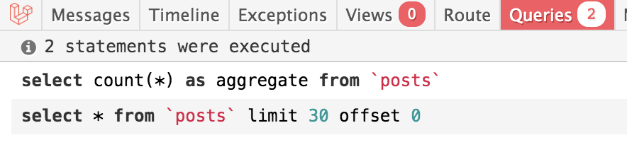
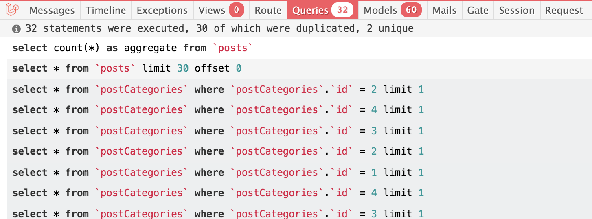
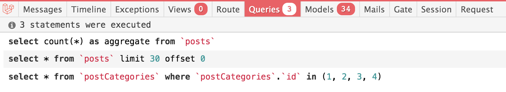

[TOC]

# laravel - 综合话题


# 一. 事件系统

[手册中的事件系统](<https://learnku.com/docs/laravel/6.x/events/5162>)

> Laravel 的事件提供了一个简单的观察者实现，允许你在应用中订阅和监听各种发生的事件。事件类通常放在 `app/Events` 目录下，而这些事件类的监听器则放在 `app/Listeners` 目录下。如果在你的应用中你没有看到这些目录，不用担心，它们会在你使用 Artisan 控制台命令生成事件与监听器的时候自动创建。
> 事件系统为应用各个方面的解耦提供了非常棒的方法，因为单个事件可以拥有多个互不依赖的监听器。举个例子，你可能希望每次订单发货时向用户推送一个 Slack 通知。你可以简单地发起一个可以被监听器接收并转化为 Slack 通知的 `OrderShipped` 事件，而不是将订单处理代码和 Slack 通知代码耦合在一起。

简单来说, 事件系统类似于更细粒度的 `Spring AOP`. 可以在某函数的任意位置调用某事件.

## 实现步骤

~~~php
/* ----------------- 1 ------------------ */
一个事件的完成, 需要以下几个类文件
    - event    : 我们自定义的事件类
    - listener : 我们自定义的监听类
    - EventServiceProvider : laravel 自带的, 用于关联 event 和对应的 listener

        
        
        


/*------------------ 2 EventServiceProvider定义 ------------------*/
首先我们在 EventServiceProvider 中定义一个事件及其监听器
        
        
/* 纵然现在还不存在这些 event 和 listener , 我们先 use 进来 */
use App\Events\testEvent;
use App\Listeners\testListener;
class EventServiceProvider extends ServiceProvider
    {
        protected $listen = [
            Registered::class => [
                SendEmailVerificationNotification::class,
            ],

            /* 我们自定义的 event 以及 listener */
            testEvent::class => [
                testListener::class
            ]
        ];

    }


/*------------------ 3 artisan 命令 ------------------*/
在定义好 EventServiceProvider 后,我们便可以利用 artisan 命令去生成对应的 event & listener

  
# 根据 EventServiceProvider 生成 event & listener
>$php artisan event:generate

    
    
    


/*------------------ 4 修改 生成的 enevt ------------------*/


/* enevt 的本质即为某个实例的容器, 所以我们需要在这个类的构造函数注入这个类 */
class testEvent
{
    use Dispatchable, InteractsWithSockets, SerializesModels;

    public $user;


    /**
     * Create a new event instance.
     *
     * @param User $user
     */
    /* enevt 的本质即为某个实例的容器, 所以我们需要在这个类的构造函数注入这个类 */
    public function __construct(User $user)
    {
        //
        $this->user = $user;
    }

    /**
     * Get the channels the event should broadcast on.
     *
     * @return \Illuminate\Broadcasting\Channel|array
     */
    public function broadcastOn()
    {
        return new PrivateChannel('channel-name');
    }
}


/*------------------ 5 修改生的 listener ------------------*/


namespace App\Listeners;
class testListener
{
    /**
     * Create the event listener.
     *
     * @return void
     */
    public function __construct()
    {
        //
    }

	/* 这个handle 即为我们的事件处理函数, 传入的参数即为我们定义的 event 实例 */
    /* event 实例包含了 $user 实体 */
    public function handle(LogIned $event)
    {
        //
        Log::debug("test listener : ". $event->user->name);
        
        // handle code
        
    }
}


/*------------------ 6 事件触发 ------------------*/  

要触发这个事件, 我们只需要在任意函数去实例化一个 event 即可

    public function login(User $user){
    	/* 触发事件 */
    	event(new testEvent($user));
	}


~~~


# 二. 安全相关

## 用户认证

> [文档中的用户认证](https://learnku.com/docs/laravel/5.6/authentication/1379#authenticating-users)
>
> [深挖Attempt函数](https://blog.csdn.net/xueba8/article/details/82347270)

`use Illuminate\Support\Facades\Auth;`

简而言之, 用户认证可以理解为用一个 `Auth` 类去保存 **当前登陆用户.**

同时我们可以使用 Auth 去获得当前登陆用户的信息

```php
// 判断当前用户是否已认证（是否已登录）
 Auth::check();A
// 获取当前的认证用户
 Auth::user();
// 获取当前的认证用户的 ID（未登录情况下会报错）
 Auth::id();
// 通过给定的信息来尝试对用户进行认证（成功后会自动启动会话）
 Auth::attempt(['email' => $email, 'password' => $password]);
// 通过 Auth::attempt() 传入 true 值来开启 '记住我' 功能
 Auth::attempt($credentials, true);
// 只针对一次的请求来认证用户
 Auth::once($credentials);
// 登录一个指定用户到应用上
 Auth::login(User::find(1));
// 登录指定用户 ID 的用户到应用上
 Auth::loginUsingId(1);
// 使用户退出登录（清除会话）
 Auth::logout();
// 验证用户凭证
 Auth::validate($credentials);
// Attempt to authenticate using HTTP Basic Auth
 // 使用 HTTP 的基本认证方式来认证
 Auth::basic('username');
// Perform a stateless HTTP Basic login attempt
 // 执行「HTTP Basic」登录尝试
 Auth::onceBasic();
// 发送密码重置提示给用户
 Password::remind($credentials, function($message, $user){});
```

也就是说, 一旦一个用户登陆(认证)了 Laravel 应用, 那么我们便可以通过 Auth 去获得其信息.


### 设置当前用户到 Auth

- 用户登陆成功情景
  我们使用 `Auth::attempt()` 去验证 `request` 传递来的登陆信息. for example :

  ```php
  public function store(Request $request){
    $basicValidate = $this->validate($request,[
          'password' => 'required',
          'email'=> 'required|email|max:255'
      ]
  );
      // 检测 basicValidate 是否存在与数据库中
      // 第二个传参为 bool 值，true 表示记住次用户
      if(Auth::attempt($basicValidate, true)){
          // 登陆成功
          
      }else{
          // 登陆失败
  
      }
  }
  ```

  `Auth::attempt()` 在验证的同时, **如果登陆成功也会记录到这个用户**. 底层代码实现如下 :

  ```php
  // in Illuminate\Auth 的文件 SessionGuard.php
      public function attempt(array $credentials = [], $remember = false)
      {
          $this->fireAttemptEvent($credentials, $remember);
          $this->lastAttempted = $user = $this->provider->retrieveByCredentials($credentials);
  
          if ($this->hasValidCredentials($user, $credentials)) {
              
              // 这里就是登陆逻辑, 如果验证成功了, 那么登陆该user
              $this->login($user, $remember);
  
              return true;
          }
          $this->fireFailedEvent($user, $credentials);
  
          return false;
      }
  
  
  public function login(AuthenticatableContract $user, $remember = false)
      {
          $this->updateSession($user->getAuthIdentifier());
  
          if ($remember) {
              $this->ensureRememberTokenIsSet($user);
  
              $this->queueRecallerCookie($user);
          }
          $this->fireLoginEvent($user, $remember);
  		
  		// login 函数的最后即为 set当前的suer
          $this->setUser($user);
      }
  
  
  // setUser 即为赋值给当前的成员函数
  public function setUser(AuthenticatableContract $user)
  {
      $this->user = $user;
  
      $this->loggedOut = false;
  
      $this->fireAuthenticatedEvent($user);
  
      return $this;
  }
  ```

### 注销当前用户

即为 logout 功能, 我们直接调用 Auth 的 logout 即可, 如下 :

```php
Auth::logout();
```


## 用户授权 与 策略授予

> [手册中的用户授权](https://learnku.com/docs/laravel/6.x/authorization/5153#registering-policies)

相比于用户认证(中间件实现) , **用户授予倾向于给当前登陆的用户授予操作某个方法的权限**, 比如 当前登陆用户只能修改自己的个人信息. **策略授予是用户授权的实现**

我们使用命令创建一个 **策略**

```shell
> php artisan make:policy UserPolicy
```

此时在 `\App\Policies\` 下会生成一个 `UserPolicy.php`文件

**基于约定大于配置的原则, 我们的策略名和 model 保持一致, 从而可以省略一些配置操作**

比如我们的用户表对应的 **Eloquent 模型为 User**, 那么我们的策略即为 **UserPilicy** 用来定义一些关于 User 数据操作的权力授予. 

**以更新用户权利为例子, 完整步骤如下 :**

```php
// --- 1. 在 UserPolicy 中定义关于 update 权利验证的方法
class UserPolicy
{
    use HandlesAuthorization;
    
    // 返回一个bool值, 这个逻辑即为当前用户只能修改自己的资料
    public function update(User $currentUser, User $passUser){

            return $currentUser->id === $passUser->id;

    }
}


// --- 2. 在 \App\Provides\AuthServiceProvider 中定义自动注册机制 (也可以手动注册)
public function boot()
{
    $this->registerPolicies();

    // 修改策略自动发现的逻辑
    Gate::guessPolicyNamesUsing(function ($modelClass) {
        //  约定大于配置 也可以如下实现 
        //  $class_name = class_basename($modelClass);
        //  if($class_name == 'User'){
        //   return 'App\Policies\UserPolicy';
        //   }
        // 动态返回模型对应的策略名称，如：// 'App\Models\User' => 'App\Policies\UserPolicy',
        return 'App\Policies\\'.class_basename($modelClass).'Policy';
    });
}


// --- 3. 在 UserController 更新操作中调用该策略
// 控制用户 CRUD 操作
class UsersController extends Controller
{

    public function update(User $user, Request $request){

        // 利用 UserPolicy 策略的 update 方法， 验证此时的user
        $this->authorize('update', $user);

		// code ...
}
```


### 关于策略方法第一个参数的问题

默认情况下, 策略内方法的第一个参数是当前登陆的用户, 可以理解为, **所有的策略方法, 都是针对某一用户权限授予, 默认情况下为当前登陆用户**

```php
class BlogPolicy
{

    /* 删除策略 */
    /* 所有策略的方法第一个传递参数都必须是 User 类型的 !!! */
    public function destroy(User $currentUser, Blog $currentBlog){
        /* 只能删除属于自己的blog */
		return $user->id == $currentBlog->user_id;
    }

}


/* 用这种方式调用的时候, laravel 默认的传递了 Auth::user() 给这个策略变为第一个参数 */
$this->authorize('destroy', $blog);
```

### 关于策略方法第二个参数的问题

```php
/* 值得注意的是, 策略的寻找并不是和对应控制器绑定的, 如下举例解释 */

class BlogController extend controller{
    

    public function destroy(Blog $blog){
        
        /* 这种调用下, 会找对应的 BlogPolicy 中的 destroy 方法去授权当前用户 */
		$this->authorize('destroy', $blog);
        
    }
    
}

/* 

	实际上以上情况会调用 `BlogPolicy` 策略文件, 是应为第二个参数传递的是 Blog 类型
	也就是说, 寻找哪个策略文件取决于 第二个传参数, 而不是所在的控制器
	
	即, 我们没必要为每一个控制器都写一个对应的 策略
	而对于每一个 Eloquent 模型才是需要对应一个 策略文件

*/
```


### 策略方法对非当前登陆用户的权限检测

```php
/* 这种方法检验权限即为 对当前登陆用户的检验*/
$this->authorize('destroy', $blog);


/* 对于非当前登陆用户, 可以如下方式查看 */
User::find(1)->can('destroy', $blog);
```


# 三. CSRF 攻击

> [CSRF 保护](<https://learnku.com/docs/laravel/7.x/csrf/7460>)
>
> Laravel 可以轻松使地保护你的应用程序免受 [跨站请求伪造](https://en.wikipedia.org/wiki/Cross-site_request_forgery) (CSRF) 攻击。 跨站点请求伪造是一种恶意攻击，它凭借已通过身份验证的用户身份来运行未经过授权的命令。
>
> Laravel 会自动为每个活跃的用户的会话生成一个 CSRF「令牌」。该令牌用于验证经过身份验证的用户是否是向应用程序发出请求的用户。

简而言之，一般的 web app 会在请求的时候在 `cookies` 和 `session` 中表示出此次请求的会话 id, 每次请求的时候客户端都会向服务端发送此会话id来标示此次会话。但是 `sessionID` 仅能标示出此次回话的存在，只靠 `sessionID` 并不能识别出此次的请求是不是真的出自于该客户端用户的操作，此就造成了 CSRF 攻击的风险。

## 一般解决思路

我们的 web 请求的时候，需要向服务端证实本次请求确实是来自于用户，具体的解决思路如下。在服务端返回给客户端页面的时候，生成一个完全随机的 `CSRF_TOKEN` ，同时存储于服务端和客户端。在客户端对服务端进行请求的时候，将此 `CSRF_TOKEN` 发送于服务端，服务端对此 `TOKEN` 进行验证。**如果对比一致，那么请求执行，同时 服务端和客户端刷新 `CSRF_TOKEN`**, 用于下一次请求。

一般 CSRF 攻击目的在于代替被攻击用户身份修改信息，**所以：各种 ’写请求‘ 都需要加上一个 `CSRF_TOKEN` 保证安全性**，而 ''读请求' '就可以不进行 `CSRF_TOKEN` 验证:

~~~php
/**
* Laravel 中验证逻辑，如果是 head, get, option 这三个 '读请求' 便可以跳过认证
* Determine if the HTTP request uses a ‘read’ verb.
*
* @param  \Illuminate\Http\Request  $request
* @return bool
*/
protected function isReading($request)
{
    return in_array($request->method(), ['HEAD', 'GET', 'OPTIONS']);
}
~~~

CSRF_TOKEN 存在于客户端的形式可以有多种

* Cookies 中存储
* Meta 标签中

实际上 `Laravel` 会同时在 `cookies` 和 `meta` 标签中存储当前会话的 `CSRS_TOKEN`

## Cookies 的 `CSRF_TOKEN` 存储

Laravel 里 cookies 的 CSRF_TOKEN 存储规定于 `\App\Http\Middleware\VerifyCsrfToken` 这个中间件中:

~~~php
<?php

namespace App\Http\Middleware;

use Illuminate\Foundation\Http\Middleware\VerifyCsrfToken as Middleware;

class VerifyCsrfToken extends Middleware
{
    /**
     * addHttpCookies为true则会在请求返回的时候对客户端设置 CSRF_TOKEN 的 cookies
     * Indicates whether the XSRF-TOKEN cookie should be set on the response.
     *
     * @var bool
     */
    protected $addHttpCookie = true;

    /**
     * The URIs that should be excluded from CSRF verification.
     *
     * @var array
     */
    protected $except = [
        //
    ];
}

~~~

如果设置了 cookies 中的 token, 那么在每一次请求的时候，都会在 request header 中附加上该信息, 但是 cookies 也有被客户端禁用的情况。

注意，`laravel` 中 cookies 设置的 csrf_token 并不是存在于服务端的原始值，而是经过一次加密的 csrf_token, 需要在传回服务端时进行解密比较。**且由于 random byte 的存在，相同的 csrf_token 会带来不同的密文**, 具体的加密解密操作可见 `VerifyCsrfToken` 中注入的 `Encrypter` 类 

~~~php
/* DI in VerifyCsrfToken */
public function __construct(Application $app, Encrypter $encrypter)
{
    $this->app = $app;
    $this->encrypter = $encrypter;
}
~~~


## Meta 标签的 `CSRF_TOKEN` 存储

为了应对 cookies 禁用以及其他 cookies 使用不成功的时候，我们还可以在 `<meta>` 标签中设置此次会话的 `CSRF_TOKEN`

~~~html
<!-- CSRF Token -->
<meta name="csrf-token" content="{{ csrf_token() }}">
~~~


## Laravel 获取 request中的 `CSRF_TOKEN`

Laravel 会从 **三个渠道获得 `CSRF_TOKEN`** 

* `post` 请求的 `input` 输出栏 (一般为隐藏栏)
* `request header` 中的 `X-CSRF-TOKEN` 字段
* 如果以上两种都不存在，则在 `cookies` 中寻找，且进行解密操作还原为服务端的原始值

以下源码可以看出 laravel 对请求中的 csrf_token 的获取顺序:

~~~php
/**
* Get the CSRF token from the request.
*
* @param  \Illuminate\Http\Request  $request
* @return string
*/
protected function getTokenFromRequest($request)
{
    $token = $request->input('_token') ?: $request->header('X-CSRF-TOKEN');

    if (! $token && $header = $request->header('X-XSRF-TOKEN')) {
        $token = $this->encrypter->decrypt($header, static::serialized());
    }

    return $token;
}
~~~


## 服务端比较`CSRF_TOKEN`

可以看到，在服务端，csrf_token 存于 `$request->session()->token()` 中。

`laravel` 中使用 `hash_equals` 进行两者的比较，可以使得无论两者值是什么，比较的时间都是一样从而有效的防止了 **侧信道攻击**。

~~~php
/**
* Determine if the session and input CSRF tokens match.
*
* @param  \Illuminate\Http\Request  $request
* @return bool
*/
protected function tokensMatch($request)
{
    $token = $this->getTokenFromRequest($request);

    return is_string($request->session()->token()) &&
        is_string($token) &&
        hash_equals($request->session()->token(), $token);
}
~~~


## 如何传递 CSRC_TOKEN

* **Method 1:** 现阶段，对于每一次 `post` 请求最好从 `meta` 标签中获取一个 csrf_token 作为其隐藏表单域名，`name` 设置为 `_token`。从而保证 `laravel` 在获得 csrf_token 的时候拥有最高的效率（因为其默认先获取 input 域中的 _token）

    ~~~javascript
    /* example for post request */
    axios.post('/login', {
        '_token' : $('meta[name="csrf-token"]').attr('content'),
        'email' : values.email,
        'password' : values.password,
        'remember' : values.remember,
    }).then((res)=>{
        console.log(res);
    }).catch(()=>{
        console.log('error');
    });
    ~~~

* **Method 2:** 也可以在每一次请求的时候，给请求头赋值 `X-CSRF_TOKEN`

    ~~~javascript
    $.ajaxSetup({
        headers: {
            'X-CSRF-TOKEN': $('meta[name="csrf-token"]').attr('content')
        }
    });
    ~~~

* **Method 3:** 当然在有 cookies 的 ` XSRF-TOKEN` 字段情况下，可以什么都不用管直接发送请求，但这种方式较前两种最慢。


# 四. N + 1 问题

N + 1 问题普遍存在于ORM框架中，发生于当模型中存在关联关系的时，我们用 `post(推文)` 表和 `category（推文类别）` 表举例子。

~~~
/* table : category */
id
category_name


/* table : post */
id 
category_id // Foreign key
~~~

当我们将 `Post Model` 和 `Category Model` 使用 `belongsTo` 关联后, 便可以使用 `Post Model` 属性的方式获得其对应的类别

~~~php
# 获得 $post 类别名
$post->category->category_name
~~~

**N+1** 问题发上在从数据库中取出一定量的 posts 同时获取这些 posts 的类别名的时候。

## 不关联的 Sql 查询

~~~php
/* 不获得推文分类信息 */

/* 分页获取 $posts */
$posts = Post::pagenate(30);
~~~

此时 `Query` 查询数量及其语句为以下两个 :

~~~sql
select count(*) as aggregate from `posts`
select * from `posts` limit 30 offset 0
~~~



## 关联的 Sql 查询

~~~php
/* 获得推文分类信息 */

/* 分页获取 $posts */
$posts = Post::pagenate(30);

/* 获取推文类别并加入为推文的属性 */
foreach($posts as &$post){
	$post['cat'] = $post->category->category_name;
}
~~~

此时的 `Query` 数量及其语句为 :



**可以看到 query 数量从 2 个飙升到 32 个**，对于每一个 post 都会查找一遍对应的类别表, 造成了极大的性能损耗.

## `with` 预加载

N + 1 的问题可以使用 `with` 预加载语句解决。

~~~php
# 预加载
$posts = $this->postModel::with('category')->paginate(30);
foreach ($posts as &$post){
    $post['cat'] = $post->category->name;
}
~~~



可以看到使用 `with` 预加载可以提前获得所有 `post` 中出现 `category_id` 然后一并查询类别表并缓存下来。从而使得其查询数量将为 3 个。


# 五. 自定义Repository层及其DI

众所周知，一个良好的web后端架构应该大致分为 `controller`, `service`, `repository` 三层，分别处理不同的逻辑实行层间解耦。

`Laravel` 类似 `Spring` 也是一个带有 IOC 和 ID 的框架那么如何在原生的 `laravel` 框架中实现 `Repository ` 的定义以及 DI呢。

## 未定义接口

~~~php
/* 在未定义接口的情况下，可以直接定义DI */
class UserRepo{
    
    
}


class UserService{
	private $userRepo;
    
    /* 直接 DI */
    public function __construct(UserRepo $userRepo){
        $this->$userRepo = $userRepo;
    }
}
~~~


## 定义接口

此时需要告诉 `Laravel` 接口和哪个实现类绑定

~~~php
interface IUserRepo{
    public function getAllUser();
}


class UserRepoImpl implement IUserRepo{
    public function getAllUser(){
        ...
    }
}
~~~


### 创建 `provider`

~~~shell
$php artisan make:provider repositoryProvider
~~~

### 绑定 `interface` 和 `implement`

~~~php
<?php

namespace App\Providers;
use App\Repo\IUserRepo;
use App\Repo\MysqlImpl\UserRepoImpl;

class RepositoryProvider extends ServiceProvider
{
    /**
     * Register services.
     *
     * @return void
     */
    public function register()
    {
        // bind repo
        $this->app->bind(IUserRepo::class, UserRepoImpl::class);
    }

    /**
     * Bootstrap services.
     *
     * @return void
     */
    public function boot()
    {
        //
    }
}

~~~

### 依赖注入

~~~php
use App\Repo\IUserRepo;

/* 在绑定后，便可以进行 DI */
class UserService{
	private $userRepo;
    
    /* DI */
    public function __construct(IUserRepo $userRepo){
        $this->$userRepo = $userRepo;
    }
}
~~~


# 六. 消息队列

> [消息队列](<https://learnku.com/docs/laravel/7.x/queues/7491#connections-vs-queues>)
>
> [Laravel 实战实例](<https://learnku.com/courses/laravel-intermediate-training/6.x/using-queues/5576>)
>
> Laravel 队列为各种不同的队列后端 (如 Beanstalk、Amazon SQS、Redis 甚至关系数据库) 提供了的统一 API。通过队列，你可以将耗时任务 (如发送电子邮件) 的处理往后推延。延迟这些耗时的任务可以极大地提升 web 请求响应速度。

## 使用例子

### 定义任务

~~~shell
# 定义一个任务类，用于消费队列中的消息
$php artisan make:job TranslateSlug
~~~

任务类被放置于 `app\jobs\` 目录下

~~~php
/*
	以我们的翻译任务为例
*/
<?php

namespace App\Jobs;

use Illuminate\Bus\Queueable;
use Illuminate\Queue\SerializesModels;
use Illuminate\Queue\InteractsWithQueue;
use Illuminate\Contracts\Queue\ShouldQueue;
use Illuminate\Foundation\Bus\Dispatchable;

use App\Models\Topic;
use App\Handlers\SlugTranslateHandler;

class TranslateSlug implements ShouldQueue
{
    use Dispatchable, InteractsWithQueue, Queueable, SerializesModels;

    protected $topic;

    public function __construct(Topic $topic)
    {
        // 队列任务构造器中接收了 Eloquent 模型，将会只序列化模型的 ID
        $this->topic = $topic;
    }

    public function handle()
    {
        // 请求百度 API 接口进行翻译
        $slug = app(SlugTranslateHandler::class)->translate($this->topic->title);

        // 为了避免模型监控器死循环调用，我们使用 DB 类直接对数据库进行操作
        \DB::table('topics')->where('id', $this->topic->id)->update(['slug' => $slug]);
    }
}
~~~

### 任务分发

~~~php
/* 
	分发的函数我们仅需调用 dispatch() 即可
*/

dispatch(new TranslateSlug($topic))
~~~

### 打开监听

~~~shell
# 让队列进入监听状态
$ php artisan queue:listen
~~~


