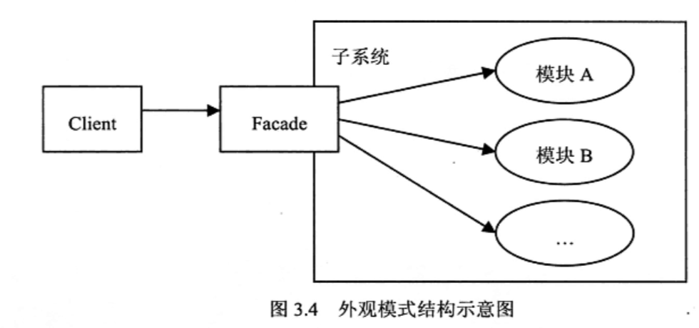

# Laravel 内核

[TOC]

# 服务容器 (IocContainer)

和 `Spring` 类似, `Laravel` 引入了 `IOC` 和 `DI` 的概念

## DI 依赖注入(带参数)

我们无法避免一些场景的类实例化的时候，需要提供一些初始化参数，而这些参数存在于我们的配置文件中，比如我们的自定义 百度翻译类  `SlugTranslateHandler`

~~~php
<?php

namespace App\Handlers;

class SlugTranslateHandler{

    private $appId;
    private $appKey;

    /* DI */
    /* 构造函数需要提供 Api 的 appid 和 appkey */
    public function __construct($appId, $appKey)
    {
        $this->appId = $appId;
        $this->appKey = $appKey;
    }
    public function translate(){
		//...
    }
}
~~~

~~~php
/* 对这个翻译类进行DI */
public function store(SlugTranslateHandler $slugTranslateHandler){

    $slugTranslateHandler->translate();

}
~~~

可以看到在对翻译类 DI 的时候并没有机会去传入这个定义的 `$appId` 和 `appKey` 。

因此，此时我们可以用到 [容器的绑定基本值实现的](<https://learnku.com/docs/laravel/6.x/container/5131#binding-basics>)

要对这个注入的 `$appId` 和 `$appKey` 进行初始赋值 ，我们可以在 `App\Provider\AppServiceProvider.php` 进行定义即可。

~~~php
<?php

namespace App\Providers;
use Illuminate\Support\Facades\Config;
use Illuminate\Support\ServiceProvider;

class AppServiceProvider extends ServiceProvider
{
    public function register()
    {

        /* baidu translate service */
        $this->app->when('App\Handlers\SlugTranslateHandler')
            ->needs('$appId')
            ->give(Config::get('services.BaiDu_translate.appId'));

        $this->app->when('App\Handlers\SlugTranslateHandler')
            ->needs('$appKey')
            ->give(Config::get('services.BaiDu_translate.appKey'));
    }

    public function boot()
    {
    }
}

~~~

#服务绑定进入 IOC 的时机

> [laravel容器是什么时候绑定服务提供者里面register的服务的](<https://www.jianshu.com/p/95f5fd4fef0d>)

我们在 `app` 目录下, 可以直接使用 `IoC` 容器中提供的服务, 例如: `auth, log` 等等

首先, 项目中的服务是在 `config/app.php` 中定义的.

但是这些服务是什么被绑定进入 `Ioc` 容器的呢. 我们一步步来看看.

1. **首先是 `\public\index.php`** 

    这里是一切请求的入口, 是我们服务器规定的 `App` 根目录 如下, 每一次 `Http` 请求都是这里进入.

    ~~~php
    <?php
    
    /* index.php 一切请求的入口 */
    
    define('LARAVEL_START', microtime(true));
    
    require __DIR__.'/../vendor/autoload.php'; 
    
    
    // $app 即为我们的全局的 IoC 容器. 通过执行如下的文件获得.
    $app = require_once __DIR__.'/../bootstrap/app.php';
    
    $kernel = $app->make(Illuminate\Contracts\Http\Kernel::class);
    
    $response = $kernel->handle(
        $request = Illuminate\Http\Request::capture()
    );
    
    $response->send();
    
    $kernel->terminate($request, $response);
    ~~~

2. **通过以上我们先找到 `bootstrap/app.php` 文件, 完成 `$app` 的实例化, 如下**

   ~~~php
   <?php
   
   /* 
   	我们的 $app IoC容器便在这里被实例化了
   	
   	有没有可能在 $app 实例化的构造函数里边绑定的呢? 我们往下看
   */
   $app = new Illuminate\Foundation\Application(
       $_ENV['APP_BASE_PATH'] ?? dirname(__DIR__)
   );
   
   
   /*
   |--------------------------------------------------------------------------
   | Bind Important Interfaces
   |--------------------------------------------------------------------------
   |
   | Next, we need to bind some important interfaces into the container so
   | we will be able to resolve them when needed. The kernels serve the
   | incoming requests to this application from both the web and CLI.
   
   | 接下来我们为 $app 容器绑定了三个最为基础的服务, 注意只有这三个最为 Basic 的服务在这个阶段进行绑定 
   */
   $app->singleton(
       Illuminate\Contracts\Http\Kernel::class,
       App\Http\Kernel::class
   );
   
   $app->singleton(
       Illuminate\Contracts\Console\Kernel::class,
       App\Console\Kernel::class
   );
   
   $app->singleton(
       Illuminate\Contracts\Debug\ExceptionHandler::class,
       App\Exceptions\Handler::class
   );
   
   /*
   |--------------------------------------------------------------------------
   | Return The Application
   |--------------------------------------------------------------------------
   |
   | This script returns the application instance. The instance is given to
   | the calling script so we can separate the building of the instances
   | from the actual running of the application and sending responses.
   |
   */
   return $app;
   
   ~~~

3. **为了验证是不是在 `$app` 的构造函数里面进行绑定的, 我们进入 `Illuminate\Foundation\Application` 文件**

   ~~~php
   class Application extends Container implements ApplicationContract, HttpKernelInterface
   {
       
       /* code ... */
       
   
       public function __construct($basePath = null)
       {
           if ($basePath) {
               $this->setBasePath($basePath);
           }
   		
           /* 
           
           	进入这三个函数发现并没有注册那些常用的服务
           	
           	此时我们回到 index.php 
           
           */
           $this->registerBaseBindings();
           $this->registerBaseServiceProviders();
           $this->registerCoreContainerAliases();
       }   
   
       
       /* code ... */
   }
   ~~~

4. **发现并不是在 `$app` 实例化的时候进行注册的, 那么我们回到 `index.php` 继续往下 :**

   ~~~php
   <?php
   
   /* index.php 一切请求的入口 */
   
   define('LARAVEL_START', microtime(true));
   
   require __DIR__.'/../vendor/autoload.php'; 
   
   
   // 服务并不是在这里注册的
   $app = require_once __DIR__.'/../bootstrap/app.php';
   
   /*
   	$app->make() 函数表示通过 类或者接口的名字, 利用反射的方式获得 IoC 中的这个实例
   	Illuminate\Contracts\Http\Kernel::class 是一个接口, 我们根据 app.php 中找到了注册的对应	 的类 : app\Http\Kernel.php
   */
   $kernel = $app->make(Illuminate\Contracts\Http\Kernel::class);
   
   // 获得 $kernel 实例后, 调用其 handle 方法, 我们进去看看
   $response = $kernel->handle(
       $request = Illuminate\Http\Request::capture()
   );
   
   $response->send();
   
   $kernel->terminate($request, $response);
   ~~~

5. **位于 `kernel.php` 的基类 `Illuminate\Foundation\Http\Kernel` 我们找到了 `handle` 函数** :

   ~~~php
   /**
   
   	----------------------- 1 -----------------------
   	
   	function handle()
   	
        * Handle an incoming HTTP request.
        *
        * @param  \Illuminate\Http\Request  $request
        * @return \Illuminate\Http\Response
   */
   public function handle($request)
   {
       try {
           $request->enableHttpMethodParameterOverride();
   		
           /* 我们找到这个函数 */
           $response = $this->sendRequestThroughRouter($request);
       } catch (Exception $e) {
           $this->reportException($e);
   
           $response = $this->renderException($request, $e);
       } catch (Throwable $e) {
           $this->reportException($e = new FatalThrowableError($e));
   
           $response = $this->renderException($request, $e);
       }
   
       $this->app['events']->dispatch(
           new RequestHandled($request, $response)
       );
   
       return $response;
   }
   
   
   
   
   /** 
   
   	----------------------- 2 -----------------------
   	
   	function sendRequestThroughRouter()
   	
        * Send the given request through the middleware / router.
        *
        * @param  \Illuminate\Http\Request  $request
        * @return \Illuminate\Http\Response
   */
   protected function sendRequestThroughRouter($request)
   {
       $this->app->instance('request', $request);
   
       Facade::clearResolvedInstance('request');
   	
       /* bootstrap 方法 */
       $this->bootstrap();	
   
       return (new Pipeline($this->app))
           ->send($request)
           ->through($this->app->shouldSkipMiddleware() ? [] : $this->middleware)
           ->then($this->dispatchToRouter());
   }
   
   
   
   /*
   	----------------------- 3 -----------------------
   		bootstarp() 方法
   */
   /**
        * Bootstrap the application for HTTP requests.
        *
        * @return void
        */
   public function bootstrap()
   {
       if (! $this->app->hasBeenBootstrapped()) {
           
           /*
           	bootstrapWith 方法 	
           	是 app类的 方法
           */
           $this->app->bootstrapWith($this->bootstrappers());
       }
   }
   
   
   ~~~

6. 最终找到 `app` 类的 `bootstrapWith()`  方法

   ~~~php
   /**
        * Run the given array of bootstrap classes.
        *
        * @param  string[]  $bootstrappers
        * @return void
        */
   public function bootstrapWith(array $bootstrappers)
   {
       $this->hasBeenBootstrapped = true;
   
       foreach ($bootstrappers as $bootstrapper) {
           $this['events']->dispatch('bootstrapping: '.$bootstrapper, [$this]);
           
           /* 
           	make 函数便为为 IoC 容器注册服务的函数
           */
           $this->make($bootstrapper)->bootstrap($this);
   
           $this['events']->dispatch('bootstrapped: '.$bootstrapper, [$this]);
       }
   }
   
   
   /*
   	
   	所以我们看到了这里我们会把 \Illuminate\Foundation\Bootstrap\RegisterProviders::class,这个服务解析出来，那么就去看这个文件喽
   
   */
   /**
        * Register all of the configured providers.
        *
        * @return void
        */
   public function registerConfiguredProviders()
   {	
       
       /* 
       	最后, 我们在这里找到了在这里进行初始化的.
       	app.providers 便是在 config/app.php 里面定义的所有app所需的服务
   	*/
       $providers = Collection::make($this->config['app.providers'])
           ->partition(function ($provider) {
               return strpos($provider, 'Illuminate\\') === 0;
           });
   
       $providers->splice(1, 0, [$this->make(PackageManifest::class)->providers()]);
   
       (new ProviderRepository($this, new Filesystem, $this->getCachedServicesPath()))
       ->load($providers->collapse()->toArray());
   }
   ~~~

## 结论

回到 `public\index.php` 中, 我们可以得到结论如下 : 

~~~php
<?php

/* index.php 一切请求的入口 */

define('LARAVEL_START', microtime(true));

require __DIR__.'/../vendor/autoload.php'; 

/* 极少的服务 (三个必备服务), bootstrap/app.php 便注入了 */
$app = require_once __DIR__.'/../bootstrap/app.php';

$kernel = $app->make(Illuminate\Contracts\Http\Kernel::class);

/* 大部分的服务, 是在 handle 方法中注册进入的 $app 全局容器的 */
$response = $kernel->handle(
    $request = Illuminate\Http\Request::capture()
);

/* 也就是说, 我们使用大部分服务需要在这个步骤之后使用, 比如 log */
/* 先从$app 中取出 log 实例, 然后调用 */
$log = $app->make('log');
$log->debug(" ---- hello laravel ----");

$response->send();

$kernel->terminate($request, $response);
~~~

# facade in Laravel (外观模式)

>[facade 和 proxy 的区别](<https://www.cnblogs.com/xinziyublog/p/4846583.html>)

外观设计模式在 `Laravel` 中使用的非常多, 

关于外观设计模式, 简单来说就是 **利用外观类可以封装复杂类的各个模块, 直接将结果提供给客户端. 如图:**

在 `Laravel` 中. 外观模式主要用来代理我们的各个服务类, 使得客户端可以更加轻易的使用服务类的服务, 这些服务包括 : `log, auth, route`等等.

以 `log` 为例子, 我们来看, `facade类` 如何发挥作用

~~~php
/* log 的外观类 */

namespace Illuminate\Support\Facades;

/**
 * @method static void emergency(string $message, array $context = [])
 * @method static void alert(string $message, array $context = [])
 * @method static void critical(string $message, array $context = [])
 * @method static void error(string $message, array $context = [])
 * @method static void warning(string $message, array $context = [])
 * @method static void notice(string $message, array $context = [])
 * @method static void info(string $message, array $context = [])
 * @method static void debug(string $message, array $context = [])
 * @method static void log($level, string $message, array $context = [])
 * @method static mixed channel(string $channel = null)
 * @method static \Psr\Log\LoggerInterface stack(array $channels, string $channel = null)
 *
 * @see \Illuminate\Log\Logger
 */
class Log extends Facade
{
    /**
     * Get the registered name of the component.
     *
     * @return string
     */
    protected static function getFacadeAccessor()
    {
        return 'log';
    }
}

~~~

通过这个类我们发现, 使用 例如`Log::debug("hello world")` 调用的 `log类的静态方法`似乎并不存在. 

但是我们打开 `Facade` 基类有一个 `__callStatic() 的魔术方法`

~~~php
/**	
	这个魔术方法可以拦截类中没有的 静态方法, 然后进入该方法
*/
public static function __callStatic($method, $args)
{
    $instance = static::getFacadeRoot();

    if (! $instance) {
        throw new RuntimeException('A facade root has not been set.');
    }

    return $instance->$method(...$args);
}
~~~

也就是说 当我们使用 `Log::debug("hello world")` 调用 `debug` 方法的时候, 我们会执行 :

 `$instance = static::getFacadeRoot();`

~~~php
/**
* Get the root object behind the facade.
*
* @return mixed
*/
public static function getFacadeRoot()
{	
    
    /* 
    	这里的static::getFacadeAccessor() 即为在 Log 外观类定义的函数
    	返回字符串 'log'
    	这个字符串便是 $app IoC 容器对于 log这个服务的简写约定
    */
    return static::resolveFacadeInstance(static::getFacadeAccessor());
}
~~~

~~~php
/**
     * Resolve the facade root instance from the container.
     *
     * @param  object|string  $name
     * @return mixed
     */
protected static function resolveFacadeInstance($name)
{
    if (is_object($name)) {
        return $name;
    }

    if (isset(static::$resolvedInstance[$name])) {
        return static::$resolvedInstance[$name];
    }
	
    /* 如果存在全局容器, 那么返回这个容器中的 $app['log'] 即为 log 服务的实例 */
    if (static::$app) {
        return static::$resolvedInstance[$name] = static::$app[$name];
    }
}
~~~

所以, 回到 `__callStatic()` 魔术方法中 :

~~~php
/**	
	这个魔术方法可以拦截类中没有的 静态方法, 然后进入该方法
*/
public static function __callStatic($method, $args)
{	
    // $instance 便是 'log' 这个服务的实例了 
    $instance = static::getFacadeRoot();

    if (! $instance) {
        throw new RuntimeException('A facade root has not been set.');
    }
	
    // 返回 $instance 调用 method 的结果, 即为 log->debug()
    // 至此完成了 外观类的方法调用
    return $instance->$method(...$args);
}
~~~

