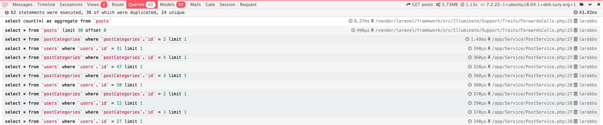

[TOC]

# laravel-plugin

laravel 框架的好用离不开它对各种第三方插件友好的支持.

由于使用 `IoC, DI` `laravel` 可以再无入侵代码的情况下轻松的引入第三方扩展库.


# [mews/captcha](https://github.com/mewebstudio/captcha) 验证码生成

> [为什么可以不在 `app.php` 中手动注册](<https://learnku.com/laravel/t/13011/why-is-mewscaptcha-no-longer-registered-in-providers>)

这个库可用用于二维码的生成

~~~shell
# 安装
$composer require "mews/captcha:~3.0"

# 发布
$  php artisan vendor:publish --provider='Mews\Captcha\CaptchaServiceProvider' 

# [可省略] 在 \config\app.php 中写入该 服务提供者
# 'providers' => [... mews\captcha\CaptchaServiceProvider::class, ...]
~~~

## 前端 Get 调用

`CaptchaServiceProvider` 这个服务提供者在 `boot` 方法中发布了两个新的路由:

~~~php
$router->get('captcha/api/{config?}', '\Mews\Captcha\CaptchaController@getCaptchaApi')->middleware('web');

$router->get('captcha/{config?}', '\Mews\Captcha\CaptchaController@getCaptcha')->middleware('web');
~~~

从而我们可以直接在 前端页面利用 `get` 请求获得验证码, 如下: 

~~~html

~~~


## 后端验证

`CaptchaServiceProvider` 同样在 `boot` 方法中提供了验证的规则 :

~~~php
// Validator extensions
$validator->extend('captcha', function ($attribute, $value, $parameters) {
    return captcha_check($value);
});
~~~

所以在后端验证控制器上, 我们也可以直接利用 `Validator` 验证

~~~php
class RegisterController extends Controller
{
    protected function validator(array $data)
        {
            return Validator::make($data, [
                'name' => ['required', 'string', 'max:255'],
                'email' => ['required', 'string', 'email', 'max:255', 'unique:users'],
                'password' => ['required', 'string', 'min:8', 'confirmed'],
                'captcha' => ['required', 'captcha'],
            ],
            [
                'captcha.required' => '验证码不能为空',
                'captcha.captcha' => '请输入正确的验证码',
            ]
            );
        }
}
~~~


# gravatar 生成用户头像

> 使用 [Gravatar](https://en.gravatar.com/) 来为用户提供个人头像支持。Gravatar 为 “全球通用头像”，当你在 Gravatar 的服务器上放置了自己的头像后，可通过将自己的 Gravatar 登录邮箱进行 MD5 转码，并与 Gravatar 的 URL 进行拼接来获取到自己的 Gravatar 头像。

引用方式简单 如下 :

```php
// 返回一个字符串, 且 get 传入自己的 email
public function gravatar($size = '100')
{
    $hash = md5(strtolower(trim($this->attributes['email'])));
    return "http://www.gravatar.com/avatar/$hash?s=$size";
}
```

直接在 img 标签的 src 引用该 url 即可

```html
gravatar('140') }}" alt="{{ $user->name }}" class="gravatar"/>
```


# Faker 生成假数据

我们可以利用 [Faker](https://github.com/fzaninotto/Faker) 扩展包 配合 `Seed` 机制生成假数据

```php
// 可以生成的假数据字段

// 使用 factory 来创建一个 Faker\Generator 实例
$faker = Faker\Factory::create();

// 生成用户名
$faker->name; // "Janie Roob"

// 生成安全邮箱
$faker->safeEmail; // "claire.wuckert@example.net"

// 生成随机日期
$faker->date // "2011-02-10"

// 生成随机时间
$faker->time // "13:03:55"
```


# Carbon 时间处理工具

~~~shell
# install
composer require nesbot/carbon

# 现在的 Laravel 已经默认安装了 Carbon 工具，不需要单独引入了
~~~

## `diffForHumans` 友好的时间显示

提供了更友好的时间显示 :

```shell
# Tinker 
>>> $time = $blg->user()->get()[0]->created_at;
=> Illuminate\Support\Carbon @1004987065 {#3071
     date: 2001-11-05 19:04:25.0 UTC (+00:00),
   }
   
>>> $time->diffForHumans();
=> "18 years ago"
```

 ~~~php
/* php script */
use Carbon\Carbon;

/* updated_at 修改器 */
public function getUpdatedAtAttribute(){

    return Carbon::parse($this->attributes['updated_at'])->diffForHumans();

}
 ~~~


# Laravel-debugbar 调试工具

~~~shell
# install
composer require "barryvdh/laravel-debugbar:~3.2" --dev
~~~

~~~php
/* config/debuger.php 设置debug环境 */
'enabled' => env('APP_DEBUG', false),
~~~

可以用于接口的 `Sql` 执行语句，效果如下 :




# Guzzle

> [Guzzle](https://github.com/guzzle/guzzle) 库是一套强大的 PHP HTTP 请求套件

## 安装

~~~shell
$ composer require "guzzlehttp/guzzle:~6.3"
~~~


## 使用

~~~php
use GuzzleHttp\Client;


$httpClient = new Client();

/* 
	发送请求
	返回值即为请求的结果
*/
$response = $httpClient->get($requestUrl);


/*
	返回如果为 Json 
	那么可以直接 json_deconde 进行解码即可
*/
$result = json_decode($response->getBody(), true);
~~~


# PinYin

> [PinYin](https://github.com/overtrue/pinyin) 是 [安正超](https://learnku.com/users/76) 开发的，基于 [CC-CEDICT](http://cc-cedict.org/wiki/) 词典的中文转拼音工具，是一套优质的汉字转拼音解决方案

## 安装

~~~shell
$ composer require "overtrue/pinyin:~4.0"
~~~

## 使用

~~~php
$pinYin = new Pinyin();

$res = $pinYin->permalink($text);
~~~


# 消息队列 Redis - based

众所周知，消息队列是一个很重要的后端技能，可以很轻松的实现模块解耦，消峰等功能。在 laravel 可是使用 Redis 作为消息队列驱动

## 安装

~~~shell
# 安装 redis 在 php 中的客户端
$ composer require "predis/predis:~1.1"
~~~


## 修改配置文件

~~~.env
.
# 指定队列驱动为 redis
QUEUE_CONNECTION=redis

# 指定redis 客户端为 predis
REDIS_CLIENT=predis
.
~~~

# 队列监控 Horizon

> [Horizon](https://learnku.com/docs/laravel/6.x/horizon) 是 Laravel 生态圈里的一员，为 Laravel Redis 队列提供了一个漂亮的仪表板，允许我们很方便地查看和管理 Redis 队列任务执行的情况。

## 安装

 ~~~shell
$ composer require "laravel/horizon:~3.1"
 ~~~

## 发布

~~~shell
$ php artisan vendor:publish --provider="Laravel\Horizon\HorizonServiceProvider"
~~~

## 访问

~~~
 larabbs.test/horizon
~~~


## 开启监听状态

~~~shell
# 开启 horizon 的监听状态后，便可以不使用 php artisan queue:listen 命令了
$ php artisan horizon
~~~


