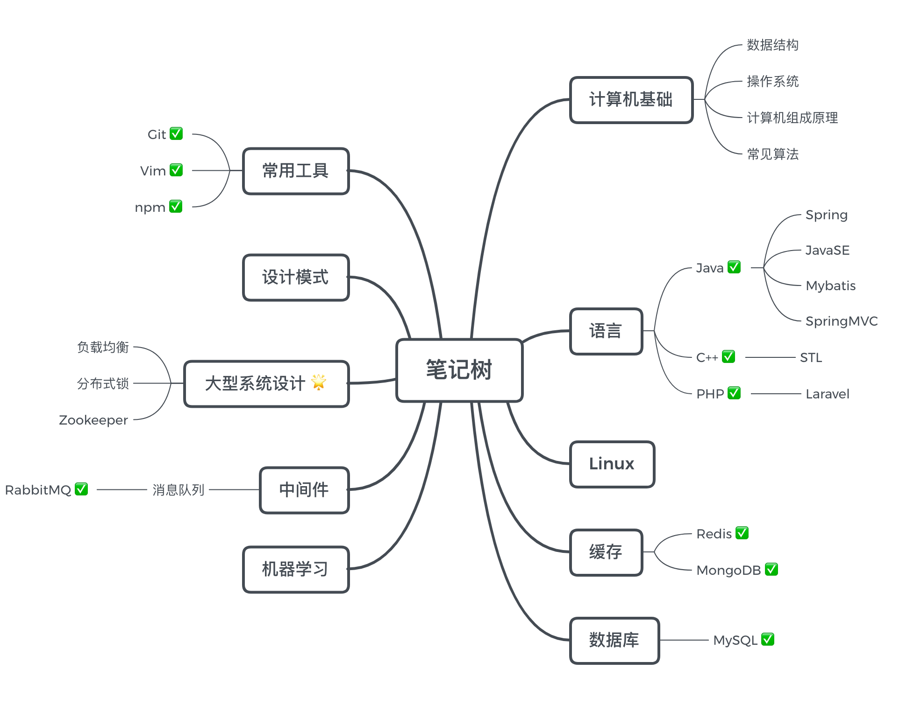

# 学习笔记

这个 Repo 用于记录大致从2019年准备秋招开始, 断断续续整理的一些笔记, 最后成功上岸鹅厂.

不断学习加深印象的同时也方便日后查阅. Coder本身就是一个需要不断积累的职业, 记录学习点滴也可以勉励自己不断向前. 

**生命不停, 学习不止** 🔥

🏃🏃‍♀️

## 计算机基础

[数据结构与算法 (exam version)](datastructure/ds.md)

[常见算法](algorithm/README.md)

## 语言

[Java](java/README.md) 

[PHP](PHP/README.md)

[C++](C++/README.md)

## Web 前端

[JavaScript基础]

[React](react-ecology/React.md)

[Redux](react-ecology/Redux.md)

## 分布式系统设计

### 服务治理

Eureka | Zookeeper 
:-: | :-: 
**Consul** | **Nacos** 

[PRC 远程调用]

[Nginx 负载均衡]

[分布式锁]

## 机器学习

[机器学习](机器学习/README.md)

## Linux

[Linux基础](linux/README.md)

## 数据库

[MySQL基础](MySQL/README.md)

[Redis](Redis/Redis.md)

[MongoDB](MongoDB/MongDB.md)

## 中间件

[消息队列概述](中间件/消息队列/消息队列概述.md)

[RabbitMQ](中间件/消息队列/RabbitMQ.md)

## 大数据

[大数据基本概念]

## 设计模式

[基本设计模式]

## 常用工具

[Git 常用命令](Git/git.md)

[vim](Vim/Vim.md)

[npm](npm/npm.md)