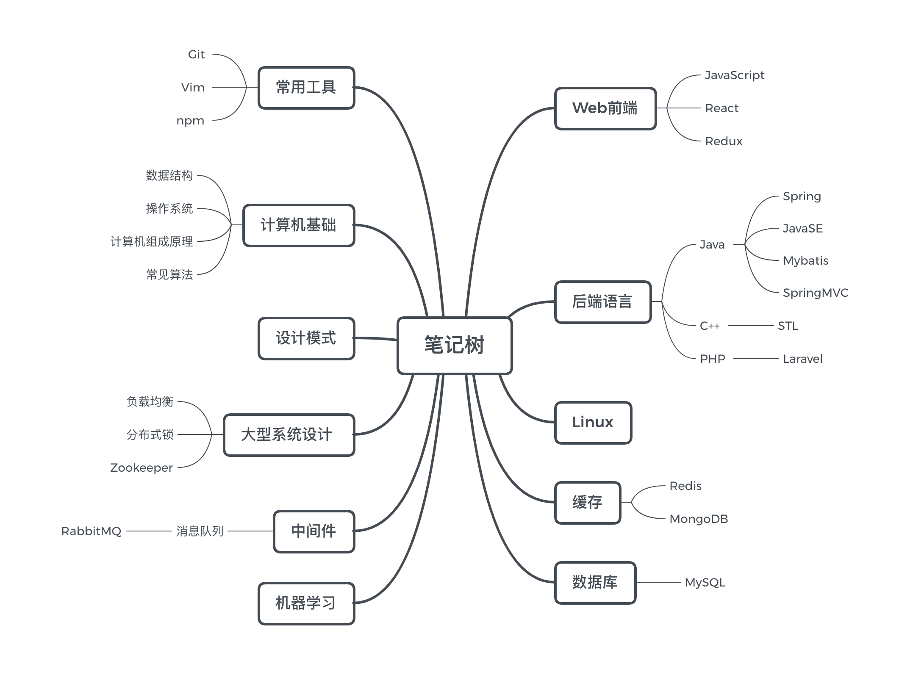

# 学习笔记

这个 Repo 用于记录大致从2019年准备秋招开始, 断断续续整理的一些笔记, 最后成功上岸鹅厂.

不断学习加深印象的同时也方便日后查阅. Coder本身就是一个需要不断积累的职业, 记录学习点滴也可以勉励自己不断向前. 

**生命不停, 学习不止** 🔥

🏃🏃‍♀️

# 计算机基础

[数据结构与算法 (exam version)](datastructure/ds.md)

[常见算法](algorithm/README.md)

# 计算机语言

[Java](java/README.md) 

[PHP](PHP/README.md)

[C++](C++/README.md)

# 机器学习

对所学的机器学习的相关课程 **用自己的话进行的归纳总结**

[机器学习](机器学习/README.md)

# Linux

[Linux基础](linux/README.md)

# MySQL 数据库

[MySQL基础](MySQL/README.md)

# 缓存层

[Redis](Redis/Redis.md)

[MongoDB](MongoDB/MongDB.md)

# 中间件

[消息队列概述](中间件/消息队列/消息队列概述.md)

[RabbitMQ](中间件/消息队列/RabbitMQ.md)

# 分布式系统设计

[PRC 远程调用]

[Zookeeper]

[Nginx 负载均衡]

[分布式锁]

# 大数据

[大数据基本概念]

# 设计模式

[基本设计模式]()

# 常用工具

[Git 常用命令]()

[vim](Vim/Vim.md)

[npm](npm/npm.md)