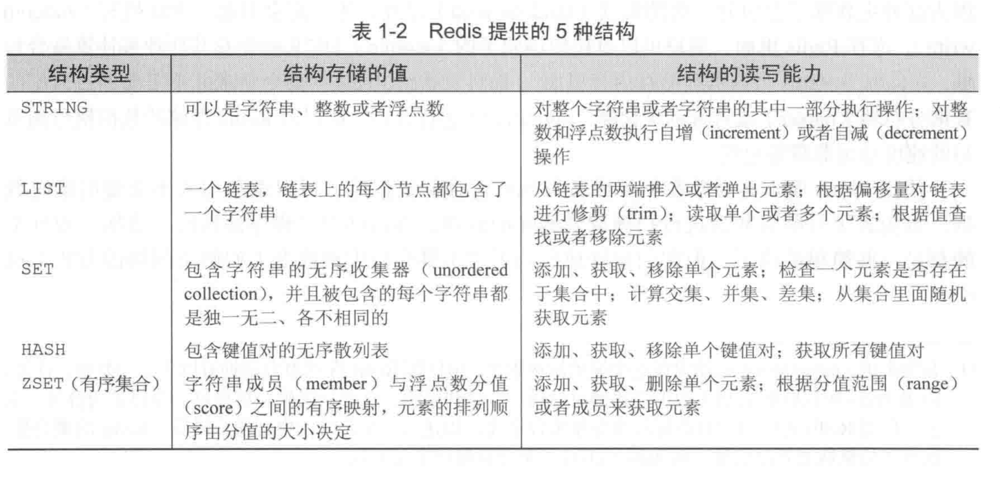
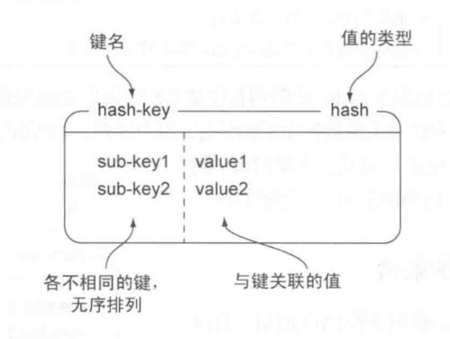
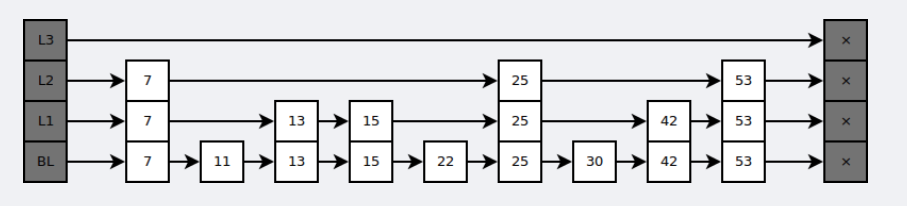
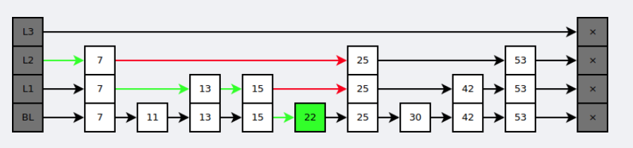

#   Redis

[TOC]

# 一. 概述	

* 速度非常快的 NoSQL 内存数据库
* 键值对的形式进行存储 (Key-Value), 其中 key 只能为字符串, Value **支持五种形式**

* Redis 支持将数据写入硬盘, 下次使用的时候, 直接从硬盘读取

* Redis 是一个 效率非常高的 **单线程 epoll 的IO多路复用模型**

# 二. 数据类型

| 数据类型 | 可以存储的值              | 操作                                                         |
| -------- | ------------------------- | ------------------------------------------------------------ |
| STRING   | 字符串、整数或者浮点数    | 1. 对整个字符串或者字符串的其中一部分执行操作  2.  对整数和浮点数执行自增或者自减操作 |
| LIST     | 一个链表, 存的值为 字符串 | 从两端压入或者弹出元素  对单个或者多个元素进行修剪， 只保留一个范围内的元素 |
| SET      | 无序集合                  | 添加、获取、移除单个元素 检查一个元素是否存在于集合中 计算交集、并集、差集 从集合里面随机获取元素 |
| HASH     | 包含键值对的无序散列表    | 添加、获取、移除单个键值对 获取所有键值对 检查某个键是否存在 |
| ZSET     | 有序集合                  | 添加、获取、删除元素 根据分值范围或者成员来获取元素 计算一个键的排名 |

## String 

String  是 Redis 中最简单的结构 仅仅支持三种命令:

* Set : 设置值

  ~~~shell
  # 表示 key => name 
  # value => fangzhou
  SET name fangzhou
  
  # value 之间如果有空格需要打上双引号
  SET name "fang zhou"
  
  # ❌
  SET name fang zhou
  ~~~

* Get : 获取值

  ~~~shell
  get name
  > fangzhou
  ~~~

* Del : 删除值

## List (列表)

* 有序性 : 基于队列实现 (FIFO, 先进先出) 的结构

* 重复性: **List 允许有相同的元素出现**

有如下命令

| command                          | des                               |
| -------------------------------- | --------------------------------- |
| rpush \[list_name] [item]        | List中压入一个值                  |
| lpop    \[list_name]             | List中取出一个值                  |
| lindex \[list_name] [index]      | List中以 index (索引) 查找一个值  |
| lrange \[list_name]\[begin][end] | list中查找 \[begin][end] 范围的值 |

## set 集合

* 唯一性: **和列表的区别 : 集合不允许有相同的元素出现** (通过 **散列表** 的方式实现)
* 无序性 : 使用无序的方式存储数据 (字符串) , 所以不能保证元素的取出顺序

对于集合的操作命令 :

| 命令                        | 描述                                     |
| --------------------------- | ---------------------------------------- |
| sadd \[set_name] [item]     | 给集合添加一个元素                       |
| smembers [set_name]         | 显示集合的所有元素                       |
| sismember \[set_name][item] | 检查 item 是不是在集合中, 返回一个布尔值 |
| srem \[set_name] [item]     | 如果item 在集合中, 那么删除它            |

## hset 散列表 

一个微小版本的 Redis, 因为Redis就是这种 Key => Value 的形式, 而 Redis 里面的 散列表 就是存储了这样的一些键值对

命令如下 :

| 命令                               | 描述                                       |
| ---------------------------------- | ------------------------------------------ |
| hset \[hash_name] \[key] \[ value] | 在 hash_name 的表里面存储一对 key => value |
| hget [hash_name] \[key]            | 获取 hash_name 的表里面的 key 对应的 值    |
| hgetall \[hash_name]               | 获取hash_name 所有的值                     |
| hdel [hash_name] \[key]            | 删除 hash_table 里的 key => value 对       |

## zset 有序集合 

* zset 是redis中 唯一 既支持 (key => value)访问形式, 又支持顺序(index) 访问的数据结构

命令如下:

| 命令                                                         | 描述                                                         |
| ------------------------------------------------------------ | ------------------------------------------------------------ |
| zadd \[zset_name] \[scores] \[member_name]                   | 给有序集合添加一个成员, 其中 排序分数[scores] 必须为 数字类型 (int , double). **插入成员的时候就按照 [scores] 排序** |
| zrange \[zset_name] \[begin]\[end]  -[withscores]            | 查看 zset_name 中所有的member, withscores 为可选项表示 输出带有 scores. 否则只输出 member |
| zrangebysrcore \[zset_name]  \[scores-begin] \[scores-end] -[withscores] | 按分数筛选 zset_name 里面的 member \[scores-begin] \[scores-end], 为查找分数的范围 |
| zrem [zset_name]\[member_name]                               | 如果 set_name 里面有 member_name 则删除该成员                |

## 字段自增命令

Redis 支持对某个字段的自增操作

对于字段的自增操作分为两种情况  :

* **如果 value 值为 string 类型, 那么可以直接使用 INCR / INCRBY 命令**

  `INCR age` 对 `age ` 的 value 值进行自增操作, 如果值不存在, 那么初始化为 0 再执行自增

  `INCRBY age increment`  对 age 的 value 执行增量为 `increment` 的操作, 增量为负的情况下, 即为自减. 同样的, 如果不存在某个值, 则初始化为 0 再执行操作

* **如果 value 值为 HashMap, 那么需要使用 HINCRBY 命令** 

  `HINCRBY myHashSet age 10` 表示对哈希表 myHashSet 的 age 字段自增 10

## Redis 获得所有的 key 值

通过 `Keys pattern` 的命令去实现对我们 redis 里面所有的 keys 的查询. 

**注意, 对于五种数据类型的 value 值, key 值都是通过这个命令去获得**

比如在投票场景 : 

我们可以通过 voteHashSet_voteId_userId 作为哈希表的 key 值. 在投票场景便可以通过这种方式去实现 key值查找

比如投票1的候选人hashset如下 : 

~~~
voteHashSet_1_2
voteHashSet_1_3
voteHashSet_1_4
~~~

那么我们返回所有候选者信息的时候, 就可以使用 

`keys voteHashSet_1_*` 去找到所有和这次投有关的候选人哈希表的 key 值, 从而实现遍历

# 三. Redis 持久化方式

Redis 有两种方式可以将内存的数据转存到磁盘, 实现持久化存储. 

* **快照的方式(snapshotting, RDB)** :	

  在某个时间点去形成数据库中, 所有数据的副本, 然后将快照进行存储备份

* 🌟**只追加文件（append-only file, AOF）**

  这种方式为现在的主流方法, 主要思想是, 执行命令后, 将命令输出到磁盘上. 

  输出的时机有三种 : **每执行一次命令** , **一秒中执行一次** , **让系统决定**

两种方式既可以单独使用, 也可以同时使用

# 四. Redis 如何于 MySQL保持数据的一致性

Redis 作为缓存层, 如何保证和 MySQL 的一致性, 我们有如下的策略

## 4.1 只读Redis

我们可以处理数据请求时, 分为读请求和写请求:

**对于读请求 :**

如果 Redis有 , 则我们直接返回Redis的数据

**对于写请求**

我们直接写入 MySQL, 然后同步更新 Redis

## 4.2 做场景划分

对于 **实时性高的数据** 我们使用 MySQL 直接存储, 比如 : 实时的金融数据, 比分数据, 这些存入缓存也没有用

对于 **实时性较低的数据** 

1. 在并放性不高的情况下 :  我们 则经过 Redis 缓存层, 比如排行榜, 好有列表等. **读操作** 直接走Redis, **写操作** 可以 MySQL端定义CRUD触发器，在触发CRUD操作后写数据到Redis

2. 在高放性情况下 : 对于写操作, 我们可以先在 Redis 修改直接返回, 然后定期写入MySQL即可

# 五. Redis 和 Memcached 比较

两者都是非关系型内存键值数据库，主要有以下不同：

## 5.1 数据类型

Memcached 只支持字符串类型, Redis 支持五种不同的数据类型

## 5.2 数据持久化

Redis 支持两种持久化策略：RDB 快照和 AOF 日志，而 Memcached 不支持持久化。

## 5.3 分布式

* Memcached 不支持分布式, 只能自己用 一致性Hash实现
* Redis Cluster 实现了分布式的支持

## 5.4 内存管理机制 

* 在 Redis 中，并不是所有数据都一直存储在内存中，可以将一些很久没用的 value 交换到磁盘，而 Memcached 的数据则会一直在内存中。

## 5.5 线程模型

Memcached 是 **多线程模型, 使用的非阻塞 IO复用** 的网络模型

Redis 使用 **单线程的多路IO** 模型

# 六. Redis 单线程结构

> [Redis运行机制](https://www.jianshu.com/p/4022fbcbbc0a)

`Redis `底层使用单线程模型. 

redis单线程取到了相关套接字之后对其进行读写，这里以客户端发来set key value命令为例子，单线程读取到这个命令之后，对命令进行解析、查找命令表、调用命令对应的函数、写入数据库、返回写入结果给客户端。也就是说redis单线程除了负责读写套接字还负责执行命令的业务逻辑。除此之外redis单线程还负责调用垃圾回收函数进行垃圾回收。

也就是说, `Redis` 单线程管所有的操作, 全套服务

## 为什么单线程的条件下, 还非常的块

1. `Redis` 底层使用了一些特殊的数据结构, 比如 **跳跃表** 等等, 在存储数据结构的优化上, 让数据的存储更加的快速
2. 使用了 `IO多路复用技术` , 底层封装了四种, 选择性能最优的执行.

# 七. Redis 的底层数据结构

# 八. Redis 过期时间

我们可以自己设置一个 `key` 的过期时间, 从而 `redis `在时间到的时候, 便会自动的将其删除

那么到时间后, 将这一批 `key` 删除的策略有 

* 定期删除 :

  **定期抽取部分删**

   redis默认是每隔 100ms 就**随机抽取**一些设置了过期时间的key，检查其是否过期，如果过期就删除。注意这里是随机抽取的。为什么要随机呢？你想一想假如 redis 存了几十万个 key ，每隔100ms就遍历所有的设置过期时间的 key 的话，就会给 CPU 带来很大的负载！

* 惰性删除

  **查了删**

  定期删除可能会导致很多过期 key 到了时间并没有被删除掉。所以就有了惰性删除。假如你的过期 key，靠定期删除没有被删除掉，还停留在内存里，除非你的系统去查一下那个 key，才会被redis给删除掉。这就是所谓的惰性删除，也是够懒的哈！

# 九. Redis 事务

redis 通过 `MULTI` , `EXEC`, `WATCH` 等命令来实现事务的功能.

redis 事务一次将多个请求打包, 然后按照顺序执行多个命令的机制, 且期间不会中断去执行其他客户端的请求

在传统的事务特点 `ACID` , redis 具有  `一致性`, `隔离性`  , 但是不能保证 `原子性` , `持久性`

~~~shell
# 开启事务
MULTI

# 这一系列操作会被先放入操作队列
# 然后在 EXEC 的时候一起执行
# 但是其中有一条命令执行不成功, 不会引起其他命令的执行 => 不具有 ·原子性·
set name fz
set age 20
...

# 执行事务
exec
~~~

# 十. Redis 乐观锁实现数据同步

`Redis` 可以利用 `Watch `+ `MULTI` + `EXEC` 组合命令的方式 去实现一个 `key` 值的同步操作

使用场景如下 , 当有两个 `Clients` 同时对 `Redis` 的某一 `key`  值操作:  

~~~shell
# Client-1
get votes 

# cilent-2
get votes

# 此时预期的结果应该是 votes 加二, 可以结果仅为加一

# client1
set votes => votes + 1

# client2
set votes => votes + 1
~~~

要解决上面的问题, 我们可以用 `Watch` + 事务的操作

~~~shell
# client1
watch votes

# 开启事务
multi

get votes 
set votes => votes + 1

# 执行
exec
~~~

此时如果 `client2` 来了之后, 如果对 `Votes` 值进行了改变, 那么这个 **事务的操作就会回滚**

**从而实现了数据的安全.**

# 十一. Redis 底层数据结构

## 散列表 (字典)

DICT 底层就是平常的 **散列表** 的数据结构, 使用拉链法解决 **Hash冲突**

## 跳跃表 (有序集合)

**有序集合 的底层数据结构之一** 所以在 **Redis** 中 有序集合不是用 红黑树实现

跳跃表是基于 **多个有序链** 表实现的 查询过程如下: 

查找的时候, 从上层指针开始查找, 找到对应的区间到下一层去查找.

查找 **22** , 首先 **L2 到 25 超过 22 的范围, 指针下移**

和红黑树相比, 跳跃表有如下的有点 :

* 插入非常快, 因为不需要 **红黑树的自选平衡操作**
* 更容易实现
* 支持无锁操作

# 十二. Redis 过期策略

**Redis 过期回收的时间 :**

* 删除达到时间的键对象
* 内存使用达到 **Maxmemory** 上限的时候触发内存溢出控制策略

## 删除过期键对象

主要针对的是, 如何删除键过期的对象, 如果是采用的过期即删除的方式, 那么对于 **单线程的Redis** 来说维护成本比较高, 所以一般采取如下的两种方法进行删除

* 惰性删除 : 当客户端下一次调用这个 **Key-value** 的时候, 如果发现已经过期, 那么会主动的将其删除

* 定时任务删除 : 让 Redis 定时的去删除一些过去的过期的 `key-value`  

  ​	

## 内存溢出回收策略

当 **Redis** 所占用的内存满了之后, 我们便需要从内存中淘汰数据, 淘汰的策略有如下几种选择 :

* LRU 淘汰策略

* ....

# 十三. 缓存可能存在的安全隐患

## 缓存穿透

就是一直访问一个 缓存不存在的值, 同时这个值也不存在与数据库中, 从而每次的请求都会打到数据库上, 但是不会去给缓存写值, 因为根本不存在

这种攻击便为 **缓存穿透**

### 步隆过滤器

> [步隆过滤器](<https://www.jianshu.com/p/2104d11ee0a2>)

当一个key值不在 redis的时候, 我们只需要去判断 这个要查询的值是否存在于我们的 mysql 中即可.

如何去判断就是采用了我们的 **布隆过滤器** 的一个思想

数据库中, 所有的

