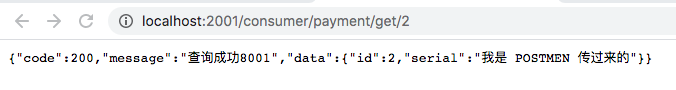

# Eureka

# 一. 概述

Eureka 采用 CS 架构如图

* Eureka Server : 服务注册功能的服务器, **是服务注册中心**。系统中其他的微服务提供者，**都需要在 Eureka 服务器上进行注册并且维持心跳**，从而告诉系统哪些服务提供者是正常运行的。
* Service consumer在寻求服务的时候，需要同时寻找 Eureka 服务中心集群找到对用服务然后访问服务提供者集群获得服务。

# 二. 基本使用

## Eureka两个基本组件

1. Eureka Server 提供服务注册服务，位于 eureka server 端。

   各个微服务节点通过配置启动之后，会在 EurekaServer 中进行注册, 这样 EurekaServer 中的服务注册表中将会存储所有可用服务节点的信息。

2. Eureka Client 通过注册中心访问，位于 服务提供端。

   是一个 Java 服务端，用于简化和 Eureka Server 的交互，客户端内置使用轮询负载均衡器，应用启动后会将 Eureka Server 发送心跳，如果长时间没有收到心跳，那么默认服务被移除 （默认90s）。

## Eureka服务端部署

Eureka 可以像所有微服务模块一样部署，步骤即为:

### 新建eureka-server模块 

New Moudel 选择 Maven 工程新建一个 Eureka 服务端模块

### 引入eureka-server依赖

改 POM 文件, 引入 Eureka 需要的依赖，如下为例

~~~xml
<dependency>
    <groupId>org.springframework.cloud</groupId>
    <artifactId>spring-cloud-starter-netflix-eureka-server</artifactId>
</dependency>
<!-- 引入自己定义的api通用包，可以使用Payment支付Entity -->
~~~

### 更改配置文件

写入配置文件

~~~yaml
server:
  port: 7001

eureka:
  instance:
    hostname: eureka7001.com #eureka服务端的实例名称
  client:
    register-with-eureka: false     #false表示不向注册中心注册自己。
    fetch-registry: false     #false表示自己端就是注册中心，我的职责就是维护服务实例，并不需要去检索服务
    service-url:
      #集群指向其它eureka
      #defaultZone: http://eureka7002.com:7002/eureka/
      #单机就是7001自己
      defaultZone: http://${eureka.instance.hostname}:${server.port}/eureka/
    #server:
    #关闭自我保护机制，保证不可用服务被及时踢除
    #enable-self-preservation: false
    #eviction-interval-timer-in-ms: 2000
~~~

### 主启动类 `@EnableEurekaServer`

写入主启动类

~~~java
package com.ark.springcloud;

import org.springframework.boot.SpringApplication;
import org.springframework.boot.autoconfigure.SpringBootApplication;
import org.springframework.cloud.netflix.eureka.server.EnableEurekaServer;

/* EnableEurekaServer 标志此为一个 Eureka 服务端 */
@SpringBootApplication
@EnableEurekaServer
public class EurekaMain7001 {

    public static void main(String[] args) {

        SpringApplication.run(EurekaMain7001.class, args);

    }

}

~~~

### 查看是否成功

浏览器访问 : localhost:7001 即可出现 Eureka 详情页面

## Eureka客户端部署

Eureka客户端即为 **微服务提供者**

### 引入eureka-client依赖

~~~xml
<!--eureka-client-->
<dependency>
    <groupId>org.springframework.cloud</groupId>
    <artifactId>spring-cloud-starter-netflix-eureka-client</artifactId>
</dependency>
~~~

### 改微服务提供者配置

~~~yml
eureka:
  client:
    #表示是否将自己注册进EurekaServer默认为true。
    register-with-eureka: true
    #是否从EurekaServer抓取已有的注册信息，默认为true。单节点无所谓，集群必须设置为true才能配合ribbon使用负载均衡
    fetchRegistry: true
    service-url:
      #单机版
      defaultZone: http://localhost:7001/eureka
~~~

### 主启动类 `@EnableEurekaClient`

主启动类加入 `@EnableEurekaClient` 注解，表示此微服务为 eureka 的 client。

~~~java
package com.ark.springcloud;

import org.springframework.boot.SpringApplication;
import org.springframework.boot.autoconfigure.SpringBootApplication;
import org.springframework.cloud.netflix.eureka.EnableEurekaClient;

@SpringBootApplication
@EnableEurekaClient
public class PaymentMain8001 {

    public static void main(String[] args) {

        SpringApplication.run(PaymentMain8001.class, args);

    }
}

~~~

### 查看是否成功

浏览器 eureka server 即 localhost:7001 可出现 Eureka 详情页面, 查看微服务是否入驻成功

# 三. Eureka 集群

作为一个注册中心，如果只有一个 eureka 服务端，那么如果出现单点故障, 那么出现错误会导致整个微服务提供者无法被发现

因此 **注册中心集群** 才是一个保险的方法。

eureka 集群采用相互注册的方式, 集群中的每一个服务端，都拥有集群内所有的 eureka 服务器信息，保证了服务器集群的高可用。

## 配置 eureka-server 集群

可以使用 **new module** 的方式注册多个 eureka 服务器，两个模块采用相关注册的方式，在配置文件上和单体版有所不同。

~~~yaml
# eureka server 7001
server:
  port: 7001

eureka:
  instance:
    hostname: eureka7001.com #eureka服务端的实例名称
  client:
    register-with-eureka: false     #false表示不向注册中心注册自己。
    fetch-registry: false     #false表示自己端就是注册中心，我的职责就是维护服务实例，并不需要去检索服务
    service-url:
      #集群指向其它eureka
      defaultZone: http://eureka7002.com:7002/eureka
      #单机就是7001自己
#      defaultZone: http://${eureka.instance.hostname}:${server.port}/eureka/
~~~

~~~yaml
server:
  port: 7002

eureka:
  instance:
    hostname: eureka7002.com #eureka服务端的实例名称
  client:
    register-with-eureka: false     #false表示不向注册中心注册自己。
    fetch-registry: false     #false表示自己端就是注册中心，我的职责就是维护服务实例，并不需要去检索服务
    service-url:
      #集群指向其它eureka
      defaultZone: http://eureka7001.com:7001/eureka
      #单机就是7001自己
#      defaultZone: http://${eureka.instance.hostname}:${server.port}/eureka/
    #server:
    #关闭自我保护机制，保证不可用服务被及时踢除
    #enable-self-preservation: false
    #eviction-interval-timer-in-ms: 2000
~~~

## 查看是否成功

分别访问 

http://eureka7002.com:7002

http://eureka7001.com:7001

可以看到 DS Replicas 是否有对方 eureka server 

注意，浏览器访问的url后面不需要加 /eureka/，但是配置的时候，是需要加上 /eureka 的

## 配置 eureka-client 注册入 eureka 集群

client 端配置 eureka 集群需要在 defaultZone 中同时指出两个 eureka server

~~~yaml
eureka:
  client:
    #表示是否将自己注册进EurekaServer默认为true。
    register-with-eureka: true
    #是否从EurekaServer抓取已有的注册信息，默认为true。单节点无所谓，集群必须设置为true才能配合ribbon使用负载均衡
    fetchRegistry: true
    service-url:
      #单机
	  # defaultZone: http://localhost:7001/eureka
      # 集群
      defaultZone: http://eureka7001.com:7001/eureka,http://eureka7002.com:7002/eureka  
~~~

如果成功，那么两个 eureka server 将同时注册上所有的 eureka client。

# 四. 微服务提供者集群

除了注册中心外，server provider 也不宜在单机模式上运行，而是需要配置为集群模式增加抗压能力。

## 配置微服务提供者集群

新建一个模块即可，功能完全复制原有模块，但是打开不同的端口，例如:

* cloud-provider-payment8001
* cloud-provider-payment8002

两个功能相同的微服务提供者，构成了一个 支付微服务集群。

**两者只需要在配置文件中有如下细微区别**

~~~yaml
# cloud-provider-payment8001
server:
  port: 8001

eureka:
    instance-id: payment8001
~~~

~~~yaml
# cloud-provider-payment8002
server:
  port: 8002

eureka:
    instance-id: payment8002
~~~

在 eureka 服务注册上没有任何区别。

## 负载均衡调用微服务

一般 eureka 提供轮询的负载均衡算法，体现在这个例子中即为 

cloud-provider-payment8001

cloud-provider-payment8002

两个微服务分别一次次处理掉用请求。

在微服务调用者上，原本以硬编码的方式调用的微服务端口，现在则需要通过 eureka 注册中心进行负载均衡调用，以 cloud-consumer-order80 为例。

~~~java
/* cloud-consumer-order controller */

/* 使用eureka注册服务名替代之前硬编码 */
public static final String PAYMENT_URL = "http://CLOUD-PAYMENT-SERVICE";
// public static final String PAYMENT_URL = "http://cloud-provider-payment";

@Autowired
private RestTemplate restTemplate;

@PostMapping("/consumer/payment/create")
public CommonResult create(Payment payment){

    return restTemplate.postForObject(PAYMENT_URL + "/payment/create", payment, CommonResult.class);

}

@GetMapping("/consumer/payment/get/{id}")
public CommonResult<Payment> getPayment(@PathVariable("id") Long id){

    return restTemplate.getForObject(PAYMENT_URL + "/payment/get/" + id, CommonResult.class);

}
~~~

## 调用端加入 `@LoadBalanced` 注解

要成功实现 eureka 负载均衡，需要在 `RestTemplate` 注入的时候加入该注解

~~~java
/**
 * IoC 容器初始化注入类
 */
@Configuration
public class ApplicationContextConfig {

    /* RestTemplate 注入到容器中 */
    @Bean
    @LoadBalanced	// enable 负载均衡调用
    public RestTemplate getRestTemplate(){
        return new RestTemplate();
    }

}
~~~

## 查看效果

可以看到，对于一个 url 客户端调用，分别调用了 8001 和 8002 两个微服务提供者。

# 五. Eureka 高级

## 服务发现 

在 eureka-client 端，可以通过服务发现，获取目前 eureka 注册中心的所有服务信息，使用方式如下:

### `@EnableDiscoveryClient` 注解

在主程上加入 `@EnableDiscoveryClient` 注解

~~~java
package com.ark.springcloud;

import org.springframework.boot.SpringApplication;
import org.springframework.boot.autoconfigure.SpringBootApplication;
import org.springframework.cloud.client.discovery.EnableDiscoveryClient;
import org.springframework.cloud.netflix.eureka.EnableEurekaClient;

@SpringBootApplication
@EnableEurekaClient
@EnableDiscoveryClient
public class PaymentMain8001 {

    public static void main(String[] args) {

        SpringApplication.run(PaymentMain8001.class, args);

    }
}

~~~

### 依赖注入 `DiscoveryClient` 类

~~~java
import org.springframework.cloud.client.discovery.DiscoveryClient;

@Autowired
private DiscoveryClient discoveryClient;
~~~

### 获取 eureka 注册服务信息

使用 `DiscoveryClient` 获取 eureka 注册服务信息

~~~java
/* 获取 eureka server 上的所有注册服务信息 */
@GetMapping(value = "/payment/discovery")
public Object discovery(){

    return this.discoveryClient;

}
~~~

## 自我保护机制

> 某时刻某一个微服务不可用了，Eureka 不会立即清理，依旧会保存对该微服务的信息。
>
> 属于 CAP 理论中的 AP 

默认情况下，Eureka Server 在一段时间没有检测到服务心跳，那么会注销该服务，但是有一些网络卡顿的情况，Eureka Client 明明是健康的情况下，对其注销是比较危险的行为，从而引入了自我保护机制。Eureka Server 如果在短时间内，大量的服务心跳被丢失，那么此时 Eureka 便会启动自我保护机制，不会再有注销微服务。

### 配置

自我保护机制在 **eureka serve** 端配置

~~~yaml
server:
  port: 7001

eureka:
  server:
  	# enable-self-preservation 默认开启
  	
    # 关闭自我保护机制，保证不可用服务被及时踢除
    enable-self-preservation: false
    # 发生故障剔除时间
    eviction-interval-timer-in-ms: 2000
~~~

