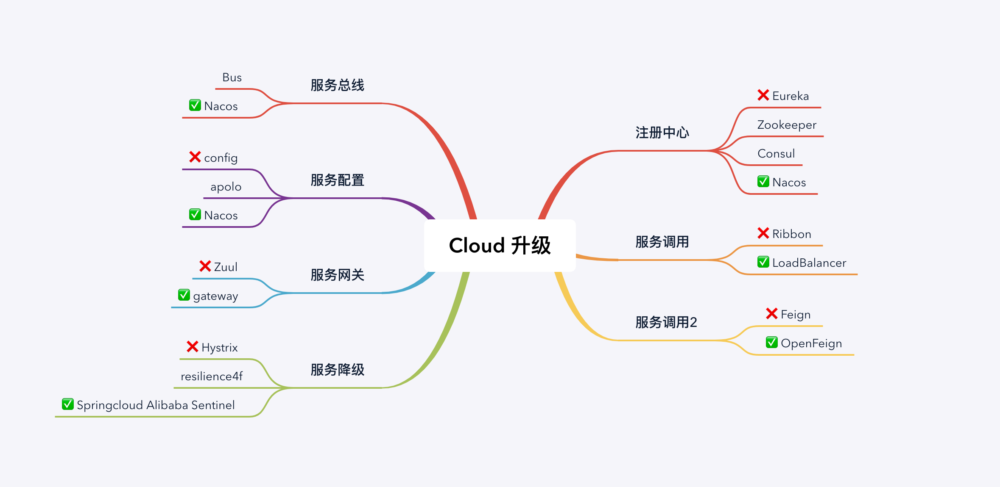
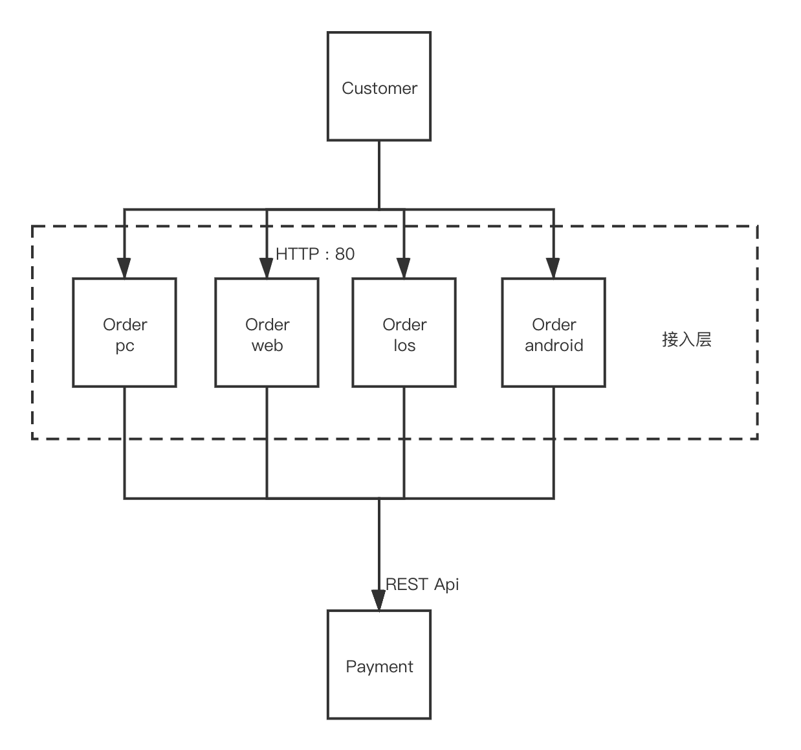

# SpringCloud

> 分布式微服务架构的一站式解决方案。

### 服务治理

- [Eureka](Eureka.md)
- [Zookeeper](zk/Zookeeper.md)
- Consul
- Nacons

### 服务调用

- LoadBalance
- [Ribbon](Ribbon.md)
- [RestTemplate](RestTemplate.md)
- [OpenFeign](OpenFeign.md)

### 配置中心

- Springcldou-config

### 服务降级

- [Hystrix](Hystrix.md)

### 服务网关

- Gateway

# 版本依赖

## Spring could 和 springboot 的版本依赖

| Release Train | Boot Version |
| ------------- | ------------ |
| Hoxton        | 2.2.x        |
| Greenwich     | 2.1.x        |
| Finchley      | 2.0.x        |
| Edgware       | 1.5.x        |
| Dalston       | 1.5.x        |

## 推荐技术战版本

| 技术                 | 版本          |
| -------------------- | ------------- |
| spring cloud         | Hoxtom.SR1    |
| springboot           | 2.2.2.RELEASE |
| spring cloud alibaba | 2.1.0.RELEASE |
| Java                 | Java8         |
| Maven                | 3.5 及以上    |
| Mysql                | 5.7 及以上    |

# 构建简单远程调用集群

## 构建父工程

## 构建一个微服务模块 

以 cloud-provider-payment800 支付模块为例，分为一下几步。

1. 建 module

   在父工程的基础上，我们 new 一个新的模块出来，在新建完成后回头检查一下父工程 pom 文件的变化

   ~~~xml
   <!-- 成功的话，父工程 pom 会添加下面一行 -->
   <modules>
       <module>cloud-provider-payment8001</module>
   </modules>
   ~~~

2. 改 POM

   将该模块依赖的JAR包写入该模块的 POM 的文件中。

3. 写 yml 或者 properties 如 :

   ~~~yaml
   server:
     port: 8001
   
   spring:
     application:
       name: cloud-payment-service
     datasource:
       type: com.alibaba.druid.pool.DruidDataSource            # 当前数据源操作类型
       driver-class-name: org.gjt.mm.mysql.Driver              # mysql驱动包
       url: jdbc:mysql://localhost:3306/db2019?useUnicode=true&characterEncoding=utf-8&useSSL=false
       username: root
       password: 123456
   
   mybatis:
     mapperLocations: classpath:mapper/*.xml
     type-aliases-package: com.ark.springcloud.entities    # 所有Entity别名类所在包
   ~~~

4. 主启动

   ~~~java
   package com.ark.springcloud;
   
   import org.springframework.boot.SpringApplication;
   import org.springframework.boot.autoconfigure.SpringBootApplication;
   
   @SpringBootApplication
   public class PaymentMain8001 {
   
       public static void main(String[] args) {
   
           SpringApplication.run(PaymentMain8001.class, args);
   
       }
   }
   ~~~

5. 业务类

   **mysql -> entity -> dao -> service -> controller**

## 模块间通信

传统的微服务架构思路以一个付款业务为例子。

我们将一个付款业务抽离为两个服务，其中 Payment 为真操作数据库的微服务，Order 为负责接入的微服务。因为付款逻辑涉及到多端实现，比如 PC端，App端，Web端，Ios端等。**我们可以便可以抽离接入层，和持久层，变为多个自治微服务。** 一般而言持久层微服务拥有 RESTful Controller, Service, Dao 三个完整层, 而接入层拥有 Controller 负责调用持久层 Api。

以 web 端为例，客户端以Http协议调用接入层的 80 端口, 然后其以 REST Api的方式调用持久层的 Payment 微服务，从而实现一个付款流程，Spring 中提供了 **RestTemplate** 类很好的实现 RESRFul API调用。

## 公共模块抽取

为了减少代码冗余，我们可以抽离出项目中公共的部分并发布为 Jar 包供所有为服务使用, 比如接入层和持久层微服务都会用到的 Java pojo 类便可以发布为一个公共 Jar 包。

因此我们一般新启一个模块: `common-api` 定义微服务公共接口并发布。发布流程即为 Maven 工程的流程:

1. Maven : clear
2. Maven : install

然后该模块便可以被打为 Jar 包存放于本地定义的 Maven 仓库中, 其他模块便可直接在 pom.xml 文件中引入:

~~~xml
<!-- 引入公共Api -->
<dependency>
    <groupId>com.ark.springsloud</groupId>
    <artifactId>cloud-api-common</artifactId>
    <version>${project.version}</version>
</dependency>
~~~

# 服务治理

> 在传统的PRC远程调用框架中，管理每个服务与服务之间的依赖关系比较复杂，管理比较复杂，所以使用服务治理老实现服务之间的调用，负载均衡，容错，发现与注册等功能。

服务治理服务器就可以看为微服务之间的 IoC容器，实现微服务之间的解耦。

## 为何引入服务治理

上章节实现的微服务集群中，在接入层和持久层直接使用端口方式调用，这就造成了如下几个缺点

* 微服务依赖以硬编码的方式写入，不利于服务间解耦
* 持久层微服务直接被调用，很可能在高压的情况下挂掉，如果挂调，持久层微服务降束手无策。

Spring cloud 封装 Netfix 发开的 **Erueka** 来实现服务治理工作。

| 组件名    | 语言 | CAP  | 健康检查   | 接口     | Spring Cloud 集成 |
| --------- | ---- | ---- | ---------- | -------- | ----------------- |
| Eureka    | Java | AP   | 可配置支持 | HTTP     | 集成              |
| Consul    | Go   | CP   | 支持       | HTTP/DNS | 集成              |
| Zookeeper | Java | CP   | 支持       | 客户端   | 集成              |

