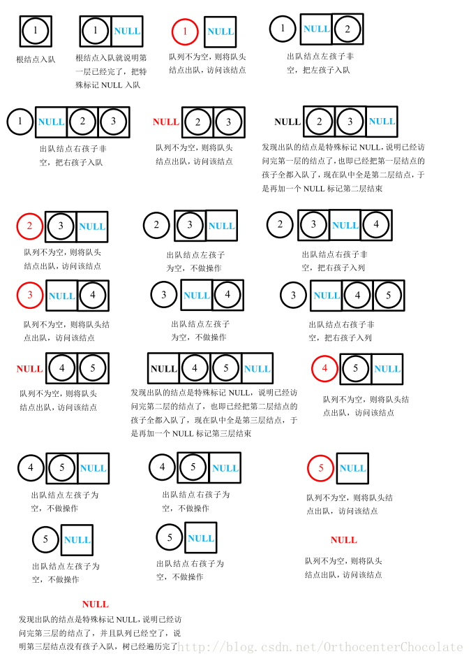

[TOC]

# 二叉树

# 一. 二叉树一般定义

一般二叉树的基本定义如下:

```c++
/**
 * Definition for a binary tree node.
 * struct TreeNode {
 *     int val;
 *     TreeNode *left;
 *     TreeNode *right;
 *     TreeNode(int x) : val(x), left(NULL), right(NULL) {}
 * };
 */
/**
```


# 二. 二叉树遍历的几种实现方法

注意 : 二叉树的非递归实现的效率会高于二叉树的递归实现


## 递归实现的 前, 中, 后序二叉树

~~~c++
void InorderTraversal(TreeNode * root){
    if(root){
        visit(root);	// 这个地方访问为前序
        if(root->left)  InorderTraversal(root->left);
        visit(root);	// 这个地方访问为中序
        if(root->right) InorderTraversal(root->right);
        visit(root);	// 这个地方访问为后序
    }
    return;
}
~~~


## 前序

* 先访问根节点
* 如果有左子树, 访问左子树
* 如果有右子树, 访问右子树

~~~c++
/**
一个二叉树为 : 
        5
       / \
      1   4
         / \
        3   6
中序遍历为 5 1 4 3 6
*/
~~~

### 栈实现

~~~c++
vector<int> preorderTraversal(TreeNode* root) {
    stack<TreeNode *> dict;
    vector<int> ans;
    TreeNode *p = root;
    while(p || !dict.empty()){
        if(p){
            // 如果p不为空, 那么就访问, 而且入栈
            ans.push_back(p->val);
            dict.push(p);
            p = p->left;
        }else{
            // 如果p为空, 那么出栈元素, 且访问它的右子树
            p = dict.top();
            dict.pop();
            p = p -> right;
        }
    }
    return ans;
}
~~~


## 中序

* **如果有左子树, 则先访问左子树**
* **如果没有左子树, 则输出跟节点**
* **如果有右子树, 则访问右子树**

~~~ c++
/**
一个二叉树为 : 
        5
       / \
      1   4
         / \
        3   6
中序遍历为 1 5 3 4 6
*/
~~~

### 栈实现🌟 

~~~c++
vector<int> inorderTraversal(TreeNode* root) {
    stack<TreeNode *> dict;
    vector<int> ans;
    TreeNode *p = root;
    while(p || !dict.empty()){
        // 如果p不为空. 则继续入栈左孩子
        if(p){
            // 注意这里入栈P 而不是 p->left
            dict.push(p);
            p = p->left;
        }else{
            // 如果p为空, 则出栈且访问
            // 在栈内的元素必非空, 所以可以直接访问memeber
            p = dict.top();
            ans.push_back(p->val);
            dict.pop();
            p = p->right;
        }
    }
    return ans;
}
~~~


### TIPS

前序 和 中序的迭代形式访问的代码是类似的, 可以说是几乎一样的, 唯一的区别就在于, 

**前序访问节点在节点入栈的时候, 中序访问在节点出栈的时候**


## 层序遍历

~~~c++
/**
输入的二叉树
    3
   / \
  9  20
    /  \
   15   7

输出的二叉树序列为:
[3, 9, 20, 15, 7]
*/
~~~


层序遍历一般用**队列**来实现. 实现也比较简单:

* 先将**根节点入队列**
* 如果队列不为空, 则出队列一个元素 ele
* **如果ele的左孩子不为空, 那么其左孩子入队列**
* **如果ele的右孩子不为空, 那么其右孩子入队列**

~~~c++
void LevelTraval(TreeNode * Root){
    queue<TreeNode *> dict;
    dict.push(Root);
    while(!dict.empty()){
        TreeNode *CurtNode = dict.front();
		// 出队列
        dict.pop()
        visit(CurtNode->val);
        if(CurtNode->left) dict.push(CurtNode->left);
        if(CurtNode->right) dict.push(CurtNode->right);
    }
}

~~~


### 1. 拓展问题 : 如何遍历的同时输入每个元素的层次?

基本思路就是 : 

> [CSDN博客](https://blog.csdn.net/OrthocenterChocolate/article/details/37612183)

在入队列的时候, 每一层结束的时候, **加入一个层结束标志** : 如 NULL

这样我们就可以每次在**遇到结束标志的时候, 就知道该层已经结束**, 如下图可以看出:




代码实现上, 如下: 

**这一题需要以二维数组的形式输每一层序遍历的结果**

~~~c++
#include <queue>
class Solution {
public:
    vector<vector<int>> levelOrder(TreeNode* root) {
        queue<TreeNode *> dict;
        vector<vector<int>> ans;
        if(!root) return ans;
        vector<int> level_val;
        TreeNode *end_flag = NULL;
        dict.push(root);
        dict.push(end_flag);
        while(!dict.empty()){
            
            TreeNode* Curt_Node = dict.front();
            // 出队
            dict.pop();
            
            if(!Curt_Node){
                // Curt_Node 为 NULL说明, 这一层已经结束
                // Curt_Node 为 NULL说明, 下一层的所有元素都已经入队列
                // 注意这个地方, 当队列没有元素的时候, 我们是不应该再去加NULL的, 否则会造成死循环
                if(!dict.empty()) dict.push(end_flag);
                // current level over push to ans vector
                ans.push_back(level_val);
                // re init level_val
                level_val.clear();
                
            }else{
                // Curt_Node 不为NULL
                if(Curt_Node->left)  dict.push(Curt_Node->left);
                if(Curt_Node->right) dict.push(Curt_Node->right);
                
                level_val.push_back(Curt_Node->val);
            }
            
        }
        
        return ans;
        
        
    }
};
~~~


# 三. 建树

## 二分法递归建树

虽然最后要求的是平衡二叉树, 但是这一题**不需要考虑二叉树的平衡调整问题**

因为这题直接给我们的是一个顺序的数组, 所以我们直接通过数组的不同位置可以直接建立平衡二叉树.

> [leetcode原题](https://leetcode-cn.com/problems/convert-sorted-array-to-binary-search-tree)

~~~c++
/**
给定有序数组: [-10,-3,0,5,9],
一个可能的答案是：[0,-3,9,-10,null,5]，它可以表示下面这个高度平衡二叉搜索树：
      0
     / \
   -3   9
   /   /
 -10  5
*/
class Solution {
public:
    // 递归建立以left, right的中间节点为根的树
    TreeNode* build(vector<int> &nums, int left, int right){
        // root_index 为此次为根的元素
        int root_index = (left + right) / 2;
        if(left > right) return NULL;
        else{
            TreeNode* Curt = new TreeNode(nums[root_index]);
            if(left == right) return Curt;
            else{
                // 递归建树
                Curt->left = build(nums, left, root_index - 1);
                Curt->right = build(nums, root_index + 1, right);
                return Curt;
            }
        }
    }
    
    TreeNode* sortedArrayToBST(vector<int>& nums) {
        int len = nums.size();
        if(!len) return NULL;
        return build(nums, 0, len - 1);
    }
};
~~~


## 给中序 前序 建立二叉树

> [LeetCode 中序, 前序建树](<https://leetcode-cn.com/problems/construct-binary-tree-from-preorder-and-inorder-traversal/>)

~~~
输入某二叉树的前序遍历和中序遍历的结果，请重建出该二叉树。假设输入的前序遍历和中序遍历的结果中都不含重复的数字。例如输入前序遍历序列{1,2,4,7,3,5,6,8}和中序遍历序列{4,7,2,1,5,3,8,6}，则重建二叉树并返回。

		1
	   / \
	  2   3	 
     /   / \   
    4   5   6 
     \     /
      7   8
~~~


~~~c++
/**
 * Definition for binary tree
 * struct TreeNode {
 *     int val;
 *     TreeNode *left;
 *     TreeNode *right;
 *     TreeNode(int x) : val(x), left(NULL), right(NULL) {}
 * };
 */
 
 
/**
 * Definition for a binary tree node.
 * struct TreeNode {
 *     int val;
 *     TreeNode *left;
 *     TreeNode *right;
 *     TreeNode(int x) : val(x), left(NULL), right(NULL) {}
 * };
 */
class Solution {
public:
    vector<int> preorder;
    vector<int> inorder;
    TreeNode* buildTree(vector<int>& preorder, vector<int>& inorder) {
        int len = preorder.size();
        if(!len) return NULL;
        this->preorder = preorder;
        this->inorder = inorder;
        
        return Build(0, len-1, 0, len-1);
    }

    /*
        根据 前序[preLeft, preRight] 中序[inLeft, inRight] 
        建立一个二叉树
        当前的根的值就是 this->preorder[preLeft]
        然后根据这个值在中序切分出值的 左右子树
        然后递归建树
    */
    TreeNode* Build(int preLeft, int preRight, int inLeft, int inRight){
        
        if(preLeft > preRight) return NULL;
        
        int curtValue = this->preorder[preLeft];
        TreeNode *root = new TreeNode(curtValue);
        
        int index;
        for(int i=inLeft; i<= inRight; i++){
            if(this->inorder[i] == curtValue){
                index = i;
                break;
            }
        }
        int leftTreeNums = index - inLeft;
        
        root->left = Build(preLeft + 1, preLeft + leftTreeNums, inLeft, index-1);
        root->right = Build(preLeft + leftTreeNums + 1, preRight, index+1, inRight);
        return root;
    }

};
~~~


