- [Data Structure 相关概念](#data-structure-%E7%9B%B8%E5%85%B3%E6%A6%82%E5%BF%B5)
  - [problem, algorithm, programming](#problem-algorithm-programming)
  - [Def. Abstract Data Type (ADT, class)](#def-abstract-data-type-adt-class)
  - [Data Structure](#data-structure)
  - [Common data structures](#common-data-structures)
    - [1. 线性结构 Linear DS : Array, List (Stack, Queue)](#1-%E7%BA%BF%E6%80%A7%E7%BB%93%E6%9E%84-linear-ds--array-list-stack-queue)
    - [3. 图 Graphs](#3-%E5%9B%BE-graphs)
    - [4. 树 Tree](#4-%E6%A0%91-tree)
    - [5. 关联表 hash tabless](#5-%E5%85%B3%E8%81%94%E8%A1%A8-hash-tabless)
  - [Proof Technoques](#proof-technoques)
    - [1. Proof by contradiction 反证法](#1-proof-by-contradiction-%E5%8F%8D%E8%AF%81%E6%B3%95)
    - [2. Proof by induction 定义直接证明](#2-proof-by-induction-%E5%AE%9A%E4%B9%89%E7%9B%B4%E6%8E%A5%E8%AF%81%E6%98%8E)
    - [3. Proof (of falsity) by counterexample 举反例](#3-proof-of-falsity-by-counterexample-%E4%B8%BE%E5%8F%8D%E4%BE%8B)
- [Analysis of Algorithms](#analysis-of-algorithms)
  - [Analysis Framework (4 steps)](#analysis-framework-4-steps)
  - [Fundamentals of Algorithmic Problem Solving](#fundamentals-of-algorithmic-problem-solving)
  - [Efficiency](#efficiency)
  - [Time Efficiency of Non recursive algorithm](#time-efficiency-of-non-recursive-algorithm)
  - [Time Efficiency of Recursive Algorithms](#time-efficiency-of-recursive-algorithms)
  - [🌟 计算 T(n) 的 example](#-%E8%AE%A1%E7%AE%97-tn-%E7%9A%84-example)
- [三种时间复杂度记号](#%E4%B8%89%E7%A7%8D%E6%97%B6%E9%97%B4%E5%A4%8D%E6%9D%82%E5%BA%A6%E8%AE%B0%E5%8F%B7)
- [数学规则](#%E6%95%B0%E5%AD%A6%E8%A7%84%E5%88%99)
  - [阶乘近似](#%E9%98%B6%E4%B9%98%E8%BF%91%E4%BC%BC)
  - [求导规则](#%E6%B1%82%E5%AF%BC%E8%A7%84%E5%88%99)
  - [等比求和](#%E7%AD%89%E6%AF%94%E6%B1%82%E5%92%8C)
- [Main data structure](#main-data-structure)
  - [Heap](#heap)
  - [Stack](#stack)
  - [Queue](#queue)
  - [Bin-tree 二叉树](#bin-tree-%E4%BA%8C%E5%8F%89%E6%A0%91)
  - [🌟 Binary Serch Tree , 插入, 删除 操作.](#-binary-serch-tree--%E6%8F%92%E5%85%A5-%E5%88%A0%E9%99%A4-%E6%93%8D%E4%BD%9C)
  - [AVL Trees](#avl-trees)
  - [B-tree](#b-tree)
  - [2-4 tree (sample-version)](#2-4-tree-sample-version)
  - [2-4 tree hard version](#2-4-tree-hard-version)
  - [Treaps](#treaps)
  - [Priority queue 优先队列](#priority-queue-%E4%BC%98%E5%85%88%E9%98%9F%E5%88%97)
- [Floating IEEE](#floating-ieee)
- [可判定问题 Decidable Problems](#%E5%8F%AF%E5%88%A4%E5%AE%9A%E9%97%AE%E9%A2%98-decidable-problems)
- [Sorting 排序](#sorting-%E6%8E%92%E5%BA%8F)
- [I. Select Sort](#i-select-sort)
  - [simple Selection Sort 简单](#simple-selection-sort-%E7%AE%80%E5%8D%95)
  - [Heap sort 堆排序](#heap-sort-%E5%A0%86%E6%8E%92%E5%BA%8F)
- [II. 插入排序](#ii-%E6%8F%92%E5%85%A5%E6%8E%92%E5%BA%8F)
  - [simple Insertion Sort](#simple-insertion-sort)
  - [Shell 排序](#shell-%E6%8E%92%E5%BA%8F)
- [III. 交换排序](#iii-%E4%BA%A4%E6%8D%A2%E6%8E%92%E5%BA%8F)
  - [冒泡排序](#%E5%86%92%E6%B3%A1%E6%8E%92%E5%BA%8F)
  - [快速排序 (D&C)](#%E5%BF%AB%E9%80%9F%E6%8E%92%E5%BA%8F-dc)
- [I.V 归并排序](#iv-%E5%BD%92%E5%B9%B6%E6%8E%92%E5%BA%8F)
  - [Merge sort 二路归并 (D&C)](#merge-sort-%E4%BA%8C%E8%B7%AF%E5%BD%92%E5%B9%B6-dc)
- [[背] 时间复杂度总结](#%E8%83%8C-%E6%97%B6%E9%97%B4%E5%A4%8D%E6%9D%82%E5%BA%A6%E6%80%BB%E7%BB%93)
- [算法模式总结](#%E7%AE%97%E6%B3%95%E6%A8%A1%E5%BC%8F%E6%80%BB%E7%BB%93)
  - [贪心算法](#%E8%B4%AA%E5%BF%83%E7%AE%97%E6%B3%95)
    - [最短路径问题  Dijkstra](#%E6%9C%80%E7%9F%AD%E8%B7%AF%E5%BE%84%E9%97%AE%E9%A2%98--dijkstra)
    - [最小生成树 Minimum Spanning Tree](#%E6%9C%80%E5%B0%8F%E7%94%9F%E6%88%90%E6%A0%91-minimum-spanning-tree)
    - [I. Kruskal's Algorithm](#i-kruskals-algorithm)
    - [II. Prim Algorithm](#ii-prim-algorithm)
    - [K - 背包问题](#k---%E8%83%8C%E5%8C%85%E9%97%AE%E9%A2%98)
    - [Scheduling – minimum time](#scheduling--minimum-time)
  - [Divide-and-Conquer 分治](#divide-and-conquer-%E5%88%86%E6%B2%BB)
    - [折半查找](#%E6%8A%98%E5%8D%8A%E6%9F%A5%E6%89%BE)
    - [找中位数 Finding the Median](#%E6%89%BE%E4%B8%AD%E4%BD%8D%E6%95%B0-finding-the-median)
- [分治算法 (Divide-and-Conquer)](#%E5%88%86%E6%B2%BB%E7%AE%97%E6%B3%95-divide-and-conquer)
  - [Mergesort 归并排序](#mergesort-%E5%BD%92%E5%B9%B6%E6%8E%92%E5%BA%8F)
  - [Binary Search 二分查找](#binary-search-%E4%BA%8C%E5%88%86%E6%9F%A5%E6%89%BE)
  - [找第 S 个小的元素  (Finding the Sth Smallest Element)](#%E6%89%BE%E7%AC%AC-s-%E4%B8%AA%E5%B0%8F%E7%9A%84%E5%85%83%E7%B4%A0--finding-the-sth-smallest-element)
    - [median 中位数](#median-%E4%B8%AD%E4%BD%8D%E6%95%B0)
- [回溯算法 (backtracking)](#%E5%9B%9E%E6%BA%AF%E7%AE%97%E6%B3%95-backtracking)
  - [八皇后问题](#%E5%85%AB%E7%9A%87%E5%90%8E%E9%97%AE%E9%A2%98)
  - [暴力法](#%E6%9A%B4%E5%8A%9B%E6%B3%95)
  - [暴力法改进](#%E6%9A%B4%E5%8A%9B%E6%B3%95%E6%94%B9%E8%BF%9B)
  - [回溯解](#%E5%9B%9E%E6%BA%AF%E8%A7%A3)
- [并行计算](#%E5%B9%B6%E8%A1%8C%E8%AE%A1%E7%AE%97)
  - [并行计算架构的类型](#%E5%B9%B6%E8%A1%8C%E8%AE%A1%E7%AE%97%E6%9E%B6%E6%9E%84%E7%9A%84%E7%B1%BB%E5%9E%8B)
- [算法代码复习 (可能考的代码)](#%E7%AE%97%E6%B3%95%E4%BB%A3%E7%A0%81%E5%A4%8D%E4%B9%A0-%E5%8F%AF%E8%83%BD%E8%80%83%E7%9A%84%E4%BB%A3%E7%A0%81)
  - [Tower of Hanoi](#tower-of-hanoi)


# Data Structure 相关概念


## problem, algorithm, programming

~~~
/* 问题函数的输入和输出 */
- a problem is  a task be performed. It is best thought of in terms of inputs and matching outputs.
  问题并没有资源上的限制

/* 算法是解决一个问题的 recipe */
- An algorithm is recipe for solving a problem. 
- 需要考虑 benefits 和 cost

/* programming */
Data structure + Algorithm = Programming 
~~~


## Def. Abstract Data Type (ADT, class) 

Defines a data type solely in terms of **a set of values**  and **a set of operations on that data type.**

Encapsulation : Hide implementation details.

抽象数据类型是在概念层面的定义一个数据类型

ADT 并没有具化使用的数据结构, 也没具体实现各个操作. 只是给了一个概念.


## Data Structure

**The physical implementation of an ADT** 

 **the data items have both a logical and a physical form. An ADT is logical form. The implementation of the data item within a data structure is its physical form** 

一个 DS 是对 ADT 的物理层面的实现

一些 ds  的例子 : list, stack, queue ....

~~~
/* def for datastructure */

数据结构是由数据的组织方式和一系列相关的操作组成的
A data structure is composed of data representation and its associated operation.
(1) Data representation
More typically, a data structure is meant to be an organization or structuring for a collection of data items.
	数据表示


(2) Associated operation
Such as : search, print, modify, sort, etc.
	基于数据的操作


/* how to select */
1. Analyze problem, determine the resource constraints

2. Determine the basic operations

3. Select the data structure that best meets these requirements


/* costs and benefits on each ds */
每一种数据结构都有相应的 cost 和 benefits

- Cost : 一个数据结构完成一个 basic operation 需要的 Time, Space Cost, 以及 programming effort

- Benefit : 用正确的数据结构可以更有效率的解决问题
~~~


## Common data structures

### 1. 线性结构 Linear DS : Array, List (Stack, Queue)

* Array :An array is a data structure consisting of a fixed number of data items of the same type

* Linked List : A sequence of zero or more nodes each containing two kinds of information: 

  1. some data 

  2. one or more links called pointers to other nodes of the linked list.  

     One Link => Singly linked list

     Double Link 

* **Stack is special types of lists** : 

  ~~~
  /* def of (LIFO =: Last In First Out) */
  Elements can be removed from a stack only in the reverse order to that in which they were inserted 
  ~~~

  A stack can be implemented by array or linked list

* **Queue is special types of lists** : 

  ~~~
  /* def of FIFO =: First In First Out */
  Elements can be removed from a queue only in the order in which they were inserted
  ~~~

  A stack can be implemented by array or linked list


###2. 结构化数据 Records

A record is a data structure consisting of a **fixed number of items** 

Unlike an array, the elements in a record may be of differing types and are named. 

也就是说 record 可以容纳不同的数据类型

~~~
– E.g. 
type person = record name: string
age: integer
height: real
female: Boolean
children: array[1:10] of string
~~~

### 3. 图 Graphs

~~~
/* def forr graph */
A graph G = <V, E> is defined by a pair of two sets: a finite set V of items called vertices and a set E of vertex pairs called edges.
~~~

图也可以分为 : 有向图, 无向图

图两种表示方式 : Adjacency matrix, Adjacency linked lists

Acyclic graph : A graph with cycle

### 4. 树 Tree

A tree (or free tree) is a connected acyclic graph.

一个树就是一个无环图

Forests: a graph that has no cycles but is not necessarily connected.

森林也是无环, 但是可以拥有很多树

### 5. 关联表 hash tabless

~~~
/* def */
- An associative table behaves like an array with no restriction on index value
- Unlike an array, there is no guarantee that item accessis Θ(1)
~~~


## Proof Technoques

### 1. Proof by contradiction 反证法

• Assume the proposition is false
• Show that this leads to a contradiction
• Therefore the proposition must be true

### 2. Proof by induction 定义直接证明

### 3. Proof (of falsity) by counterexample 举反例


# Analysis of Algorithms 

~~~
/* 同常用 Time, Space 描述一个算法 */

- 时间复杂度 : 丈量 basic operations executed 

- 空间复杂度 : 丈量 extra memory units consumed.


/* how to analyze algorithm */

1. How good is the algorithm? => Crrectness, time, space **efficiency**
   Efficiency : 
   A solution is said to be efficient if it solves the problem within its resource constraints.
       -space
       -time

2. Does there exist a better algorithm? => low bounds ...
~~~


## Analysis Framework (4 steps)

~~~
/* 基于输入 size 会逐渐增长到 n */
1. Measuring an input’s size

2. Measuring running time 
   计算 ruunning time 不需要每一步都计算, 只需要计算一个算法中的 basic operation 即可

3. * Orders of growth (of the algorithm’s efficiency function)
   一共有三种方式丈量 程序的 growth

4. Worst-case, best-case and average-case (Random input) efficiency
~~~


## Fundamentals of Algorithmic Problem Solving

~~~
/* 设计算法的步骤 */

1. Understanding the problem

2. Deciding on 合适的 ds.

3. Design an algorithm

4. Proving correctness

5. Analyzing an algorithm (analysis framework)

6. Coding an algorithm
~~~


**design algorithm  需要从以下流程开始**

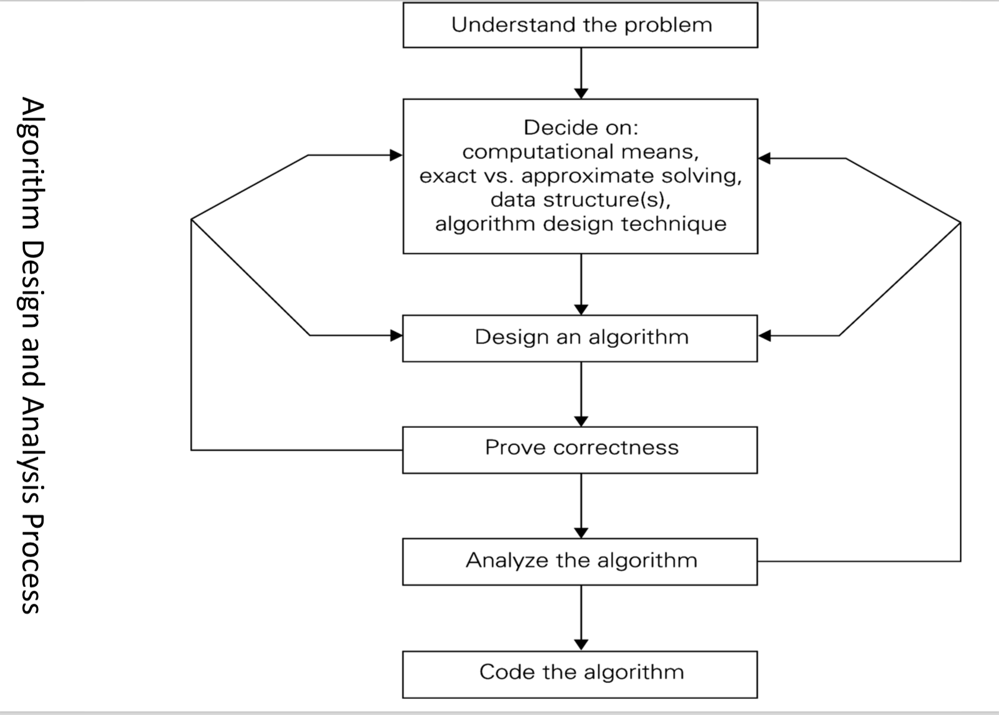


算法设计的策略 : 

1. 暴力 brute force
2. 分治 divide and conquer
3. 贪心 Greedy aproach
4. 动归 Dynamic programming
5. 回溯 BackTracking
6. ...


## Efficiency

~~~
/* def */
- A solution is said to be efficient if it solves the problem within its resource constraints. (这个算法满足下面两点的限制)	
 * space
 * time

- The cost of a solution is the amount of resources that the solution consumes.
 和第一点其实是一个意思
~~~


## Time Efficiency of Non recursive algorithm 

1. Decide on parameter n indicating input size
2. Identify algorithm’s **basic operation**
3. 确认 basic operation 是否和 input size 有关, 如果是则需要分别确定 worst, average, best
4. 根据输入为n的时候, 列出相关公式


## Time Efficiency of Recursive Algorithms
1. Decide on parameter n indicating input size
2. Identify algorithm’s basic operation
3. 确认 basic operation 是否和 input size 有关, 如果是则需要分别确定 worst, average, best
4. Set up a recurrence relation and initial condition(s) for C(n)-the number of times
   the basic operation will be executed for an input of size n (alternatively count
   recursive calls).
5. Solve the recurrence or estimate the order of magnitude of the solution by
   backward substitutions or another method


**For example : Tower of Hanoi Puzzle**

M(n) = 2M(n – 1) + 1 for every n > 0

M(1) = 1

M(n) ∈ Θ (2$^n$)


## 🌟 计算 T(n) 的 example

~~~~
/* one by one Recurrence */

- T(n) = T(n-1) + cT(1) = d  
  => T(n) = (n-1)c + d

- T(n) = T(n-1) + cn
  => T(n) = [n(n+1)/2 – 1] c + d
  
/* Decrease-by-a-constant-factor */

- T(n) = aT(n/b) + f (n)
   T(n) = T(n/2) + 1    Θ(logn)
   T(n) = 2T(n/2) + n   Θ(nlogn)
   T(n) = 3T(n/2) + n   Θ(n^log_2^3)
~~~~


# 三种时间复杂度记号

* 🌟 O(f(n))，**给出了算法运行时间的上界，也就是最坏情况下的时间复杂度**

  ~~~
  /* fomal def */
  A function t(n) is said to be in O(g(n)), denoted t(n) \belong to O(g(n)), if t(n) is bounded above by some constant multiple of g(n) for all large n, i.e., 
  
  
  **if there exist some positive constant c and some nonnegative integer n0 such that**
  
  🌟 t(n) <= cg(n) for all n >= n0
  通俗解释就是, 只要在所有无穷远点n, cg(n) 一直大于 t(n) 即可
  纵然近点可能 cg(n) 小, 但是 dosen't matter
  ~~~

* Ω(f(n))，给出了算法运行时间的下界，也就是最好情况下的时间复杂度； 

  ~~~
  if there exist some positive constant c and some nonnegative integer n0 such that
  t(n) >= cg(n) for all n >= n0
  ~~~

* Θ(f(n))，给出了算法运行时间的上界和下界，这里Θ(f(n))是渐近的确界， 
  另外，并非所有的算法都有Θ(f(n))。

  ~~~
  if there exist some positive constant c1 and c2 and some nonnegative integer n0 such that
   c2 g(n) <= t(n) <= c1g(n) for all n >= n0
  ~~~


~~~
/* other word */
/* 利用比值定义, 可以使用洛必达法则 */


- O(g(n)) : 我们说一个 f(n) 属于 O(g(n)) 是说, 在 n 趋近无穷的时候, f(n) 和 g(n) 的比值为一个常数
~~~


# 数学规则


## 阶乘近似

n! = $\sqrt{2\pi n} ( n / e) ^n$


## 求导规则

| -        | 导数             |
| -------- | ---------------- |
| $n^a$    | $a n^{a-1}$      |
| $log_an$ | $\frac{1}{nlna}$ |
|          |                  |
|          |                  |
|          |                  |


## 等比求和

$S(n) = \frac{a1 - a_n * q}{ 1 - q}$

**For example :** 

满二叉树的节点个数 => 1, 2, 4, ... 2$^{h-1}$

N(nodes) = $\frac{1 - 2^{h-1}*2}{1-2} = 2^h -1 $ 


# Main data structure


## Heap

**堆就是用数组实现的二叉树 (一般是完全二叉树)，所有它没有使用父指针或者子指针**

~~~
/* def for heap */
– A heap is a binary tree with an additional property
– The value in any node is less than or equal to the value in its parent node. (except for the root node).


Heap[1] is the root of the tree
~~~


Heap 分为两种 : 

大顶堆 (Max heap) : parent node > child node, root val is the max one

小顶堆 (Min heap) : parent node < child node, root val is the min one


**Heap 的 opeartion :**

1. Transform non-heap array to heap : **Makeheap : Θ(n log n)**

1. add new ele : **ShiftUp is Θ( log n)**
2. remove ele : **ShiftDown is Θ(log n)**


利用 heap 可以是实现的功能 : 

1. heap sort 
2. find min, max val in a collection
3. 🌟 **Priority queue**
4. ...


## Stack

又称堆栈，**它是运算受限的线性表 (Linear table)** ，其限制是仅允许 **在一端进行插入和删除操作** 。按照先进后出（First In Last Out )的原则存储数据

Stack top : 允许进行插入和删除操作的一段被称为栈顶,栈的入口、出口的都是栈的顶端位置。

Stack bottom : 无法进行数据操作的一端被称为栈底

**stack 的相关操作 : **

1. Push , 元素压入 stack, 
2. Pop , stack 顶元素出栈

stack 可以有多种实现方式, link list(链表) 是最常用的一种


## Queue

**它是运算受限的线性表 (Linear table)** ，其限制是仅允许 **在前端(front) 进行删除操作, 在后端(read) 进行插入操作** 。按照先进后出（First In First Out )的原则存储数据

**Queue 相关操作 : **

1. Push
2. Pop

延伸的还有 循环队列, 双向队列 ...


## Bin-tree 二叉树

~~~
/* def */
In computer science, a binary tree is a tree data structure in which each node has at most two children, which are referred to as the left child and the right child.
~~~

Bin-tree 的遍历 : 


## 🌟 Binary Serch Tree , 插入, 删除 操作.

~~~
/* def */
A SEARCH TREE is:
1) The value in each node is greater than or equal to all the values in its left child or any of that child’s descendants 
2) The value in each node is less than or equal to all the values in its right child or any of that child’s descendants
~~~

插入, 删除 等操作与树同高 : O(log(n)).

~~~
/* 插入 - 删除 */


/* 由于二叉搜索树的特殊性质确定了二叉搜索树中每个元素只可能出现一次，所以在插入的过程中如果发现这个元素已经存在于二叉搜索树中，就不进行插入。*/

- 插入 : 每次按二叉树的定义插入为叶节点即可 
   
   
	
- 删除 : 

	1. 删除的节点没有 chile, 直接删除
	
	2. 删除的节点只有左 : 让父节点原本只想它的指向他的孩子即可
	
	3. 删除的节点只有右 : 让父节点原本只想它的指向他的孩子即可
	
	4. 删除的节点左右都有 : 找到 数值刚比这个大的节点, 替换即可, 也就是中序排序是它后面的那个节点替换它
	
~~~


## AVL Trees

~~~

– An AVL (Adelson-Velski and Landis) tree is a binary search tree with a balance condition
– The condition must be easy to maintain.
Try “every node must have left and right subtrees which differ in height by at most 1”

左右子树高度差不超过 1
加入一个 平衡因子的概念 : 

某个节点的左右子树高度差, 可以是 绝对值, 也可以是左-右..
~~~

插入, 删除, 查找的 时间复杂度都是 O(log(n)).

~~~
/* AVL 树的插入, 删除操作和搜索树很像, 增加的只是平衡操作, 所以, 我们可以先利用 二叉搜索树的知识先插入, 删除, 然后再平衡 */


/* 平衡操作 */

- LL 问题 => single R - rotation

- RR 问题 => single L - rotatio

- LR 问题 => double LR -rotatio

- RL 问题 => double RL -rotatio
~~~


## B-tree


## 2-4 tree (sample-version)

~~~
/* def */
1. Every node (except possibly the root) has between two and four nodes.
	每个除了 root 的节点都有 2 ~ 4 个(可有三个) items
	
2. All leaves of the tree are at the same depth.

3. Items are stored in the leaves of the tree. Each internal node contains, for each child, the value of the largest key in the sub tree rooted at that child.

4. The items in the leaves appear in order from left to right.
~~~


**叶节点有所有的元素, 非叶节点只是索引**

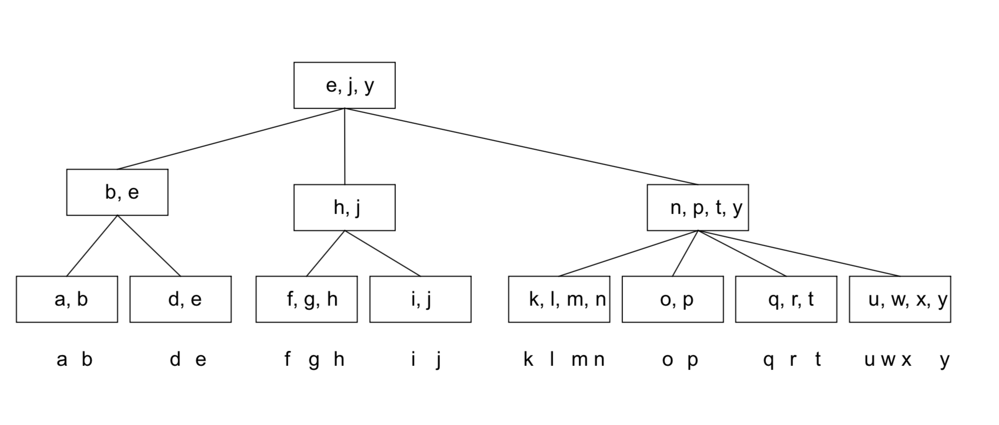


~~~
寻找, 插入, 删除 时间复杂度都是 O(logn)

/* 操作 */ 

~~~


## 2-4 tree hard version

~~~
/* 和 simple version 最大的不同就是, 此时节点存的不再是索引, 而是真实值.*/
~~~

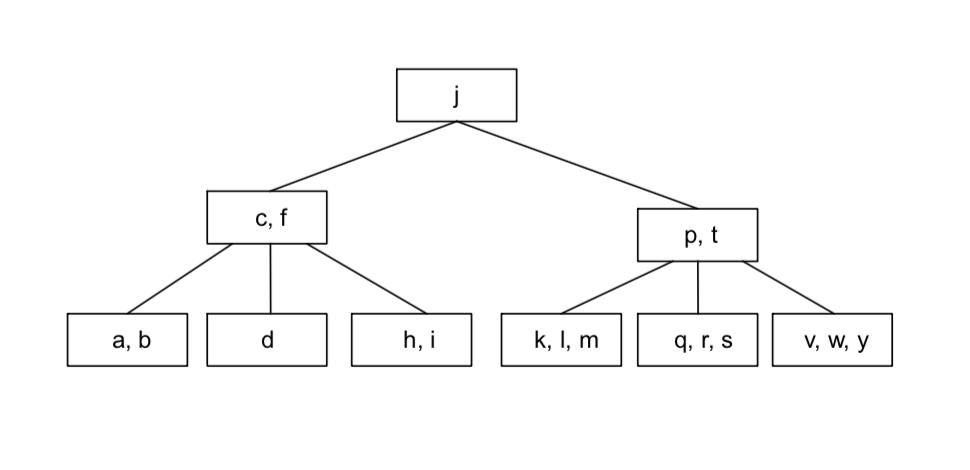

## Treaps

~~~
/* 结合了 BST, Heap */
/* 注意并不需要平衡 */


一个节点被 value, priorty 定义, 需要满足如下 : 
 
* 根据 value 满足 BST 

* 根据 proprty 满足 heap

~~~


## Priority queue 优先队列

在队列中, 具有更高优先级的元素先出队列, 我们利用数值表示元素的优先级, 那么有 :

* 最大优先队列 : 无论入队时间, 元素优先级大的先出

* 最小优先队列 : 无论入队时间, 元素优先级小的先出

**利用 Heap 实现优先队列 : 用到了 Max Heap 或 Min Heap**

优先队列有 : 

* 入队操作 对应了 Heap 的上浮(siftup) 操作, 
* 出队操作 先将堆顶元素取出, 然后将最后的元素至于堆顶, 再实行下沉(siftdown) 操作

两种操作的时间复杂度均为 : log$_2$(n)


# Floating IEEE

~~~
/* overview */

- number by calculating by : s x B^e
  
  * The significand (or mantissa) s;
  
  * The base b (一般固定为 2);
  
  * The exponent e;
  
  
  for example :  

  4.75可以表示为 : 1.0011 * 2^2;
  significand : 1.0001
  exponent : 2
  
  
  
  
	
/* 使用float 可能出现的三种错误 */
1. overflow;
    The finite size of the exponent part of a floating point
   
2. underflow; 
	we can only represent numbers with a minimum size related to the size of the exponent field
	
3. rounding;
    we have a finite number of bits in
~~~


# 可判定问题 Decidable Problems

~~~
/* def */
Are there problems which cannot be solved with algorithms?


- Undecidable Problems
  我们可以定义一个 bool does_halt 函数进行判定,返回 true 代表没有进入无限循环


* We will show that it is impossible to write such a function

Whatever such a function does_halt( paradox, paradox ) returns, it will be incorrect 
- If it returns true, paradox(paradox) goes into an infinite loop 
- If it returns false, paradox(paradox) halts

Therefore, it is not possible to find a computational answer to the halting problem
~~~


# Sorting 排序

[排序 Gif](https://www.cnblogs.com/onepixel/articles/7674659.html)


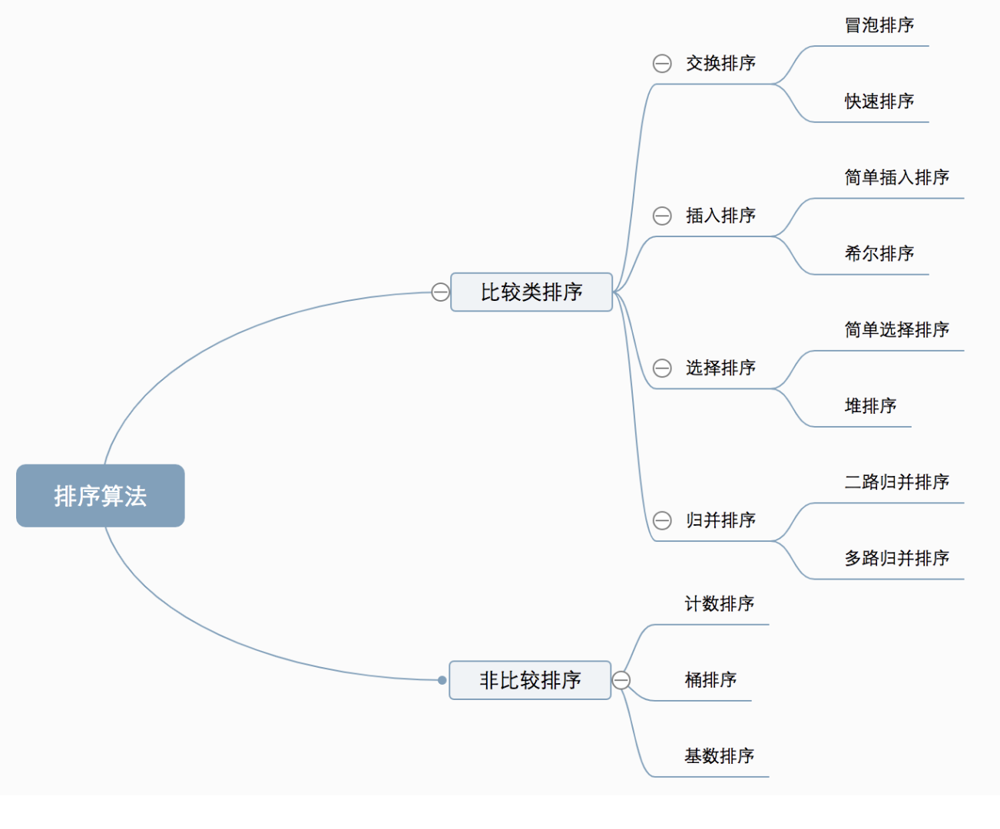


# I. Select Sort


## simple Selection Sort 简单

~~~
- 大 loop 整个 数组

- 选择一个 最小 的 和 最前排的元素交换位置

- 最前排元素➕1, repeat
~~~


## Heap sort 堆排序

~~~
/* def */
Heapsort sorts an array by using the heap property

/* steps */

makeheap : 对一个初始化数组建堆操作
具体为, 从 (int)size/2 个节点(这个节点是第一个开始有叶节点的)开始, 依次的执行 shiftdown 操作
一次 shiftdown 操作会一次将这个元素于最大的子节点元素交换. 交换后再去比较..


/* Time Comp */

Makeheap : Θ(n log n)

Siftdown is in Θ( log n)
~~~


# II. 插入排序

## simple Insertion Sort 

1. 大loop 遍历整个数组
2. 每到一个 ele, 便依次和之前的元素比较, 只到找到合适的地方插入

明显为 O(n$^2$) 复杂度


## Shell 排序

~~~
- 选择一个增量序列t1，t2，…，tk，其中ti>tj，tk=1；

- 按增量序列个数k，对序列进行k 趟排序；

- 每趟排序，根据对应的增量ti，将待排序列分割成若干长度为m 的子序列，分别对各子表进行直接插入排序。仅增量因子为1 时，整个序列作为一个表来处理，表长度即为整个序列的长度

~~~


# III. 交换排序

## 冒泡排序


## 快速排序 (D&C)

~~~
/* concept */
通过一趟排序将待排记录分隔成独立的两部分，其中一部分记录的关键字均比另一部分的关键字小，则可分别对这两部分记录继续进行排序，以达到整个序列有序。

/* steps */
1. 从数列中挑出一个元素，称为 “基准”（pivot）；
2. 重新排序数列，所有元素比基准值小的摆放在基准前面，所有元素比基准值大的摆在基准的后面
3. 递归地（recursive）把小于基准值元素的子数列和大于基准值元素的子数列排序。
~~~


~~~c++
/* 递归执行 */
function quickSort(arr, left, right) {
    varlen = arr.length,
        partitionIndex,
        left = typeofleft != 'number'? 0 : left,
        right = typeofright != 'number'? len - 1 : right;
 
    if(left < right) {
        partitionIndex = partition(arr, left, right);
        quickSort(arr, left, partitionIndex-1);
        quickSort(arr, partitionIndex+1, right);
    }
    returnarr;
}
 

/* 分区 */
function partition(arr, left ,right) {     // 分区操作
    varpivot = left,                      // 设定基准值（pivot）
        index = pivot + 1;
    for(vari = index; i <= right; i++) {
        if(arr[i] < arr[pivot]) {
            swap(arr, i, index);
            index++;
        }       
    }
    swap(arr, pivot, index - 1);
    returnindex-1;
}
 
function swap(arr, i, j) {
    vartemp = arr[i];
    arr[i] = arr[j];
    arr[j] = temp;
}
~~~


~~~
/* worst - case */
- 输入 完全有序或者逆序

/* best - case */
每次都可以分到中间
Partition always balances the two sides of the partition equally (the best case)
~~~


# I.V 归并排序


## Merge sort 二路归并 (D&C)

~~~
/* concept */
1. 把长度为n的输入序列分成两个长度为n/2的子序列；

2. 对这两个子序列分别采用归并排序；

3. 将两个排序好的子序列合并成一个最终的排序序列。
~~~


~~~c++
// 递归执行 mergeSort
function mergeSort(arr) {
    varlen = arr.length;
    if(len < 2) {
        returnarr;
    }
    varmiddle = Math.floor(len / 2),
        left = arr.slice(0, middle),
        right = arr.slice(middle);
    returnmerge(mergeSort(left), mergeSort(right));
}

// 合并两个 sorted 操作
function merge(left, right) {
    varresult = [];
 
    while(left.length>0 && right.length>0) {
        if(left[0] <= right[0]) {
            result.push(left.shift());
        } else{
            result.push(right.shift());
        }
    }
 
    while(left.length)
        result.push(left.shift());
 
    while(right.length)
        result.push(right.shift());
 
    returnresult;
}
~~~


分治思想 :  


~~~
/* 归并的时间复杂度计算 */

f(n) ≤	2f (n/2) + O(n)
	 ≤	2(2f (n/4) + O(n/2)) + O(n) = 4f (n/4) + 2O(n)
	 ...
	 ≤  n · f (1) + log n · O(n)
~~~


# [背] 时间复杂度总结


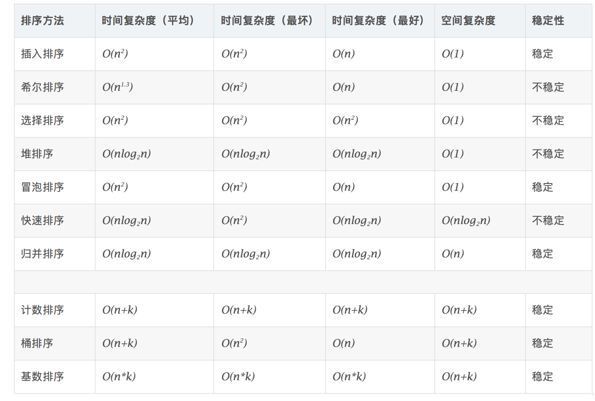

只有堆, 归并 的三种情况一样 : O(nlog2n)


# 算法模式总结

## 贪心算法

~~~
每一步都选择当前最好的选择, 注意结果可能不是正确解
~~~

### 最短路径问题  Dijkstra

~~~
/* Uses two sets of nodes S and C */

- At each iteration S contains the set of nodes that have already been chosen
s 表示已经被选择的 nodes

- At each iteration C contains the set of nodes that have not yet been chosen
C 表示还没有被选择的 nodes

- At each step we move the node which is cheapest to reach from C to S
每一步从 C 中选择一个放入 S, 且同步更新 D

- An array D contains the shortest path so far from the source to each node
D 表示目前的所有 Shortest path
~~~

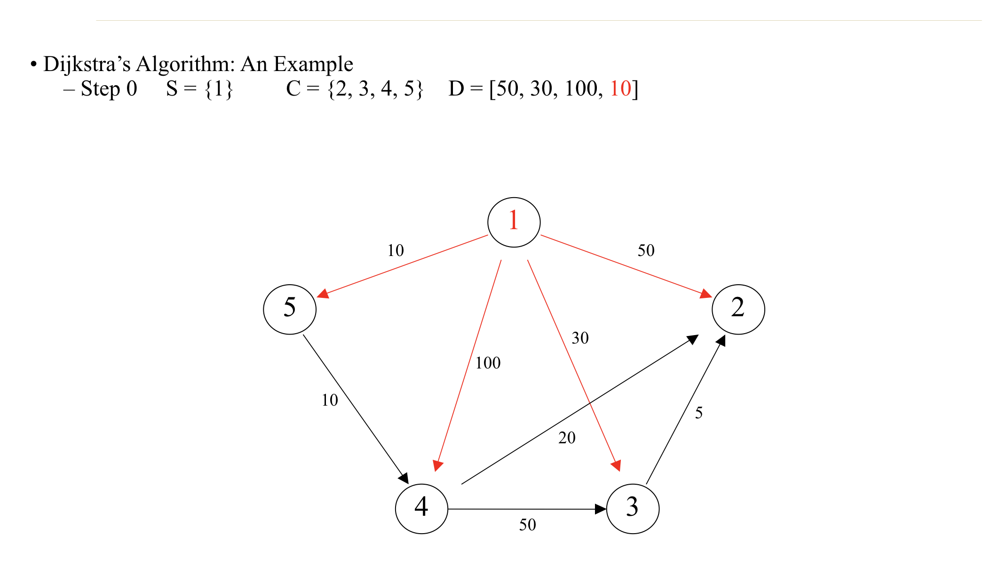


**S 从 C 中加入 5 后, D 被更新**

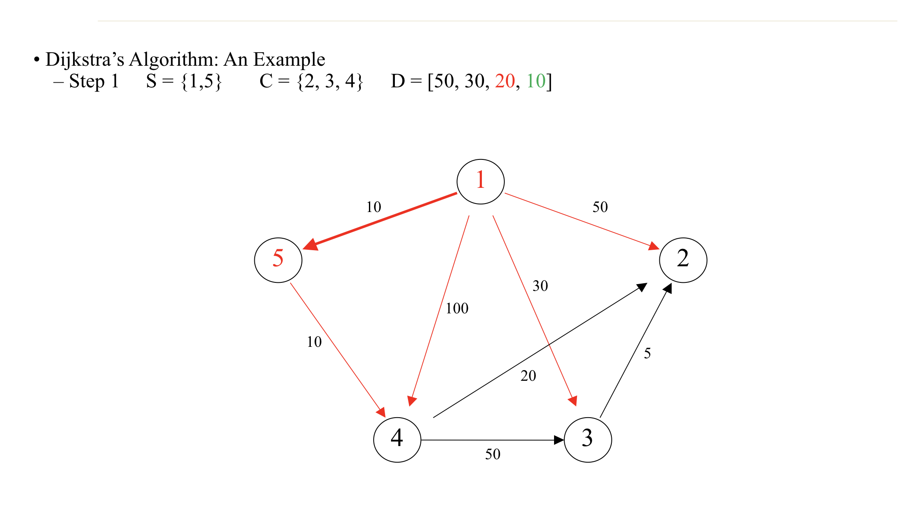


[Dijkstra’s](https://www.jianshu.com/p/5a60f921b019)


### 最小生成树 Minimum Spanning Tree 

~~~
- G = (N, E) 表示一个 undirected graph

- MST 是找到 G' = (N, E') 使得 G'刚好包含所有的N, 且 E 的cost最少
~~~


### I. Kruskal's Algorithm

~~~
– Start with an initially empty set of edges S.
 从一个空的 edges set 开始

- 选择最小权重的边，判断是否其在当前的生成树中形成了一个环路。如果环路没有形成，则将该边加入树中，否则放弃。

- 重复步骤 2，直到有 V - 1 条边在生成树中。
~~~


### II. Prim Algorithm

~~~
– Let O be a set of nodes and S a set of edges 
O 表示已经选择的 nodes, S 表示已经选择的 edges

- Initially O contains the first node of N and S is empty 

– At each step look for the shortest edge {u, v} in E such that u ∈ O and v ∉ O 
从还没有加入 O 的nodes 中选择一个 和 O整体距离最短的 node, 加入

- 重复以上, 知道 o 包含所有
~~~


### K - 背包问题

~~~
We have a set of n objects and a knapsack. 

- each object have weight wi, and value vi

- knapsack have space W

- find the most valuable way
~~~


贪心三种策略 :

1. 每次拿 价值最大的物品
2. 每次拿 最轻的物品
3. ✅ 每次拿 Value/Weight 最大的物品


### Scheduling – minimum time

~~~
/* 求所有顾客的等待时间+服务时之和最小*/

- 服务时间小的先服务即可

~~~


## Divide-and-Conquer 分治

~~~
/* def */
- break the problem up into smaller sub problems which can each either be easily solved or further subdivided.

- Once the sub problems have been solved, the partial solutions are recombined to arrive at the solution of the original problem.
~~~


### 折半查找

**递归版本**

```
function binsearch(x, T[1..n])
    if n = 0 or x > T[n] then return n + 1
    else if x < T[1] return 1
    else return binsrch(x, T(1..n])

function binsrch(x, T[i..j])
    if i = j then return i
    k = (i + j) / 2
    if x ≤ T[k] then
    elsereturn binsrch(x, T[i..k])
        return binsrch(x, T[k + 1..j])
```


### 找中位数 Finding the Median


# 分治算法 (Divide-and-Conquer)

~~~
/* overview */

- 分治算法的基本思想是将一个规模为N的问题分解为K个规模较小的子问题

- 这些子问题相互独立且与原问题性质相同, 求出子问题的解，就可得到原问题的解.


/* 2-sub 分治的一般步骤 */

1. split the original problem into 2 sub-problems with equal sizes
	分

2. Recursively solve these 2 sub- problems by applying this algorithm.
	递归

3. Merge the solutions of the 2 sub- problems into a solution of the original problem.
	合
	
	
/* 事件复杂度 */

T(n) = 2T(n/2) + S(n) + M(n) ,n >= c
T(n) = b ,n >= c

  - S(n) : time for splitting
  - M(n) : time for merging
  - b,c 都是常数
~~~


##  Mergesort 归并排序


## Binary Search 二分查找

~~~
/* 在 D&C 思想下的 二分查找 */

默认我们寻找的数组是有序的

- step 1 : 在每一个步骤, 我们都验证我们的 subarray 的最中间的值.

- step 2 : 如果中间值 > 我们的寻找值, 那我们转到 left subarray, 如果 < 转到 right subarray
~~~

~~~c++
int binary_search_recursion(const int array[], int low, int high, int key)
{
    
    // 取中间位置
    int mid = low + (high - low)/2;
    
    // end key not found
    if(low > high)
        return -1;
    
    else{
        
        // find return the result 
        if(array[mid] == key)
            return mid;
        else if(array[mid] > key)
            return binary_search_recursion(array, low, mid-1, key);
        else
            return binary_search_recursion(array, mid+1, high, key);
    }
}
~~~


* **Ppt 上的关于二分查找的例子, 它上面处理 key not found 的情况, 并不是直接 return -1;**

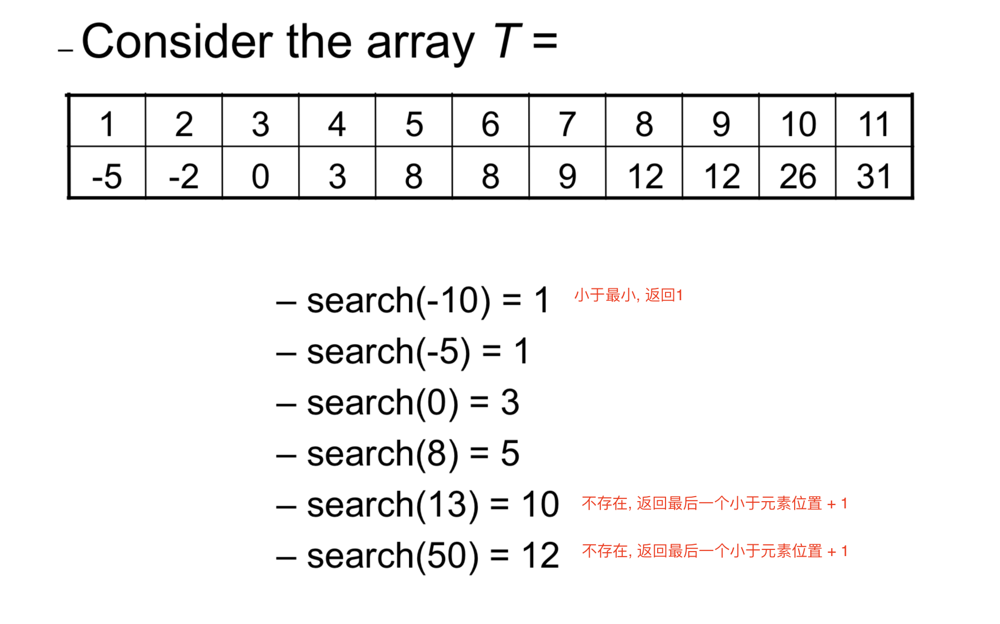

## 找第 S 个小的元素  (Finding the Sth Smallest Element)


### median 中位数

~~~
/* def */

- 并不是均值, 而是中间位置的值

- {1, 3, 3, 6, 7, 8, 9} 中位数 -> 6

- 和 mean 相比的优势是, 并不特别受 max, min 值的限制
~~~


~~~
/* steps */
利用快排的思想

mid 在 sorted 数组的下标一定为 : minPos = (size+1)/2

1. 先进行一趟快排，使得div左边的值都比arr[div]小，div右边的值都比arr[div]大，但是这个div的位置是不确定的，可能位于中间，也可能偏左或者偏右。

2. 如果 div = midPos 即为中位数, 如果 div > minPos, 说明中位数在左边,那么递归的再执行一遍, 同理 div < minPos
~~~


# 回溯算法 (backtracking)

~~~
/* def */
- 适合计算量非常大, 但是有明确限制的穷搜问题

- 但当探索到某一步时，发现原先选择并不优或达不到目标，就退回一步重新选
~~~


## 八皇后问题

~~~
/* def */
- 八个皇后, 一个 8*8 的棋盘

- 找到八个皇后的在棋盘中的排放位置, 满足如下 : 所有的八个皇后都不在 ‘横’, ‘竖’, ‘直’ 的直线上
  no two queens share the same row, column, or diagonal.
  
~~~


## 暴力法 

~~~
/* def */

- 最暴力的方法, 直接列举所有可能的情况, 然后进行判断

- 一共有 8x8x8x8x8x8x8x8 种可能 => not acceptable to run 
~~~


## 暴力法改进 

~~~
- 根据题意, 八皇后明显不会出现在相同的行, 列中

- 所以选择一个后, 我们便可以知道, 当前的行, 列不可以再选

- 这种方式 我们有 8! 可能
~~~


## 回溯解

[八皇后问题](https://www.jianshu.com/p/65c8c60b83b8)

~~~
 - 核心思想 : 当在棋盘摆放一个皇后的时候, 便可以确定当前皇后的封锁范围 : “绿色”区域
~~~

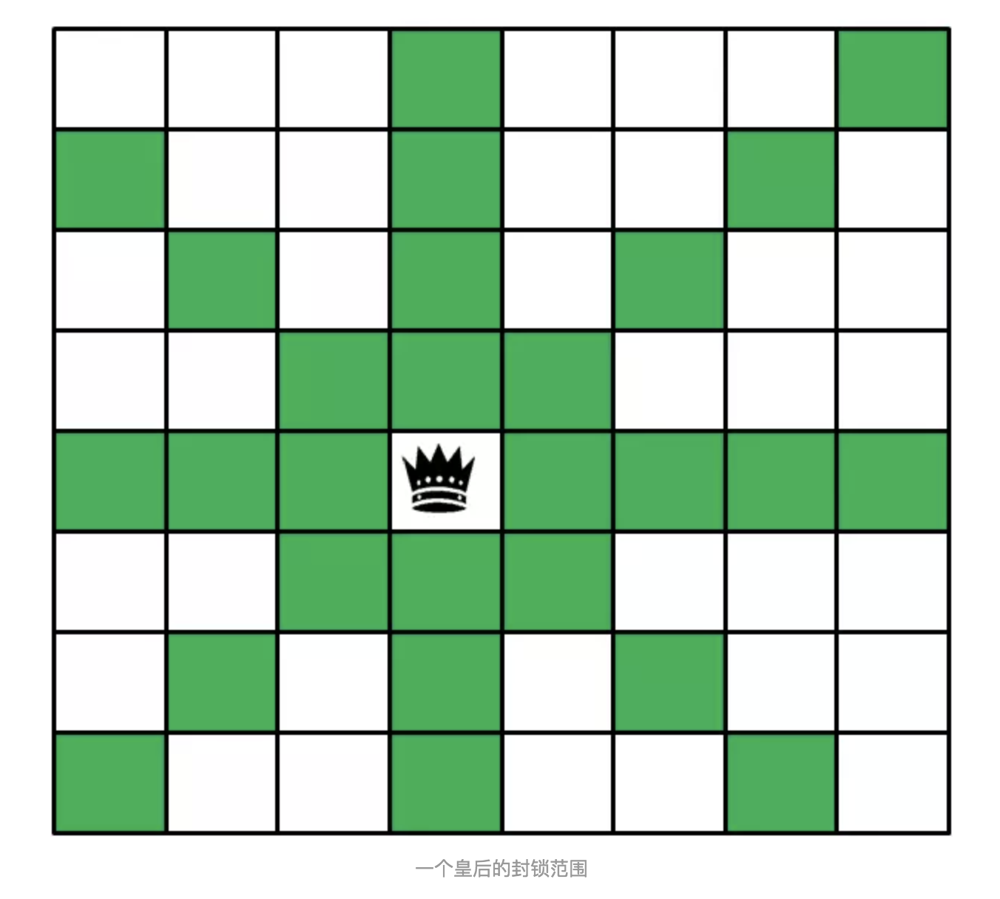

**步骤回朔 (4*4为例子): **

* step1 : 在第一行选择一个点放置, 然后从而确定出哪些不能放 : 

  如图, 黑色的表示被封锁的.

  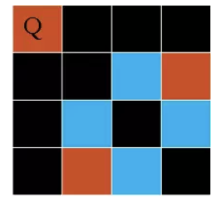

* step2 : 在第一步的基础上, 选择第二行没有被封锁的位置. 

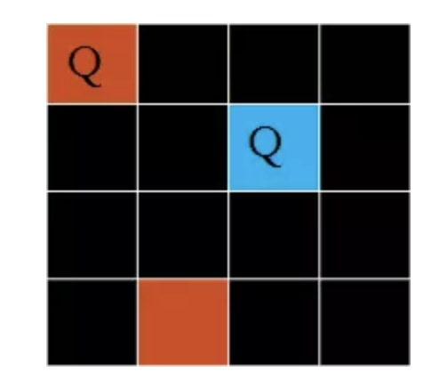

​	此时发现第三刚已经被封锁了, 这种情况无解了, 开始回朔.

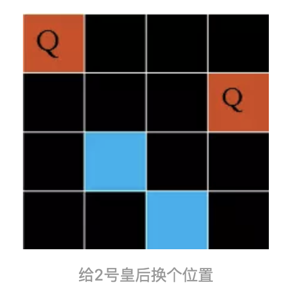


**核心代码如下 :**

(其中有几个逻辑函数没有实现)

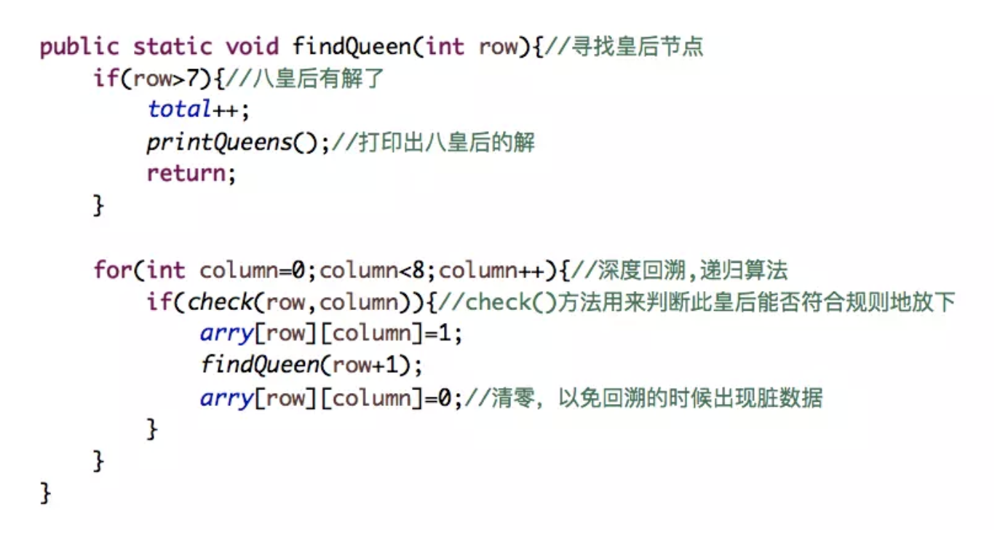


~~~
/* conclusion */

- More efficient 

- general approach to problem solving –backtracking.
~~~


# 并行计算

## 并行计算架构的类型

~~~
/* 并行计算架构的类型 */
- SIMD (Single instruction, Multiple data)
  Array/Vector Processors 
  在同一时刻, 必须执行相同的命令
  
- MISD (Multiple instruction,  Single data)
  Pipeline processors.
  每个处理器对单个数据流执行不同的指令
  
- MIMD (Multiple instruction, Multiple data)
  高级并行计算, 允许不同的处理器在同一时刻处理不同的指令
  Each processor operates fully independently of each of the others.
~~~


# 算法代码复习 (可能考的代码)


## Tower of Hanoi

~~~c++
/*
    1. 先把 n-1 个盘子从from放在temp上，
    2. 把from上剩下的一个盘子（也就是最底下的盘子）放到to上。
    3. 把temp上的 n−1 个盘子放到to上。
*/
#include<stdio.h>
void hanoi(int n,char from,char temp,char to)
{
    if(n>0)
    {
        //第一步 先将前 n-1个盘子通过 to 移到 temp 上
        hanoi(n-1,from,to,temp);
        //第二步 再将 第n个盘子从 from 移到 to上
        printf("%c move to %c\n",from,to);
        //第三步 最后将 n-1个盘子通过 from 从 temp 移到 to上
        hanoi(n-1,temp,from,to);
    }
}
int main()
{
    hanoi(3,'A','B','C');    
}
~~~


