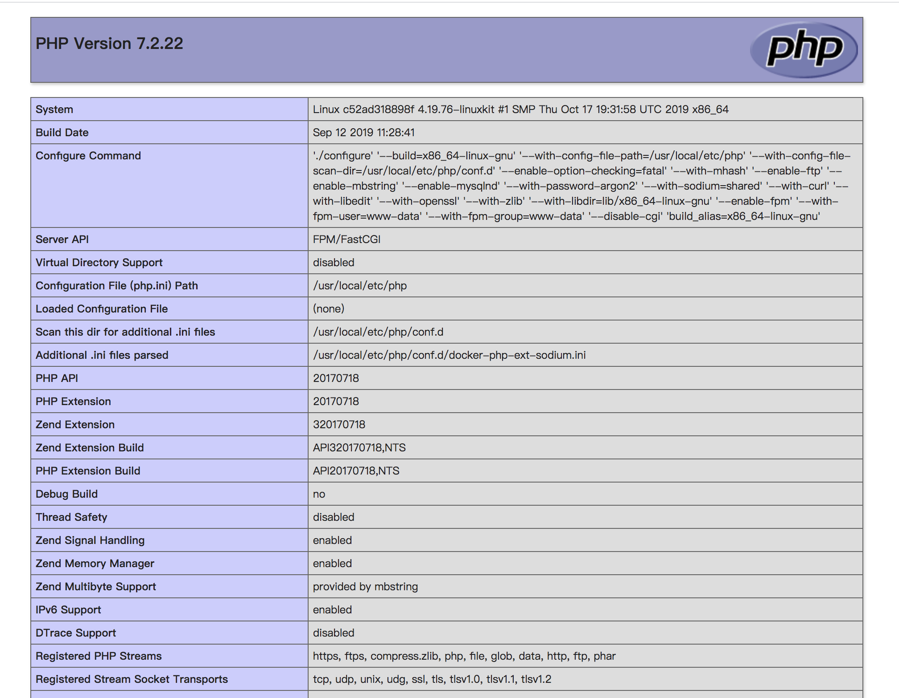

# 	Docker

# 一. 安装

### Mac

[阿里云镜像下载 for MacOS](<http://mirrors.aliyun.com/docker-toolbox/mac/docker-for-mac/?spm=5176.8351553.0.0.7f231991HGal1K>)

设置本地国内仓库源:

~~~json
{
  "experimental": false,
  "debug": true,
    
  /* 设置国内阿里云仓库镜像 */
  "registry-mirrors": [
    "https://******.mirror.aliyuncs.com"
  ]
}
~~~

### Ubuntu

>  [ubuntu docker 安装手册](<https://docs.docker.com/engine/install/ubuntu/>)

命令窗口可以直接修改 `/etc/docker/daemon.json`

~~~shell
{
    # 国内镜像
    "registry-mirrors": [
        "https://docker.mirrors.ustc.edu.cn/",
        "https://0hwpcb37.mirror.aliyuncs.com/"
    ]
}
~~~

# 二. 入门指令

## Hello world - 启动一个 ubuntu 的容器

~~~shell
# -i 表示容器 Stdin 开启
# -t 表示分配一个伪tty终端
# ubuntu 为告诉 docker 创建的镜像容器 类似的如 : fedora,debian,centos...
# bin/bash 告诉docker采用的交互 shell
$docker run -i -t ubuntu /bin/bash
~~~

执行命令后，首先 `docker` 会在本地寻找 `ubuntu` 镜像，如果本地不存在则在配置的 `registry-mirrors` 中寻找且下载至本机，此时便启动可一个 ubuntu 系统的 docker 容器。

在执行`run`命令后，便可以进入 `ubuntu` 的系统 `shell` 中。

~~~bash
# 退出docker容器，回到宿主机
exit
~~~

## 启动实例 `docker run` 

* `-p` : 端口映射

* `-d` : 容器后台运行

* `-i`:  交互式操作

* `-t`:  终端

  ~~~shell
  # 如该命令表示将 docker 端口6379映射到宿主机20003端口上
  docker run -p 20003:6379 -itd redis --name=redis-serve
  ~~~

  

## 容器实例列表 `docker ps`

~~~shell
# 可以查看当前系统中所有容器的列表
# 可以列出如容器 ID, IMAGE, NAMES 等信息
$docker ps -a
~~~

## 容器命名

我们可以在创建容器的同时给容器命名:

~~~shell
# 容器的命名必须是唯一的，可以用于容器的辨认
$docker run --name myContainer -i -t ubuntu /bin/bash
~~~

## 重启容器

在使用 `exit` 命令后的容器便会自动停止，我们可以分别用 **ID**, **Name** 的方式对容器进行重启:

~~~shell
# 使用名称重启
$docker start myContainer

# 使用ID重启
$docker start 5bbba0b5aef1
~~~

## 附着容器 `attach`

在容器重启后，我们便可以重新进入容器中:

~~~shell
# 使用名称进入
$docker attach myContainer

# 使用ID进入
$docker attach 5bbba0b5aef1
~~~

## 进入守护容器 `docker exec`

守护容器并不能直接附着，需要使用 `exec` 命令进入

~~~shell
# 进入容器
docker exec -it containerID/containerName /bin/bash
~~~

## 停止容器

~~~shell
$docker stop myContainer 

$docker stop 5bbba0b5aef1 
~~~

## 删除容器

删除容器需要在停止容器后才能执行

~~~shell
$docker rm myContainer

# 删除全部容器
$docer rm `docker ps -a -q`
~~~

## `apt-get` 命令加速

一般而言 docker apt-get速度很慢，我们需要设置docker ubuntu apt-get 源.

~~~shell
# 设置阿里云源
> sed -i s@/archive.ubuntu.com/@/mirrors.aliyun.com/@g /etc/apt/sources.list
> apt-get clean
~~~

~~~shell
# 更新加速
> apt-get update
~~~

# 三. 镜像和仓库

## 镜像与容器

容器即为镜像的实例，一个镜像可以实例出多个容器

## 列出镜像 `docker image`

~~~shell
➜  ~ docker images
REPOSITORY          TAG                 IMAGE ID            CREATED             SIZE
ubuntu              latest              1d622ef86b13        7 days ago          73.9MB
hello-world         latest              bf756fb1ae65        3 months ago        13.3kB
~~~

下载下来的镜像被放置于宿主机的 `/var/lib/docker` 目录下。

## 删除镜像 `dcoker rmi`

~~~shell
docker rmi hello-world
~~~

## 设置镜像标签 `docker tag`

~~~
docker tag <imageID> <imageName>:<tag>
~~~

## 构建自定义镜像

更新和管理自定义镜像的方法主要有以下两种

* 使用 docker commit 
* 使用 **docker build 和 Dockerfile 文件** 🌟 推荐使用

### Docker commit 构建自定义镜像

* 首先我们需要登陆到 hub.docker 上

  ~~~shell
  >sudo docker login
  ~~~

* 然后我们开一个 ubuntu 容器

  ~~~shell
  $docker run -i -t ubuntu /bin/bash
  ~~~

* 然后下载 `apache` 

  ~~~shell
  # in container
  >apt-get update
  >apt-get -y install apache2
  ~~~

  我们日后希望生成的web应用的容器可以不用再重新去下载 `apache`

* 退出 ubuntu 然后 commit

  ~~~shell
  # exit from container
  >exit
  # in macOs
  $sudo docker commit [containerID] username/apache2
  # 在 commit 之后，便可以将刚容器中的环境设置保存到用户仓库中，且提交的时候仅保存 创建容器和当前状态之间的差异部分 从而使得更新非常轻量
  ~~~

* 获取用户仓库中的镜像

  ~~~shell
  # 此时获得的镜像即为刚用户保存的自定义镜像
  $sudo docker run -t -i username/apache2 /bin/bash
  ~~~
  
  

## Dockerfile

Dockerfile 是一个用来构建镜像的文本文件，文本内容包含了一条条构建镜像所需的指令和说明。

以 `gRpc` 应用 dockerfile 为例

~~~dockerfile
# 构建阶段1: 以golang为基础镜像
FROM golang AS build
# 设置变量location
ENV location /go/src/github.com/code-newbee/geeker
WORKDIR ${location}/server
ADD ./ ${location}/server

# RUN 表示执行后面的命令
# 1. RUN <命令>
# 2. RUN ["可执行文件", "参数1", "参数2", ...]
RUN go get -d ./...
RUN go install ./...
RUN CGO_ENABLED=0 go build -o /bin/geeker

# 构建阶段2: 
# scratch 为docker官方的保留关键字, 表示一个空镜像
FROM scratch
# 复制阶段1中编译的二进制文件到scratch
COPY --from=build /bin/geeker /bin/geeker
# 启动入口, docker run 的参数会被当作参数传递给该文件
ENTRYPOINT ["/bin/geeker"]

# 声明端口, EXPOSE 仅是展示作用
EXPOSE 50001
~~~

## 构建镜像 `docker build`

* `-t` : 指定生成
* `-f` 

## 容器中访问宿主机服务

场景: 在容器中的服务可能需要和宿主机上的服务服务相互通信, 例如nginx容器代理到宿主机服务,此时不能使用 `127.0.0.1` 而应该是 `http://host.docker.internal`

# 实战

## #1. 配置 redis 主从集群

* 首先拉取 `redis` 镜像

    ~~~shell
    # 拉取官方 redis 镜像
    $docker pull redis
    
     查看是否成功
    $docker images
    REPOSITORY             TAG                 IMAGE ID            CREATED             SIZE
    redis                  latest              987b78fc9e38        3 days ago          104MB
    ~~~

* 然后根据 `redis`镜像开启多个实例

    ~~~shell
    # 根据redis镜像 开启redis实例1
    ➜  ~ docker run --name redis001 -p 20001:6379 -d redis redis-server
    
    # 根据redis镜像 开启redis实例2
    ➜  ~ docker run --name redis002 -p 20002:6379 -d redis redis-server
    
    # 根据redis镜像 开启redis实例3
    ➜  ~ docker run --name redis003 -p 20003:6379 -d redis redis-server
    ~~~

    `--name` 表示实例命名

    `-p` 即为端口映射, 将容器的`redis-server` 的 `6379` 端口映射到宿主机的 `20001`

    `-d` 表示容器不需要交互式界面，仅后台运行 `Run container in background and print container ID`

* 查看是否创建实例成功

  ~~~shell
  # 实例化成功
  ➜  ~ docker ps -a
  
  CONTAINER ID        IMAGE               COMMAND                  CREATED             STATUS              PORTS                     NAMES
  a8225e8d4bf9        redis               "docker-entrypoint.s…"   11 minutes ago      Up 11 minutes       0.0.0.0:20003->6379/tcp   redis003
  39ad1efae430        redis               "docker-entrypoint.s…"   24 minutes ago      Up 24 minutes       0.0.0.0:20002->6379/tcp   redis002
  5ebc41df8a83        redis               "docker-entrypoint.s…"   26 minutes ago      Up 26 minutes       0.0.0.0:20001->6379/tcp   redis001
  ~~~

* 访问实例的 `redis-server` 可以有两种方式

  ~~~shell
  # 1. 通过宿主机 redis-cli 访问容器 redis-server
  ➜  ~ redis-cli -h 127.0.0.1 -p 20001
  
  # 2. 直接登陆实例访问 redis-cli
  # -t 即 -tty Allocate a pseudo-TTY 分配一个 tty 终端
  # -i 即 STDIN
  ➜  ~ docker exec -it redis001 redis-cli
  ~~~

* 主从配置

  我们拟将 `redis001` 作为主，`redis002,redis003` 作为从

  首先获得 `redis001` 的局域网 ip

  ~~~shell
  # 查看 redis001 详情
  ➜  ~ docker inspect redis001
  
  "Networks": {
      }	
  	    ...,
  	    "IPAddress": "172.17.0.2",
  	    ...,
      }
  }
  ~~~

  然后进入 `redis002`

  ~~~shell
  # 进入 redis002 redis-cli
  ➜  ~ docker exec -it redis002 redis-cli
  
  # 配置主服务器
  127.0.0.1:6379> slaveof 172.17.0.2 6379
  ~~~

  同理进入 `redis003` 配置即可。

* 查看配置成功

  ~~~shell
  # 查看 redis001 是否配置成功
  ➜  ~ docker exec -it redis001 redis-cli
  
  127.0.0.1:6379> info replication
  # Replication
  role:master
  
  # 2个从redis-server 说明配置成功
  connected_slaves:2
  slave0:ip=172.17.0.3,port=6379,state=online,offset=5653,lag=0
  slave1:ip=172.17.0.4,port=6379,state=online,offset=5653,lag=0
  master_replid:2bce22ae5f1f6b4c954089e99830faa7043d8126
  master_replid2:0000000000000000000000000000000000000000
  master_repl_offset:5653
  master_repl_meaningful_offset:179
  second_repl_offset:-1
  repl_backlog_active:1
  repl_backlog_size:1048576
  repl_backlog_first_byte_offset:1
  repl_backlog_histlen:5653
  ~~~

## #2. 配置 php + nginx 环境

`php` + `nginx` 为经典的 web 环境，首先我们分别拉取 `php` 和 `nginx` 的镜像文件。

* 拉取 `nginx` 镜像

  ~~~shell
  # 拉取镜像
  $docker pull nginx
  
  # 查看
  $docker images
  ~~~

* 拉取 `php:7.2-fpm` 镜像

  ~~~shell
  # 拉取
  $docker pull php:7.2-fpm
  
  # 查看
  $docker images
  ~~~

* 首先创建三个目录，分别用于映射不同的 `nginx` 所需文件

  ~~~shell
  # conf 下存放配置文件
  # www  存放web应用
  # logs 存放日志文件
  $mkdir -p conf www logs
  ~~~

* 写 nginx 配置文件 `conf/nginx.conf`

  ~~~conf
  server {
      charset utf-8;
      client_max_body_size 128M;
  
      listen 80; ## listen for ipv4
      #listen [::]:80 default_server ipv6only=on; ## listen for ipv6
  
      server_name localhost;
      root        /usr/share/nginx/html/public; # 定义更目录
      index       index.php;
  
      location / {
          #-e表示只要filename存在，则为真
          if (!-e $request_filename){
              rewrite  ^(.*)$  /index.php?s=$1  last;
              break;
          }
          # Redirect everything that isn't a real file to index.php
          try_files $uri $uri/ /index.php$is_args$args;
      }
  
      # uncomment to avoid processing of calls to non-existing static files by Yii
      #location ~ \.(js|css|png|jpg|gif|swf|ico|pdf|mov|fla|zip|rar)$ {
      #    try_files $uri =404;
      #}
      #error_page 404 /404.html;
  
      # deny accessing php files for the /assets directory
      location ~ ^/assets/.*\.php$ {
          deny all;
      }
  	
  	# 定义 php 文件解析器 fcgi
      location ~ \.php$ {
          fastcgi_pass   php:9000;
          fastcgi_index  index.php;
          fastcgi_param  SCRIPT_FILENAME  /www/public/$fastcgi_script_name;
          include        fastcgi_params;
  	}
  
      location ~* /\. {
          deny all;
      }
  }
  ~~~

* 实例化 `php` 镜像

  ~~~shell
  # 实例化 php 镜像
  # -v 表示将宿主机的  ~/Code/docker/larabbs/www 目录挂载到 php容器的/www下
  # 	 容器的 www/ 目录为php-fpm的工作目录，需要将webapp挂载上去
  # -d 表示 daemon 模式
  # php:7.2-fpm 即为镜像名
  docker run --name php-env -v ~/Code/docker/larabbs/www:/www -d php:7.2-fpm
  ~~~

* 实例化 `nginx` 镜像

  ~~~shell
  docker run --name php-nginx -p 8080:80 
  -v ~/Code/docker/larabbs/www:/usr/share/nginx/html 
  -v ~/Code/docker/larabbs/conf:/etc/nginx/conf.d
  -v ~/Code/docker/larabbs/logs:/var/log/nginx
  --link php-env:php
  -d nginx
  ~~~

* 最后仅需要将 `webapp` 放到 `www` 目录下, 我们假设为。

  ~~~php
  <?
      # index.php 
      
      echo phpinfo();
  ~~~

  

  至此，可以成功启动。

## #3. 配置 mysql 环境

* 首先拉去 `mysql` 镜像，默认 `latest` 已经是 `8.0`

  ~~~shell
  $docker pull mysql
  ~~~

* 然后分别开三个文件夹分别存放 配置文件，日志，数据

  ~~~shell
  $mkdir -p data log conf
  ~~~

* 然后编写 `conf/conf.d` 数据库配置文件

  ~~~
  [mysqld]
  # 表名不区分大小写
  lower_case_table_names=1
  #server-id=1
  datadir=/var/lib/mysql
  #socket=/var/lib/mysql/mysqlx.sock
  #symbolic-links=0
  # sql_mode=NO_ENGINE_SUBSTITUTION,STRICT_TRANS_TABLES
  [mysqld_safe]
  log-error=/var/log/mysqld.log
  pid-file=/var/run/mysqld/mysqld.pid
  ~~~

* 然后实例化镜像

  ~~~shell
  # -p 3307:3306 宿主机的映射端口为 3307
  # 三个 -v 即为三个需要挂载到宿主机的目录
  # MYSQL_ROOT_PASSWORD 表示初始化 root 用户的密码
  # -d 即为 daemon 模式运行
  docker run --name mysql-3307 -p 3307:3306 -v /Users/ark/Code/docker/zhouxuan/mysql/conf:/etc/mysql/conf.d -v /Users/ark/Code/docker/zhouxuan/mysql/log:/var/log -v /Users/ark/Code/docker/zhouxuan/mysql/data:/var/lib/mysql -e MYSQL_ROOT_PASSWORD=root-19951103 -d mysql
  ~~~

* 访问 `mysql`

  ~~~shell
  # 1. 在宿主机可以直接进行远程访问 (需要打开root远程访问权限)
  #    -P (注意P为大写) 表示端口
  # 	 -p (注意p为小写) 表示登录要使用密码
  > $mysql -h 127.0.0.1 -P 3307 -u root -p
  
  # 2. 进入容器后访问
  # 	 首先进入容器
  > $docker exec -it mysql-3307 /bin/bash
  #    然后在容器内访问
  # 	 在容器内访问则相当于本地访问，所以可以省去 IP 和 端口
  > $mysql -u root -p
  ~~~

## #4. 配置 rabbitmq 环境

* 拉取 `rabbitmq` 镜像 

  ~~~shell	
  # 仅仅为 rabbitmq 则没有管理界面
  $docker pull rabbitmq
  
  # management tag 表示为带 web 管理界面的版本
  $docker pull rabbitmq:management
  ~~~

* 创建一个 `rabbitmq` 实例

  ~~~shell
  # RABBITMQ_DEFAULT_USER 为管理界面登录用户名
  # RABBITMQ_DEFAULT_PASS 为管理界面登录密码
  # 15672 端口挂在为 web 管理界面的端口
  docker run -dit --name Myrabbitmq -e RABBITMQ_DEFAULT_USER=admin -e RABBITMQ_DEFAULT_PASS=admin -p 15672:15672 -p 5672:5672 rabbitmq:management
  ~~~

