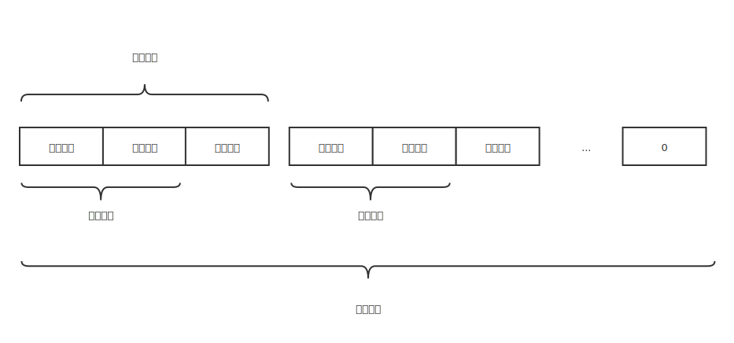

# 前置知识

## #1. Protobuf 编码技术

gRpc 使用 `Http/2 + protobuf` 的方式传输

protobuf为编码方式, 使用时只需要使用 protobuf 的方式定义好消息的内容, 在客户端和服务端传输, 会自动按照规定的编码方式将消息转化为 **二进制流** 进行传输

一个protobuf消息定义的例子

~~~protobuf
message productId {
	
	  // 字段索引为1, 类型为string
		string value = 1;
}
~~~

一个 protobuf 消息的编码模型如下:

* 字段索引: 字段定义时的顺序, 必须在消息内唯一 
* 线路类型: 对应字段的类型: string, int32, int64, ..., 规定了字段内容的读取长度
* 字段内容: 即为传输的真实内容

protobuf 对应不同的字段类型采用不同的编码技术

* 字符串 `string` : UTF-8 编码
* 整型 `int32` : Varint 编码

## 编译 Protoc 

* 可以编译 `protobuf` 文件生成 **服务端接口** 和 **客户端存根**(stub)
* 语言, 平台无关

一个 protoc 命令实例

~~~shell
protoc -I ecommerce ecommerce/product_info.proto --go_out=plugins=grpc:ecommerce
~~~

`-I` : 指明当前编辑的proto文件 *Import* 路径 (如果不指明则默认为当前执行命令的路径)

`--go_out=` : 指明当前生成的 go 文件存根路径

# gRpc 综合

## 拦截器

拦截器允许 gRpc 在调用远程方法 **之前** 或者 **之后** 做一些自定义业务处理, 例如 Log 记录, 监控, 认证 等

gRpc支持的拦截器基于不同的请求模式可以分为

* 一元拦截器 : 一元通信模式
* 流拦截器 : 流通信模式

### 服务端一元拦截器

~~~go
// 服务端一元拦截器
func OrderUnaryInterceptor(ctx context.Context, req interface{}, info *grpc.UnaryServerInfo, handler grpc.UnaryHandler) (interface{}, error) {

	// ... 请求
	log.Printf("[server interceptor] : %v", info.FullMethod)
	log.Printf("[request mesage] : %v", req)

	// rpc 消息处理
	m, err := handler(ctx, req)

	// ... 响应
	// m 即为 response message
	log.Printf("Post message %s", m)

	return m, err
}

// 在使用的时候, 注册在服务器初始化时即可
func main(){
  // ...
  
  s := grpc.NewServer(
    // 注册一元拦截器, 则服务中 所有 的一元请求方式都会被拦截
		grpc.UnaryInterceptor(interceptor.OrderUnaryInterceptor),
	)
  
  // ...
}
~~~

### 服务端流拦截器

## gRpc 安全通信

## Http/Json转码

将gRpc提供的服务转化为RestfulApi是一个常见的需求, 要实现则需要用到gRpc官方提供的 [gRpc-gateway](https://github.com/grpc-ecosystem/grpc-gateway), 它是一个代理网关, 可以实现从 gRpc/pb 到 http/json 的相互转化

~~~shell
go get \
    github.com/grpc-ecosystem/grpc-gateway/protoc-gen-grpc-gateway \
    github.com/grpc-ecosystem/grpc-gateway/protoc-gen-swagger \
    github.com/golang/protobuf/protoc-gen-go
~~~

~~~protobuf
syntax = "proto3";
// package 名采用三段式 grpc.{appName}.{serverName}
package grpc.newbee.geek;
option go_package = "github.com/code-newbee/protocol/geeker";

import "google/api/annotations.proto";

service Geeker{
    rpc sayHello (sayHelloRequest) returns (sayHelloResponse){
    	  // 表明Http接口uri
        option (google.api.http) = {
            post: "/v1/sayHello"
            body: "*"
        };
    }
}
message sayHelloRequest{
    string RequestId = 1;
}

message sayHelloResponse{
    string Message = 1;
    int32 Code = 2;
}
~~~

