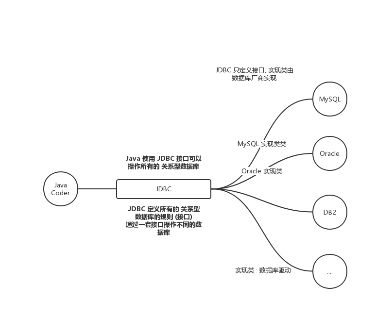

# JDBC 

[TOC]

# 一. 概述

`JDBC (Java DataBase Connection)` 是 **Java开发的数据库的统一的接口**, 对于不同的 database 使用统一的接口

即可.

本质上 : `JDBC` 是官方定义的 一套操作所有 `关系型数据库` 的规则 (接口). 各个数据库厂商去实现这个接口 (多态性质), 提供数据库驱动 `Jar 包` , 我们可以使用 `JDBC` 接口编程, 但是真正执行的为 `驱动 jar` 包实现类

# 二. JDBC 包含对象详解

~~~java
/*
	一次数据库操作涉及一下的步骤
*/

// 手动加载 Driver 类
Class.forName("com.mysql.cj.jdbc.Driver");

//链接数据库
Connection cn = DriverManager.getConnection("jdbc:mysql://localhost:3306/bank useSSL=false", "root", "password");

// 定义 SQL
String sql = "select * from account";

Statement stmt = cn.createStatement();

ResultSet r =  stmt.executeQuery(sql);

// 关闭
stmt.close();

// 关闭链接
cn.close();
~~~

一次数据库操作可能涉及到一下的对象

* `DriverManager` : 数据库驱动对象
* `Connection`  : 数据库链接对象
* `Statement` : 执行 SQL 的对象
* `ResultSet` : 结果集对象
* `PreparedStatement` : 执行 SQL 的对象

##2.1 `DriverManager` 对象

有以下功能 :

* 注册驱动
* 获取数据库链接

注册驱动 : 可以告诉程序, 应该使用哪一个 数据库驱动 jar

~~~java
// 手动加载 Driver 类
Class.forName("com.mysql.cj.jdbc.Driver");

// 直接加载Driver类是因为这个类里面就有关于注册驱动的 静态代码块
// 可以看到真正起作用的还是 DriverManager.registerDriver() 方法
static {
    try {
        DriverManager.registerDriver(new Driver());
    } catch (SQLException var1) {
        throw new RuntimeException("Can't register driver!");
    }
}

~~~

获取数据库链接 : 

~~~java
static Connection getConnection(String url, String user, String pwd);
/*
	URL : 链接路径 
		e.g. jdbc:mysql://localhost:3306/databaseName
        如果 链接为本机的 MySQL 服务器,且默认端口为3306, 那么可以删除 localhost:3306 部分
        可以简写为 : jdbc:mysql:///databaseName (三个‘/’)
*/
~~~

## 2.2 `Connection` 对象

数据库链接对象, 有如下作用 :

* 获取 执行 SQL 对象 (两个方法)
  * `Statement createStatement()`
  * `PreparedStatement preparedStatement(String sql)`

* 管理 `事务` 
  * 开启 事务 :  `void setAutoCommit(boolean autoCommit)`  传递 false 即为开启事务
  * 提交 事务 :  `void commit()`
  * 回滚 事务 :  `void rollback()`

## 2.3 `Statement` 对象

用于执行 `静态SQL` 语句, 并且返回相应的值. 有如下作用:

* 执行 sql

  * 执行 DML 语句 `int excuteUpdate (String sql) ` , 一般是 `update` , `insert`, `delete` 

    返回值是影响的行数 

  * 执行 DQL 语句 `ResultSet excuteQuery(String sql)` , 即执行 `select` 

    返回值就是 结果集 对象

## 2.4 `ResultSet` 结果集 对象

### 基本方法

封装查询结果的对象, 一个结果集包含 **多行查询数据**, 有如下成员方法 :

* `boolean next()` : 结果集游标向下移动一行 (默认在第一行上面), 所以最开始要先调用 next, 然后判断当前行是否为 结果集末尾, 到达结尾返回 false.

* `getXxx(string fieldName)` 可以获得 当前行结果集的某一字段的内容 , e.g.

  ~~~java
  // 获得当前行myName字段的值
  getString("myName")
  ~~~

### 遍历结果集

~~~java
ResultSet rs = Statement.excuteQuery(sql);

/*
	遍历
*/
while(rs.next()){
    // 获得 当前行数据
    // ...
    
}
~~~

# 数据库连接池

一个存放 若干数据库连接对象 的一个容器. 

当系统初始化的时候, 容器被创建, **且容器中申请一些连接对象**, 当用户访问数据库的时候, 从容器获取连接对象, 用户访问完之后, 将连接对象归还给连接池

好处 :

- 节约系统资源
- 用户访问高效

