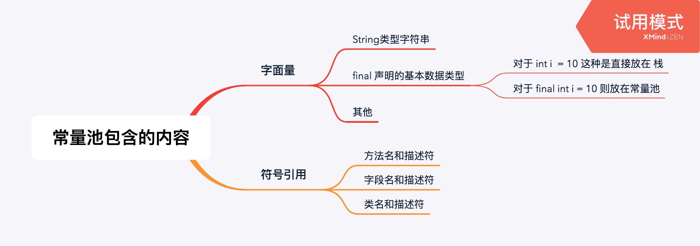
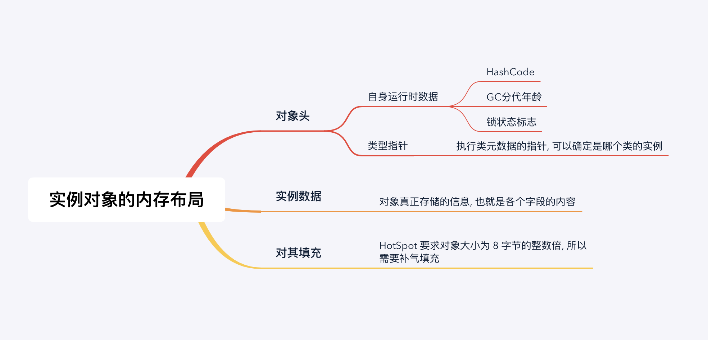

# Java 内存区域

[TOC]

# 一. 运行时内存区域

Java 虚拟机在执行 Java 程序的过程中会把它管理的内存划分成若干个不同的数据区域 : 

## 共享和私有

一个 Java 进程 可以包含多个 线程, 所以内存角度上看, 分为 : 线程共有的区域 和 线程私有的区域

线程共享的区域

* 堆
* 方法区
* 直接内存 

线程私有的区域

* 程序计数器
* (VM)虚拟机栈
* 本地方法栈

## 线程私有

### 程序计数器

程序计数器, 是当前线程所执行的字节码的行为指示器, 也就是说, 它是用来指示当前的线程该运行那一条命令的, 注意它存储的不是命令本身.

字节码解释器工作的时候, 是通过 **改变这个技术器的值**, 来选取该线程下一条需要执行的命令

每一个线程都有一个独立的程序计数器. 独立存储, 互不影响, 从而可以保证不同的线程在切换之后可以回到正确的位置

所以程序计数器作用如下 :

1. 字节码解释器 通过改变 程序计数器的值, 对线程进行控制
2. 多线程情况下, 程序计数器记录 **当前的执行位置**, 保证切换过程正确执行

**程序计数器就可以理解为 组原里面的PC**, 里面就存放程序下一个命令的地址.

**程序计数器是唯一不会 出现 OutOfMemoryError 的内存区域, 它随着线性的生命周期 生死**

### 虚拟机栈

**虚拟机栈：** 每个 Java 方法在执行的同时会创建一个栈帧用于存储 **局部变量表、操作数栈、常量池引用**等信息。从方法调用直至执行完成的过程，就对应着一个栈帧在 Java 虚拟机栈中入栈和出栈的过程。

**VM栈也是线程私有的, 它的生命周期和线程相同**

VM 栈存储的东西 : 

线程方法调用的数据是通过栈传递的. VM栈包含的很重要的一部分就是 **局部变量表**, 里面存放了 :

1. 局部变量为 : 八种数据类型的话, 就直接存值
2. 局部变量为 : 对象的话, 就存放对象的引用 (Reference, 所有的Java对象, 都是用引用表示的)

VM 栈作用 :

每一次函数调用, 对应的帧栈都会被压入VM栈, 每次调用结束 (Return & 异常抛出), 相应函数帧栈都会出栈.

VM 栈异常 :

**StackOverFlowError：**若VM 栈的大小不允许动态扩展, 是有限的 所有当前的线程 调用方法过深, 会导致栈溢出

**OutOfMemoryError: **   VM 栈内存用完了

### 本地方法栈

和 VM 栈即为类似, 功能也大致相同

和虚拟机栈所发挥的作用非常相似，区别是： **虚拟机栈为虚拟机执行 Java 方法 （也就是字节码）服务，而本地方法栈则为虚拟机使用到的 Native 方法服务。** 在 HotSpot 虚拟机中和 Java 虚拟机栈合二为一。

## 线程共享

### 堆 (Heap)

Java 堆 **所有线程共享的一块内存区域**, 在虚拟机启动的时候就创建

**此内存区域的唯一目的就是存放对象实例，几乎所有的对象实例以及数组都在这里分配内存。**

**存对象 !!! 存数组 !!!**

Java 堆也是垃圾回收机制管理的主要区域

**当然如果是静态对象,  那么存储地点为 方法区**

### 方法区 (Non - heap)🌟 

这个区域也是所有先出共享的一块 **内存区域** 主要存放以下内容 :

1. 加载的类的信息 : **字节码对象**

2. **静态变量**

3. 编译器编译后的代码

4. **运行时常量池** 存放 **编译器** 就已经确定的值, 常量池又可以分为以下几类: 
   * 注意, 基本数据类型只有被 final 修饰才会被放入常量池, 否则入栈.
   * 注意, JDK1.7 以后, **JVM 已经将常量池从方法区移出来了. 放在了 Heap 中**

注意 **不在常量池里面的元素** 不意味着不能共享数据, 如 : 

> 此时栈中 i1,i2,i3的地址还是指向同一个值

 

### 直接内存

直接内存并不是 JVM运行时数据区的一部分, 也不是 JVM 规范的内存区域 但是这一部分也会被 JVM 频繁使用.

**使用方式 :**

Jdk1.4 加入 NIO(New Input/Outout) 类, 引入了一种基于管道(Channel)和缓存区(Buffer)的 I/O 方式. 

直接使用 **Native** 函数进行 **堆外内存分配** 从而可以不收到 Java 堆的限制

# 二. HotSpot 虚拟机对象创建过程

HotSpot 虚拟机在 Java 堆中创建, 实例化一个对象的全过程如下

## 1. 类的加载

虚拟机 **遇到一条 new 指令时**，首先将去检查这个指令的参数是否能在 **常量池中定位到这个类的符号引用**，并且检查这个符号引用代表的类是否已被加载过、解析和初始化过。如果没有，那必须先执行相应的类加载过程。

注意 **静态方法, 成员变量 都是在类加载的阶段放入方法区**

~~~java
/*
	初始化阶段 静态代码块 和 静态成语变量 执行顺序
*/

/* 错误的情况 */
class Mytest{
    /*
    类的加载的初始化阶段的 静态成员变量 和 静态代码块 是***顺序进行的****
    此时编译器会报错
    */
    static {
        System.out.println("this is :" + i);
        System.out.println("hello world");
    }

    public static  int i = 10;

}

/* 正确的情况 */
class Mytest{

    public static  int i = 10;
    /*
    静态代码块在初始化阶段执行，且只在类加载的时候执行一次
    类的加载的初始化阶段的 静态成员变量 和 静态代码块 是***顺序进行的****
    也就是说, 如下的情况才为正确
    */
    static {
        System.out.println("this is :" + i);
        System.out.println("hello world");
    }

}

~~~

## 2. 分配内存

在 **类加载检查通过** 之后 , 接下来 JVM 为新生的 **实例化对象分配内存** 到 **堆区**

实例化一个对象所需要的内存大小 在加载初始化的阶段就可以确定, 分配就是从 堆区内从中划分一块确定大小的内存

## 3. 初始化零值

内存分配完成之后, JVM 需要将 为这个实例化的对象的 内存空间都初始化为 **默认值** 包括 :

| 类型    | 默认值 |
| ------- | ------ |
| int     | 0      |
| short   | 0      |
| btye    | 0      |
| long    | 0      |
| float   | 0.0    |
| double  | 0.0    |
| boolean | false  |
| char    | ''     |
| object  | null   |

从而保证 Java 代码中 **类的成员字段** 可以不赋值直接使用 !

## 4. 设置对象头

初始化零值完成之后, 会对象头进行必要的设置, 例如对象是这个类的实例, 那么会存放一些对于这个实例化类的 **描述信息** 比如 :

* 如何才能找到类的元数据信息
* 对象的哈希码
* 对象的 GC 分代年龄等信息

等等

## 5.执行 init 方法

在上面工作都完成之后，从虚拟机的视角来看，一个新的对象已经产生了, 此时可以开始安装 coder 的意愿去初始化这个实例化类了.

按顺序执行对象的构造函数, 如果有父类, 则先调用父类构造. 

# 三. 实例对象内存布局

## 对象的访问定位

建立对象就是为了使用对象，我们的 Java 程序通过栈上的 reference 数据来操作堆上的具体对象。对象的访问方式有虚拟机实现而定，目前主流的访问方式有**①使用句柄**和**②直接指针**两种：

1. **句柄：** 如果使用句柄的话，那么 Java 堆中将会划分出一块内存来作为句柄池，reference 中存储的就是对象的句柄地址，而句柄中包含了对象实例数据与类型数据各自的具体地址信息；

   

   **使用句柄来访问的最大好处是 reference 中存储的是稳定的句柄地址，在对象被移动时只会改变句柄中的实例数据指针，而 reference 本身不需要修改**

2. **直接指针：** 如果使用直接指针访问，那么 Java 堆对象的布局中就必须考虑如何放置访问类型数据的相关信息，而 reference 中存储的直接就是对象的地址。

   

   **使用直接指针访问方式最大的好处就是速度快，它节省了一次指针定位的时间开销。**

# 四.常量池

这里的常量池 属于 **运行时常量池** 存在于 **堆的方法区**

各个基本类型的常量池共享, 也就是说, **在不同方法内创建的 对象 会放在同一个常量池**

e.g.

~~~java
/*
	常量池的唯一性
*/
public void method1(String s1){   
    String test = "abc";
    System.out.println(s1 == test) // true, 即是在同一个常量池取值的
}
public void main(){
    String s = "abc";
    method1(s)	
}
~~~

## String 常量池

### = 和 new

记住一点：**只要使用 new 方法，便需要创建新的对象。**

~~~java
String str1 = "abcd";//先检查字符串常量池中有没有"abcd"，如果字符串常量池中没有，则创建一个，然后 str1 指向字符串常量池中的对象，如果有，则直接将 str1 指向"abcd""；
String str2 = new String("abcd");//堆中创建一个新的对象
String str3 = new String("abcd");//堆中创建一个新的对象
String str4 = "abcd";
System.out.println(str1==str2);//false
System.out.println(str2==str3);//false
System.out.println(str1==str4);//true
~~~

* 利用 引号的声明方式, 会去常量池找, 然后直接返回常量池里面的字符串. 如果常量池里面已经存在, 那直接返回, 否则创建一个并返回. 
* 如果 使用 new 的方式, 会直接在堆里面创建, 不管值是否一样. 都会声明一个新的

### 拼接

~~~java
String str1 = "str";
String str2 = "ing";

String str3 = "str" + "ing";//常量池中的对象
String str4 = str1 + str2; //在堆上创建的新的对象	  
String str5 = "string";//常量池中的对象

System.out.println(str3 == str4);//false
System.out.println(str3 == str5);//true
System.out.println(str4 == str5);//false
~~~

### String s1 = new String("abc");这句话创建了几个字符串对象？

**将创建 1 或 2 个字符串。如果池中已存在字符串文字“abc”，则池中只会创建一个字符串“s1”。如果池中没有字符串文字“abc”，那么它将首先在池中创建，然后在堆空间中创建，因此将创建总共 2 个字符串对象。**

~~~java
String s1 = new String("abc");// 堆内存的地址值
String s2 = "abc";
System.out.println(s1 == s2);// 输出 false,因为一个是堆内存，一个是常量池的内存，故两者是不同的。
System.out.println(s1.equals(s2));// 输出 true
~~~

## 八种基本类型的包装类和常量池

* Java 的基本类型的包装类大部分实现了 **常量池技术** 即 **Byte,Short,Integer,Long,Character,Boolean**. 
* 浮点类 **Float, Double 没有实现常量池技术**

🌟🌟 注意常量池 只涉及包装类才有 !!

~~~java
Integer i1 = 33;
Integer i2 = 33;
System.out.println(i1 == i2);// 输出 true
Integer i11 = 333;
Integer i22 = 333;
System.out.println(i11 == i22);// 输出 false

// Double 没有实现常量池
Double i3 = 1.2;
Double i4 = 1.2;
System.out.println(i3 == i4);// 输出 false
~~~

**这 5 种包装类默认创建了数值[-128，127] 的相应类型的缓存数据，但是超出此范围仍然会去创建新的对象。**

~~~java
/*
	注意知道 使用了 new
	那么一定都是从 堆重新创建对象了 !!!
*/
Integer i1 = new Integer(1);
Integer i2 = new Integer(1);
System.out.println(i1 == i2);// 输出 false
~~~

## 八种基本类型的本类

而基本类型不管多大都是**放在 栈里**, 不会放在常量池 !!!!!!!!!!!!!!!!!!

~~~java
/*
	对于本类, 无论数值多大, 都不算一个对象
	只要值一样, 就指向同一个地方
	且存储地方为 栈
*/
int i = 10000;
int j = 10000;
System.out.println(i == j);// 输出 true
~~~

