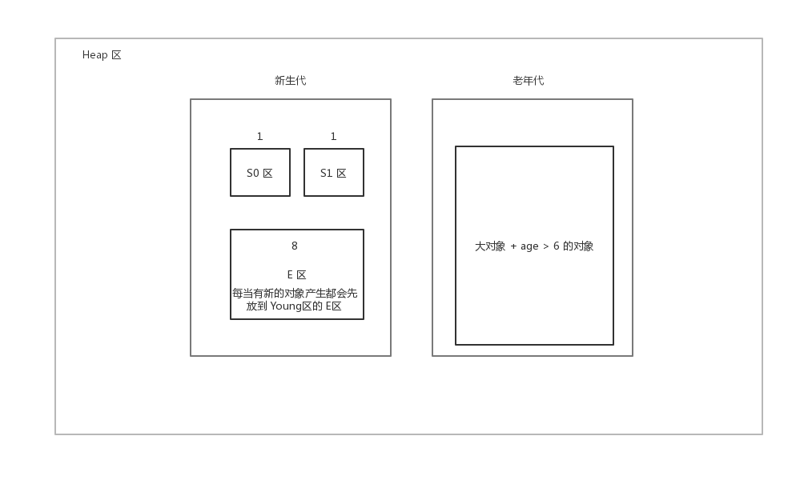

# 垃圾回收机制

[TOC]

Java 内存回收主要围绕以下流程展开:

# 一. 揭开 JVM 内存分配与回收神秘面纱

Java 的自动内存管理 **最核心的内容** 是针对 **堆中对象** 的分配与回收

Java 堆是垃圾收集器管理的主要区域, 因此也被称为 **GC(Garbage Collected Heap) 堆**, 针对与垃圾回收机制, 

Java堆空间 还可以被分为 :

* 新生代
  * Eden 空间
  * From Survivor 
  * To Survivor
* 老年代
  * Tentired 

# 二. 如何判断对象已经死亡

堆中几乎放着所有的对象实例，对堆垃圾回收前的第一步就是要判断那些对象已经死亡（即不能再被任何途径使用的对象。

## 2.1 引用计数法

给对象加一个引用计数器, 如果有一个地方引用该对象, 那么计数器加1. 如果引用实效, 那么计数器减1. 如果一个对象的引用技术器为 0, 那么表示对象不能再被使用.

**这个方法实现简单，效率高，但是目前主流的虚拟机中并没有选择这个算法来管理内存，其最主要的原因是它很难解决对象之间相互循环引用的问题**

什么是 **循环引用 ?** 

比如 ObjA 和 ObjB 相互引用对方, 但是没有了其他的引用, 这样会导致 A, B 不会被回收 For Example: 

~~~java
public class ReferenceCountingGc{
 	Object instance = null;
    public static void main(String[] args){
    	ReferenceCountingGc objA = new ReferenceCountingGc();
        ReferenceCountingGc objB = new ReferenceCountingGc();
        // 对象内部相互引用
        objA.instance = objB;
        objB.instance = objA;
        // 释放引用
        objA = null;
        objB = null;
    }
}
~~~

## 2.2 根搜索算法(可达性算法)

核心思想是通过一系列的称为 **"GC ROOTS"** 的对象作为起点 ,然后向下搜索, 所有可达的对象证明为仍然存活的对象, 反之为可回收的对象

`Java` 中可作为 `GC Root` 的对象：

- 虚拟机栈中引用的对象（本地变量表）
- 方法区中静态属性引用的对象
- 方法区中常量引用的对象
- 本地方法栈中引用的对象（Native对象）

# 三. 如何收集已死亡对象 (GC 算法)

在确定了哪些垃圾可以被回收后，垃圾收集器要做的就是进行垃圾的回收，有下面的几种算法：

## 3.1 标记-清除算法 

该算法分为 "标记" 阶段 和 "清除" 阶段. 

"标记" 阶段就是标示出我们不用的对象 然后再 "清除" 阶段进行清除

该算法实现较为简单, 直接收回, 不移动

所以, 很容易造成以下的问题 :

1. 效率低下
2. 空间回收后碎片太多

## 3.2 标记-整理算法

结合前两个的优点.

标记过程和 "标记-清除" 算法一样, 但是后续不是直接对 不可用对象进行回收

而是让所有的可用对象, 移动向另外一端, 然后直接清理掉端边界以外的内存

优点 : 解决内存碎片问题

缺点 : 代价比较大

## 3.3 复制算法

为了解决效率问题, 我们引进了 **复制算法**

我们将内存分为两块, 然后每次使用其中的一块, **每当这一块使用完之后, 就将还存活的对象复制到另一块.**

从而清除的时候可以将这一半空间整个回收, 增加了效率

- 优点 : 实现简单, 不易产生内存碎片, 每次只需要对半个区进行内存回收
- 缺点 : **内存缩减为原来的一半**, 且可存活对象越多, 效率越低

## 3.4 分代收集算法

**现在大部分虚拟机采用的算法(包括HotSpot)**

我们将堆内的内存分为不同的区域 (新生代, 老年代), 然后根据 **不同的区域采取不同的回收策略**

可以看到, **当前主流的 GC 算法中, 将Heap内存分为两个区**

* 新生代
* 老年代

### 新生代

也可以细分为三个区, 容量比为  `S0 : S1 : E = 1 : 1 : 8`  

E区 : 每次新对象的 **出生点**

**当 E区满了之后**, 会触发一次 `YoungGC`  基于的是 `复制算法`

1. 将 E + S0 区的所有存活元素 移动到 S1区, 所有对象年龄 +1
2. 清空 E + S0 区

下次 **E区满了之后**, 又会触发一次 `YoungGC` :

1. 将 E + S1 区的所有存活元素 移动到 S0区, 所有对象年龄 +1
2. 清空 E + S1 区

当检测到对象的 Age > 6 之后, 将该对象移动到 老年代中

### 老年代

老年代只有一个区域, 存放大对象 (e.g. 大数组对象, Age>6 的对象)

当老年代内存满了之后, 触发 `OldGC` , 且会伴随 `YoungGC`的到来. 因此也叫:  `fullGC` 

此时会带来 `Stop The World` , 也就是说所有的 Java 程序停止, 全面执行垃圾回收工作

`oldGC` 主要采用的为 `标记-清理/标记-整理` 的算法

# 四. 垃圾收集器 (GC Tools)

`GC tools` 就是以上手机算法的 `具体实现了`

目前还不存在一个完美的 垃圾回收器, 所以 `HotSpot` 实现了很多种垃圾收集器给我们选择

## 4.1 Serial 收集器

`单线程` 

`Stop the World` 

`新生代 : 复制` 

`老年代 : 标记 - 整理`

`简单高效`

## 4.2 ParNew 收集器

`Seriral 的多线程版本`

`Stop the World` 

`新生代 : 复制` 

`老年代 : 标记 - 整理`

## 4.3 CMS 收集器

高并发、低停顿，追求最短 `GC` 回收停顿时间，`cpu` 占用比较高，响应时间快，停顿时间短，多核 `cpu` 追求高响应时间的选择

## 4.4 G1 收集器

# 常量池垃圾回收机制

常量池的 **GC** 类似于普通变量的 **GC**

在垃圾回收的时候, 如果没有一个指向常量池的饮用, 那么该常量被 GC

# 内存泄漏与内存溢出

* 内存泄漏 (memory leak) : 指一个确定不再被使用的对象, 仍然使用的 **JVM** 空间, 这种情况叫做内存泄漏
* 内存溢出 (out of memory) OOM : 值 **JVM** 没有足够的内存去给一个新的对象进行分配了

## 内存泄漏的各种情况

1. **静态的容器 : **  静态变量在类加载的时候, 便被放到了方法区, **生命周期为 JVM 的生命周期** 从而造成了内存泄漏

2. **各种连接 : ** 如数据库连接,  网络连接, IO连接等. 这些连接如果不关闭, 则不会被 **GC** 回收, 所以如果没有显现的关闭各类连接, 会造成大量的对象无法被回收, 从而引起内存泄漏

3. **不合理的作用域 : ** 如果变量的作用域大于起使用范围, 则很有可能造成内存泄漏, 比如 :

   ~~~java
   /*
   	e.g.for 内存泄漏
   */
   public class MemLeaking{
       
       private String msg;
       
       public void receiveMsg(){
           
           readFromNet(msg);
           saveDB(msg);
       }
       
   }
   
   
   ~~~

   可以看到, **msg** 在方法内部使用完后, 就没用了, 但是由于 **MSG 的生命周期和整个对象一样, 所以在用完 msg 后还不能回收, 这就导致了 内存泄漏**

4. 改变 **HASH值**, 比如将一个对象存入了容器后, 重写了该对象的 **hashCode** 那么此时容器里面的某个对象遍永远不会被找到了, 从而造成了内存泄漏

