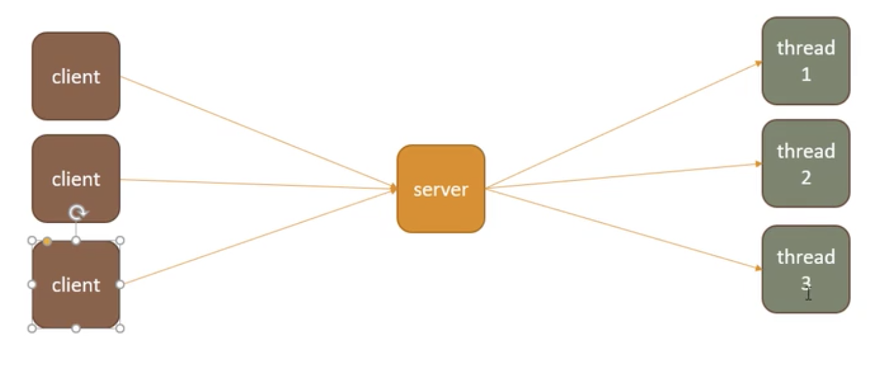
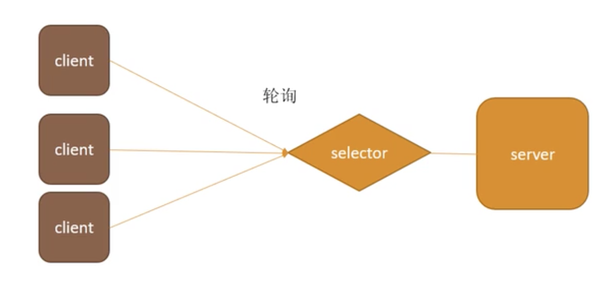

# 网络IO模型

[TOC]

# 同步异步, 阻塞非阻塞

- 同步 : 在发出一个 **功能调用** 的时候, 在没有得到结果之前, 该调用就不返回

- 异步 : 在发出一个 **功能调用** 的时候, 不管有没有结果, 先执行后续的操作. 异步的模型的复杂度远高于同步. 

  `e.g.1` : NIO 服务端通过 **状态轮询 (select)**  , **通知 (epoll)** , **回调 (epoll)** 的方式去发现结果有没有被处理完

  `e.g.2` : Netty 给另一端发送消息的时候, 并不判断消息发送的成功与否, 而是直接进行下面的步骤, 成功与否通过 **回调** 的方式去判断

- 阻塞和非阻塞是针对于线程在等待某个事的状态来说的, 如果等待的是时候, 让出 CPU 资源, 直到等待事件发生, 便为 **阻塞**

`Java 网络I/O`  的发展路线如下 :

`BIO -> NIO -> AIO -> Netty` 实际上 `Netty` 只是对 `NIO ` 的封装

> [epoll 详解](<https://www.cnblogs.com/yangyuanhu/p/11152914.html>)

# 端口与连接

注意, **并不是** 一个端口只能建立一个连接, 而是可以建立非常多的连接, 参考 `80` 端口就可以同时建立多条 **Web 请求** , 且建立连接的数量和系统内核有关系.

但是 每个链接会对应不同的 `Socket` , 然后链接也用 `Socket` 进行标示

`Socket = (源地址、源端口、目的地址、目的端口、协议号)`

每次 `server` `accept` 一个连接后, 都会返回一个 `Socket` 去标示这一个链接

## 什么是 Socket ?

Socket 本质就是一个 **文件**, 这个文件用于维护所有和 当前连接有关的信息 : 

* 数据缓冲区
* 等待队列
* ...

# BIO - 阻塞IO模型

`Java.io	`包为传统的 IO 模型, 里面就是使用了 BIO

`BIO Blocking-IO` 即为 `阻塞IO` 

使用的是 **Thread Per Client** 的模式 ,  即 每一个 `Client` 尝试连接 `server` , `server` 都会去

起一个新的 `Thread` 去处理这个请求.

`BIO` 的实现机制如下 :

* `server` 监听我们的规定 `端口号` , 如果一直没有 `clent` 连接便 一直阻塞这个 监听线程 

  阻塞语句为 : `ServerSocket.accept()`

  ~~~java
  // 
  ServerSocket ss = new ServerSocket();
  
  // 绑定端口和ip
  ss.bind(new InetSocketAddress("127.0.0.1", 8888));
  // 循环监听
  while(true){
      Socket s = ss.accept();	// 线程阻塞 -- 释放 CPU 资源
      
      // 有客户端连接, 则开一个线程处理
      // s 为一个 int 类型的值, 表示这个 C/S 连接
      new Thread(()->{
          // do somethings ...
      }).run();
  }
  ~~~

* 一旦有 `client` 请求, 则开一个线程去处理, 然后主线继续进入监听阻塞状态, 否则无法处理并发

​	

## BIO 各线程什么情况会被阻塞

`BIO` 模式下, 被阻塞的线程的情况非常的多

* 主线程 监听的时候会被阻塞
* 处理线程 处理读写 字节流的时候 会被阻塞

所有由于线程阻塞的情况, 我们的 `BIO` 的实际效率非常的低.

## BIO 的缺点

对于 BIO 模型, **每一个客户端连接都会创建一个新的线程去处理**. 首先线程的创建和销毁极其的耗费时间. 且并不是每一个连接都会去 进行读写数据操作, 如果并没有写操作, 处理这个连接的线程就会一直阻塞. 这时服务器线程变成为了无效线程. 非常的浪费服务器资源

# NIO - 单线程模型

`Java.nio` 包下的 `IO` 模型

NIO 模型引用 `selector` , 可以实现用较少的线程, 甚至只需要一个线程, 就可以去处理我们的所有的客户端的请求.

## NIO 的思想

在 BIO 中, 每一个新开的线程, 会 **阻塞的的等待 Client 发送信息**, 这是 BIO 效率低的一个非常关键的点. 

在 NIO 中, 我们 **引入了新的思想 : ** 三个关键思量

*  **ServerSocket** 此时 **不会阻塞的去接受请求**
* **有请求来了后的 Socket** 不会开一个新的线程去处理, 而是放入一个 Socket 容器
* 每次循环, 都会去检查我们的 Socket 容器里的 Socket 有没有新的数据, 如果有就处理, 否则继续循环

## NIO Java 实现

**NIO 单线程实现 多客户端连接操作**

NIO 引入一个新的 Java API : `ServerSocketChannel` 

~~~java
// 存放 SocketChannel 的容器
List<SocketChannel> list = new arrayList();

// Java 中的 NIO API
ServerSocketChannel ssc = ServerSocketChannel.open()

// 绑定 ip 已经 Port 号
ssc.bind(new InetSocketAddress(8888);

// 设置为非阻塞 IO
ssc.configureBlocking(false);
         
		
         while(true){
             
            // 非阻塞的监听
			SocketChannel socketChannel = ssc.accept();
            
             if(SocketChannel != null){
                 // 放入 SocketChannel 容器
                 list.add(SocketChannel)
             }
			
            // 设置为 非阻塞的 等待 Read or Write
            SocketChannel.configureBlocking(false);
             
             for(SocketChannel sc : list){
                 // 循环 list 看有没有 SocketChannel 可以读写数据
                 // code ...
                 
                 
             }
             
         }
~~~

在这种模型中, 我 利用 **Java app** 自己创建且维护了一个 `List` , 然后每一次都 遍历一边整个 `List` 从而得出哪些的 `socketChannel` 有数据可以读取. 也就是说 **SocketChannel 容器** 是维护在 `Java` 层的 :

# 经典的 IO 三模型

# 一. select 模型 

和上面的模型不同的是, select 模型的 socket 容器维护在  `OS` 内核中. 

在 Java 中体现就是 **SocketServerChannel + SocketServer + Selector**

* select 容器被定义与 `fd_size` 大小大约为 1024 个 `fd_id` 也就是说 **一个线程下的** select 模型同时最大只能去处理 1024 个连接. 
* 采用 遍历整个数组的的方式去判断 哪些 连接有事件发生, 极其的损耗时间

对于 `select / poll` 模型来说, 每一次轮询, 都会遍历所有的 **Socket** , 从而判断哪些通道有新的 **IO** 请求. 也就是

说在 `select / poll ` 模型, 我们处理的时间复杂度在 `O(n)` 范围.

# 二. poll 模型

poll 模型 和 Select模型 非常相似. 不同的是  **poll使用链表保存文件描述符, 也就没有了文件描述符大小的限制, 但是 select 的缺点依然存在**

# 三. epoll 模型 (Linux)

## 概述

Linux 平台才提供 epoll 模型, 其他平台没有实现

Linux 平台下 epoll 的系统调用函数有 : 

* `epoll_create ` : 用来创建一个 epoll **文件描述符** 
* `epoll_ctl ` : 用来添加/修改/删除需要监听的文件及其时间
* `epoll_wait` : 监听描述符上的, 用户感兴趣的 IO 事件

**epoll 模型为现阶段最高效的 IO 模型, 它的高效主要来自于**

* 红黑树 + 双链表的数据结构
* **回调机制 (Callback)**

不同于 `select/poll` 模型, `epoll` 模型不会去线性扫描所有的 `Socket 列表` , 取而代之的是只对 **已经做好IO装备的 Socket 进行处理** , 那么如何知道哪些 **Socket 已经做好了 IO 装备** , 一个很重要的特性就是 **回调函数** , 准备 **IO** 的 **Socket** 会通过回调函数, 告诉系统哪些 **Socket** 已经准备好, 从而让 **线程知道哪些 Socket 有 IO 请求**

## 已知的 epoll 模型应用

* Nginx
* Redis

