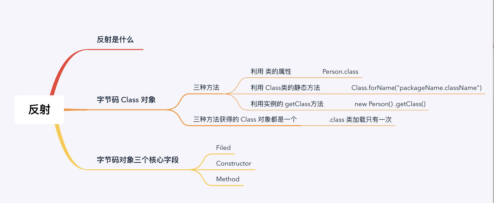
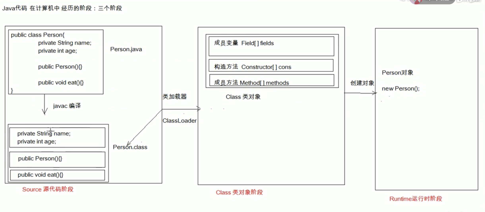

# 反射

[TOC]

# 一. 什么是反射

将 **类的各个组成部分** 封装为 对应Class对象的各个字段 行为就是反射机制

将 **每一个类 .class 文件的描述一个类型的信息 封装成一个对象 !!** 这种机制就是反射

主要分为三类 :

* 类的字段封装为 字节码 Class 类的 `Field[]` 数组
* 类的构造方法封装为 字节码 Class 类的 `Constructor[]` 数组
* 类的成员方法 封装为 字节码 `Method[]` 数组

e.g. **一个类的创建的三个阶段**

#二. 如何获得 字节码 Class 对象

对应的以上三个不同的阶段, 获得字节码 Class 对象的方法也是不同的

1.  当 .class 文件还没有加载进内存的时候 

   `Class.forName("全类名")` : 手动将字节码文件加载入内存, 返回 Class 对象

2.  当 .class 文件已经被加载过内存了

   `类名.class ` 通过类名的 class 属性即可获取

3. 当 .class 文件已经被加载, 且被实例化了

   `对象.getClass()` : 主要 getClass 为 Object 对象里面定义的

~~~java
/*
	获得字节码对象的 三种方式
*/

// method 1
Class myClass1 = Class.forName("com.company.Person");

// method 2
Class myClass2 = Person.class;

// method 3
Person p = new Person();
Class myClass3 = p.getClass();

// 注意 一次程序中, 一个对象的 字节码文件都是一个 (只加载一次)
System.out.println(myClass1 == myClass2); //true
System.out.println(myClass2 == myClass3); // true
~~~

# 三. 使用 Class 对象

~~~java
/*
	假设一下的代码对 Person 对象操作
*/
Person{
    public String name;
    public int age;
    private double saving;

    Person(String name, int age){
        this.name = name;
        this.age = age;
    }
    
    public void MyName(){
        S.O.P("my name is : " + name);
    }
    
}
~~~

## 3.1 获得类的成员变量们

* `getFields()`  : 只获得 `public` 修饰的 `成员变量`

~~~java
/*
    获得类 public 成员变量相关的方法
    Field[] getFields();
    Field getFields(String name);

    return Field 对象
*/
// 获取所有 public 修饰的成员变量
Class.getFields(); 

// 获得指定名称的 Public 修饰的成员变量
Class.getFields(fieldName);
~~~

~~~java
/*
	Field 对象用法
*/
Field a = Person.class.getFields("name")
    
// 使用 Field 对象对 对象的字段进行赋值

Person p = new Person("fz", 18);
// 获得 a 字段的值
S.o.p(a.get(p)) // 'fz	'
~~~

* `getDeclareFields() ` : 获得所有的 `成员变量`

~~~java
/*
	获得所有的 成员变量
	Field[] getDeclareFields();
	Field getDeclareFields(String name);
*/

// 通过这种方法 可以获得 类的私有方法
Filed Saving = Pseron.class.getDeclareFields("Saving");
~~~

`setAccessible(true) ` : 暴力反射

~~~java
// 获得 Saving 之后, 但是我们无法访问, 因为它是私有的
Person p = new Person();

// 返回异常
Saving.get(p);

// 通过 setAccessible(true) 来忽略访问权限
setAccessible(true);
Saving.get(p);
~~~

## 3.2 获得类的构造函数们

* `getConstructor()` : 获得类的构造函数 

~~~java
/*
	只获得 public
	Constructor<T>[] getConstructor ()
	Constructor<T> getConstructor(类<?>... parameterTypes)
		
	获得所有
	Constructor<T>[] getDeclaredConstructor ()
	Constructor<T> getDeclaredConstructor(类<?>... parameterTypes)
	
	
	return Constructor 类
*/

// 获得 字节码 对象
Class PersonClass = Person.class;

// 传递一个 构造器的参数列表
Constructor c = PersonClass.getConstructor(String.class, int.class);
~~~

* 利用 `Constructor类` 直接创建一个 Person 对象

~~~java
/*
	Constructor 类 可以用来创建 相应对象
	
	Object Constructor.newInstance();
*/
Object person = c.newInstance("fz", 12);
~~~

## 3.3 获得类的成员方法们

* `getMethod(String name)`

  ~~~java
  /*
  	只获得 Public 方法
  	Method[] getMethod()
  	Method getMethod(String MethodName, 类<?>...parameterTypes...)
  	
  	获得所有的方法
      Method[] getDeclaredMethod()
  	Method getDeclaredMethod(String MethodName, 类<?>...parameterType)
  */
  ~~~

* 利用 `Method对象` 可以执行该方法

  ~~~java
  Method m = PersonClass.getMethod("myName");
  
  
  // 使用 invoke 方法 执行方法
  Person p = new Person();
  
  // 执行
  m.invoke(p)
  ~~~

