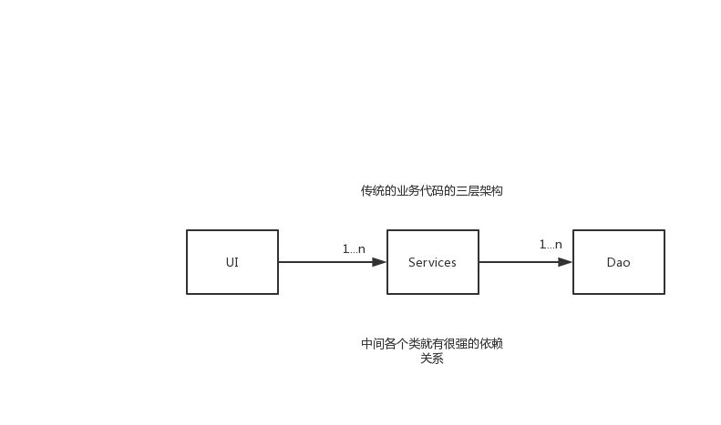
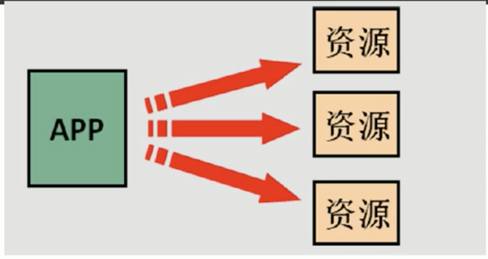
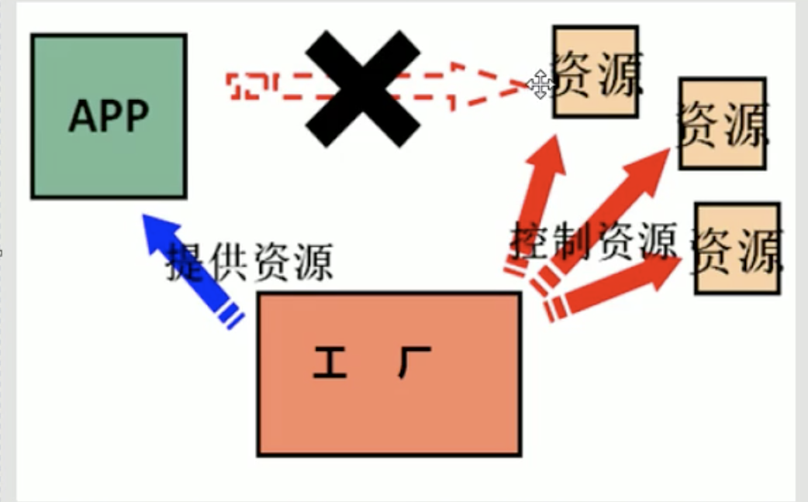

# Spring

[TOC]

# 一. 概述

# 二 .IOC 控制反转原理

`IOC` :  控制反转, 指创建对象的权利交给对象 .包括了 `依赖注入` 和 `依赖查找`	

IOC 的主要作用是用来 **减少** 我们的项目给类之间的依赖的, **借助于“第三方”实现具有依赖关系的对象之间的解耦**如下图：

## 2.1 传统项目上的依赖关系

例如 **传统MVC架构** 下的一个项目 :

以一个 `Account` `Save` 流程来看 : 

各个层次的数据类之间有很强的依赖关系. 为了减少我们的这种依赖关系, 我们引入 `工厂模式` 去构建一个 `BeanFoctry`, 达到 `松耦合` 的目的

## 2.2 工厂模式松耦合

利用 `Beans` 工厂 `配置 + 反射` 的机制 可以创建任何的类

基本的思路就是 : 作为一个中间工厂, 可以实例化各个类, 使用的时候, 只需要传入类名, 则可以实现对对应类的实例化. 

~~~java
package factory;

/* 创建一个Bean对象的工厂 */
/* Bean 就是可重用组建的意思 */

import java.io.InputStream;
import java.util.HashMap;
import java.util.Map;
import java.util.Properties;

/*
*       这个类主要工作就是用于创建我们的 Service 和 Dao 对象的， 创建步骤如下：
*       1. 需要一个配置文件来配置我们的 Service 和 dao
*       2. 通过 反射机制 来创建我们的反射对象
*
*       配置文件可以是 : xml or properties
**/
public class BeanFactory {

    // 定义一个 Properties 对象
    private static Properties props;

    // 一个静态 Map 存放我们需要创建的 对象
    // 将我们的程序设计为 单例
    private static Map<String, Object> beans = new HashMap<String, Object>();

    // 使用 静态代码块为 Properties 赋值
    static {

        try {
            props = new Properties();
            // 创建一个 字节流读取 对象
            InputStream is = BeanFactory.class.getClassLoader().getResourceAsStream("bean.properties");
            // 获得 properties 文件流对象
            props.load(is);
//            Enumeration<String> keys =  props.keys();

        }catch (Exception e){
            throw new ExceptionInInitializerError("初始化 pro 失败");
        }

    }

    // 通过 className 来返回一个 class 实例
    public static Object getBean(String className){

        Object bean = null;
        try {
            String beanPath = props.getProperty(className);

            // 通过反射的机制 获得一个类的实例
            if(!beans.containsKey(className)){
                beans.put(className, Class.forName(beanPath).newInstance());
            }

            bean = beans.get(className);
        }catch (Exception e){
            e.printStackTrace();
        }
        return bean;

    }

}

~~~

所以我们加入工厂之后松耦合了 Client 和 资源的依赖关系 如下:

 无工厂

有工厂

## 2.3 Spring IOC 容器

根据以上的内容, 我们 `Spring` 框架就是采用

# 三. Bean对象创建方式

## 3.1 默认构造函数创建

在 `Spring` 配置文件, 配置 `id` 和 `class` 后, 且没有其他属性, 则是使用默认构造函数创建

~~~xml
<bean id='AccountService' class='AccountService的全路径' ></bean>
~~~

**注意** 此时如果没有 类默认构造函数, 那么会创建失败

## 3.2 使用工厂中的方法创建类

我们需要创建的 类是由 工厂创建, 我们无法直接创建

~~~java
class InstanceFactory{
    
    // 通过工厂创建 MyClass类
    public MyClass getMyClassInstance(){
        return new MyClass();
    }
}
~~~

这种情况下  我们需要 指定 `factor-bean` 和 `factor-method` 两个属性

~~~xml
<bean id="InstanceFactory" class"FullPath_InstanceFactory"></bean>
<bean id="MyClass" factor-bean="InstanceFactory" factor-method="getMyClassInstance"></bean>
~~~

## 3.3 使用工厂中的静态方法创建类

如果此时为 `静态工厂` : 

~~~java
class InstanceFactory{
    
    // 通过工厂创建 MyClass类
    public static MyClass getMyClassInstance(){
        return new MyClass();
    }
}
~~~

此时直接在一个 `bean`标签写 `factory-method` 代表此时的 `factory-method` 为一个 静态方法

~~~xml
<bean id="MyClass" class"FullPath_InstanceFactory" factory-method="getMyClassInstance"></bean>
~~~

# 四. Bean 的作用范围 

通常情况下, `Bean ` 创建的一般都是 `单例` 的  :

~~~java
AccountService as1 = ac.getBean("accountService");
AccountService as2 = ac.getBean("accountService");

System.out.println(as1 == as2); // true
~~~

如果想调整它的作用范围, 那么我们可以利用 `scope` 属性去修改

`scope` 可取值如下 :

* `singleton`  : 单例, 也是默认方式
* `prototype`  : 多例
* `request` : 作用于 web 应用的 请求范围
* `session ` : 作用于 web 应用的 会话范围
* `global-session` : 作用于 **集群的** 会话范围

~~~xml
<!-- 默认为单例 -->
<bean ... scope = "singleton"></bean>

<!-- 多例 -->
<bean ... scope = "prototype"></bean>
~~~

# 五. Bean 生命周期

## 5.1 单例对象

`出生` :  **当容器创建的时候, 对象出生**

`活着` :  只要容器还在, 那么一直存活

`死亡` :  随着容器的销毁被销毁

也就是说, 单例对象的 生命周期 == 容器生命周期

## 5.2 多例对象

`出生` : **当我们使用对象的时候, Spring才会创建一个对象**

`活着` :  对象使用则会活着

`死亡` :  使用 **JVM 的 GC** 回收

# 六. 依赖注入

**IOC的作用只是降低耦合, 但是还是有 依赖的存在**

依赖就是当前 `Bean` 里面封装的其他类型变量

## 6.1 什么是依赖注入

在当前类中需要用到其他类的对象 :

~~~java
Class car{
    // 则说明 car 和 wheel 之间有依赖关系
    public wheel w = new wheel();
    
	// code ...
}
~~~

我们将这种 依赖关系, 依然交给 `Spring` 维护

依赖关系的维护 就叫做 : 依赖注入

## 6.2 依赖注入的 三类 数据类型

* 基本类型 和 String
* 其他的 bean 类型
* 复杂类型 e.g : `数组` , `集合` , `Map`...

~~~java
class Person{
    
    //.. 如此的成员变量则需要实现依赖著注入
    public String Name;
	public Date BirthDay;
    public Integer age;
        
    
}
~~~

## 6.3 依赖注入的 三种方式 

* 构造函数直接注入
* 🌟 set 方法注入
* 注解方法注入

**构造函数直接注入**

~~~java
class Person{
    
    //.. 如此的成员变量则需要实现依赖著注入
    public String Name;
	public Date BirthDay;
    public Integer age;
    Person(String name, Date day, Integer age){
        this.name = Name;
        this.day = BirthDay;
        this.age = age;
    }
}
~~~

如果构造函数带有了传参, 那么我们需要在对应的 `xml`  的 `<constructor-arg></constructor-arg> `标签进行说明

~~~xml
<!-- 
constructor-arg 可以带有的属性 :
	type  : 构造函数传递参数类型
	index : 指定索引 (从 0 开始)
	🌟(最常用) name  : 指定给构造函数中指定的名称的传参数赋值
	===================(以上三个属性 给哪个参数赋值)==========================
	value : 用于提供基本类型,String类型的数据
	ref :	用于指定其他的 Bean 类型的数据 (需要在 IoC核心容器中出现过的 Bean 对象)
-->
<bean id="person" class="FullPath_Person">
	<constructor-arg name="name" value="fz"></constructor-arg>
    
    
    <!-- Spring 可以直接将 "18" 装化为 Integer -->
    <constructor-arg name="age" value="18"></constructor-arg>
    
    
    <!-- 此时的day为一个日期对象, 则不能直接用字符串表示了-->
    <!-- 此时我们再反射创建一个 Date 对象, 然后用 ref属性引用-->
    <constructor-arg name="day" ref="now"></constructor-arg>
</bean>

<bean id="now" class="java.util.Date"></bean>
~~~

构造函数 **优势** :

在获取bean对象, 注入数据是必须的, 否则无法创建成功

构造函数 **劣势** :

如果创建对象时候, 如果不需要提供数据初始化的时候, 我们也必须给它注入值

🌟 **set 方法的注入**

此时 **构造函数还是默认构造函数** , 我们的 **赋值操作** 放在 对象的成员函数里

~~~java
class Person{
    //.. 如此的成员变量则需要实现依赖著注入
    public String Name;
	public Date BirthDay;
    public Integer age;
        
    // 构造函数还是 隐式 调用
    
    // 用 set成员函数的模式去给成员赋值
    public void setMyName(String name){
        this.Name = name;
    }
    public void setMyBirthDay(Date day){
        this.BirthDay = day;
    }
    public void setMyAge(Integer age){
        this.age = age;
    }
}

~~~

此时的 `xml` 便可以用 `property` 标签来注入依赖

~~~xml
<bean id="now" class="java.util.date"></bean>

<bean id="Person" class="FullPath_Person">
    <!-- 此时 name 为Person里面成员 set函数 的名称-->
	<property name="MyName" value="fz"></property>
	<property name="MyBirthDay" ref="now"></property>
    <property name="MyAge" value="18"></property>
</bean>
~~~

此时 `property` 标签 不同于 构造函数,  可以自定义给需要赋值的 变量赋值 ,拥有更大的灵活性 !!

## 6.4 两个 bean 相互依赖的注入问题

如果是通过get,set 注入就不会有问题 

如果是通过构造函数注入，SPRING就会报循环引用注入出错 

## 6.5 复杂类型的注入问题

复杂类型包括 我们常用的 `Java 容器`, `Java 数组`

对于 **复杂类型** 的注入, 我们还是选用 `set` 的方式

~~~java
class Person{
    //.. 如此的成员变量则需要实现依赖著注入
	public Map<String, String> my_map;
    public List my_list;
    public String[] my_string;    
    
    public setMyMap(Map<String, String> my_map){
        this.my_map = my_map;
    }
    
    public setMyList(List my_list){
        this.my_list = my_list;
    }
    
    public setMyStringArray(String[] my_string){
        this.my_string= my_string;
    }
    
}
~~~

在 `xml` 文件里面可以 :

~~~xml
<!-- 
	对于 list, array, set 注入的标签 可以互换
	
	对于 map, props 注入的标签 可以互换
-->
<bean id="person" class="FullPath_person">
    
    
	<property name="MyList">
    	<list>
        	<value>A</value>
            <value>B</value>
            <value>C</value>
        </list>
    </property>
    
    
    <property name="MyStringArray">
    	<array>
        	<value>A</value>
            <value>B</value>
            <value>C</value>
        </array>
    </property>
    
    
    <property name="MyMap">
    	<map>
        	<props key="A">1</value>	
            <props key="B">2</value>
            <props key="C">3</value>
        </map>
    </property>
    
    
</bean>
~~~

 

# 七. 容纳你的Beans

在 Spring 中实现了多个 Beans 的容器, 但是总结下 主要就是两种方式 :

* BeanFactory, 就是最简单的容器, 只提供最基础的 DI 支持
* ApplicationContext 应用上下文, 基于 BeanFactory 构建, 可以在BeanFactory的基础上提供很多高级的功能.

ApplicationContext 是我们的首选, 由于大部分时候 BeanFactory 提供的功能过于简. 

有多个类实现了 ApplicationContext 接口, 大致有以下几个 : 

1. `AnnotationApplicationContext` : 从一个 `JavaConfig` 类文件中加载出 Beans
2. `ClassPathXmlApplicationContext`: 从类路径下的一个或者多个 XML 文件 中加载出 Beans
3. `FileSystemXmlApplicationContext : ` 从系统的绝对路径中的一个或者多个 XML 中加载出 Beans

实例化应用上下文类后就可以利用 `getBean("beanID")` 方法来获得一个 Bean 了

# 八. Bean 生命周期

不同于 传统的一个对象的 创建, 销毁过程 : 直接 New 实例化就可以用了, 然后回收的时候 调用 `finalize` 就被 GC 了

 一个 Bean 的生命周期要显得复杂很多 : 

