[TOC]

# 一. 基本配置

`web.xml文件`  :

~~~xml

<servlet>
    <servlet-name>dispatcher</servlet-name>
    <servlet-class>org.springframework.web.servlet.DispatcherServlet</servlet-class>
    <!-- 定义和我们的SpringMVC.xml 绑定 -->
    <init-param>
        <param-name>contextConfigLocation</param-name>
        <param-value>classpath:springMVC.xml</param-value>
    </init-param>
    <load-on-startup>1</load-on-startup>
</servlet>

<!-- 配置拦截地址的通配符 即为所有 /* 形式的都被拦截 -->
<servlet-mapping>
    <servlet-name>dispatcher</servlet-name>
    <url-pattern>/*</url-pattern>
</servlet-mapping>
~~~


`SpringMVC.xml` 配置:

~~~xml
<?xml version="1.0" encoding="UTF-8"?>
<beans xmlns="http://www.springframework.org/schema/beans"
       xmlns:xsi="http://www.w3.org/2001/XMLSchema-instance"
       xmlns:context="http://www.springframework.org/schema/context"
       xmlns:mvc="http://www.springframework.org/schema/mvc"
       xsi:schemaLocation="http://www.springframework.org/schema/beans
         http://www.springframework.org/schema/beans/spring-beans-2.5.xsd
         http://www.springframework.org/schema/mvc
         http://www.springframework.org/schema/mvc/spring-mvc-3.0.xsd
         http://www.springframework.org/schema/context
         http://www.springframework.org/schema/context/spring-context-3.0.xsd">

    <!-- 包扫描, 加入IoC容器 -->
    <context:component-scan base-package="ark.controller"></context:component-scan>

    <!-- 加入SpringMVC 注解驱动 -->
    <mvc:annotation-driven></mvc:annotation-driven>
</beans>
~~~


# 二. 控制原理


# 三. 注解


## @RequestMapping

**修饰了类的成员方法** 

**修饰类**

规定为对外访问的 **虚拟路径**

参数 : `value` 定义为对外的 `url`


~~~java
@Controller
@Scope("prototype")
@RequestMapping("app")
public class HomeController{
    // Hello 方法对外访问则为 Project_url/app/hello.(xml拦截格式)
    // 但是不管 xml 拦截格式是什么 RequestMapping() 都不需要管
    @RequestMapping("hello")
    public void Hello(){
        // do something
    }   
}
~~~


**注意, `Controller` 只能接受到被 `dispatchServlet类` 拦截的请求** 

如果请求没有没 `dispatchServlet` 拦截是无法转发给 `Controller` 的


## @Scope 

**只能修饰类**

参数 : 

* `prototype` 多例 `Scope(value = "prototype")` ;
* `singleton` 单例 (默认);


<hr>

**多例 :**

~~~java
@Controller
@Scope("prototype")
public class HomeController{
    @RequestMapping("hello.htm")
    public void Hello(){
        // do something
    }   
}
~~~

对于多例来说, **每当一个请求** 过来, 都会重新实例化一个新的 `HomeController` 对象




<hr>

**单例 :** 

~~~java
@Controller
@Scope("singleton")
public class HomeController{
    @RequestMapping("hello.htm")
    public void Hello(){
        // do something
    }   
}
~~~

不管多少个请求, 多只生成一个 `实例对象` , 但是后者需要等待前者调用方法完成后, 才能调用这个实例


## @RequestParam

**修饰我们的参数**

可以实现 后端接受数据 和 前端 `input : name` 的绑定 等功能

属性:

* `name` :  为需要绑定的前端 `input:name`  
* `defualtValue` : 设置这个参数的 默认值
* `require = {true, false}`  : 设置这个字段是不是必须的


<hr>

使用 `RequestParam` 前 :

~~~java
public void login(String username, String password, Integer age){
    // username, password, age 为从前端接受的数据, 需要和前端表单对应
    // code here ... 
}
~~~


<hr>

使用 `RequestParam` 后:

可以将 前端 `name=user` 的表单值 映射到 `username` 中

~~~java
public void login(@RequestParam(name = "user") String username, String password, Integer age){
    // username, password, age 为从前端接受的数据, 需要和前端表单对应
    // code here ... 
}
~~~


## @ExceptionHandler 统一异常处理

给 `Controller` 层做的 **统一** 的 异常处理机制

如果在 `Controller` 层的时候

- 没有捕获异常, 前端便会报出 `500` 错误

- 如果捕获异常, 会报出 `404` 


<hr>

**修饰某一个方法, 且只能处理当前包下的方法**

**参数**

* 指明错误类型

以下可以实现 `统一的异常处理`

这种方法便不会返回 `404` or `500`

~~~java
@ExceptionHandler(Exception.class)
class void exceptHandler(Exception e){
  	// Exception Handler code..
    e.printStackTrace();
    return "/pages/front/error.jsp";
}
~~~


<hr>


## @ControllerAdvice

**修饰一个类**

理解为所有包下类的 **切面**


e.g. : 

新建一个包, 然后写一个 `统一工程异常处理对象` , 实现全局的 `异常处理`

**注意还是需要扫描这个包**

~~~java
@ControllerAdvice
public class GlobalExceptionHandler{
 	
    @ExceptionHandler(Exception.class)
    public String exceptHand(Exception){
     	// deal here   
    }
}
~~~


## @ResponseBody

需要给此注解添加 注解驱动

```xml
<!-- 加入SpringMVC 注解驱动 -->
<mvc:annotation-driven></mvc:annotation-driven>
```

**规定此方法的 `return` 方式为给 客户端的响应** 响应的数据格式有 **很多种类型**, 非常的方便.


以下的类型返回不用引入新的 `jar` 包

<hr>

* `String` 类型

    ~~~java
    @RequestMapping('hello')
    @ResponseBody
    public String hello(){

        // 此种方式就会给浏览器端 返回一个 String 字符串  
        // 如果不加的话, 默认会 return 是转发页面 而不是给浏览器响应
        return "hello world";
    }
    ~~~

*  `boolean` 类型

  ~~~java
  @RequestMapping('hello')
  @ResponseBody
  public boolean hello(){
      return true;
  }
  ~~~

* `int` 类型

  ~~~java
  @RequestMapping('hello')
  @ResponseBody
  public int hello(){
      return 10;
  }
  ~~~


导入新的 `jar` 包, 可以转化 **各种复杂类型** 到 `json`

<hr>

* `实体类` 

  ~~~java
  @RequestMapping('user')
  @ResponseBody
  public User beanToJson(){
      User user = new User();
      user.setUsername("fz");
      user.setAge(20);
      return user;
  }
  ~~~

  ~~~json
  {
      "username" : "fz",
      "age" : 20
  }
  ~~~


* `Map类`

  ~~~java
  @RequestMapping('map')
  @ResponseBody
  public map mapToJson(){
  	Map<String, Object> map = new HashMap<>();
      map.put("java", 80F);
      map.put("springMVC", 100F);
      return map;
  }
  ~~~

  ~~~json
  {
      "java" : 80.0,
      "springMVC" : 100
  }
  ~~~


* `List类` :

  ~~~java
  @RequestMapping('list')
  @ResponseBody
  public List mapToJson(){
  	List<int> list = new ArrayList<>();
  	list.add(1);
      list.add(2)l
      return list;
  }
  ~~~

  ~~~json
  [
      1,
      2
  ]
  ~~~


* 各种 `复杂类型的组合类型` : e.g. `List<Map<Stting, Object>>` , ....


## @ResponseBody 无效 bug

需要 `web.xml` 的 `dispatchServlet` 拦截类型里不要以 `*.htm`  结尾

~~~xml
<servlet-mapping>
    <servlet-name>dispatcher</servlet-name>
    
    <!-- 有bug!!!!!! 
    <url-pattern>*.htm</url-pattern>
    -->
    
    <!-- 无bug -->
    <url-pattern>*.shtml</url-pattern>
</servlet-mapping>
~~~


# 四. 重定向 与 转发

> [重定向和转发的区别](<https://www.jianshu.com/p/f21a245d26ed>)

转发为内部操作,  Client 端地址不会改变

重定向为外部操作, Client 端地址自动改变


**有两种方法** 

* `HttpServletRequest` 传统的的方式 转发 & 重定向 

~~~java
// 注意 HttpServletRequest, HttpServletResponse 需要导入 tomcat 下的 servlet jar包
public void test1(String user, HttpServletRequest request, HttpServletResponse response){
    if("admin".equals(user)){
     
        // 转发:
        request.getRequestDisptcher("/pages/...").forward(request, response);
        
        // 重定向:
        // 先动态获取工程路径
        String basePath = request.getContextPath();
        request.sendRedirect(basePath+"/pages/...");
        
    }else{
        
        
    }
}
~~~


* 使用 `SpringMVC` 提供的方法 :

在 `SpringMVC` 里面使用 `String` 的返回类型, 一般都是默认为 `重定向` or `转发`

~~~java
/*
	注意返回值为 String
	SpringMVC 重定向则不需要接工程名了
*/
public String test1(String user){
    // 重定向:
    // 直接 return 重定向
    return "redirect:/pages/...";
}
~~~

~~~java
public String test2(String user){
    // 转发:
    return "forward:/pages/...";
    
    // SpringMVC 默认为 转发, 可以不用写 forwoads
    return "/pages/...";
}
~~~


# 五. 视图


## 视图解析器配置

**试图解析只对 转发 有效**

前缀 与 后缀 的配置 `SpringMVC.xml`: 

~~~xml
<!-- 自动拼接视图的 前缀和后缀 -->
<!-- 视图解析器 -->
<bean id="InternalResourceViewResolver" class="XXX.InternalResourceViewResolver">
<!-- 配置前缀 & 后缀-->
<property name="prefix" value="/pages/front/"></property>
<property name="suffix" value=".jsp"></property>
</bean>
~~~

然后我们再进行 `转发` 工作

~~~java
public String hello(){
    // 自动 转发到 "/pages/front/welecome.jsp" 下
    return "welecome";
}
~~~


## 过滤器解决中文乱码

我们通过过滤器可以拦截在 `Clent` 和 `tomcat` 之间的请求, 然后做相关的工作


### 传统解决方式

实现上, 我们可以新建一个 `Package` 里面实现一个 `过滤器类 ` 去专门处理乱码问题

~~~java
/*
	首先继承 Filter 接口
*/
public class EncodingFilter implements Filter{
    
    // 实现 doFilter 方法
    public void doFilter(ServletRequest request, ServletResponse response, FilterChain chain) throws IOException, ServeletException{
        request.setCharacterEncoding("utf-8");
        response.setCharacterEncoding("utf-8");
        response.setContentType("text/html;charset=utf-8");
        
        // 放行请求
        chain.doFilter(request, response);
    }
    
    
}
~~~


然后再 `web.xml` 下配置过滤器:

~~~xml
<!-- 配置过滤器 -->
<filter>
	<filter-name>encodingFilter</filter-name>
	<filter-class>full_path</filter-class>
</filter>
<filter-mapping>
	<filter-name>encodingFilter</filter-name>
    <!-- 全部过滤 -->
	<url-pattern>/*</url-pattern>
</filter-mapping>


<!-- 过滤器在servlet前面 -->
<servlet>
	...
</servlet>
~~~


### SpringMVC 解决方式

SpringMVC 帮我们已经写好了 `Filter类` , 从而我们可以不同去重新写这个类实现

只需要在 `web.xml` 里面配置即可

~~~xml
<!-- 配置过滤器 -->
<filter>
	<filter-name>encodingFilter</filter-name>
    <!-- 替换为 SpringMVC 写发 -->
	<filter-class>org.spring.XXX.filter.CharacterEncodingFilter</filter-class>
    <!-- 初始化方法, 可以重新定义 字符类型-->
    <!-- 硬编码变为了软编码-->
    <inti-param>
    	<param-name>encoding</param-name>
        <param-value>utf-8</param-value>
    </inti-param>
</filter>
<filter-mapping>
	<filter-name>encodingFilter</filter-name>
    <!-- 全部过滤 -->
	<url-pattern>/*</url-pattern>
</filter-mapping>


<!-- 过滤器在servlet前面 -->
<servlet>
	...
</servlet>
~~~


# 六. SpringMVC 给页面带数据

## 通过 Request 域方式

~~~java
/*
	其实还是原始的方式
*/
public String requestData(String usr, HttpServletRequest request){
   	
    // usr 变量存入 usr 域
    request.setAttribute("usr", usr);
	
    return "/pages/front/success.jsp";
}
~~~


~~~jsp
jsp 文件

<body>
<!-- 通过Request取数据-->
    ${requestScope.usr}
    or 
    ${usr}
</body>
~~~


## 通过 Model 传递数据

~~~java
/*
	其实这里的 model 里面封装了 request 类
*/
public String requestData(String usr, Model model){
   	
    // usr 变量存入 usr 域
    model.addAttribute("usr", usr);
	
    return "/pages/front/success.jsp";
}
~~~

~~~jsp
jsp 文件
<!-- 取法和request一样 -->
<body>
<!-- 通过model取数据-->
    ${requestScope.usr}
    or 
    ${usr}
</body>
~~~


##通过 Map 集合带数据 🌟 

~~~java
/*
	Map 最后还是保存到 Request 里面
*/

public String requestData(String usr, map<String, Object> myMap){
   	
    // 和 map 存储一样
	myMap.put("username", usr);
    
    return "/pages/front/success.jsp";
}
~~~

~~~jsp
jsp 文件
<!-- 取法和 request 也是一样 -->
<body>
<!-- 通过 map 取数据-->
    ${requestScope.usr}
    or 
    ${usr}
</body>
~~~


# 七. SpringMVC 处理 json

`json` 是现在通信的很常用的数据格式.


