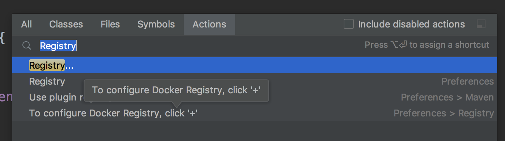

# Spring-plugins

介绍 Spring 技术群中好用的一些插件

# 一. Devtools 热部署

## 安装

~~~xml
<dependency>
    <groupId>org.springframework.boot</groupId>
    <artifactId>spring-boot-devtools</artifactId>
    <scope>runtime</scope>
</dependency>
~~~

## 使用步骤

1. `idea` 中需要开启自动编译的选项

   `preferences -> Build, Execution, Deployment -> Compiler`  将右边的选项打勾

2. `idea` 中输出 `command + shift + A` 搜索 Registry

   

3. 然后选中允许热部署

   

