# 多线程

[TOC]

## 一. 进程和线程

### 进程

进程是 **资源分配** 的基本单位

进程不直接执行, 而只是获得分配计算机的相关资源


### 线程

线程是 **独立调度** 的基本单位

而线程是在进程的资源上进行直接执行的一个基本控制单元, 也可以被称为 **执行情景**, **执行路径**

一个进程至少需要包括一个线程, 也可以包括多个线程, 即多个执行路径. 且多个执行路径可以**并发执行**


* 一个进程可以有多个线程
* 多个线程可以共享进程的 **方法区** , **堆区**
* 每个线程有自己私有的 **VM 栈** , **本地方法栈**, **PC**

**总结：** 线程 是 进程 划分成的更小的运行单位。线程和进程最大的不同在于基本上各进程是 **独立** 的，而各线程则不一定，因为同一进程中的线程极有可能会相互影响。线程执行开销小，但不利于资源的管理和保护；而进程正相反 

* 进程资源独立易保护
* 线程共享开销小, 难维护


## 二. 使用线程

### 创建 并 启动线程

在java中使用一个线程共有如下三种方法 : 

* 实现 Runnable 接口
* 实现 Callable 接口
* 继承 Thread 类

实现 Runnable 和 Callable 接口的类只能当做一个可以在线程中运行的任务，不是真正意义上的线程，因此最后还需要通过 Thread 来调用。可以说任务是通过线程驱动从而执行的。

 


#### 继承 Thread 类的方式使用线程

其实 Thread 类也是 Runnable 的一个 Impls

~~~java
class Thread extends object implements Runnable{}
~~~

<hr>

第一步 : 定义一个类继承 Tread 类:

~~~java
/*
	java 核心语言包 lang 中封装了 thread 类
	这个类可以帮助我们开启一个新的线程
	
*/
class MyThread extends Thread{
    // code ..
}    
/*
	使用时, 我们直接实例化这个类, 再调用下面介绍的方法即可
*/
~~~

<hr>


第二步 : **覆盖** Thread 类中的 run 方法

定义一个新的线程的目的就是为了 : 让线程去帮助我们的并行的运行计算一些任务

Thread 类里面提供了 一个方法 run()

~~~java
/*
	run() 方法
	我们需要在子类里面重写这个 run 方法, 从而实现我们自定义功能的目的
*/
class MyThread extends Thread{
    
    public void run(){
        // your function here
    }
    
    /*
     特别注意, 父类的run方法 参数列表为空
     所以我们重写(覆盖)的时候, 不要添加新的参数列表
     否则 便是一个新的run方法, 而不是重写了
     
     ❌
     public void run(int i){

      }
      
    */
}   
~~~


<hr>

第三步 : 启动线程

我们启动线程, 只需要将实例化的对象去调用 父类方法 start 即可.

注意, 多次启用一个线程是非法的 !!!

~~~java
public static void main(String args[]){
    
    MyThread t1 = new MyThread();
    
    /*
    	注意start的作用是 : 
    	导致此线程开始执行; Java虚拟机调用此线程的run方法。
    */
    t1.start()
        
    // 多次启用一个线程是非法的 ❌
	// 注意次种情况会抛出异常 (主线程种抛出的!!!!) 
    // t1.start()
        
    /*
    	如果我们直接以成员方法的形式调用 run, 那么结果并不会以多线程的形式表现
    	和普通的对象方法调用无异
    */
    t1.run()
}
~~~


#### 🌟 实现 Runnable 接口的方式使用线程

~~~java
/*
	我们可以让一个类继承一个 Runnable 接口
	然后在新类中实现 Runnable 的 run方法即可
*/
public class MyThread implements Runnable{
    public viod run(){
        // code ...
    }
}

// 主程序中用调用
public static void main(String[] args){
    
    // 先声明一个我们的对象
    MyThread mt = new MyThread();
    
    // 然后利用 Thread 的构造函数, 去实现一个 runnable 的传参
    Thread t1 = new Thread(mt);
    
    // 再进行start的时候, 该线程便是直接调用的 mt 的 run 方法
    t1.start();
}
~~~


#### 实现 Callable 接口的方式使用线程

~~~java
/*

*/
public class MyThread implements Callable{
    public viod run(){
        // code ...
    }
}

// 主程序中用 
~~~


#### 实现接口 VS 继承 Thread

🌟 实现接口的方法更好, 因为 :

* Java 不支持多重继承，因此继承了 Thread 类就无法继承其它类，但是可以实现多个接口
* 类可能只要求可执行就行，**继承整个 Thread 类开销过大**


### 线程名称

查看一个 **线程的名称(字符串)** 的方法 : 

注意这个线程类不一定被开启了.

~~~java
/*
	getName() 方法
	线程名称是一个字符串可以在构造函数传递
    * 如果在构造函数传递了自定义字符串, 则线程被命名为该字符串
    * 如果没有传递, 那么线程调用默认的命名 e.g. "Thread-0"
*/
class MyThread extends Thread{
    MyThread(String name){
        super(name)
    }
}

public static void main(String args[]){
    MyThread t1 = new MyThread("FangZhou");
    
    // 获得线程名称
    // 注意, 这个线程的名称, 是一旦实例化就被分配到的, 不管这个线程有没有开启 (strat)
    t1.getName();
}

~~~


<hr>

查看一个 **正在运行(已经被开启)** 的线程类的名称:

~~~java
/*
	currentThread() 方法
	这个是一个静态的方法, 可以返回当前正在运行的线程的对象引用
*/
class MyThread extends Thread{
    public void run(){
        // code...
    }
}

public static void main(String args[]){
    MyThread t1 = new MyThread("FangZhou");
    
    // 打印出 main
	System.out.println(Thread.currentThread().getName());
}
~~~


## 三. 线程运行状态

~~~java
/*
	runable <=> TimeWaiting 调用sleep(time)函数, time规定了睡眠时间, 时间到了线程自动变为运行态
	runable <=> waiting 
				调用 wait() 函数, 让线程进入 waiting 态, 且不会自动切回
				调用 notify() , 让线程可以从 waiting 态切回 运行态
*/
~~~


### 新建 New

创建了线程后还未启动

<hr>

### 可运行态 Runnable

* 可能正在运行
* 可能正在等待CPU分配时间片

可对应于CPU的两种线程状态 : Ready , Running

<hr>

### 阻塞 (Blocked)

线程需要等待一个系统的资源(e.g. I/O) 被释放, 才能继续的运行

<hr>

### 无限等待状态 (Waiting)

除非其他线程显示的进行唤醒 (notify) , 否则不会被分配CPU的时间片

<hr>

### 限期等待 (Timed Waiting)

不需要被显示的唤醒, 在一定时间过后被系统自动唤醒

<hr>

### 死亡 (Terminated)

线程有两种方式可以走向消亡 ☠️

* 完成任务自然结束
* 遇到异常而结束

<hr>


## 四. 卖票问题

利用实现 runnable 接口, 实现对 **一个实例化对象 (Ticket)** 的多线程运行问题.  **从而实现多个线程运行的过程中, 资源为同一个 (实例化对象). 而不需要将线程共享的资源声明为静态资源**

也就是说, 使用 `runnable`接口只有 `run` 方法里面被多线程调用, 属于各个线程私有, 但是该类的成员变量 如 `ticket_num` 仍然是多个线程共有


~~~java
class Ticket implements Runnable{
	private ticket_num = 100;
    public void run(){
        while(true){
            if(num < 0){
                Sale_Ticket();
            }
        }
    }
}

public static void main(String[] args){
    Ticket Tick_Impls = new Ticket();
    
    // Runnable对象作为传参数的构造线程
	Thread t1 = new Thread(Tick_Impls);
    Thread t2 = new Thread(Tick_Impls);
    Thread t3 = new Thread(Tick_Impls);
    Thread t4 = new Thread(Tick_Impls);
    
    // 运行
    // 此时 t1, t2, t3, t4 共享一个实例化对象的资源
    t1.start();
    t2.start();
    t3.start();
    t4.start();   
}

~~~


<hr>

**可能出现的问题 :** 

在多线程的使用时, 我们必须去考虑一下线程的安全问题

比如这个小例子, 售出的票可能出现负数的情况, 从而导致严重灾难




## 五. 线程安全

### 产生安全问题前提

多线程可能产生安全问提的前提 :

1. **多个线程** 在操作一个 **共享数据**
2. 操作共享数据的代码有 **多条** , 因为如果只有一条的话, 一个线程只有在这个语句执行前后才可能出现阻塞. 所以还是前后一致的


### 进程同步 (synchronized)

将操作共享数据的一段代码视为一个不可分割的整体, 即让这一段代码具有原子行, 从而当一个线程操作 共享数据的时候, 被的线程无法进入临界区.

同步关键字, 可以定义一个 : 

1. 同步代码块 : 处于这个代码块里的代码, 可以让线程操作该代码块的时候, 对这个代码块进行上锁. 

2. 同步函数 : 直接将函数声明为同步的


#### 🌟 同步代码块

~~~java
/*
	传递的对象 obj 声明成 object 类即可
	可以将 obj 看成是一个 同步锁
    synchronized (obj){
		
		// thread operator shared resource
	
    }
*/

class Ticket implements Runnable{
	private ticket_num = 100;
    object obj = new object();
    public void run(){
        while(true){
            synchronized (obj){
                // operator shared resource
                if(num < 0){
                    Sale_Ticket();
                }
            }
        }        
    }
}
~~~


**同步代码块下需要注意的前提 :**

同步过程中, 所有的线程必须使用同一个锁 🔒 , 也就是说, 锁对象 object 必须是全局的, 而不是局部的

```java
class Ticket implements Runnable{
	private ticket_num = 100;
    public void run(){
        // ❌ 不能将这个锁声明为局部的
        object obj = new object();
        while(true){
            synchronized (obj){
                // operator shared resource
                if(num < 0){
                    Sale_Ticket();
                }
            }
        }        
    }
}
```


#### 同步函数

~~~java
class bank{
    private num = 0;
/*
	用 synchronized 修饰函数, 可以不用再去定义一个obj对象锁
    但是注意同步函数, 便规定了同步范围, 且该函数内的语句全部被同步
    所以同步的时候, 需要注意同步范围
*/
/*
	使用同步函数的时候, 用的锁是固定的
	即为 this, 就是这个代码块的调用对象
*/
    
    public synchronized void add(int i){
        sum = sum + i;
        System.out.println("your blance is :" + num);
    }
}

/*
	表面看起来 run 函数只有一个语句, 不符合产生安全性前提. 
	但是 add 确实一个函数, 函数的内容也应该是线程共享的一部分
	所以还是有安全性问题发生的可能.
*/

class cust implements Runnable{
    bank b = new bank();
    
    public run(){
        for(int i=0; i<3; i++){
            b.add(100);
        }
    }
}

public static void main(String[] args[]){
    Cust c = new Cust();
    Thread t = new Thread(c);
    
    // start thread
    t.start();
}
~~~


#### 同步函数 和 同步代码块的区别

同步代码块的锁是任意的对象

同步函数的锁是固定的 this

<hr>

如果 同步函数的为 **静态的函数**, 此时同步函数的 **锁便不是 this** (静态函数里面没有 this)

~~~java
/*
	此时同步函数的锁🔒 
	是这个对象的锁是对象为: 该对象的字节码对象
	this.getClass()
*/
public static synchronized void add(int i){
    sum = sum + i;
    System.out.println("your blance is :" + num);
}
~~~


### 同步弊端

同步虽然会解决一部分的安全性的问题, 但是会降低程序的执行效率


### 多线程下单例设计模式的安全隐患

见设计模式笔记


###死锁

死锁就是, 两个及以上的线程, 相互持有对方要运行时的资源, 且都不释放自有资源的情况, 这种情况, 相互持有资源的线程被死锁.

死锁发生的前提 :

1. 至少有 **两个即以上的 共享锁**
2. 锁的利用上有 **相互嵌套** 的情况


<hr>

~~~java
/*
	一个死锁的例子
*/
package MutiThread;
class locker{

    public static final Object lockerA= new Object();
    public static final Object lockerB= new Object();

}

class DeadLock implements Runnable{

    public boolean flag;
    public DeadLock(boolean flag){
        this.flag = flag;
    }
    @Override
    public void run() {
        if(flag){
            while(true) {
                synchronized (locker.lockerA) {
                    synchronized (locker.lockerB) {
                        System.out.println("hello : " + Thread.currentThread().getName());
                    }
                }
            }

        }else{
            while (true) {
                synchronized (locker.lockerB) {
                    synchronized (locker.lockerA) {
                        System.out.println("hello : " + Thread.currentThread().getName());
                    }
                }
            }
        }
    }
}


public class DeadLockDemo {
    public static void main(String[] args){
        DeadLock d = new DeadLock(true);
        DeadLock d2 = new DeadLock(false);
        Thread t1 = new Thread(d);
        Thread t2 = new Thread(d2);

        t1.start();
        t2.start();

    }
~~~


## 六. 线程之间的协作

当多个线程可以一起工作去解决某个问题时，如果 **某些部分必须在其它部分之前完成**，那么就需要对**线程进行协调**。

注意 线程协作 不同于 线程互斥 .

**线程互斥** 更多的是保证线程之间不被彼此干扰

**线程协调** 是强调彼此之间的协调, 线性之间存在工作的次序性


