[TOC]

# 线程池概述

线程池简单来说就是一个负责 **协调, 管理** 众多 线程的一个容器.

创造出线程池这样一个容器的 **目的** 是 : 

在线程的使用中, 线程的频繁的 **创建** 或者 **销毁** 会非常占用系统时间. 所以需要线程池协调多个线程,线程池的作用包括 :

* 可以在初始化的时候, 就创建一定数量的线程, 且结束的时候不销毁而是归还, 这样可以节约大量的时间.

- 利用 线程池管理并复用线程、控 制最大并发数等。
- 实现任务线程队列缓存策略和拒绝机制。
- 实现某些与时间相关的功能，如定时执行、周期执行等。


## 线程池工作原理

- 一个存放任务的任务仓库 : 就是每生成一个任务, 便给这个仓库队列添加一个任务.
- 一些初始化的线程, 从仓库里面取得任务从而执行
- 当没有任务的时候, 线程阻塞, 有任务就唤醒


# 任务的创建方法

一个任务可以用 **两个继承接口** 表示

## Runnable 

不赘述

~~~java
class testThread implement Runnable{
	@override
    void run(){
        sout("hello world");
    }
}
~~~


## Callabe


# 并发队列

* **阻塞队列**  : 线程池利用 **阻塞队列** 队列实现

  入队 : 如果队列达到最大长度的时候, 会自动的阻塞, 一直到队列有容量空出.

  出队 : 如果队列为空, 则取线程阻塞

  在 `Java` 中表现为 `BlockQueue 接口` 

  `BlockQueue实现了很多类型的阻塞队列 : `

  ~~~java	
  /*
  	阻塞队列 : LinkedBlockingDeque
  */
  BlockQueue<String> bq = new LinkedBlockingDeque(3);
  
  
  // 注意此时的 add 操作, 还是和非阻塞对类的 add 操作一样, 队列满了会抛出异常
  bq.add("hello")
      
  // 阻塞的形式给 队列加值
  // 如果队列满, 则等待3秒的时间
  // 如果时间到了还没有添加进去, 则丢弃这个数据
  bq.offer("world", 3, TIMEUTIL.SECOND)
  ~~~


* **非阻塞队列 :** 

  入队 : 在达到队列的最大长度的时候, 非阻塞队列是不可以让数据进入队列的

  出队 : 在取数据的时候, 如果队列为空的时候, 取出的数据为空

  e.g. `ConcurrentLinkedQueue`

  ```java
  /*
  	非阻塞队列 `ConcurrentLinkedQueue`
  */
  ConcurrentLinkedQueue<String> clq = new ConcurrentLinkedQueue();
  clq.add("hello");
  clq.poll();
  ```


# ThreadPoolExecutor 类

~~~java
// jdk 封装的线程池类
ThreadPoolExecutor t = new ThreadPoolExecutor(1,3,50, TimeUnit.MILLISECONDS, new LinkBlockingQueue<Runnable>(3));
/*
    第一个参数 1 : 表示线程池的核心线程数
    第二个参数 3 : 表示线程池的最大线程数
    第三个参数, 第四个参数 : 表示时间和时间单位
    第五个参数 : 传入的阻塞队列类型
*/
~~~

下面进一步的讲解各个参数的意思 :

* 核心线程数 : 即为 **线程池初始化的时候, 初始化出来的线程的数量** , 也就是我们线程池中, 主要完成任务的线程数量

* 所有非核心线程: 在创建出来后, 执行任务之后, 都会在一定时间内被销毁

* 最大线程数 : 即为 这个线程池运行存在的最大的线程数量. 如果超过了这个数量, 那么就会拒绝执行任务

* 阻塞队列的长度 : 为所有核心线程在执行任务的时候, 可以放 `Runnable` 任务类的队列, 如果这个队列没有满, 则直接入队, 否则就会判断是否需要系统取创建一个新的线程取执行任务

* **也就是说, 如果有核心线程, 且阻塞队列没有满, 所有的任务都是核心线程执行, 否则在不大于最大线程数的情况下重新创建一个线程去执行这个任务, 且在规定的时间后去销毁**


下面为 一个用户的提交任务的线程池处理过程 :



~~~java
// e.g.
public class MyPoolExecutor {
    public static void main(String[] args) {
        // 创建线程池
        ThreadPoolExecutor t = new ThreadPoolExecutor(1,10,3, TimeUnit.SECONDS, new LinkedBlockingDeque<>(3));

        // 线程池执行任务
        for (int i=0 ;i<10; i++) t.execute(new TestThread());

        // 关闭
        t.shutdown();
    }

}

// 任务类
class TestThread implements Runnable{


    @Override
    public void run() {
        System.out.println("hello world by :" + Thread.currentThread().getName());
    }
}

~~~


# 线程池分类

**这里提到的线程池都是基于ThreadPoolExecutor实现的 **

都是基于 `JUC` 下


##newFixedThreadPool

~~~java
// 注意这种位于 JUC 下的 Executors类中 
ExecutorService es = Executors.newFixedThreadPool(3);

// newFixedThreadPool 的构造函数
public static ExecutorService newFixedThreadPool(int nThreads) {
    return new ThreadPoolExecutor(nThreads, nThreads,
                                  0L, TimeUnit.MILLISECONDS,
                                  new LinkedBlockingQueue<Runnable>());
}

// 可以看到这是一个 核心线程数 == 最大线程数的 且 阻塞队列无限长的 线程池
~~~


## newCachedThreadPool


## newSingleThreadExecutor

**单利线程池**

**只有一个线程** 去执行阻塞队列里面的任务

~~~java
// 注意这种位于 JUC 下的 Executors类中 
ExecutorService es2 = Executors.newSingleThreadExecutor();


public static ExecutorService newSingleThreadExecutor() {
    return new FinalizableDelegatedExecutorService
        (new ThreadPoolExecutor(1, 1,
                                0L, TimeUnit.MILLISECONDS,
                                new LinkedBlockingQueue<Runnable>()));
}
// 可以看到这是一个 核心线程数 == 最大线程数 == 1 且 阻塞队列无限长的 线程池
~~~


