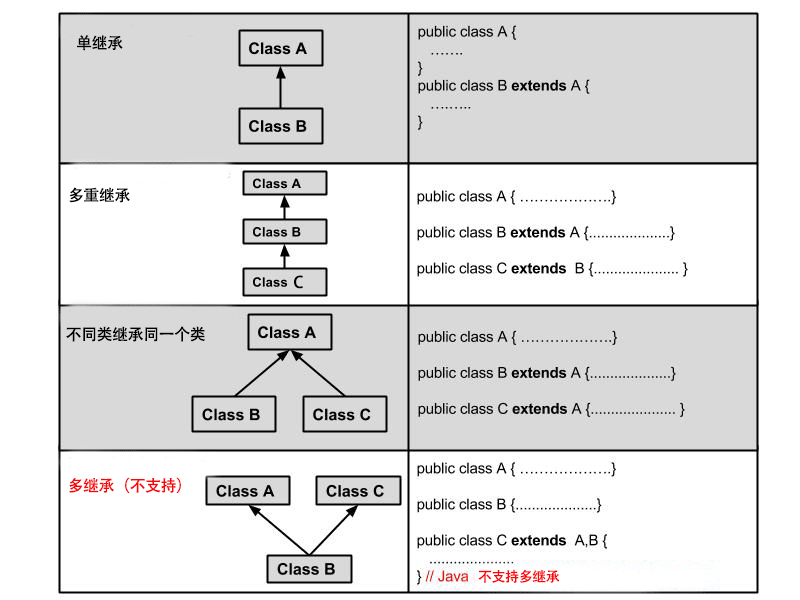
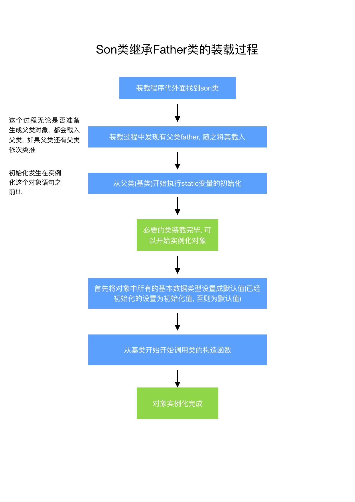

## 类再生

### 1. 类的合成

所谓类的合成就是在一个类中加入另外已经存在的类. **只需要在新类简单的置入对象的句柄即可**

例如: **一个汽车类便可以由轮子类, 门类, 窗户类等合成, 而不是选择继承的方法**

下面举一个类合成的例子

~~~java
class WaterSource{
    private String s;
    WaterSource(){
        System.out.println("WaterSource()");
        s = new String("constructed");
    }
    public String toString(){return s;}
}

public class SprinklerSystem{
    // SprinklerSystem的合成变量
    private String valve1, value2;
    WaterSource source;
    int i;
    float f;
    void print(){
        System.out.println("source :" + source); 
        ...
    }
    public static void main(){
        // 在本类的main函数中实例化本类
        SprinklerSystem x = new SprinklerSystem();
        x.print();
    }
}

~~~

几个要点 : 

1. 函数 : System.out.println("source :" + source); 可以看到这里做了对WaterSource类的字符串拼接, 但是**WaterSource类并不是字符串类** , 这个操作的可行性在于, **WaterSource类的toString方法**, 在java中, 如果希望对一个类进行字符串操作, 则必须需要在这个类中定义toString()函数, 从而可以将这个类进行字符串的处理.
2. 在前面提到过, 如果在一个类的成员变量中, 只进行了声明而未进行初始化, 对于java的八个基本数据类型(int, short, long, char, double , float, boolean, byte)会被自动的初始化. 如int成员初始化为0, 而对于非java基本数据类型, **java只会将其句柄初始化为null,而不会实例化一个对象**
3. 对于一个类的main函数 : 1. 所有的类都可以有main函数 2. 亦可以在main函数中调用该类的main函数, 但是会造成栈溢出的错误. 3. 别的类中亦可以调用这个类的main函数 4, 每一个类进过javac编译后都会生成一个.class文件, 没有mian函数的.class文件是不能被运行的

### 2. 类的继承

#### 2. 1 类继承类

需要继承的时候, **这个新类和那个旧类差不多**. 利用**extenes**关键字完成继承操作

于c++不同的地方是, java并不支持多继承, 即**一个子类有且仅有一个父类**: 

* 父类的 public & protected & 友好 成员可以被子类继承, private 成员不可以被继承
* 父类的 final 关键字代表 如果该方法被继承, 那么不可以被重写(override)

以下面的例子说明  :

~~~java
class cell{
    cell(int i){
        System.out.println("im cell");
    }
    public void print(){
        System.out.println("hi cell");
    }
}
class animal extends cell{
    animal(){
        super(1);
        System.out.println("im animal");
    }
    // override
    public void print(){
        System.out.println("hi animal");
    }
    // final 方法可以被子类调用但是不可以被重写
    final public void move(){
        System.out.println("animal move");
    }
    // private method can not be inherited
    private void private_move(){
        System.out.println("animal private move");
    }
}
class human extends animal{
    human(){
        System.out.println("im human");
    }
    // override
    public void print(){
        System.out.println("hi human");

        // super指针指向了自己的父类，调用其的函数可以为父类可以继承的所有(即private除外)
        super.move();
    }
}
~~~

几个要点 :

1. **对于构造函数**: 在构造一个子类的时候, **子类是不会继承父类的构造器的, 它是隐式的调用**. 如果父类的构造函数中带有参数, 则必须用**super指针进行显示的调用** 且执行顺序是: 父类构造 ==> 子类构造
2. **对于子类的重写函数**: 子类的**重写函数一定是父类可以继承的函数**, 且如果需要子类调用父类的对应函数, 需要使用super指针调用
3. 对于super指针指向的是子类的上一个父类, 且super指针只能去调用父类可以继承的成员

#### 2.2 类继承接口

使用implements关键字可以使得一个类继承接口, 且**使得java类具有多继承的特性**

~~~java
public interface A{}
public interface B{}

public class c implements A,B{}
~~~

### 3. 上溯造型初步

简单来说, java的子类的句柄可以转化为父类的句柄, 从而实现**传参要求为父类类型时, 传入子类对象**

~~~java
public class Uptracking {

    public static void main(String[] args) {

        piano p = new piano();
        // 传递的为子类对象句柄
        p.tune(p);
    }
}
class instrument{

    public String play(){return "instrument";}
	
    // 传递参数为instrument对象
    public void tune(instrument i){
        System.out.println(i.play());
    }
}
class piano extends instrument{
    // 如果重写了， 那么调用子类的, 否则调用父类的
    public String play(){
        return "piano";
    }
}
~~~

这样可以实现**多态化**, 即如果子类重写了父类的方法, 那么此时调用的是子类的play()函数, 否则调用的是父类的函数

**判断自己到底应该选用合成还是继承, 一个最简单的办法考虑就是是否需要从新类上溯造型回基础类**

### 4. final 关键字

final 关键词最一般的意思就是"这个东西不能改变", 应用的场合有: **数据, 方法, 类**

#### 4.1 final 数据

java 常数分为两种类型

1. **编译期常数 :**  对于编译期常数, 编译器可以将常数直接封装到需要的计算构成中, 即计算可以在**编译器就提前执行**, 从而节省运行时的一些开销. java中用于编译期常数的数据类型必须为**基本数据类型**, 这些用final关键字进行表述. **且初始化编译器常数的是时候必须给出相应的值!** 

   ~~~java
   final int I1 = 10;
   
   // static 表示I2在运行期间只有一个, 即不随对象实例化而复制很多份
   // static final 修饰的基本数据类型表示 运行期间只有一个的常数
   static final I2 = 20;
   ~~~

   * **final 和 const 作用差不多, const为java中的预留关键字, 所以一般用的是final**

2. **运行期常数 :** 

   如果**对象(基本类型之外)句柄**使用final修饰, 并**不是该对象不能再被改变, 而是该句柄不能再指向另外的对象**

   比如 : 

   ~~~java
   class demo{
       public int i = 10;
   }
   class FinalTest{
       final demo mydemo = new demo();
   }
   
   public void main(String[] args){
       FinalTest ft = new FinalTest();
       // 正确的
       ft.mydemo.i = 13;
       
       // 错误的
       ft.mydemo = new demo();
       
   }
   
   ~~~

3. **注意, 使用final 或者 static final 修饰的基本类型不一定就是编译期常数, 例如:** 

    ~~~java
    // 这两种形式的只在编译器并没有指出, 为运行期常数
    final int i1= Math.random()
    // 即不管实例化多少个对象, static final 的值有且只有一个
    static final int i2 = Math.random()
    ~~~

4. final 修饰自变量:

   * final不可以修饰未初始化的**成员变量**

     ~~~java
     class demo{
         // 这个方式编译器会报错
         public final int i;
     }
     ~~~

   * final可以修饰未初始化的自变量(即非成员变量)

     ~~~java
     public void main(String[] args){
         // 这种方式是可以的
         final int i;
     }
     ~~~

   * final可以用来修饰函数的传递参数

     ~~~java
     // 这种方式是可以的, 但是i在函数内部不可以被改变
     public int test(final int i){
     	return i+1;
     }
     ~~~

#### 4.2 final 方法

使用final关键字修饰一个方法主要有以下两个原因

* 让一个方法在程序运行过程中保持不变, **即防止继承子类改变他本来的含义**, 使得其子类不可以重写或者覆盖改方法
* **加快程序的执行效率**, 编译器可以把final方法的所有的调用都置入到“嵌入”调用里, 从而可以避免调用方法时候的一些系统开销, 当然如果方法体积太大, 性能所带来的提升就会被缩减

final关键字的使用**明确,禁止方法被覆盖, 或者代码量非常少的时候**, 才可以设置为final方法

Tips:

* **final 方法只是不能被子类所重写, 但是可以被重载**

  ~~~java
  //但是传递的变量可以是final修饰
  // private修饰的方法默认为final的， 因为他们不可能被重写
  public final int f(final int i){
      return i+1;
  }
  
  // final 方法不可以被重写， 但是可以被重载
  public final int f(int i, int j){
      return 1;
  }
  ~~~

* **private方法默认就是的final的, 所以一个private final 的方法, 效果上等同于 private**

#### 4.3 final 类

如果一类用final关键字修饰, 那么这个类就**无法被继承**, 但是其中的成员变量并没有限制, **也可以被改变**

* 一个final类中所有的方法都是final的

#### 4.4final总结

如果考虑代码的执行效率, 就会发现**只有不把任何方法设计成final, 才能使其发挥更大的作用**

java 标准库中就很少用到final关键字

* Stack 类 是从Vector 类中继承而来 
* Hashtable 没有任何的final方法

### 5.java类装载和初始化

