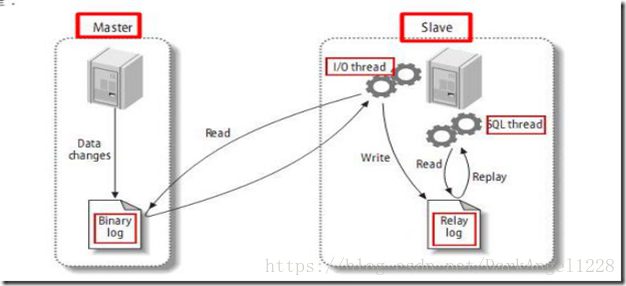

# MySQL 分布式设计

[TOC]

一般来说, 为了应对高并发的问题, MySQL 可以设计为 分布式, 也就是 **主从表设计模式** , 实现请求的 **读写分离**, 从而提高并发性能.

* 主表  : 主数据库一般是准实时的业务数据库, 用来进行 **写操作**
* 从表  : 和主数据库完全一样的数据库环境, 一般用来 进行 **读操作**

# 一. 主从复制的好处

从不同的方面来说, 有以下三个好处 : 

1. 安全性 : 数据分散存储, 可以避免单机意外事故的发生

2. 高并发 : 多库存储, 降低单机上磁盘的 I/O, 提高响应速度. e.g. 对于有些报表的系统, 前台用 master, 报表生成用 slave, 那么可以极大的提高并发量

# 二. 数据一致性原理

1. ##### 数据库有个bin-log二进制文件，记录了所有sql语句。

2. ##### 我们的目标就是把主数据库的bin-log文件的sql语句复制到从数据库。

3. ##### 然后在从数据的relay-log重做日志文件中再执行一次这些sql语句.

可以看到一共有三个线程配合工作 

1. Thread_1:  主库都创建一个线程然后发送 **binlog** 内容到从库
2. Thread_2 : 从库创建一个线程将 binlog 的文件 更新到 自己本地的 Relay log 中
3. Thread_3 : 执行刚刚更新的 SQL 语句

