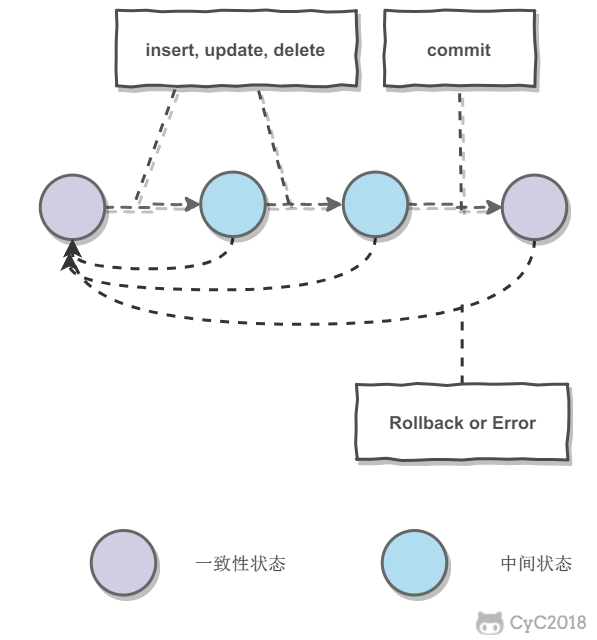
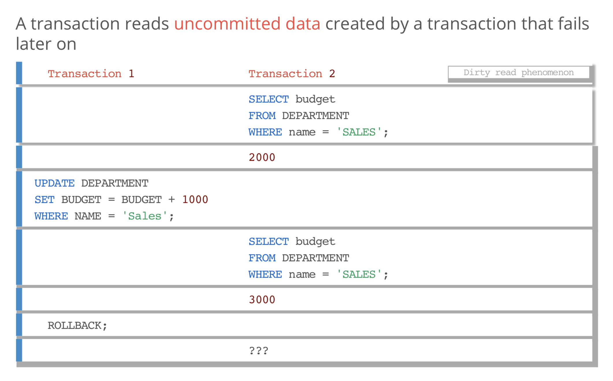
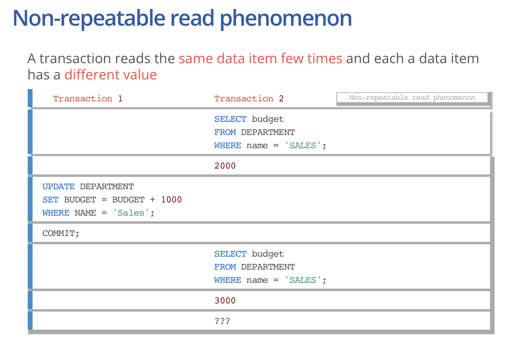
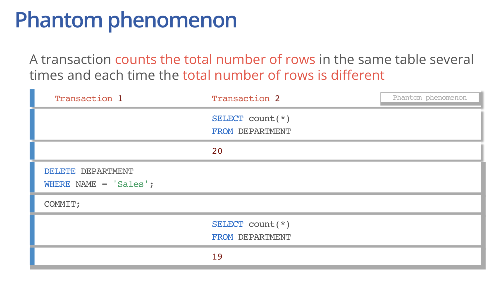

# 事务

[TOC]

# 事务的概念

可以将多个 **一条或者多条SQL语句聚合在一起, 且这些语句, 要么所有都可以正确的执行, 要么都不能执行(原子性)**

事务可以被更专业的定义为 : **事务指的是满足 ACID 特性的一组操作**

如下图, 启动事务之后, 数据库的 **相关行进入中间态**, 直到commit之后, 如果所有的都被正确执行, 才将这一系列SQL的结果提交, 如果有失败, 则执行roolback操作, 从而保证数据的一致性.

从sql表述上如下: 

~~~sql
/* 启动事务*/
start transaction;
	/*
	sql code
	...
	*/
if sql exc success 
	commit;
else 
	roolback;
~~~

# ACID

## 1. 原子性 (Atomicity)

事务被视为 **最小的不可分割的单元**, 要么事物内的SQL被全部提交, 要被全部失败则回滚

回滚操作是实现依赖于 **回滚日志** , 可以记录事务执行的操作, 失败则反向执行即可

## 2. 一致性 (Consistency)

数据库在事务的执行前后都是保持一致性的, 所有事务对一个数据的读取结果都是相同的.

## 3. 隔离性 (Isolation)

一个事务所做的修改在最终提交以前，对其它事务是不可见的。

举个例子 : 在一个事务的执行过程中, 就算此时对某一行进行了修改. 此时其他用户对这一行进行 **查询$^{[1]}$时候**

**查询的还是之前的值**, 只到事务commit后, 才能查询到新的值

## 4. 持久性 (Durability)

一旦事务提交, 就会被 **永久保存**, 即使服务器崩溃, 结果也不会丢失

实现方式 : 利用 **重做日志**

<small> [1] 实际上, MySQL的事务过程对某一行实行的写锁, 及其他用户对相关行还是可以进行读取 </small>

# AUTOCOMMIT

MySQL 默认采取了自动提交的方式, **即使不显示的 start transaction 开启一个事务**, 服务器也会将每个操作作为一个事物提交

MySQL 允许关闭自动提交模式 :

~~~sql
/* 
	关闭自动提交模式 
	一旦关闭自动提交模式, 所有的SQL语句都会被认为在同一个事务范围
	并且必须显示的对事务进行 提交 或者 回滚
*/
set autocommit = 0
~~~

在 **InnoDB based** 的数据库上, 事务是一个最小的逻辑处理单元. 默认在没有开启事物的情况下, **InnoDB 一个语句就是一个事物 (隐式的开启, 提交)**

# 数据库锁	

> [数据库锁](<https://www.cnblogs.com/leedaily/p/8378779.html>)

## 锁的粒度

数据库的锁分为三种:

* 行锁 : 表中的一行记录被锁定
* 页锁 : 这里的页指的是一个内存页的数据
* 表锁 : 整个表都被锁定

各个粒度的选择各有利弊 : 粒度越细的锁, 所占的资源越多, 但是用户的自由性越大

在选择锁的时候, 需要做锁开销和并发行的权衡

**从数据库类型上看 : **

| 数据库类型 | 支持类型         |
| ---------- | ---------------- |
| MySQL      | 行锁, 页锁, 表锁 |
| SQL Server | 行锁, 页锁, 表锁 |
| Oracle     | 仅支持 行锁      |

**从数据库引擎上看 :**

| Engine             | 支持锁类型             |
| ------------------ | ---------------------- |
| InnoDB (Mysql默认) | **行锁 (默认)** / 表锁 |
| MyISAM             | 表级锁                 |
| MEMORY             | 表级锁                 |
| BDB                | 页面锁                 |

## MyISAM 表锁

对于 **MyISAM** 表级锁有两种模式, **读锁, 写锁**

* 如果一个表被加了读锁, 那么 **不会阻塞其他用户的读操作, 但是会阻塞其他用户的写操作**

* 如果一个表被加了写锁, 那么 **会阻塞其他用户的读写操作**

## MyISAM 如何加表锁

给 **MyISAM** 添加表锁有 **两种方式**

1. 自动添加

   MyISAM 在执行一个 `select` 语句的时候, 会自动的给数据表加上一个读锁

   MyISAM 在执行 `delete, update,insert 等 ` 语句的时候, 会自动给表上一个写锁

2. 显示添加

   由于 **MyISAM 不支持事物的操作, 所以显示的添加锁一定程度上是为了模拟事物的操作**

   ~~~sql
   -- 表示给 myTable 添加一个读锁
   Lock table myTable read local
   
   select ...
   select ...
   
   Unlock table;
   ~~~

## InnoDB 锁

和 **MyISAM** 最的不同是

1. InnoDB 支持事务
2. InnoDB 支持行锁

InnoDB 实现了两种类型的行锁, **共享和排他锁** 

| 锁类型   | 功能                                                         |
| -------- | ------------------------------------------------------------ |
| 共享锁 S | 事务在读取一行数据记录时候, 会加上 S 锁, 此时再有读请求过来会被满足, 但是写请求被阻塞. 如果一个事务 A 对一个数据集上了 S 锁, 那么 事物 A 无法对数据集进行修改, 只能读相关的数据集. 且此时其他的事务可与对这个数据集上 S 锁, 但是还是无法上 X 锁 |
| 排他锁 X | 阻止其他事物取得相同数据集的 S, X 锁. 如果事务 A 对于一个数据集上了 X 锁, 那么会阻止其他事务上 S, X 锁 |

注意一个关键点 : 

**InnoDB 下 : ** 

 `update, insert, delete` 等语句都会默认的给要操作的数据集加上 X 锁 

但是一般的 `select` 语句是默 认不加锁的, **是 S, X 锁都不加**. 也就是说, 在一个数据集被加了 X, S 锁的情况下, 一般的 `select` 语句照样可以执行

**但是不走一般情况`select` 语句也是可以加锁的**

* **select 语句加 S 锁 : **  `select * from table lock in share mode`
* **select 语句加 X 锁 : ** `select * from table for update`

## 隐式和显式锁定

# 隔离级别

| 隔离级别         | 描述                                                         | 导致问题                                                     |
| ---------------- | ------------------------------------------------------------ | ------------------------------------------------------------ |
| READ-UNCOMMITTED | 事务之间可以读取 **未提交** 的数据。                         | 脏读： 事务1读取了事务2对某个字段 **未提交的修改**, 然后事务2 Rollback, 此时事务1使用的数据即为脏数据 |
| READ-COMMITTED   | 事务之间只能读取 **提交** 的数据。                           | 不可重读：事务1, 读取事物2提交前后的字段结果不一样           |
| REPEATABLE-READ  | 解决了不可重复度的问题，保证同一个事务内读取同一数据结果一样。 | 幻读：事务1执行时，事务2在该范围插入新的记录，从而导致幻行。 |
| SERIALIZABLE     | 强制事务串行执行，避免幻读的问题。                           | 过度使用锁，导致执行时间长，很少用这种级别。                 |

第三种 REPEATABLE-READ 可重复读的隔离级别为 MySQL 的默认隔离级别。

一个事务便可以看成一个线程, 和并发程序一样, 多事务并行的话, 可能会造成下列一些问题 :

* **脏读（Dirty read）** :  一个事物对一个数据进行了修改, **但是还没有提交的时候**, 此时另一个事务读取了这个 **还没有提交的** 的数据, 从而形成了不正确的操作 e.g.

  

* **丢失修改（Lost to modify)** : 两个事务同时对一个数据进行了修改, 便可能造成其中一个修改丢失 .e.g. 事务一 执行 A = A +1 的时候, 事务B执行 A = A + 10, 由于两个事务读取的 A 一样, 从而, 最后会丢失一次修改

* **不可重复读（Unrepeatableread）:** 值在一个事务内, 多次读取一个数据, 在前一次读取后, 另一个事务对这个数据进行了修改, 从而下一次读取造成了 **两次读取不一致的** 的情况 e.g.

  

* **幻读（Phantom read）:** 在一个 事务T1 读取多行数据的时候, 另一个事务T2 在对这多行数据进行了 **删除 OR 新增** , 从而事务T1 再次读取的时候 便发现可原来并不存在的数据

**不可重复度和幻读区别：**

不可重复读的重点是 **修改**，幻读的重点在于 **新增或者删除**

~~~
例1（同样的条件, 你读取过的数据, 再次读取出来发现值不一样了 ）：事务1中的A先生读取自己的工资为 1000的操作还没完成，事务2中的B先生就修改了A的工资为2000，导 致A再读自己的工资时工资变为 2000；这就是不可重复读。

例2（同样的条件, 第1次和第2次读出来的记录数不一样 ）：假某工资单表中工资大于3000的有4人，事务1读取了所有工资大于3000的人，共查到4条记录，这时事务2 又插入了一条工资大于3000的记录，事务1再次读取时查到的记录就变为了5条，这样就导致了幻读。
~~~

 