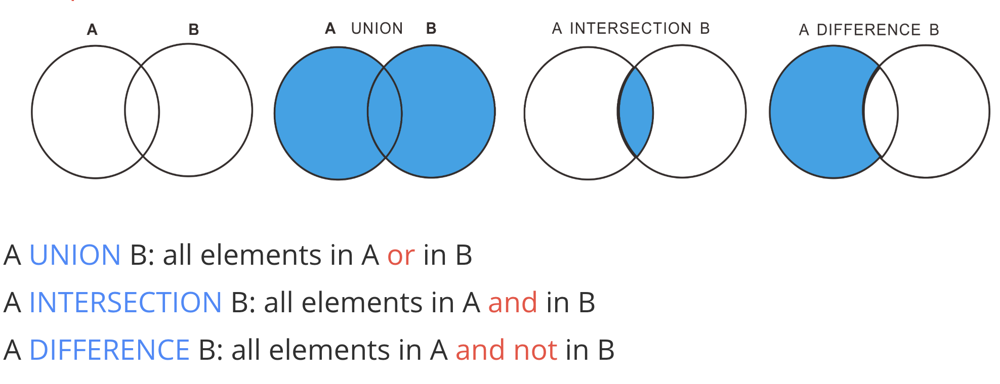

## 使用集合

和数学概念一样, 集合操作包括三种

* 并操作 union
* 交操作 intersect
* 差操作 except

特别注意, 在MySQL上(版本4.0及以上), 只实现了集合的并操作

### 并操作

* union  : 会自动去除重复的项
* union all : **不会去除重复**

可以求两个集合的并集, 所以 **union** 操作的两端必须是 **集合**

~~~sql
/*
select ...
union
select ...
*/
~~~

两个集合可以使用并操作的必要条件是 :

* 两个集合有相同数量的列
* 取并操作以后, 列的名字为 **前一个数据集规定的名字**

### 交操作 intersect

* intersect (去除了交集中两个集合的重复项)
* intersect all  (没有去除重复项)

可以返回两个 **集合的** 交集, 用法和 union 类似

### 差操作 except

* except
* except all 

