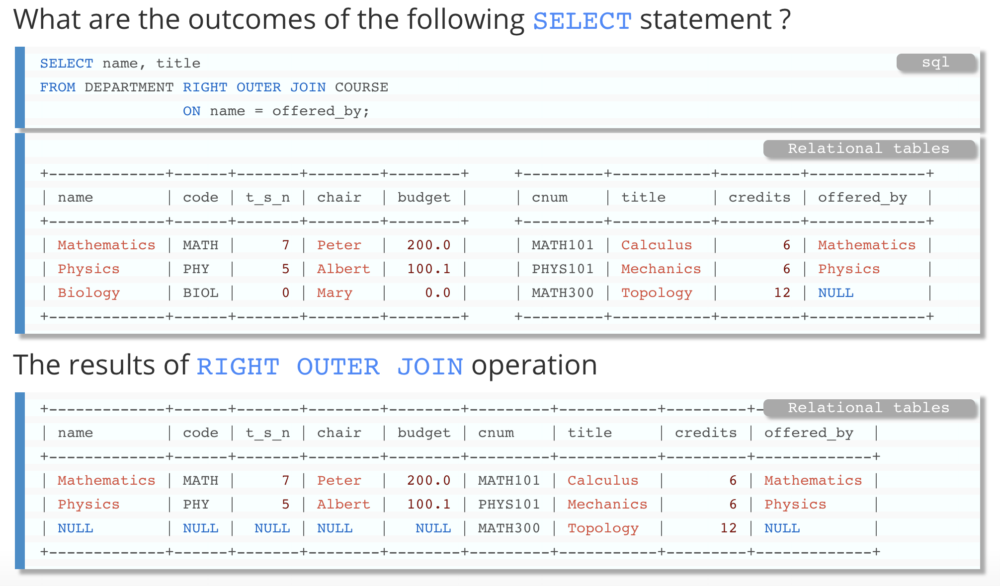

## 多表查询 (表连接)

[TOC]

在这里我们通过 **连接 join** , 将两个及以上的表连接起来. 实际上连接有很多种 :

* 笛卡尔积 cross join

* 内连接 inner join

* 外连接 outer join

  * 左外连接 left outer join

  * 右外连接 right outer join

### 笛卡尔积 cross join

这种连接方式就是简单的对多个表进行拼接.  所以如果 TA 有 n 个记录, TB 有 m 个记录.

那么经过笛卡尔积之后, 我们的查询表共有 n * m 个记录, 下面举例 :

TA :

| person _id | name | age  |
| ---------- | ---- | ---- |
| 1          | fz   | 1    |
| 2          | zz   | 2    |

TB :

| person_id | food   |
| --------- | ------ |
| 1         | Cookie |
| 1         | Fish   |

最后经过笛卡尔积产生的结果为 :

~~~sql
/* 即使person_id 为指向TA的外键, 但是我们在笛卡尔积中没有用*/
select a.name, a.age , b.food from TA a cross join TB b;

/* 等效 */
select a.name, a.age , b.food from TA join TB;

/* 等效 */
select a.name, a.age , b.food from TA, TB;
~~~

| name | age  | food    |
| ---- | ---- | ------- |
| fz   | 1    | cookies |
| fz   | 1    | fish    |
| zz   | 2    | cookies |
| zz   | 2    | Fish    |

笛卡尔积, 就是很简单的表拼接, 并没有考虑很外键之类的因素

### 内连接 inner join

在笛卡尔积的基础上, 我们需要利用 关键字 **ON** 指定出, 两个表是的如何关联的. 

内连接表示 : **如果在连接方式上, 两个表有不匹配的地方, 那么那一行将不会被显示**, 这也是内连接和外连接的区别之处.

#### 两个子表的情况

以上面的两个表为例子, 我们inner join的结果为: 

~~~sql
/* TA, TB 两个表内连接*/
/* 在不指明连接类型的情况下, 默认就是内连接*/
select a.name, a.age, b.food from TA a join TB b on a.person_id = b.person_id 
/* 两种等效*/
select a.name, a.age, b.food from TA a inner join TB b on a.person_id = b.person_id
~~~

#### 三个及以上子表的情况

对于多于两个表的情况, 我的语法还是类似的, 且连接的次序不同, 最后的结果都是一样的.

#### 自然连接 natural join

**自然连接也是一种内连接**, 准确说是只一种 **语法简写的机制**

~~~sql
/* 
当且仅当 TA, TB 两个表的 外键 的列名一定要和另外一个表的 主键 名相同
此例子为: 两个person_id 列名相同
所以可以简写
*/
select * from TA natural join TB
/* 等效于 */
select * from TA a inner join TB b on a.person_id = b.person_id;
~~~

**如果两个表的 外键, 主键 名字不同** ,那么自然连接变默认为 **交叉连接**

#### using 关键字连接

也是算作一种 **语法简写机制**, 自然连接也是 需要的是, 外键和主键的列明完全相同. 

using 则可以指定一个相同的列名

~~~sql
/* 
人为指定一个两个表相同的列名
*/
select * from TA join TB using(person_id)
/* 等效于 */
/* 但是我们一般选择这种方式, 结构清晰 */
select * from TA a inner join TB b on a.person_id = b.person_id;
~~~

### 外连接 outer join

考虑下面的问题 : 在内连接的要求里面, 我们需要连接的双方 **必须键位匹配, 否则就会被忽略.**  e.g.

table_a : 

| A        | B    |
| -------- | ---- |
| fz       | 1    |
| fangzhou | 2    |
| ark      | 3    |

table_b :

| B    | C     |
| ---- | ----- |
| 1    | food  |
| 3    | music |
| 4    | dance |

那么我们连接如下:

~~~sql
/* 内连接 */
select * from table_a a inner join table_b b on a.B = b.B;
~~~

如果为内连接, 结果只会有 B = 1, 3的情况, 其他不匹配的情况会被自动忽略

#### 该问题引出外连接的概念

有些情况我们不希望这些结果集被忽略, 从而有了外连接的概念.

~~~sql
/* 左外连接*/
select * from table_a a left outer join table_b b on a.B = b.B;

/* 右外连接*/
select * from table_a a right outer join table_b b on a.B = b.B;
~~~

* 如果是左外连接, 最后的结果, **会保证表A所有的记录都不会被忽略**. 如果没有匹配的, 那么字段会被自动填为null

* 如果是右外连接, 最后的结果, **会保证表B所有的记录都不会被忽略**. 如果没有匹配的, 那么字段会被自动填为null

下面有一个更为清晰的例子:

**左连接 :**

**右连接 :**

