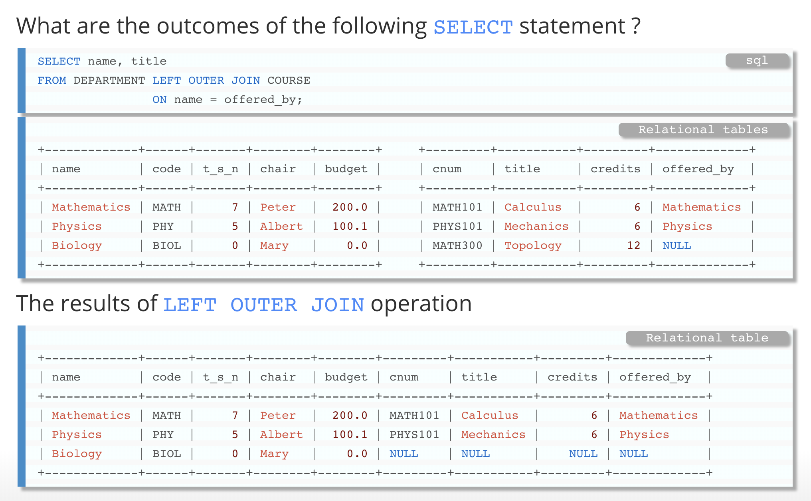
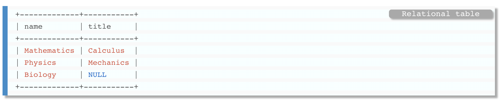
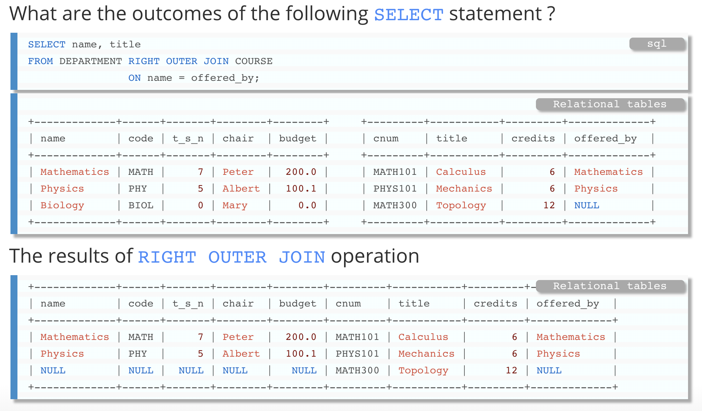
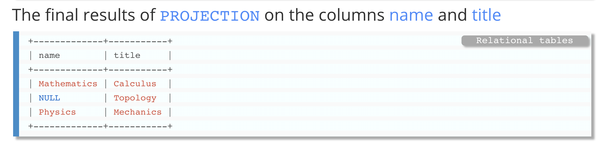

# 查询

[TOC]


# 简单查询


## select query 子句汇总

一个 **select 查询** 一般 只包含 2~3 个字句, 但是标准下一个select拥有6个字句

| 子句     | 作用                                                 |
| -------- | ---------------------------------------------------- |
| select   | 确定查询结果包含哪几列, 如果后面接 *, 则包含所有.    |
| from     | 指出要提取的数据表                                   |
| where    | 利用条件过滤不需要的记录                             |
| group by | 用于对 **具有相同列值** 的行进行分组                 |
| having   | 过滤不需要的组                                       |
| order by | 按一列或者多列进行排序输出, 如果不加, 则对顺序不保证 |

<center style='font-size:30px;color:red'> 注意在语句中, 我们的各个子句的先后顺序个上面的出现次序一致


## select 子句

select 可以选择这个结果集返回记录的哪些列, 或者用 * 表所有列.

select 选择的同时, 我们可以 **对相应返回的列值做以下操作**:

- 对列值加一个表达式, 比如:

  ```sql
  /* 对选择出来的 age 做乘100 操作 */
  select age * 100 from person;
  ```

- 对列值加上内建函数, 比如:

  ```sql
  /* 将name所有的字母变为大写*/
  select upper(name) from person;
  ```

- 给返回列加上别名

  ```sql
  /* 现在新的列名为 new_name, new_age*/
  select upper(name) new_name, age*10 new_age from person;
  
  /* 同样使用 AS 关键字也是一样的效果*/
  select upper(name) as new_name, age*10 as new_age from person;
  ```

- 删除某列中 **数值重复的记录**

  注意使用 distinct 会大量的耗时, 我们应该 **尽量减少 distinct 的使用**

  ```sql
  /* 删除重复*/
  select distinct food from favorite_food;
  ```

## from 子句

from 子句定义了表查询中所使用的表


<center style='font-size:20px'> 表的概念及种类


**定义, 表的该脸并不局限于我们create的表, 而包括以下三个概念**

- 永久表 : 通过 create 创建的表
- 临时表 : 通过查询语句 select 返回的表, 也就是说, 我们使用 **select查询后的结果也是一个表**
- 虚拟表 : 使用视图 create view 子句所创建的 **视图**


<hr>

**我们来看看什么是 临时表, 虚拟表**

临时表 (子表查询产生的表)

```sql
/* 注意我们要给子表查询的结果命名 e.g: 取名为 e */
/* 然后我们才能利用 e.age的形式去选择里面的列   */
select e.age from (select * from person) e;
```

虚拟表 (通过视图创建)

视图是什么 : **视图就是存储于数据字典的数据查询** 注意我们的视图并没有任何数据, 而只是一个定义. 我们调用他的时候, 服务器也只是简单的去掉用这个定义.

```sql
/* 定义视图 */
create view person_v as select age from person;

/* 此时person_v 就被定义为这个查询*/
/* 从而我们直接对视图进行查询即可 */
select * from person_v;

/* 删除一个视图*/
drop view person_v;
```

- 视图会存在于我们的真实表中, 即可以通过 show tables 显示出来

<hr>

with 语句

和 视图类似的, 我们还有 **with 语句**, 也可以创建一个虚拟表, 但是show tables不能显示

```sql
/* 下面我们就可以用 table_name 代替 select * from account 语句*/
with table_name as (select * from account)
```

<center style='font-size:30px ;color:red'> MySQL 并不支持 with语句


<center style='font-size:20px'> 连接表


我们可以在查询的时候合并多个表, 然后对这个合并表执行查询操作. 比如 :

```sql
/* 通过person_id 连接 person 表 和 favorite_food 表*/
/* ... inner join ... on... */
select person.person_id, person.age, favorite_food.food from 
person inner join favorite_food 
on
person.person_id = favorite_food.person_id;
```

**此时返回的就是 两个表的合并表**

由于我们在字段的选择以及其他的地方我们需要 **指定我们选择的是哪一个表 e.g person.person_id**

为了简便操作, 我们对其使用别名 : 

```sql
/* 通过person_id 连接 person 表 和 favorite_food 表*/
/* ... inner join ... on... */
select p.person_id, person.age, f.food from 
person p inner join favorite_food f
on
p.person_id = f.person_id;

/* 当然也可以加 AS 增加可读性*/
select p.person_id, person.age, f.food from 
person AS p inner join favorite_food AS f
on
p.person_id = f.person_id;
```


## where 子句

where 语句中可以用到的符号

### 比较运算符

- = 等于

- <> 或者 != 都表示不等于

- <=> 安全的等于

  ```sql
  /* 返回null */
  select null=null
  
  /* 返回1 */
  select null<=>null
  ```

- <= 

- <

- \>=

- \>

### 逻辑运算符

可以通过条件限定查找的记录是什么, 主要就是两个逻辑符号:

- AND

- ALL , ANY

  all 运算符会和结果集的所有的元素比较一遍

  ```sql
  /* 表示要大于所有的结果集中的元素 */
  /* 大于所有才为真*/
  select * from account where blance > all (1, 2, 3)
  
  /* 大于一个就为真*/
  select * from account where blance > any (1, 2, 3)
  ```

- NOT 

- EXISTS, NOT EXISTS

  多用于判断 **子查询中返回的数据集存在与否**

  ```sql
  /* 如果存在子查询的数据集, 那么就之前父查询 */
  select * from account where exists (select * from product where product_cd = 'chk')
  ```

- OR

- IN  , NOT IN

  可以限定一个范围 e.g:

  ```sql
  /* 选择年纪为18, 19, 20的人*/
  
  select * from person where age in (18, 19, 22);
  ```

- LIKE 模糊查找 

  %STRING% 匹配表示 字符串含有STRING且左边, 右边的字符任意

  %STRING 匹配表示, 结尾必须为STRING, 左边字符任意

  STRING% 匹配表示, 开头必须为STRING, 右边字符任意

  ```sql
  /* 选择名字中带有fang的人 */
  select * from person where name like '%fang%';
  ```

通过逻辑符号可以执行多个限定条件


### group by 和 having子句

group by 可以对 **结果集进行分组** , 分组的依据就是 **如果group by后面的字段值相等, 那么就可以归为一组**, e.g.

```sql
/* 语法 */
/* aggregate_function 为聚合函数 */
SELECT column_name, aggregate_function(column_name)
FROM table_name
WHERE condition

/* 在结果集中, column_name1相同的列, 被归位一组 */
/* 然后通过select 里面的聚合函数, 对这些组聚合操作 */
GROUP BY column_name

/* having 语句加上筛选项, 对结果进行过滤, having 里面一般都是聚合函数的一些逻辑条件 */
having aggregate_function(column_name) condition
```

- group by 和 having 一般是一起出现的.
- group by 语句一般用来结合 **聚合函数** 一起使用的

#### having 子句 和 where 子句的区别

- Where 是一个 **约束声明** ，使用Where约束来自数据库的数据，Where是在结果返回之前起作用的，**Where中不能使用聚合函数**
- Having是一个 **过滤声明**，是在查询返回结果集以后对查询结果进行的过滤操作，**在Having中可以使用聚合函数**


### 关于聚合函数

1. 常用的聚合函数有 : 

- count() 计数
- sum() 求和
- avg() 平均数
- max() 最大值
- min() 最小值

1. 注意聚合函数不一定只能在 group by 语句中才能使用
2. count(*) 会统计所有的记录,且不会忽略null记录,  count(val)会自动的忽略null记录


### 关于Group by 的几点问题:

1. select 子句选择的是一定是 : 

   - group by 的字段
   - 包含在聚合函数其他列

   **即 select 不能选择另一个不是 group by 的列**

   ```sql
   /* 这种是不允许 ❌ 的 */
   select a from user group by b
   ```

2. 多个字段 group by

   ```sql
   /* 可以选择的字段, 仅限于group by的字段中  */
   /* 此时只有 a, b 都一样, 才会被当做一个分组 */
   select a, b from user group by a, b;
   ```


## order by 子句

**直接对某一列进行排序**

可以使得结果根据某个字段进行排序, 同时可以指定是 **升序asc** , 还是 **降序desc**

```sql
select * from person order by age;
/* 不指定默认为升序 */
/* 上下结果相同 */
select * from person order by age asc; 

/* 结果降序 */
select * from person order by age desc; 
```


**依据两列及以上进行排序**

```mysql
/* 例如依据 age 和 name 进行排序 */
/* 注意先对列明重命名 */
select age a, name n from person order by a, n
```


# 多表查询 (表连接)


在这里我们通过 **连接 join** , 将两个及以上的表连接起来. 实际上连接有很多种 :

* 笛卡尔积 cross join

* 内连接 inner join

* 外连接 outer join

  * 左外连接 left outer join

  * 右外连接 right outer join


## 笛卡尔积 cross join

这种连接方式就是简单的对多个表进行拼接.  所以如果 TA 有 n 个记录, TB 有 m 个记录.

那么经过笛卡尔积之后, 我们的查询表共有 n * m 个记录, 下面举例 :

TA :

| person _id | name | age  |
| ---------- | ---- | ---- |
| 1          | fz   | 1    |
| 2          | zz   | 2    |

TB :

| person_id | food   |
| --------- | ------ |
| 1         | Cookie |
| 1         | Fish   |

最后经过笛卡尔积产生的结果为 :

~~~sql
/* 即使person_id 为指向TA的外键, 但是我们在笛卡尔积中没有用*/
select a.name, a.age , b.food from TA a cross join TB b;

/* 等效 */
select a.name, a.age , b.food from TA join TB;

/* 等效 */
select a.name, a.age , b.food from TA, TB;
~~~

| name | age  | food    |
| ---- | ---- | ------- |
| fz   | 1    | cookies |
| fz   | 1    | fish    |
| zz   | 2    | cookies |
| zz   | 2    | Fish    |

笛卡尔积, 就是很简单的表拼接, 并没有考虑很外键之类的因素


## 内连接 inner join

在笛卡尔积的基础上, 我们需要利用 关键字 **ON** 指定出, 两个表是的如何关联的. 

内连接表示 : **如果在连接方式上, 两个表有不匹配的地方, 那么那一行将不会被显示**, 这也是内连接和外连接的区别之处.

### 两个子表的情况

以上面的两个表为例子, 我们inner join的结果为: 

~~~sql
/* TA, TB 两个表内连接*/
/* 在不指明连接类型的情况下, 默认就是内连接*/
select a.name, a.age, b.food from TA a join TB b on a.person_id = b.person_id 
/* 两种等效*/
select a.name, a.age, b.food from TA a inner join TB b on a.person_id = b.person_id
~~~


### 三个及以上子表的情况

对于多于两个表的情况, 我的语法还是类似的, 且连接的次序不同, 最后的结果都是一样的.


### 自然连接 natural join

**自然连接也是一种内连接**, 准确说是只一种 **语法简写的机制**

~~~sql
/* 
当且仅当 TA, TB 两个表的 外键 的列名一定要和另外一个表的 主键 名相同
此例子为: 两个person_id 列名相同
所以可以简写
*/
select * from TA natural join TB
/* 等效于 */
select * from TA a inner join TB b on a.person_id = b.person_id;
~~~

**如果两个表的 外键, 主键 名字不同** ,那么自然连接变默认为 **交叉连接**


### using 关键字连接

也是算作一种 **语法简写机制**, 自然连接也是 需要的是, 外键和主键的列明完全相同. 

using 则可以指定一个相同的列名

~~~sql
/* 
人为指定一个两个表相同的列名
*/
select * from TA join TB using(person_id)
/* 等效于 */
/* 但是我们一般选择这种方式, 结构清晰 */
select * from TA a inner join TB b on a.person_id = b.person_id;
~~~


## 外连接 outer join

考虑下面的问题 : 在内连接的要求里面, 我们需要连接的双方 **必须键位匹配, 否则就会被忽略.**  e.g.

table_a : 

| A        | B    |
| -------- | ---- |
| fz       | 1    |
| fangzhou | 2    |
| ark      | 3    |

table_b :

| B    | C     |
| ---- | ----- |
| 1    | food  |
| 3    | music |
| 4    | dance |

那么我们连接如下:

~~~sql
/* 内连接 */
select * from table_a a inner join table_b b on a.B = b.B;
~~~

如果为内连接, 结果只会有 B = 1, 3的情况, 其他不匹配的情况会被自动忽略

### 该问题引出外连接的概念

有些情况我们不希望这些结果集被忽略, 从而有了外连接的概念.

~~~sql
/* 左外连接*/
select * from table_a a left outer join table_b b on a.B = b.B;

/* 右外连接*/
select * from table_a a right outer join table_b b on a.B = b.B;
~~~

* 如果是左外连接, 最后的结果, **会保证表A所有的记录都不会被忽略**. 如果没有匹配的, 那么字段会被自动填为null

* 如果是右外连接, 最后的结果, **会保证表B所有的记录都不会被忽略**. 如果没有匹配的, 那么字段会被自动填为null


下面有一个更为清晰的例子:

**左连接 :**






**右连接 :**






# 子查询 (Nested queries)

- 什么是子查询
- 子查询类型
  - 非关联子查询
  - 关联子查询


## What is 子查询?

1. 子查询就是 包含在另一个SQL语句中 **内部的查询** 通常用括号()包起来.  
2. 子查询发生在 包含在语句执行之前
3. 子查询返回的结果也是一个数据集
   - 单行单列 => **标量子查询**  从而可以被用于常用比较运算符(=, <, >, <>, >=, <=)中.
   - 单行多列 => 不可以用常用比较运算符, 但是可以用于 in, not in
   - 多行多列 => 也可以用 in, not in语法
4. 子查询返回的数据在查询结束以后会被丢弃

子查询的例子 :

### 单行单列

```sql
/* 在where中设置子查询语句*/
/* select max(account_id) from account 也可以做一个独立的查询语句*/
/* 此处的子查询变为标量子查询 */
select * from account where account_id = (select max(account_id) from account);
```

### 单行多列


### 多行多列

```sql
/* in, not in 同样也可以处理多行多列的比较情况 */
/* 在要查询的多列用括号包起来 */
select email, age from person where (email, age) not in (select email, age from preson_2);
```


## 子查询类型

- 在 from 子句后面使用子查询, 我们需要对其进行重命名

  ```sql
  /* 如果不加 as p 则会报错*/
  select * from (select * from person) as p
  ```

- 在 where 子句后面可以不用重命名


### 非关联子查询

子查询中的 **SQL可以单独执行** , 而不需要包含语句中的任何内容.

我们大部分开发中, 遇到的都是非关联类型的


### 关联子查询

子查询的内容包含了父查询的内容, 从而不能被单独执行

```sql
/* 可以看到子查询内部引用了外部的表 c*/
/* 从而造成了关联*/
select * from customer c
where 2 = (select count(*) from account a where a.cust_id = c.cust_id)
```


# 使用集合

和数学概念一样, 集合操作包括三种

- 并操作 union
- 交操作 intersect
- 差操作 except


<center style = 'font-size : 30px' />特别注意, 在MySQL上(版本4.0及以上), 只实现了集合的并操作

## 并操作

- union  : 会自动去除重复的项
- union all : **不会去除重复**

可以求两个集合的并集, 所以 **union** 操作的两端必须是 **集合**

```sql
/*
select ...
union
select ...
*/
```

两个集合可以使用并操作的必要条件是 :

- 两个集合有相同数量的列
- 取并操作以后, 列的名字为 **前一个数据集规定的名字**


## 交操作 intersect

- intersect (去除了交集中两个集合的重复项)
- intersect all  (没有去除重复项)

可以返回两个 **集合的** 交集, 用法和 union 类似


## 差操作 except

- except
- except all 


 


