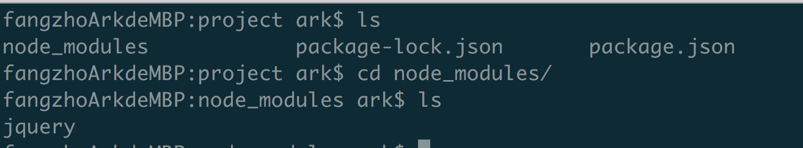

[TOC]

# I. 概述

**Node Package Manager**

一个 **包管理工具**, 可以看作为 **前端** 开发的 **Maven**

# II. npm 常用操作

## 1. 安装依赖

**`以前`**

**以前引入一个依赖如 `Jquery`我们通常的做法是**

~~~html
<html>
<- 在线引用 jquery !->    
<srcipt src="site for jquert code online"> </srcipt>

...
</html>
~~~

**`现在`**

**引入 npm 后, 我们再安装一个项目的依赖入 `Jquery` 可以**

~~~shell
# 先进入我们的项目的目录
cd ~/home/webproject

# 初始化 npm
npm init -y

# 下载 jquery
npm i jquery

# 此时 jquery 相应的代码便被下载到了本地项目的 node_modules 中
~~~

~~~html
<html>
<- 本地引用 jquery !->    
<srcipt src="node_modules/jquery/..."> </srcipt>

...
</html>
~~~

## 2. `package.json` 文件

~~~json
{
  "name": "project",
  "version": "1.0.0",
  "description": "",
  "main": "index.js",
  "scripts": {
    "test": "echo \"Error: no test specified\" && exit 1"
  },
  "keywords": [],
  "author": "",
  "license": "ISC",
  "dependencies": {
    "jquery": "^3.4.1"
  }
}
~~~

可以看到此时项目的依赖项加入了 jquery, 以及相应的版本

如果 node_module 中没有对应的依赖, 那么我们可以直接用执行下载

~~~shell
$ npm i 
~~~

也就是说, 我们可以直接改变 **package.json** 文件, 然后执行该命令一次性下载所有所需文件

## 3. 卸载依赖

~~~shell
> npm uninstall jquery
~~~

## 4. 更新版本

~~~shell
# 会下载更新最新的版本
> npm update jquery
~~~

## 5. 指定版本安装

~~~shell
> npm i jquery@2.0.0
~~~

## 6. 设置国内镜像

~~~shell
> npm config set registry=https://registry.npm.taobao.org
~~~

