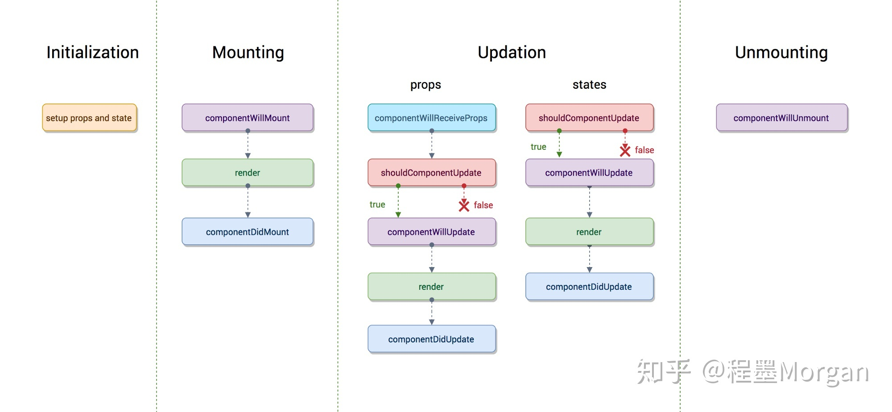
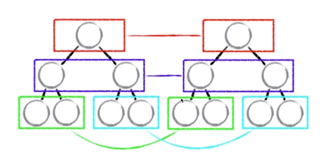

[TOC]

# 安装

## 创建新的React应用

Required `npm` , `node`

~~~shell
# 创建一个名为 my-app 的 react 应用
npx create-react-app my-app


cd my-app

# 启动
npm run start
~~~


## 核心文件

~~~
public 
	- index.html 
src 
	- App.js	
	- index.js	# 整个项目的入口文件
~~~

~~~javascript
// index.js

import React from 'react';
import ReactDOM from 'react-dom';
// 实际上是 ./App.js 文件，如果没有加后缀，则默认先寻找js文件
import App from './App';

ReactDOM.render(
  // JSX语法引入自定义App组件，且自定义组件名称需要以大写字母开头
  <App />
  ,
  document.getElementById('root')
);
~~~

~~~javascript
// App.js 定义了一个 App 组件


// 相当于引入 React 和 React.Component
import React, { Component } from 'react';

// 定义一个 App 组件， 必须继承于 React.Component
class App extends Component{
  render(){
      return (
        // JSX 形式的标签需要引入 React 
        <div>
          hello world
        </div>
      );
  }
}
export default App;

~~~


# 核心概念

## JSX

> 这个有趣的标签语法既不是字符串也不是 HTML。
>
> ```javascript
> const element = <h1>Hello, world!</h1>;
> ```

React 将HTML标签定义在 JavaScript文件中变成了 JSX

### 防止冲突重命名

为了防止HTML标签中的语法和JS关键字冲突，React 对HTML中的标签进行了重命名

~~~javascript
// 1. class => className
<h1 className='h1'> hello world </h1>

// 2. for => htmlFor
<label htmlFor='insertArea'>请输入内容</label>
<input id='insertArea' />
~~~

### 允许输入嵌入HTML标签

`dangerouslySetInnerHTML`

~~~javascript
// dangerouslySetInnerHTML 属性允许将 content 内容不经过解析直接嵌入到 <li> 标签里面去
<li 
dangerouslySetInnerHTML = {{__html:content}}
>
</li>
~~~


## 组件

> 组件思想允许你将 UI 拆分为独立可复用的代码片段，并对每个片段进行独立构思。

### 创建一个简单组件

~~~javascript
// 创建一个 HelloWorld 组件
// 需要引入 React 和 React.Component

import React, {Component} from 'react'

// 组件需要继承 React.Component
class HelloWorld extends Component{
    
    // 使用render(){}函数的返回值定义组件的内容
    render(){
        return(
			<div> hello world </div>
        )
    }
}

// 导出 HelloWolrd 组件
export default HelloWorld
~~~

### 组件间传值

* 父组件在子组件的标签引用处通过其标签属性的方式向子组件传值，且此值为 `read only`
* 子组件需要改变父组件值的时候，需要调用父组件对应的方法，而不应该在组件里更改 （单向数据流的）


~~~javascript
class fatherComponent extends Component{
    render(){
		// 在父组件中调用子组件        
        <childComponent 
        
        // 参数的传递直接在其标签中定义
        item={item}
        index={index}
        deleteItem = {this.fatherClickHandler.bind(this, index)}
        >
        </childComponent> 
    }
}


// 子组件中使用 this.props. 的方式进行调用
class childComponent extends Component{

    constructor(props){
        super(props)
    }
    
    render(){
        return(
            <div 
            key={this.props.index}
            onClick={this.childClickHandler}
            dangerouslySetInnerHTML = {{__html:this.props.item}}
            >
            </div>
        )
    }
    
    childClickHandler(){
        
        // 子组件向父组件中的函数传值
        this.props.fatherClickHandler(this.props.index)
    }
    
}
~~~

### 组件传值类型检查

[React 类型检查](<https://react.docschina.org/docs/typechecking-with-proptypes.html>)

在父组件向子组件传递值时候，需要限定值的类型

~~~javascript
import PropTypes from 'prop-types';

class Greeting extends React.Component {
  render() {
    return (
      <h1>Hello, {this.props.name}</h1>
    );
  }
}

// name 值必须为 string 类型的
Greeting.propTypes = {
  name: PropTypes.string
};

~~~

### 组件传值默认值设定

~~~javascript
class Greeting extends React.Component {
  render() {
    return (
      <h1>Hello, {this.props.name}</h1>
    );
  }
}

// 指定 props 的默认值：
Greeting.defaultProps = {
  name: 'Stranger'
};
~~~

### 组件 `render()` 函数

组件的 `render()` 定义了该组件的显示内容，每当组件的 `state`, `props`变量发生变化，以及父组件的`render()`函数执行的时候，该`render()`函数便会被重新执行一次，从而实现了和数据的动态绑定。

`redner()` 函数的重新执行效率非常高, 得益于其 **虚拟 DOM 机制**。


## State

为了实现UI界面的动态更新，React的思想是将各个组件和数据动态绑定，从而实现当数据变化的时候，组件的显示相应的变化。

### 数据组件绑定的一个例子

React将组件的数据存放在 `state` 成员变量中，可以在组件的构造函数中进行初始化。

~~~javascript
// 动态获取和更新 input 输入框

// TodoList 组件
import React, {Component, Fragment} from 'react'
class TodoList extends Component{

    // TodoList 的构造函数
    constructor(param){
        super(param)
        this.state = {
            'inputValue' : 'hello world',
        };
    }
    
    render(){
        return(
            <div>
            	// 将组件的 inputValue 值和 input 输入框绑定
            	// 从而更新 inputValue 的值便可以更新输入框的内容
                <input 
                    value={this.state.inputValue}
            
            		// 注意这里需要绑定 this 使得函数中this指向该组件
                    onChange = {this.inputChangeHandler.bind(this)}
                />
                <button>确定</button>
            </div>
		)

    inputChangeHandler(e){
        // 更新 state
        // e.target 代表该DOM元素:Input
        // this.setState 为React设计的更新state方法，不能直接使用等号更新
        this.setState({
            'inputValue' : e.target.value
        })
    }
}
export default TodoList
~~~

### 更新UI `setState`

React 中将组件的数据和该类的 state 变量绑定在一起， 从而实现改变 state 变量的时候 UI 动态更新.

~~~javascript
// 正确的更新 state


// Wrong
// 不可以使用将 state 直接赋值的方法更新
this.state.comment = 'Hello';

// Correct
// 需要调用 setState 的方法更新
this.setState({comment: 'Hello'});

~~~

### 异步 `setState`

~~~javascript
/* setState 是一个异步函数。 */
this.setState(() => ({
    'list' : currentList
}), () => {
    /* 可以用setState的回掉函数从而实现在setSatet后执行某功能 */
    console.log('hello world1')
}
)

/* 此时setState()一般会执行在 console.log() 之后 */
console.log('hello world2')
~~~


### `setSatet` 更新规范

~~~javascript
// old version
inputChangeHandler(e){
    // 更新 state
    this.setState({
         'inputValue' : e.target.value
    })
}


// new version
inputChangeHandler(e){
    // 将更新的变量以常数的形式先定义在外面
    const value = e.target.value
    
    this.setState(()=>({
        'inputValue' : value
    }))
}
~~~

## 生命周期函数

> 生命周期函数指在某一时刻被自动调用执行的函数, 如 render() 函数	

`react` 的生命周期函数包括以下




### 挂载周期

挂载周期即 将`render()`中生成的内容，挂载到真实的 DOM 节点中。挂载周期内的周期函数在组件的存在期间只执行一次。

~~~javascript
// 组件被挂载之前执行
componentWillMount(){
    console.log(" componentWillMount ")
}

// 最常用的 render 函数提供挂载模版
render(){
    // JSX 
}

// 组件被挂载之后
componentDidMount(){
    console.log(" componentDidMount ")
}
~~~

### 更新周期

指将`React`中的两个变量 `Props` 和 `State` 发生变化的时候的周期函数

~~~javascript
// 1. 当一个组件从父组件接受参数 
// 2. 当父组件 除第一次外的render函数执行，子组件的这个生命周期便被执行 
componentWillReceiveProps(){

    console.log(" componentWillReceiveProps ")

}

// 状态是否需要更新
// bool 返回值 true 表示需要更新, false 表示不必更新
shouldComponentUpdate(){
    console.log(" shouldComponentUpdate ")
    return true
}

// 状态更新前
componentWillUpdate(){
    console.log(" componentWillUpdate ")
}

// 状态更新 重新执行 render()
render(){
    // JSX
}

// 状态更新后
componentDidUpdate(){
    console.log(" componentDidUpdate ")
}
~~~


### 解除挂载周期

~~~javascript
// 当该组件从页面剔除之前执行
componentWillUnmount(){
    console.log(" componentWillUnmount ")
}
~~~


## 虚拟 DOM

`React` 中使用 虚拟DOM 的方案高性能的更新 UI，其过程可以总结如下：

1. 定义 state 数据

2. JSX 模版

3. JSX模版 + 数据 生成一个虚拟 DOM

   ~~~javascript
   // JSX 模版通过 React.creatElement() 函数转化为 虚拟DOM
   // 例如在 render 函数中一下两种写法等价
   render(){
       
    return <div id='a'><span>hello world</span></div>;
    return React.creatElement('div' {id:1}, React.creatElement('span', {}, 'hello world'))
    
   }
   
   // 假如真实 DOM 对应的虚拟 DOM 即为
   ['div',{id:a}, ['span',{},'hello world']]
   ~~~

4. 根据虚拟 DOM生成 真实DOM 用来 UI 显示

   ~~~html
   <div id='a'><span>hello world</span></div>
   ~~~


5. 当数据更新的时候，数据 + 模版 会生成一个 **新的虚拟DOM**

   ~~~
   // 更改后的虚拟DOM
   ['div',{id:a}, ['span',{},'hello']]
   ~~~

6. 比较新旧两个 虚拟DOM 之间的差异，找到区别

7. 直接操作原来的真实DOM, 从而更新


**虚拟DOM的优势**

* `React` 中虚拟DOM实质上就是一个 JS 对象，可以很快的创建和比较，而真实DOM的创建和比较很耗费时间。
* 由于中间虚拟DOM的存在，使得 React 不仅可以应用于 WebApp 开发，原生应用也可以通过解析虚拟DOM来显示UI。

### 虚拟DOM diff 比对算法



新旧的虚拟 DOM 采用同层比对的算法，从根节点开始往下，如果该层的节点不同，则直接替换该层及以下的所有节点，而不再进行比较.

### 节点 Key 值选取

由于 React 中 diff 比对算法和节点的 key 值关联，从而最好在新旧虚拟DOM中，节点 key 值最好稳定不变。**所以最好不要在循环中使用 index 作为节点 key 值**

## 事件

### 事件命名

在 React 中，时间需要使用 camelClass 的方式命名 (区分于传统 JavaScript)

例如，传统的 HTML：

~~~html
<button onclick="activateLasers()">
  Activate Lasers
</button>
~~~

在 React 中略微不同：

```html
<button onClick={activateLasers}>  Activate Lasers
</button>
```

更多的有:

| 事件     | 含义           |
| -------- | -------------- |
| onClick  | 点击事件       |
| onChange | 输入框改变事件 |


### 向事件处理程序传递参数

> 在循环中，通常我们会为事件处理函数传递额外的参数。例如，若 `id` 是你要删除那一行的 ID

~~~javascript
<button onClick={this.deleteRow.bind(this, id)}>Delete Row</button>

// this 为隐式传递所以不用写上去
deleteRow(id){
    console.log(id)
}
~~~


## AJAX 操作

`React` 并没有对 `AJAX` 操作进行封装，使用时需可以安装 `axios` 。

~~~shell
# 安装 axios
cd your-app

yarn add axios
~~~

一般的 `ajax` 操作会写在 `componentDidMount` 生命周期中

~~~javascript
import axios from 'axios'

// ajax 操作
componentDidMount(){
    axios.get('/api/todoList') 
        .then((res) => {
        // 成功
        console.log('success');

        // 更新
        this.setState(() => ({
            'list' : res.data
        }))

    })
        .catch(() => {
        console.log('error')
    })
}
~~~


# 项目构建准则

## 项目标准目录

~~~
/* 一个例子 for 标准的前端react项目目录结构 */
├── common	/* 放整个项目的公共组件，如 header, footer */
│   └── header
│       ├── index.js
│       ├── store /* header 的公共数据管理 */
│       │   ├── actionCreator.js
│       │   ├── actionType.js
│       │   ├── headerReducer.js
│       │   └── index.js
│       └── style.js
├── index.js
├── pages 	/* 放项目不同页面的组件 */
│   ├── detail	/* 文章 detail 页面 */
│   │   └── index.js
│   └── home	/* 项目首页 */
│       ├── components	/* 项目首页的一些组件 */
│       │   ├── list.js
│       │   ├── recommend.js
│       │   ├── topic.js
│       │   └── writer.js
│       ├── index.js
│       ├── store     /* 项目首页的公共数据管理 */
│       │   ├── actionCreator.js 
│       │   ├── actionType.js
│       │   ├── homeReducer.js
│       │   └── index.js
│       └── style.js
├── static			 /* 项目静态数据 */
│   ├── cs.jpeg
│   ├── home.jpeg
│   ├── iconfont
│   │   ├── iconfont.js
│   │   ├── iconfont.svg
│   │   ├── iconfont.ttf
│   │   ├── iconfont.woff
│   │   └── iconfont.woff2
│   └── logo.png
├── store           /* 项目整个公共数据管理 */
│   ├── index.js
│   └── reducer.js
└── style.js
├── App.js
~~~


## 组件逻辑和UI拆分

组件 UI 和 逻辑可以分别拆分为两个文件，例如: 

~~~javascript
/* componentLogic.js */

import React, {Component} from 'react';
import componentUI from './componentUI'

class componentLogic extends Component{
  
    constructor(props){
        super(props)

        this.func = this.func.bind(this)
    }

    render(){
        return (
            <componentLogicUI 
            
            // 通过这种方式向 UI 组件传值
            func = {this.fuc}
            />
        );
      }
    
    func(){
       // code ...
    }
}
export default componentLogic;
~~~

抽离的 UI 部分可以定义为一个 **无状态UI组** 相比于普通的组件，无状态组件加载销量更高，因为没有了一些生命周期函数.

~~~javascript
/* componentUI.js */ 

// 抽离 componentUI 的 UI 组件
// 只负责定义 UI， 不涉及逻辑
import React from 'react'

/* 无状态UI组件，相比于 Component 类，无状态组件新能更高 */ 
const componentUI = (props) => {
    return(
		<div props.func>
        	...
        </div>
    )
}

export default componentUI
~~~


# 扩展

## `styled-components`

这个扩展可以使得我们可以用 `js` 的方式引入 `css` 文件

`styled-components` 可以对单独组件赋予样式，避免组件件样式冲突

### 安装

~~~shell
$yarn add styled-components
~~~

### 全局样式

> 使用 css reset 定义全局样式
>
> http://meyerweb.com/eric/tools/css/reset/ 

~~~javascript
/* 定义 */
import { createGlobalStyle } from 'styled-components'

/* css 样式 */
export const Globalstyle = createGlobalStyle`
	
body{
	
}
`
~~~

~~~javascript
/* 引入 */
import {Globalstyle} from './style.js';

function App() {
  return (
    <div className="App">
      /* 全局样式 */
      <Globalstyle />
      <Header />
    </div>
  );
}
~~~


### 组件局部样式

~~~javascript
/* 定义 */
import styled from 'styled-components'

/* 为 div 定义一个样式名为 HeaderWrapper */
export const HeaderWrapper = styled.div`
    position : relative;
    height : 56px;
    border-bottom : 1px solid #f0f0f0;
`
~~~

~~~javascript
/* 引入 */
import {
    HeaderWrapper
}from './style'

class Header extends Component{
    render(){
        return (
            <HeaderWrapper>header</HeaderWrapper>
        )
    }
}
~~~


### 选择器 `&` 和 `.`

~~~html
<List calssName = 'Wrapper'>
    <Item className = 'Wrapper_Item'/>
</List>
~~~

~~~js
import styled from 'styled-components'

/* 如果在父元素中修饰子元素的样式则用 . */
export const List = styled.div`
	...

    .Wrapper_Item{
        ...
    }
`

/* 如果在是自己规定自己的某class的样式则用 &. */
export const Item = styled.div`
	...

    &.Wrapper_Item{
    ...
    }
`
~~~


## `react-transition-group`

> [react-transition-group](<https://reactcommunity.org/react-transition-group/>) 是一个 react 动画扩展库

### 安装 

~~~shell
$yarn add react-transition-group
~~~


### 入门使用

~~~javascript
import { CSSTransition } from 'react-transition-group'

<Wrapper>
/* 使用 CSSTransition 包裹需要动画效果的元素中 */
<CSSTransition
    timeout = {200}
    in = {this.state.focused}
    classNames = 'slide'
>
	<ItemNeedTransition>
</CSSTransition>
</Wrapper>
~~~

这里的 `CSSTransition` 需要定义一些初始属性：

* `timeout` 定义动画的是时间
* `in` 是一个 `bool` 值，当为 `true` 的时候，启动动画的 `enter` 效果，当为 `false` 时，启动动画的 `exit` 效果
* `className` 定义在 `css` 中修饰的属性前缀

**动画的定义**

~~~javascript
export const Wrapper = styled.div`
		
	/* 这两个样式定义当in为true 时候的动画 */
	.slide-enter {
        transition : all .2s ease-out
    }
    
    .slide-enter-active{
        width : 250px;
    }


	/* 这两个样式定义当in为false 时候的动画 */
    .slide-exit {
        transition : all .2s ease-out
    }
    .slide-exit-active{
        width : 160px;
    }
`
~~~


## `react-router-dom`

`react` 路由扩展, 可以实现组件的根据路由显示。


### 安装

~~~shell
# 安装
$yarn add react-router-dom
~~~


### 使用

~~~javascript
/* 入口 App Component 中 */
import { Route, BrowserRouter } from 'react-router-dom';

function App() {
  return (
    <div className='App'>
      <Header />
      <BrowserRouter>
        <div>
          <Route path = '/' exact render = {()=><div>home</div>}></Route>
          <Route path = '/detail' exact render = {()=><div>detail</div>}></Route>
        </div>
      </BrowserRouter>
    </div>
  );
}
~~~

* 当路由为 `/` (根域名) 的时候，显示。

  ~~~javascript
  <Route path = '/' exact render = {()=><div>home</div>}></Route>
  ~~~

* 当路由为 `/detail` , 显示。

  ~~~javascript
  <Route path = '/detail' exact render = {()=><div>detail</div>}></Route>
  ~~~

`exact` 表示路由的精准匹配。否则在 `/detail` 的时候，也会匹配到 `/` 从而输出两个组件的内容。


### 更一般的

~~~javascript
/* 更一般的将组件引入 */
import React from 'react';
import Header from './common/header'
import { Route, BrowserRouter } from 'react-router-dom';
import Home from './pages/home';
import Detail from './pages/detail';

function App() {
  return (
    <div className="App">
      <Header />
      <BrowserRouter>
        <div>
      	  /* 组件引入 */
          <Route path = '/' exact component = {Home}></Route>
          <Route path = '/detail' exact component = {Detail}></Route>
        </div>
      </BrowserRouter>
    </div>
  );
}
export default App;
~~~


### 动态路由

~~~javascript
/* 带参路由的写法 */
<Route path = '/detail/:id' exact component = {Detail}></Route>


/* 对应的页面获取 id */
this.props.match.params.id
~~~


### `Link` 标签跳转

~~~java
import {Link} from 'react-router-dom';

/* 可以将包裹的DOM变为一个链接，跳转到/detail */
<Link to={'/detail'}>
	...
</Link>
~~~


## `react-loadable`


