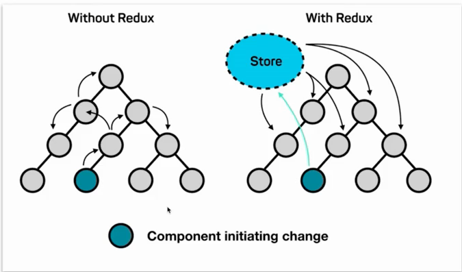
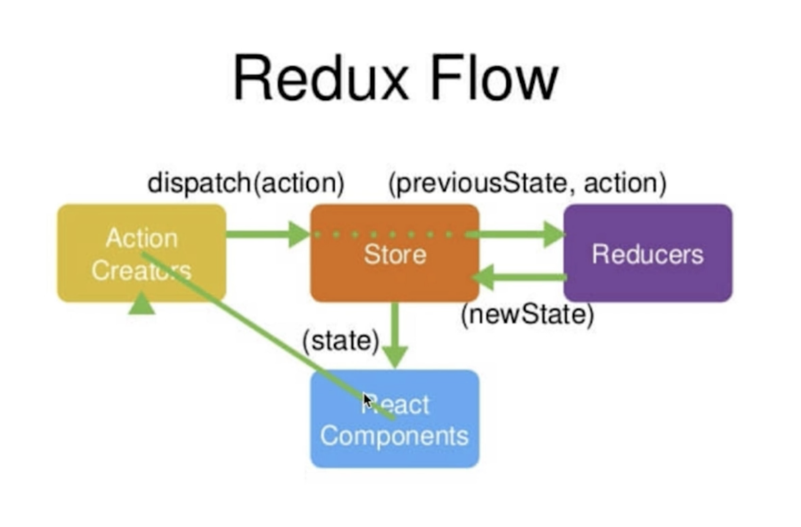
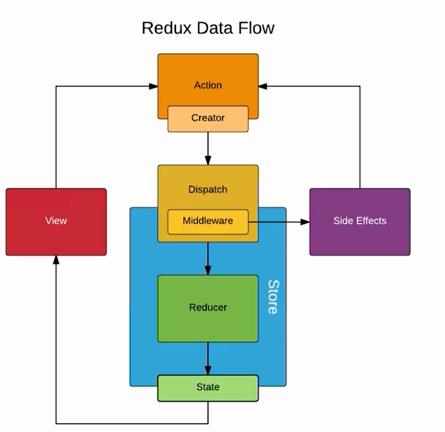

> Redux = Reducer + Flux
>
> Redux 作为 React 生态的重要组成部分，是前端数据层框架，用于负责大型项目中各个组件之中的传值。在引入Redux之后便可以使用一个全局的数据层 Store, 给各个组件传值, 避免各个组件自身传值过于复杂。

# 安装

## 使用 `yarn` 

~~~shell
cd your-app

$yarn add redux
~~~

# 核心概念

## Redux 工作流程

* React Component 即为各个 React 组件
* Store 为全局公共数据存储池
* Action Creator 负责为组件的数据操作创建一个 `action` (动作)，用于描述组件需要什么数据
* Reducers 负责处理 `action` 对应的 数据处理更新，然后更新 `stroe` 中的对应数据

## Store 定义

Store 可以看作为整个 web 前端的数据库类似 `MySQL` 之于后台的存在，它一般被定义于 `\store\index.js` 中

且它可以给 View (React component) 端 和 Reducer 端提供借口

~~~javascript
// 公共存储仓库
import {createStore} from  'redux'
import reducer from './reducer'

/* 使用 createStore 函数创建一个 store */
const store = createStore(
    reducer,
    
    /* 插件相关 */
    window.__REDUX_DEVTOOLS_EXTENSION__ && window.__REDUX_DEVTOOLS_EXTENSION__()
)

export default store;
~~~

## Reducer 定义

Reducer 可以看为后端逻辑中的 `controller` 层的存在，它可以接受 从 `React component` 中传递过来的 `action` 然后对 `action` 进行解析，最后更改当前 `store` 中的值

~~~javascript
// init 数据
const defaultState = {

    'inputValue' : '',

    'list' : [
        'Racing car sprays burning fuel into crowd.',
        'Japanese princess to wed commoner.',
        'Australian walks 100km after outback crash.',
        'Man charged over missing wedding girl.',
        'Los Angeles battles huge wildfires.',
    ]

}

// reducer 
export default (state = defaultState, action) => {

    // handle the input value change
    if(action.type === 'input_value_change'){
        // deep copy
        const newState = JSON.parse(JSON.stringify(state))

        // assign
        newState.inputValue = action.value

        return newState
    }

    if(action.type === 'button_click'){
        // deep copy
        const newState = JSON.parse(JSON.stringify(state))

        newState.list = [...newState.list, action.value]

        return newState 
    }

    return state;
}
~~~

主要的逻辑处理在中定义

~~~javascript
// 这里的 state 即为上一个状态下的数据状态 , action 即为 React component 传递过来的具体动作
/* 	
	action 一般包含两个字段
    {
    	type : 操作的类型由React component定义.
    	value: 状态的新值
    }
*/
export default (state = defaultState, action) => {
    
    // code ...
    
}
~~~

值得注意的是 `Reducer` 中不允许直接对上一个`state` 进行操作，因此需先对其 `deep copy` ，然后再返回相应的 `newState`.

~~~javascript
// deep copy
const newState = JSON.parse(JSON.stringify(state))

// assign
newState.inputValue = action.value

return newState
~~~

## React component 定义

`React component` 只能操作 `store`  而不能操作 `reducer`

### 通过 store 初始化 state

在 component 的构造函数中，可以对 state 进行初始化

~~~javascript
import store from './store/index'

class App extends Component{
  constructor(props){
    super(props)
    // init state
    this.state = store.getState()
  }
}
~~~

### 修改 store

React component 通过定义 `action` 向 store 使用 `dispatch` 函数修改 store。这里是利用 

`store.dispatch(action)` ，但是 `store` 并不直接接受这个 `action` 而是传递给 `reduce` 处理。

~~~javascript
import store from './store/index'

class App extends Component{
  constructor(props){
	// code ...
  }

  render(){
     // code ...
  }

   /* 以input 框输入事件举例 */
  inputHandleChange(e){
    /* 定义action */
    const action = {
      'type' : "input_value_change",
      'value': e.target.value
    }
    /* 分发action, store 提供的接口，但是处理者为 reducer */
    store.dispatch(action)
  }
}
~~~

### 通过 store 更新 state

React component 通过对 `store` 更新事件的 **订阅事件** 来对其自身的 state 进行更新

~~~javascript
import store from './store/index'

class App extends Component{
  constructor(props){
	// code ...
      
    this.handlerStoreChange = this.handlerStoreChange.bind(this)
    /* 当 store 更新时 ，自动执行这个订阅的函数 */
    store.subscribe(this.handlerStoreChange)
  }

  render(){
     // ...
  }
	
  /* 通过更新后的 store 来更新组件的 state */
  handlerStoreChange(){
    this.setState(
      store.getState()
    )
  }
}
~~~

### actionType 拆分

~~~javascript
/* 以input 框输入事件举例 */
inputHandleChange(e){
    /* 定义action */
    const action = {
        'type' : "input_value_change",
        'value': e.target.value
    }
    /* 分发action, store 提供的接口，但是处理者为 reducer */
    store.dispatch(action)
}

// 这样的 action.type 的方式会造成死数据，不利于维护.
~~~

抽离 actionType 

~~~javascript
/* actionType.js */

// 定义 ActionTypes 
export const INPUT_VALUE_CHANGE = "1"
export const BUTTON_CLICK = "2"
export const ITEM_CLICK = "3"
~~~

### actionCreator 拆分

同样我们讲 action 的定义抽离

~~~javascript
/* actionCreator.js */

// 文件统一创建 action
import {INPUT_VALUE_CHANGE, BUTTON_CLICK, ITEM_CLICK} from './actionTypes'

/* 框输入动作 */
export const inputHandleChangeAction = (value) => {
    return {
        'type' : INPUT_VALUE_CHANGE,
        'value': value
      }
}

/* 按钮点击动作 */
export const buttonHandlerClickAction = (value) => {
    return {
        'type' : BUTTON_CLICK,
        'value': value
    }
}

/* 按钮点击动作 */
export const itemHandlerClickAction = (value) => {
    return {
        'type' : ITEM_CLICK,
        'value': value
    }
}
~~~

在调用的时候，便可以直接

~~~javascript
import { inputHandleChangeAction } from './store/actionCreator'

/* input 框输入事件 */
inputHandleChange(e){

    const inputValue = e.target.value

    store.dispatch(inputHandleChangeAction(inputValue))

}
~~~

# 扩展

## 中间件定义

`redux` 中间件的定义在 `action` 和 `store` 中间, 是对 `dispathch` 方法的升级

## `redux-thunk`

> With a plain basic Redux store, you can only do simple synchronous updates by dispatching an action. Middleware extend the store's abilities, and let you write async logic that interacts with the store.
>
> [redux-thunx-github](<https://github.com/reduxjs/redux-thunk>)

### 安装

~~~shell
$yarn add redux-thunk
~~~

### 引入

项目只有一个中间件的时候，可以如下引入

~~~javascript
/* 引入 thunk 部分在 stroe 的创建文件中，即 store/index.js */

// 公共存储仓库, 全局唯一
/* applyMiddleware 可以使用中间件(redux-thunk) */
import {createStore, applyMiddleware} from  'redux'
import reducer from './reducer'
/* 使用 redux-thunk 中间件进行AJAX */
import thunk from 'redux-thunk'

const store = createStore(
    reducer,
    /* redux 中间件定义 */
    applyMiddleware(thunk)
)

export default store;
~~~

项目有多个中间件的时候，需要如下引入

~~~javascript
// 公共存储仓库, 全局唯一
/* applyMiddleware 可以使用中间件(redux-thunk) */
import {createStore, applyMiddleware, compose} from  'redux'
import reducer from './reducer'
/* 使用 redux-thunk 中间件进行AJAX */
import thunk from 'redux-thunk'

/* 
    这种写法让 redux 同时支持
    redux-devtools,
    thunk
    两个中间件
*/
const composeEnhancer = window.__REDUX_DEVTOOLS_EXTENSION_COMPOSE__?
window.__REDUX_DEVTOOLS_EXTENSION_COMPOSE__({}) : compose

/* redux 中间件定义 */
const enhancer = composeEnhancer(
    applyMiddleware(thunk)
)

// window.__REDUX_DEVTOOLS_EXTENSION__ && window.__REDUX_DEVTOOLS_EXTENSION__()
const store = createStore(
    reducer,
    enhancer
)

export default store;
~~~

### Redux-thunk 中间件 实现 AJAX

如果不使用 redux-thunk 那么我们的 actionCreator 只能返回一个对象

~~~javascript
/* 框输入动作 */
export const inputHandleChangeAction = (value) => {
    return {
        'type' : INPUT_VALUE_CHANGE,
        'value': value
      }
}
~~~

redux-thunk 可以使得我们的 actionCreator 返回一个函数, 从而在这个函数中进行一步 Ajax

~~~javascript
/* 不使用 redux-thunk 则action只能返回一个对象 */
/* redux-thunk 可以使得 action creator 返回一个函数 */
export const getTodoList = ()=>{
    return (dispatch)=>{
        axios.get('/api/getInit').then((res)=>{
            // success
            dispatch(todoListInitData(res.data))      
          }).catch(()=>{
            // error
            console.log('error')
          })
    }
}
~~~

调用，从而实现将 Ajax 操作封装到 `actionCreator` 中

~~~javascript
/* 组件挂载后 */
componentDidMount(){
    /* 利用 redux-thunk 返回一个异步 action */
    const action = getTodoList()
    
    store.dispatch(action)
}
~~~

## `react-redux`  🌟

`react-redux` 也是目前市面上主流的 `redux` 中间件，帮助 `react` 更好的使用 `redux`

### 安装

~~~shell
# install
$yarn add react-redux
~~~

### 简单使用

~~~
/* react-redux 需要以下文件 */
- stroe
	- index.js
	- reducer.js
	- actionType.js
~~~

~~~javascript
/* index.js 定义来自 redux 用于定义数据仓库store */

import {createStore, applyMiddleware, compose} from 'redux';
import reducer from './reducer';

/* 使用 redux & redux-develope-tools */
const composeEnhancer = window.__REDUX_DEVTOOLS_EXTENSION_COMPOSE__?
window.__REDUX_DEVTOOLS_EXTENSION_COMPOSE__({}) : compose

const store = createStore(
    reducer,
    composeEnhancer()
)

export default store;
~~~

~~~javascript
/* reducer.js */
/* 定义也来自于 redux 接受来自 store dispatch 的请求并对 store 进行修改*/

import { SEARCH_INPUT_FOCUSED, SEARCH_INPUT_BLUR } from './actionType'

const defaultState = {
    'focused' : false
}

const HeaderReducer = (state = defaultState, action) => {
    if(action.type === SEARCH_INPUT_FOCUSED || action.type === SEARCH_INPUT_BLUR){
        return {
            'focused' : action.value
        }
    }
    return state;
} 

export default HeaderReducer
~~~

~~~javascript
/* actionType.js 抽离出action type */

export const SEARCH_INPUT_FOCUSED = 'search_input_focused';
export const SEARCH_INPUT_BLUR = 'search_input_blur';
~~~

**定义完提供给 `redux` 的三个文件， 便可以使用 `react-redux` 对其进行使用** 

* `Provider` 定义 ； 

  首先在整合项目的 **入口文件 index.js** 中引入 `react-redux`, 使用 `<Provide>` 标签对项目 `<App />` 进行包裹，表示其所有的 `<App />` 的元素都可以使用 `store` 中的值

  ~~~javascript
  import React from 'react';
  import ReactDOM from 'react-dom';
  import App from './App';
  
  /* redux react-redux */
  import store from './store/index';
  import { Provider } from 'react-redux';
  
  ReactDOM.render(
    <React.StrictMode>
      <Provider store = {store}>
        <App />
      </Provider> 
    </React.StrictMode>,
    document.getElementById('root')
  );
  
  ~~~

* `connect` 定义 ： 

  `connect` 连接特定组件和 `store` 实现数据同步

  ~~~javascript
  /* react-redux */
  import { connect } from 'react-redux'
  
  /* 无状态UI组件 */
  const Header = (props) => {
      
      // ...
  }
  
  /* connect Header component with store*/
  export default connect(mapStateToProps, mapDispatchToProps)(Header);
  ~~~

* `mapStateToProps` 和 `mapDispatchToProps` 定义 :

  `mapStateToProps` 定义了组件中的 `props` 和 `redux` 中的 `stroe` 的映射关系.

  `mapDispatchToProps` 则定义了 `action` 更新逻辑

  ~~~javascript
  /* 无状态UI组件 */
  const Header = (props) => {
      
      /* 绑定事件 */
  	<Input
      	onFucus = {props.handlerSearchInputFocused}
      	onBlur = {pros.handlerSearchInputBlur}
      />	
      
  }
  
  /* 定义该组件中的 focused 对应 store中的focused */
  const mapStateToProps = (state) =>   {
      return {
          focused : state.focused
      }
  } 
  
  /* 绑定组件中的事件修改store */
  const mapDispatchToProps = (dispatch) =>{
      return {
          handlerSearchInputFocused(){
              const action = {
                  type : SEARCH_INPUT_FOCUSED,
                  value : true
              }
              dispatch(action)
          },
          handlerSearchInputBlur(){
              const action = {
                  type : SEARCH_INPUT_BLUR,
                  value : false
              }
              dispatch(action)
          }
      }
  }
  
  ~~~

### 使用`combineReducers` 拆分 `reducer`

随着项目的扩大，`reducer` 中的逻辑会越来越多, 此时可以通过 `combineReducer` 来拆分总 reducer ，比如我们进行页面`Header`编写的时候，可以给 Header 专门建立 `headerReducer` 然后使用 `combineReducer` 结合

~~~
- common
  - header
  	- store
  		- headerReducer.js
  		- actionType.js
  	index.js
- store
  - reducer.js
  - index.js
~~~

此时可以在 `/store/reducer.js` 中定义

~~~javascript
/* /store/reducer.js */
import {combineReducers} from 'redux'
import HeaderReducer from '../common/header/store'

/* 合并各个 reducer */
export default combineReducers({
 	
    /* 该reducer key值为header */
    header : HeaderReducer

})
~~~

然后在 `/common/header/index.js` 组件中，对数据的引用需要改为

~~~javascript
// ...

const mapStateToProps = (state) =>   {
    return {
        // state.focused 改为 state.header.focused
        focused : state.header.focused
    }
} 
~~~

### 拆分 `actionCreator`

~~~
- common
  - header
  	- store
  		- headerReducer.js
  		- actionType.js
  		- actionCreator.js	// 拆分 actionCreator
  	index.js
- store
  - reducer.js
  - index.js
~~~

~~~javascript
/* 抽离 actionCreator */
import { SEARCH_INPUT_FOCUSED, SEARCH_INPUT_BLUR } from './actionType'

export const searchFocused = () => ({
    'type' : SEARCH_INPUT_FOCUSED,
    'value' : true
});

export const searchBlur = () => ({
    'type' : SEARCH_INPUT_BLUR,
    'value' : false
});
~~~

则对应的 `dispatch` 可以写为：

~~~javascript
import { actionCreator } from './store';

const Header = (props) => {
	 //  ...
}

const mapDispatchToProps = (dispatch) =>{
    return {
        handlerSearchInputFocused(){
            dispatch(actionCreator.searchFocused())
        },
        handlerSearchInputBlur(){
            dispatch(actionCreator.searchBlur())
        }
    }
}
~~~

### 提供统一出口文件

~~~
- common
  - header
  	- store
  		- headerReducer.js
  		- actionType.js
  		- actionCreator.js
  		- index.js	// 统一出口文件
  	index.js
- store
  - reducer.js
  - index.js
~~~

~~~javascript
/* 该 folder 下的入口文件 */
import headReducer from './headerReducer'
import * as actionCreator from './actionCreator'
import * as actionType from './actionType'

export {headReducer, actionCreator, actionType}
~~~

~~~javascript
/* 通过统一出口文件 便捷引入 */

import { actionCreator } from './store';
~~~

## `Immutable`

> [immutabel](<https://github.com/immutable-js/immutable-js>)

`Immutable` 用于管理 `redux` 中的不可变变量 `state`

### 安装

~~~shell
$yarn add immutable
~~~

### 相关 Api  `get` & `set`

* 定义一个 immutable 对象 : `fromJS()`

  ~~~javascript
  import {fromJS} from 'immutable'
  
  const defaultState = fromJS({
      'focused' : false
  })
  ~~~

* 修改 immutable 对象 : `set()`

  ~~~javascript
  defaultState.set('focused', action.value);
  ~~~

* 获取 immutable 对象 : `get()`

  ~~~javascript
  defaultState.get('focused')
  ~~~

### 使用例子

~~~javascript
/* store/reducer.js 定义 immutable 对象 */

import { SEARCH_INPUT_FOCUSED, SEARCH_INPUT_BLUR } from './actionType'
import {fromJS} from 'immutable'

/* 对state进行 immutable 定义*/
const defaultState = fromJS({
    'focused' : false
})

const HeaderReducer = (state = defaultState, action) => {
    if(action.type === SEARCH_INPUT_FOCUSED || action.type === SEARCH_INPUT_BLUR
        
        /* 
        	对 immutable 对象state 进行重新赋值.
        	set 并没有改变 immutable, 而是做了一个 copy 替换
        */
        return state.set('focused', action.value);
    }
    return state;
} 

export default HeaderReducer
~~~

~~~javascript
/* index.js 使用 immutable 对象 */

const mapStateToProps = (state) =>   {
    return {
        /* 使用 get 使用v*/
        focused : state.header.get('focused')
    }
} 
~~~

### 不同 `json` 变量的取值

~~~javascript
/* home */
const defaultState = fromJS({
	  
      /* 普通变量 */
      "view_count" : 10,
      
      /* list 变量 */
      "topic" : ['core', 'Spring', 'PHP'],
      
      /* list_Map 变量 */
      "listCategory" : [
        {
          "id": 1,
          "name": "分享",
        },
        {
          "id": 2,
          "name": "公告",
        },
        {
          "id": 3,
          "name": "程序",
        }
      ]
})
~~~

~~~javascript
class A extends Component{
    /* 对于普通变量 */
    this.props.veiw_count
    
    /* 对于list变量*/
    this.props.topic.map((item)=>{
		{item}
    })
	
	/* 对于 list_map 变量*/
    this.props.listCategory.map((item)=>{
		{item.get('id')}
        {item.get('name')}
    })
}

/* 映射关系如下 */
const mapStateToProps = (state)=>{
  return {
    'view_count' : state.get('home').get('view_count'),
    'topic' : state.get('home').get('topic'),
    'listCategory' : state.get('home').get('listCategory'),
  }
};
~~~

### 同时修改多个属性 链式 `set`

~~~javascript
/* home */
const state = fromJS({
      "view_count" : 10,
      "topic" : ['core', 'Spring', 'PHP'],
})

/* 同时修改多个属性 */
state.set('view_count', 20).set('topic', ['JS', 'Java']);
~~~

## `redux-immutable`

~~~javascript
/* 引入 redux-immutable 的目的 */

const mapStateToProps = (state) =>   {
    return {
        /* 
        	这里我们的state.header是 immutable的 
        	但是 state 理应也变为 immutable, 则可以通过 redux-immutable 实现
        */
        focused : state.header.get('focused')
    }
} 
~~~

### 安装

~~~shell
$yarn add redux-immutable
~~~

### 使用

~~~javascript
/* 总 reducer 文件 */

/* old : import {combineReducers} from 'redux' */
/* 只需要从redux-immutable中引入 combineReducer 即可 */
import {combineReducers} from 'redux-immutable'
import {headReducer} from '../common/header/store'

/* 合并各个 reducer */
export default combineReducers({
 
    header : headReducer

})
~~~

~~~javascript
/* 调用 */
const mapStateToProps = (state) =>   {
    return {
        
        /* 此时 state 变成为了一个 immutable 对象 */
        focused : state.get('header').get('focused')
    }
} 
~~~

