# RabbitMQ

采用 `Erlang` 编写

[TOC]

# 一. 安装与启动

~~~shell
# for mac  只需要 homebrew 安装即可
$brew install rabbitmq

# 启动 :
$brew services start rabbitmq

# 停止 :
$brew services stop rabbitmq

# Client 端 web
http://localhost:15672
~~~

# 二. 使用

## User 配置

在 `RabbitMq `中 `guest` 账号相当于超级管理员

我们需要自己再创建一个账号作为我们的工作账户:

~~~
root
199511103
~~~

## virtual hsot

virtual hsot 相当于 MySQL 中的 db 的概念

我们在使用时候, 需要首先添加一个 `virtual host` , 一般以 `/` 开头

然后对用户进行授权 `Set Permissions`

# 四. 简单队列模型	

简单的 **生产者消费者模型**

一个 **生产者** , 一个 **消费者** , 一个**简单队列**

有如下的缺点

- 耦合性高 : 生产者, 消费者一一对应.
- 消费者只能有一个

**Mq 连接**

~~~java

package com.ark.rabbitmq.util;

import com.rabbitmq.client.Connection;
import com.rabbitmq.client.ConnectionFactory;

import java.io.IOException;

/**
 * 连接 Mq 工具类
 */
public class ConnectionUtil {

    private static final String url = "127.0.0.1";

    private static final int port = 5672;

    private static final String vHost = "/vhost_ark";

    private static final String userName = "root";

    private static final String passWord = "19951103";

    /**
     * get the connection of rabbitMq
     * @return Mq连接
     */
    public static Connection getConnection() throws IOException {
        // use the connection factory
        ConnectionFactory cf = new ConnectionFactory();

        // 配置连接参数
        cf.setHost(url);

        // AMQE协议 : 5672
        cf.setPort(port);

        // vhost 数据库
        cf.setVirtualHost(vHost);

        // 用户名密码
        cf.setUsername(userName);
        cf.setPassword(passWord);

        return cf.newConnection();
    }
}

~~~

**Mq 生产者发送信息**

~~~java
// 队列名 一一对应
private static final String QUEUE_NAME = "simple_test_queue";

// 获取一个连接
Connection connection = ConnectionUtil.getConnection();

// 从连接中 创建一个通道
Channel channel = connection.createChannel();

// 声明队列
channel.queueDeclare(QUEUE_NAME, false, false, false, null);

String msg = "hello world";

// 发布
channel.basicPublish("", QUEUE_NAME, null, msg.getBytes());

System.out.println("-----------------Send Msg successful------------");

// 关闭
channel.close();
connection.close();
~~~

**Mq 消费者消费消息**

~~~java
// 队列名 一一对应
private static final String QUEUE_NAME = "simple_test_queue";

// 获得连接
Connection connection = ConnectionUtil.getConnection();

// 获得通道
Channel channel = connection.createChannel();

// 声明 Queue
channel.queueDeclare(QUEUE_NAME, false, false, false, null);

// 事件触发回掉函数
// 匿名函数
// 一旦有消息进入 队列， 这个函数便会被触发
DefaultConsumer consumer = new DefaultConsumer(channel){

	// 重写 DefaultConsumer handleDelivery 函数
    @Override
    public void handleDelivery(String consumerTag, Envelope envelope, AMQP.BasicProperties properties, byte[] body) throws IOException {

        // 消息为 : Body
        String msg = new String(body, "utf-8");

        System.out.println("Receiver Msg: " + msg);

    }
};

// 监听队列 epoll (event poll)  IO模型
// 并不会阻塞线程
channel.basicConsume(QUEUE_NAME, true, consumer);

// code .. 后面的 code 照样可以执行 
~~~

# 五. Work 队列模型 (多消费者模型)

这个模型中  **一个小生产者, 多个消费者**

## 轮询分发消息

`Channel.basicConsume()`

不管消费者处理能力以及时间如何, 经过 `RabbitMq` 发送给各个消费者的消息都是均分的, 也就是说, **消息均匀分发到各个消费者** , 并不是哪个消费者处理的快, 就处理的消息多

## 公平分发消息

`Channel.basicQos(int Perfetch) `  

**可以实现 处理能力快的消费者, 可以处理更多的数据**

**需要关闭(置为false)  `channel.basicConsume(QUEUE_NAME, false, consumer);`**

`Perfetch`  的概念就是, 每个消费者在预选分发 `prefetch` 数量的消息

然后消费者消费消息后, 需要给 `Queue` 发送回执

~~~java
// Handler
Consumer consumer = new DefaultConsumer(channel){
    @Override
    public void handleDelivery(String consumerTag, Envelope envelope, AMQP.BasicProperties properties, byte[] body) throws IOException {
        try {
            Thread.sleep(100);
            System.out.println(Thread.currentThread().getName() + new String(body));
        }catch (Exception e){
            e.getStackTrace();
        }finally {
			// 手动返回消息确认
            channel.basicAck(envelope.getDeliveryTag(), true);
        }
    }
};
// 每次预分发值为 1
channel.basicQos(1);
// 消费 且关闭 AutoACk = false
channel.basicConsume(QUEUE_NAME, false, consumer);

~~~

# 六. 消息应答

~~~java
/*
第二个参数就是 autoAck 
*/
channel.basicConsume(QUEUE_NAME, false, consumer);
~~~

`autoAck = True ` 表示, 一旦 `Mq` 将数据推送给消费者, 数据就被在 `MQ` 删除, 此时可能

面临丢失消息的风险

`autoAck = False` 表示, 手动确认消息. **也就是说,当消费者确认处理完后**, 我们的 `MQ` 才将内存数据删除. 

**消息应答机制保证了, 消费者挂了,正在处理的任务不会丢失**

# 七. 数据持久化

`Mq` 将内存中的某个队列, 持久化到硬盘中.

**注意, 是持久化一个队列, 而不是队列里面的消息**

如果队列为预先定义了, 则不能通过 `durable` 声明的方式去改变该队列的持久化政策.

~~~java
// declare queue
channel.queueDeclare(QUEUE_NAME, false, false, false, null);

/*
 	第二个参数 : durable = true , 代表是否支持可持久化
 	
*/
~~~

**数据持久化保证了, MQ 挂了, 存储的数据不丢失**

# 八. 发布订阅模型

不同于前面模型的一个消费者消费一个消息, **发布订阅模型是 : 将同一个消息推送给多个消费者**

**一个队列一个消费者 !!!**

* 一个生产者, 多个消费者
* 每一个消费者都对应一个消息队列
* **此时所有的消费者都可以收到同样的消息**
* 生产者没有直接把消息发送到队列, 而是直接发送到了交换机, **Exchanger 转发到各个队列**
* 每个队列都要绑定到 **Exchanger** 上

## Exchanger 交换机

**注意交换机并没有存储消息的功能, 也就是说,如果没有队列和交换机绑定, 那么发送给交换机的队列将会被丢失**

~~~java
/*
	在生产者端, 生产者将队列发送给 交换机
	而不是直接给队列了
*/

package com.ark.rabbitmq.PublisherSubscriber;

import com.ark.rabbitmq.util.ConnectionUtil;
import com.rabbitmq.client.Channel;
import com.rabbitmq.client.Connection;

import java.io.IOException;

/**
 * 发布订阅模型
 * 生产者
 */
public class Publisher {

    // 分发器名
    public static final String EXCHANGER_NAME = "test_exchanger_fanout";

    public static void main(String[] args) throws IOException {

        // 获得连接
        Connection connection = ConnectionUtil.getConnection();

        // 获得 channel
        Channel channel = connection.createChannel();

        // 声明 Exchanger
        channel.exchangeDeclare(EXCHANGER_NAME, "fanout");

        String msg = "hello world";

        channel.basicPublish(EXCHANGER_NAME, "", null, msg.getBytes());

        channel.close();
        connection.close();

    }
}

~~~

## 队列绑定交换机 Exchanger

注意如果 `Exchanger` 不绑定 队列 会造成数据的丢失, 因为 `Exchanger` 只提供转发的工作, 不提供存储的功能

~~~java
/*
	 队列绑定操作
*/
Connection connection = ConnectionUtil.getConnection();

// get Chanel
final Channel channel = connection.createChannel();

// declare queue
channel.queueDeclare(QUEUE_NAME, false, false, false, null);

// bind 将这个队列绑定到 交换机
// 注意绑定放在 Declare 后面否则会报错
channel.queueBind(QUEUE_NAME, EXCHANGER_NAME, "");

/*
	code ... 其他的和 Work 模型一样
*/
~~~

# 九. 指定路由模型

可以通过指定的 **路由匹配** , 将生产者的消息推送到向匹配的关键字上.

从而实现消息的 **定向推送**

