# 消息队列 MQ

[TOC]

# 一. 消息队列的使用场景

## 1.1 发送消息体系和其他体系强耦合的情况 (提升开发效率)

考虑如下架构 : 系统 A 获得数据, 并且发送给 系统 B, 系统 C

但是没有消息队列的存在下, A 的发送接口和 B, C 是 **强耦合** 的, 也就是说, 如果对B, C 系统进行撤销, 或者 加入新的系统 D, 都需要有大量的代码修改工作. 

此时便可以引进 **消息队列** 进行处理 :

 解耦合的消息队列架构 

所以这种架构基于的场景就是 : 

生产消息的程序 和 消费程序之间的关系极为复杂, 很容易写成强耦合的代码, 这个时候可以引入 **MQ松耦合**

## 1.2 异步化提升高延时接口性能 (提升用户体验)

对请求返回耗时容忍很低的系统 : 

## 1.3 消峰 (保证不宕机)🌟 

大量用户在某一个精确 (**高峰**)时间端, 同时给服务器发送请求 ; 

**对于 MySQL 每秒超过3000个请求, 那么这个系统会崩溃 !!!!**

# 二. 消息队列的带来的问题

## 2.1 系统可用性降低

在第一种 松耦合的架构中, 所有的 **消息传递** 都 **依赖于MQ系统**, 也就是说, 此时MQ一旦出现问题, 会带来很严重的后果. 

且在这种架构中  也是需要考虑的问题, 因为可能 MQ 出现问题, 比如同一个消息同时给下游传递两次, 会导致数据出错

## 2.2 保持数据的一致性

因为 分开执行 SQL, 可能会导致 如果有一个 SQL 执行错误但是没有发现机制, 从而导致数据的 **不一致性**

# 三. 针对MQ缺点提出的改进

