# Zookeeper

[TOC]

# 安装

[下载地址](<https://zookeeper.apache.org/>)

## 生成 zoo.cfg

默认下载下来的 `zookeeper` 是没有配置文件的，但是自带一个 `zoo_sample.cfg`

我们仅需 copy 该文件为我们的配置文件即可

~~~shell
$cp zoo_sample.cfg zoo.cfg
~~~

## 开启 zookeeper 服务端

~~~shell
# zookeeper 服务端sh防与 bin 文件夹下
$cd zookeeper/bin

# 开启
$./zkServer.sh start
~~~

## 使用客户端进入 zookeeper

~~~shell
# zookeeper 客户端同样位于 bin 文件夹下
$cd zookeeper/bin

# 进入
$./zkCli.sh 
~~~

# 基础概念

`ZooKeeper` 是一个为分布式服务器提供 **协调服务** 的 `Apache` 项目

一个基于 `观察者模式的` 的设计模式分布式服务管理框架

负责存储个管理大家都关心的数据, 接受观察者的注册, 如果某个节点有数据的变化, 会通知已经注册的人

**Zookeeper = 文件系统 + 通知机制**

**提供 : 分布式一致性**

## 机器节点结构

节点(机器)服从 **一主多从的结构**

* 一个领导者 (Leader), 多个跟随者(Follower)

* **集群中只要有半数以上的节点存活, Zookeeper 集群就可以正常服务**

  所以我们集群的节点一般选的是 奇数个节点

* 全局数据一致 : 每个 Zookeeper Server 保存一份相同的 **数据副本**, 无论 Client 连接到哪个 Server, 数据都是一致的

  数据副本并不是所有的数据, 仅仅包含 `1MB` 数据, 就是一些配置文件

* **树形的节点结构 :**

## Zookeeper 服务

### 统一命名服务

**类似软负载均衡, 可以将一个域名定位到内部集群的不同机器上, 实现负载均衡的效果 (可以类比于 Nginx)**

### 统一配置管理

* 一个集群中, 所有节点的配置文件都是一致的
* 对配置文件修改后, 可以快速同步到各个节点上

* 可以将配置文件写在 Zookeeper 的各的 Znode 上

### 统一集群管理

* Zookeeper 可以实时监控节点的状态变化

## Zookeeper 选举机制

选举机制就是一种选举出 **集群 Leader** 的一种机制

1. **半数机制 :** 集群中半数以上机器存活, 集群可用, **所以 Zookeeper 适合安装奇数台服务器**
2. Zookeeper 工作是没有要求我们配置出 **Leader, Follower**. 但是 **Leader** 会通过内部的选举产生, 这就是 Zookeeper 的选举机制

**选举机制如下 :**

* 集群中, 每一个节点都具有投票权
* 投票选举过程从 **myid** 最小的开始
* 每一个节点首先投票投给自己, 如果此时没有产生 **Leader** 那么投票投给 **myid** 最的节点
* 如果某一个节点的获得的票数超过半数, 那么该节点立即升级为 **Leader**, 而无需再管其他节点的投票.

## Zookeeper 节点类型

* 持久型节点 : 客户端和服务器断开后, 创建的节点不删除
* 短暂型节点 : 客户端和服务器断开后, 创建的节点自己删除 **可以用于判断节点的存活与否**

