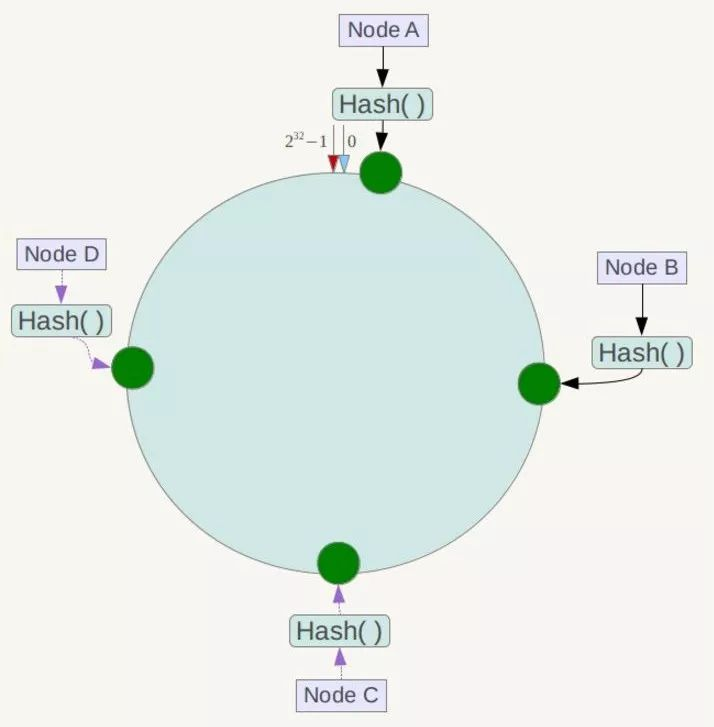
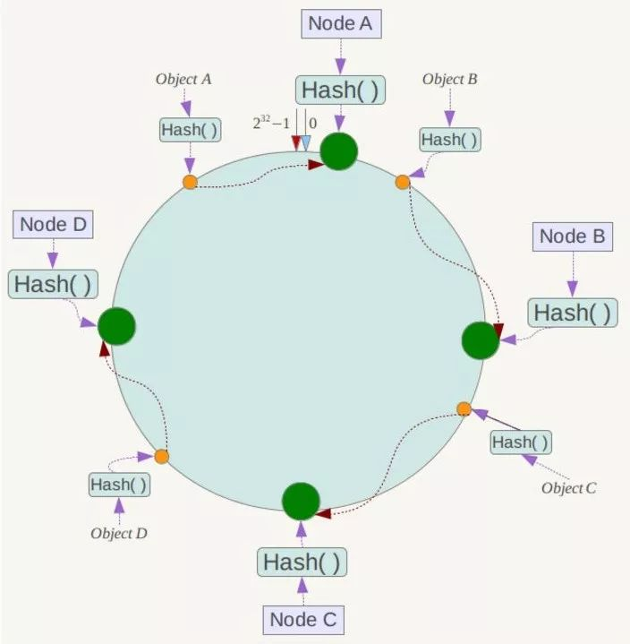

# 分布式系统设计

[TOC]

# 分布式系统的经典基础理论

> [分布式系统的经典基础理论](<https://blog.csdn.net/qq_34337272/article/details/80444032>)

本文主要是简单的介绍了三个常见的概念： **分布式系统设计理念** 、 **CAP定理** 、 **BASE理论** ，关于分布式系统的还有很多很多东西。 

## 分布式系统设计理念

两大设计思路:

* **中心化 :**

  分布式集群节点分为 : **Master, Slaves** **Master**为领导监督各个从属机器的工作, 以及分配任务, 如果从属机器宕机, 则主节点将其踢出集群. 但是这种设计思路可能造成, 如果 **Master** 宕机, 便造成混乱.

* **去中心化 :**

  去中心化并不是没有中心节点, 而是中心节点人人都可以当 (人人都可以做领导), **中心节点通过选举产生**. (典型的就是 **Zookeeper** )

  去中心化的设计也有很严重的问题,就是 **脑裂** , 就有由于一个集群的故障, 导致两个集群不能正常通信, 从而造成严重的数据冲突问题.

## CAP

对于一个分布式系统来说, 不可能同时满足以下三点 :

* **一致性（Consistence）** :所有节点访问同一份最新的数据副本	

  也就是说, 系统每次更新一个节点的数据之后, 数据会自动同步到所有其他的节点, 从而用户每次读取的都是最新的值, 这样的系统被认为 **强一致性**

* **可用性（Availability）**:每次请求都能获取到非错的响应——但是不保证获取的数据为最新数据

* **分区容错性（Partition tolerance）** : 分布式系统在遇到某节点或网络分区故障的时候，仍然能够对外提供满足一致性和可用性的服务。

  也就是说, 当分布式系统被划分为多个网络区时, 如果网络故障, 同一个区域的可以通讯. 但是区域之间不能通讯, 这个情况下, 系统还是要为用户提供 **一致性和可用性**

**权衡 (必须满足 P )**

****

在分布式系统中，**分区容忍性必不可少**，因为需要总是假设网络是不可靠的。因此，CAP 理论实际上是要在可用性和一致性之间做权衡。

- 为了保证一致性（CP），不能访问未同步完成的节点，也就失去了部分可用性；
- 为了保证可用性（AP），允许读取所有节点的数据，但是数据可能不一致。

## BASE

BASE 理论是对 CAP 中一致性和可用性权衡的结果

BASE 理论在保证 **P** 的情况下, 对 **CA** 进行了中间权衡保证

* **权衡 A :** 在分布式系统出现故障的时候, 为了保证核心可用, 允许损失部分可用性 . 
* **权衡 C :** BASE 理论中, **不要求满足强一致性**, 而是需要满足 **最终一致性** . 也就是说集群中, 各个主机拥有各自的数据副本, 但是可能某一时刻各个副本之间的数据不相同. 称为数据的中间状态. 但是这并不影响系统的整体可用性

# 一致性 Hash

## 传统 Hash

在数据量特别大的时候, 我们需要对 `redis` 缓存层做 分库分表的操作, 即主从分离达到 `读写分离` 的效果, 这是便涉及到了服务器集群的问题, 我们将不同的 `redis` 服务器部署在不同的机器上, 实现了分布式的布局

但此时也带来也问题, 就是如果分布式部署 `redis` 服务端, 那么我们如何去获得每个存储对象的存储信息.

**一个解决办法是:**

`Loc(obj) = Hash(obj) % Nums(redis)` , 这样我们可以在 `O(1)` 的时间范围内去获得 `Obj` 的定位信息:

但是这样的实现有很大的 **弊端** :

* 如果 `redis` 服务器的数量增加, 意味着 **在原有机器上的缓存位置都要重新计算 !!!**  因为 `Hash(obj) % nums`必然会发生变化
* 同样的, 如果  `redis` 服务器的数量减少, 也会引起所有 **缓存位置的变化**

## 一致性Hash原理

针对上面算法带来的两个严重的问题, 我们引出了 `一致性Hash算法`  :

即 我们取模时候, 是模的 `2^32 -1 ` , 然后所得的的结果 **逆时针** `跑` 碰到的第一个 `Node` 便是我们存储的`Node`

`Loc(obj) = 逆时针运动(Hash(obj) % (2^32 - 1))`

