[TOC]

# 分布式锁

**分布式集群** 上, 实现分布式锁有多重方式 

* 基于数据库
* 基于 **Redis**
* 基于 **zookeeper**

**当系统架构上升到 分布式集群的场景下, 则需要实现的 进程之间的数据安全 **, 而不同于 **JVM** 仅仅是 **线程之间的数据安全** , 所以传统的 **JVM** 锁, 并不适用于 **集群的环境**

# 一. 基于数据库

利用 `MySQL` 的 行锁, 就可以实现分布式的锁

基于数据库的行锁实现, 性能依赖于数据库的性能, 性能较差

# 二. 基于 Redis

基于 `Redis` 的 `setnx` 命令实现, 并且通过 `LUA` 脚本保证解锁时对缓存操作的原子性

由于基于内存, 所以可以实现性能高, 但是无法优雅的实现阻塞锁.

## 基础知识

**SETNX 命令:**

是 redis 的 set 命令, 使用 : `SETNX key value` 

效果如下: 

如果 key 不存在, 则将 `key - value` 写入

如果 key 存在, 则 `do nothing`

**Set 命令加入 NX(Not Exist) 模式, 且设置一个缓存过期时间 :**

`set name "ark" NX PX 2000 `

表示 : `NX` 模式 设置一个键值对 `name => ark` , 且 这个键值对的过期时间为 2000 毫秒 = 2秒

## Redis 实现分布式锁的正确格式

加锁过程 : 

通过 `SET a b NX PX` 给特定的 key 写入一个随机值, 并且同时设置失效时间. 写值成功即加锁成功

* 必须给锁设置一个失效时间 **从而避免死锁 ** : 比如防止竞争到锁的服务突然宕机则可能造成死锁
* 加锁时, 每个节点产生一个 **随机字符串** (每个竞争服务持有一个特点的随机字符串) : **避免误删**  : 比如竞争到锁的服务在过期时间过后才去删除, 此时可能误删
* 写入随机值与设置失效时间必须同时 : **保证原子性**

解锁过程 :  	 

匹配随机值, 如果匹配成功, 则解除锁定

* 当前竞争到锁的服务 比较 key 值的 value 和 持有的是有的是否相同, 如果相同才进行 `del` 操作

# 三. 基于 zookeeper

​	

