## 人工神经网络(ANN)

人工神经网路在仿生上模仿(**极其简单的模仿**)了人脑的神经结构, 可以**Learn from data**. 和**生成模型不同** ,神经网络不会去计算概率分布,而是构建一个**最优化的数学拟合表达式[1]**. 去解决一些实际的问题(最广泛使用的还是**分类问题**). 

如图为一个三层神经网络的基本结构, 第一层为输入层(input layer), 第二层为隐藏层(hidden layer), 第三层为输出层(output layer). 中间的节点为神经元(neuron)

一个三层神经网络的基本结构

神经网络的主要形式分为以下两种:

* 基于监督(Supervised)学习的神经网络
  * **分类问题(主要)**
  * 回归问题[2]

* 基于非监督(Unsupervised)学习的神经网络
  * 聚类
  * 密度估计

<small>[1] 神经网络理论上可以拟合任意的函数</small>

<small>[2] 也可以用于回归, 但是绝大多数的应用都在分类上, 如果在回归也需要在最后一层只有一个神经元且不给激活函数</small>

### 线性的ANN结构

#### 基本结构

以**分类问题作为切入点** , 一个**简单的线性ANN** 的结构可以如下表示:

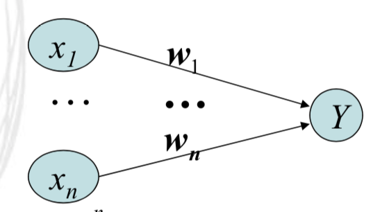

single layer Linear ANN

在这个结构中, 即使和我们的**线性分类问题基本一致** , 输入为数据的特征向量(Input layer), 输入为其线性相加:

这个在我们的线性判别的分类问题中, 就相当于我们的**决策界**

然后我们再设置一个阈值T, 从而完成了一个简单的二分类问题的解结构 :

我们将 *X* 预测为 class1 if Y >= T

我们将 *X* 预测为 class2 if Y < T

#### 加入偏置项 Bais

我们假设阈值 T = 0,  为了方便表述, 输入神经元的个数(即输入数据的特征个数)设置为2. 从而我们有

这一条二维平面的**直线形成了我们的决策界 (Decision region/boundary)**, 从而在直线两边的点可以分别被分类.

但是有一个问题就是 : **这一条决策直线是一直经过原点的** , 从而给我们的分类问题造成了限制. 为了解决这个问题, 我们给这个结构加入一个偏置b, 如图 :

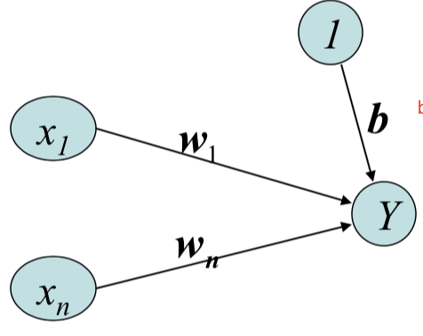

* 加入的b[1]可以为任意常数(当为0的时候, 就默认回到过原点的状态)
* 从而我们ANN的输入层的维度增加一个默认为1的点

从而我们的公式变为:

<small>[1] 其实这里的b也可以看为非零的阈值, 但我们通常将阈值设置为0</small>

#### 训练线性ANN

可以看到这个决策界就是被ANN的weight和bias决定的, 所我我们**训练ANN的过程就是找到最佳的weight 和 bias的过程**, 寻找最佳参数的过程我们可以利用 : 

##### LMS(delta) rule 

这个规则旨在利用**梯度下降法(证明见本节末)**找到**线性神经网络**的最优解. 对于模型好坏的衡量标准, 我们LMS作为我们的误差函数, 对于P个sample我们的误差函数如下:

(E is an error function of Weight)(用1/2的为了梯度下降的微分方便)

我们希望去Minimuize这个误差函数, 从而找到对应的 Weight 和  Bias

利用**梯度下降法**有以下步骤:

* 对E求相对于Weight向量的各个偏导数(**Partial Derivative**)   :

* 更新我们的Weight向着更低的方向移动 : [1]   即换一种写法, 我们可以写为 :

   [2]

* Repeat 直到达到收敛条件

<small>[1] 经过计算, 在线性神经网络上, 这个式子可以被简化为 : , t, y 分别为target和预测值, xi 为第i个输入层神经元</small>

<small>[2] 这种写法将在我们的MLP后向传播过程中用到</small>

##### 算法描述

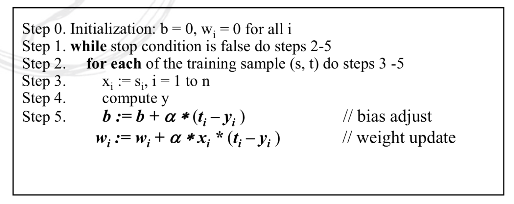

**其中 alpha 为我们的学习速率,  定义每一步移动步长大小**

##### 更新策略

- Batch 更新 : 我们读取完所有的数据之后, 再去更新
- On-line 更新 : 我们每读取一个数据, 就跟新一次

更新策略对应到算法上就形成下面两种形式:

* Sequential mode (on-line mode) : 每读取一个数据, 跟新一次Weight 喝 Bias
* Batch mode : 在读取完所有的数据后, 再更新我们的Weight 

利用 On-line 的方式会使得我们对数据的顺序更加敏感, **使用Batch一般会得到更好的结果**

##### Notes:

* 在算法中, E 是单调减小的, 但是可能最后收敛到局部最小值(local minimum)
* 该算法运用在**线性系统中 (Linear System)** 即没有加激活函数

#### 对于线性ANN的总结

* 线性的ANN结构不管含有多少层神经网络, 都是线性的! 证明如下 :

  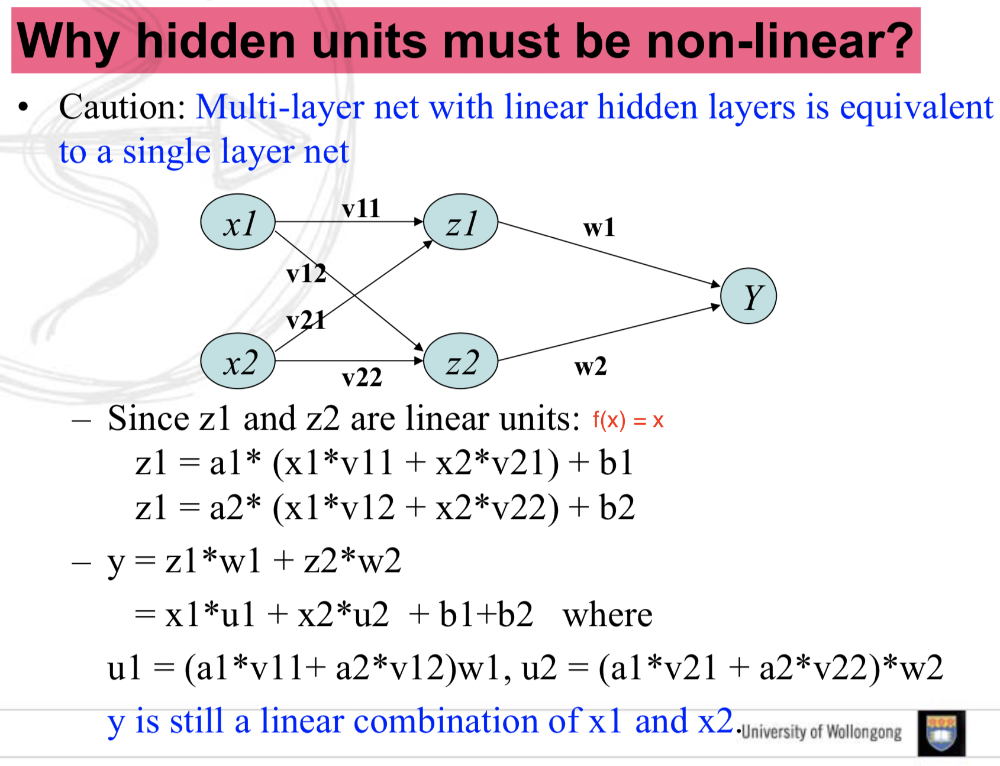

  可以看到三层的ANN, 如果隐藏层是线性的函数, 那么最后的输出结果依然是x1, x2线性的组合表示, 可以推广到多层 : **多层的ANN, 只要激活函数是线性的, 不管中间有多少层, 结果依然是线性的, 且可以等效为单层的ANN**.

* 线性的ANN结构只能解决线性可分(**Linearly separable**[1])的问题

<small>[1] if two classes of patterns can be **fully separated** by the **linear equation**, then they are said to be linearly separable</small>

### 非线性ANN结构

线性结构下的ANN, 虽然简单, 但是面对线性不可分(**Linearly inseparable**)的问题便束手无策. 以最简单的异或门举例子.

#### 异或XOR问题导致的AI寒冬

对于线性结构下的ANN, 在空间上甚至无法区分非线性的class, 导致进入了AI寒冬

异或门电路的真值表如下:

| x1   | x2   | y    |
| ---- | ---- | ---- |
| 1    | 1    | 0    |
| 1    | 0    | 1    |
| 0    | 1    | 1    |
| 0    | 0    | 0    |

二维空间上表示为坐标轴上的四个点. 上下一类, 左右一类. **找不出任何一个线性函数可以将它们区分**

##### 非线性ANN解决XOR问题

这个问题当我们**非线性函数作为隐藏层的激活函数的时候** , 便可以得到解决, 结构如下:

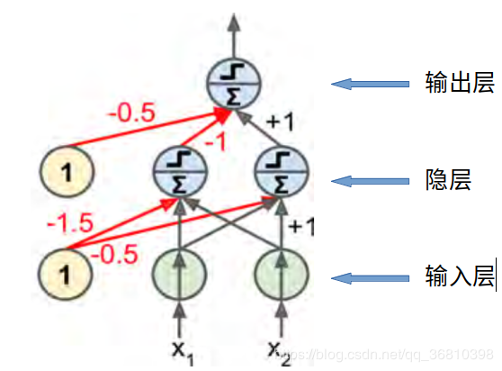

XOR问题

我们选用了**阶跃函数 (heaviside)**, 作为激励函数.

阶跃函数定义如下 :

~~~
h(x) = 0 if x < 0 
h(x) = 1 if x >= 0
~~~

从而我们可以验证 :

~~~
当输入(x1, x2) = (0, 0) 时 :
隐藏层左 = h(0*1 + 0*1 + -1.5) = 0
隐藏层右 = h(0*1 + 0*1 + -0.5) = 0
输出层 = h(0*-1 + 0*1 + -0.5) = 0
输出为0
~~~

#### 引入MLP (Multi-layer Perceptron Networks)

对于**多层的**具有**非线性**结构的ANN, 我们将**它称为MLP**有如下特点 :

* 至少包含一个隐藏层(hidden layer)
* 隐藏层的神经元必须是**非线性(non-linear)的激励函数** , **非隐藏层(例如输出层)**可以使用线性 f(x) = x 的激励函数
* MLP的每一层的都是和下一层**全连接(fully connected)**, 且每个连接都有各自的**权重(Weighted)**
  * 对于一个MLP的训练算法通常叫做 **Back-propagation Algorithm** 是我们梯度下降(gradient descent)思想的一个应用 , 包括两个过程:
  *  **前向传播 (Forward phase)** : 权重固定(fixed), 输入向量经过网络中各个层的传递到输出层的过程
  *  **后向传播 (Backward phase)** : 通过比较输出和期望获得误差信号, 然后逐步的向后调整权值达到减小误差的目的

##### 前向传播过程 (Forward phase)

所谓的前向传播就是由**输入数据的特征向量获得输出的过程** , 其中 output layer 的输出结果, 就是整个MLP的输出结果. 在 MLP 中任意一个神经元的输出值计算公式如下 :

*  : 代表了第n层的第j个神经元
* f : 即为该层的激励函数
*  : 即为连接i, j 的权重

##### 后向传播过程 (Backward phase)

后向传播就是根据 **预测值和真实值的误差, 逐步的由后向前纠正权重的过程** , 实现的原理和线性的ANN类似, 也是**利用了梯度下降法, 将权重向误差小的方向调整.** 在这个模型的后向传播中, 我们默认:

* 隐藏层的激励函数可导[1] , f(x) 求导 用 f'(x) 表示
* 输出层的激励函数为线性, f(x) = x (即没有加激励函数)

接下来我们按步骤描述这一个过程[4] :

1. 首先我们要有一个 **cost function[2]**  e.g. 均方差:   ,为了计算的方便, 我们可以将该目标函数变为: [3] 

   **注意这里的求和是求的n个输出层神经元的误差,  而不是n个sample**

2. 首先从最后一层 **ouput layer** 开始计算. 由于输出层的激励函数就是 f(x) = x , 所以在调整**最后一层记为n, 和倒数第二层记为n-1** 的时候, 计算公式和线性ANN的调整方法(计算方法)一样, 可以写为:
    参数说明如下 :

   * xj为第n-1层的第j个元素
   * wij即为连接第n层神经元i和第n-1层神经元j的权重
   *  = (xi - ti)为第i个输出神经元和期待值(target)的差
   * alpha为学习速率.

   上述过程反应到如图, 可以得到 : 

   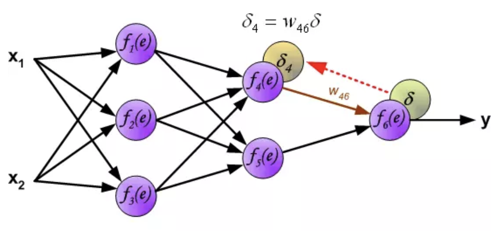

   **在计算出这个变化量后, 不应该马上调整, 因为后续的调整步骤依赖于这个原始的权值, 所以需要计算出所有的权值之后, 再进行更新**

3. 计算完输出层后, 我们开始计算隐藏层的权重更新. 利用一张图示可以清晰的描述出反向传播, 图中可以看出**反向传播就是以误差为输入, 方向由输出到输入的传播过程** , 我们在输出层计算出误差以后, 就可以将误差向输出层传播调整权值. 此时的理解就是输出当输入, 传播反向. 从而可以得到n-1层的误差. 有 : 

    (其中的函数即为隐藏层激励函数的导数了, 其中e是前向传播过程这个神经元的sum项)

   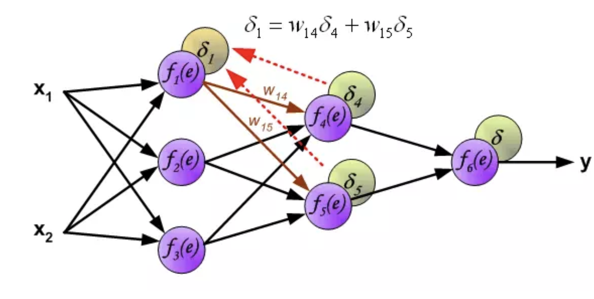

<small>[1] 由于利用了梯度下降法, 所以后向传播的过程要求了我们的**激励函数是可导**的</small>

<small>[2] 用来衡量我们模型的误差, 这也是我们要减小的目标函数</small>

<small>[3] 注意这里的求和是求的n个输出层神经元的误差,  而不是n个sample</small>

<small>\[4] [反向传播过程](<https://www.jianshu.com/p/3a65213e68a8>) </small>

##### 公式总解

**所以我们的公式总计可以总结如下:**

\- 对于forward-phase:

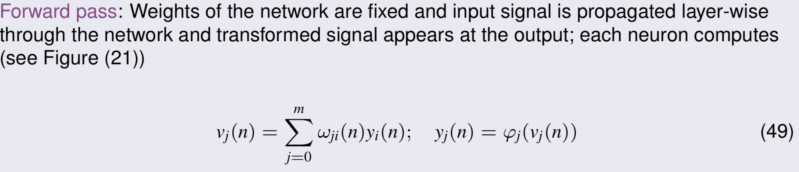

\- 对于backward-phase:

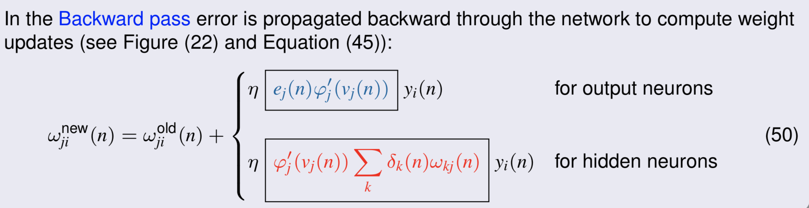

* 输出层来说, 激励函数一般为线性的, 所以其导数一般为1
* 此时隐藏层的激励函数的导数的自变量 Vj(n) 即为前向传播过程中, 这一步的值

##### 算法描述

~~~
The MLP training algorithm :
1: init the weights in the MLP with random values
2: Repeat 
3: 	 for each sample x in the training set
4:		y0 = MLP_output(x0);
5:		e  = calculate error (target - y0)
6: 		compute the delta_W for all weights by using the gradient descent 
7: 		update the Weights
8:	  Until MLP error converge
~~~

#### 激励函数种类

>[理解激活函数](<https://mp.weixin.qq.com/s?__biz=MzU4MjQ3MDkwNA==&mid=2247483977&idx=1&sn=401b211bf72bc70f733d6ac90f7352cc&chksm=fdb69fdecac116c81aad9e5adae42142d67f50258106f501af07dc651d2c1473c52fad8678c3&scene=21#wechat_redirect>)

这些激活函数保证了MLP的非线性映射, 只要激活函数选的合理, 理论上, 三层MLP就可以实现对任意函数的逼近 (**万能逼近(Universal Approximator)定理**)

##### Sigmiod 函数

公式为:  

函数图像为 : 

无穷小点为0, 无穷大点为1

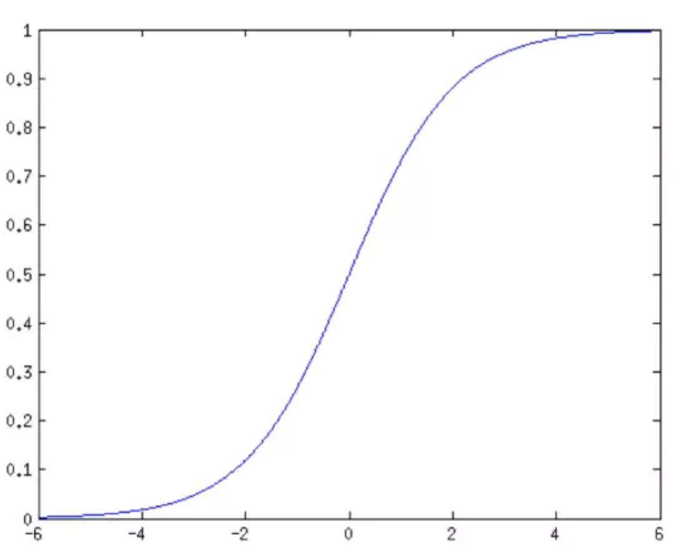

##### tanh 函数

公式为 : 

图像为 : 

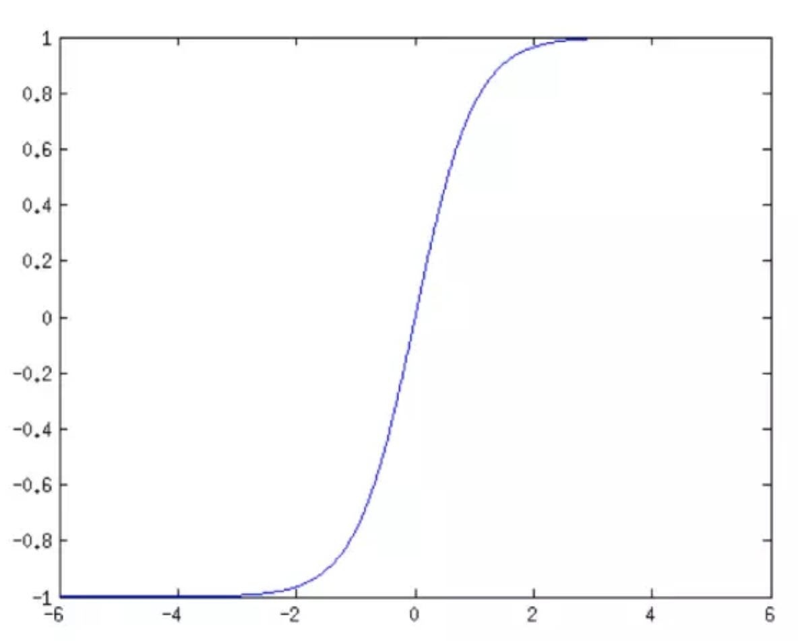

##### Softmax 函数

公式为 :  

可以将不同的输入映射到(0,1)区间, 且值可以看为输入值的概率分布 :

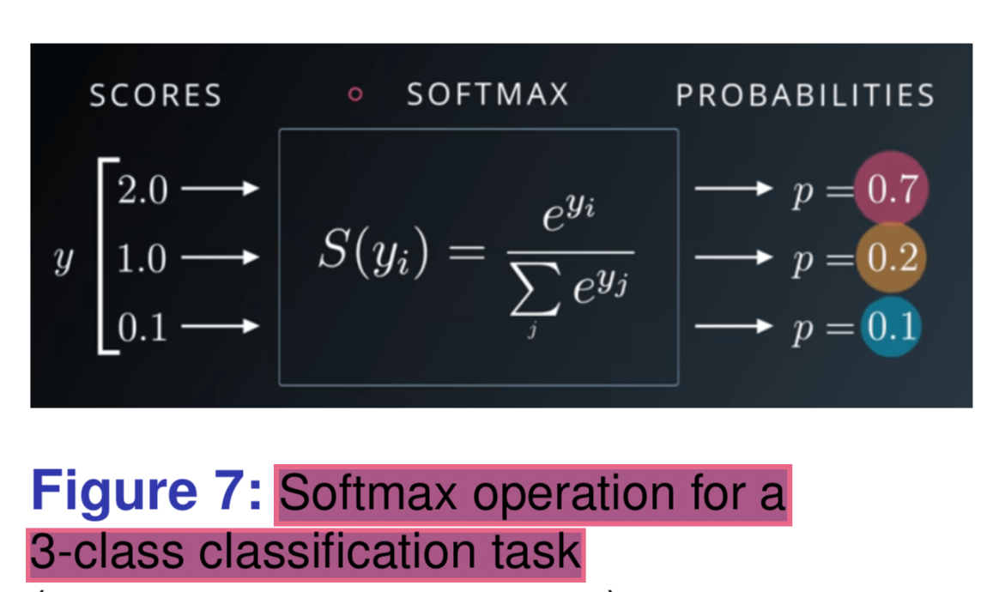

#### 对于非线性ANN(MLP)的总结

* MLP 相对于我们来说就是一个黑盒子‘black box’. 特别是在deep learning领域, 我们不知道为什么会有这样的结果, 但是就是发生了. (There is no rule to be extracted)

##### Limitation 

* 这是一个 **Asymptotic algorithm** : 意味着误差会 **缓慢的** 接近最小.
* 很容易收敛到局部最小值
* 有很多参数需要设置, 所以在**样本空间小**的情况下, **很容易导致过拟合**, 这也是近几年在拥有大量的数据量和计算能录后, Deep learning 才火起来的原因. 

##### 小Tips

* 学习速率通常是0,1之间的数, 可以动态改变, 且更有利于收敛
* 输出神经元一般利用线性的激励函数因为: 有些非线性的激励函数的值域有限制, e.g. Sigmoid函数值域为[0, 1]这和我们的样本的target值会相差较大

#### 非线性ANN(MLP)的知识点问答

* **Q : 我们增加MLP的隐藏层会有什么影响 ?**

  A : 1. 增加隐藏层可以模拟复杂性增加的问题, 但是也会导致**梯度消失的问题**. 2. 更为明显的就是可能造成overfitting. 

* **Q : 基于万能逼近定理, 我们三层MLP可以逼近任意函数, 是不是意味着, 我们不需要高于三层的MLP模型?**

  不是, 有些复杂的模型, 在三层MLP拟合下, 会变的特别复杂, 虽然可以做到, 但是代价太大.比如, 对于一个简单的线性可分的问题, 我们不可能选择很复杂的模型, 虽然复杂的模型可以拟合出来.

### 非线性ANN(MLP)的训练

**目标** : 训练出**泛化能力强(generalization)**, 准确率高的MLP模型.

所谓的泛化能力指的就是模型在**新数据前预测准确率依然很高的能力**. 泛化能力强的模型, 一定不是过拟合(Overfitting)的. 下图是泛化误差和训练误差的图表 :

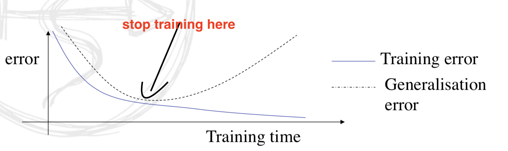

* 可以看到, 我们的训练次数增多, 泛化误差会越来越大, 从而导致过拟合的问题出现
* 我们希望训练出来的MLP停止在这个**泛化误差的最低点, 而不是训练误差的最底点**

#### 所有的训练数据拿来训练模型 (All in 训练法)

这种简单的方法就将**所有的数据都拿出来训练** (显然不是一个很好的方法) , 这种方法很容易导致下面的问题

* 模型很容易导致overfit, 特别是在输入的数据特征值特别多的情况下
* 虽然训练的误差值很小, 但是泛化误差很大

#### Hold-out method (三分训练法)

这种方法的思想就是, 我们将训练数据集分为三部分 : **training dataset, validating dataset, test dataset**, 一般的占比为 3 : 1 :1

* Training dataset : 用于获得MLP模型的基本参数如 Weight, bias. 就是训练时候用到的数据集
* Validation dataset : 用于阶段性的检验MLP的泛化能力, 从**而可以让我们人为的调整超参数[1].**
* Test dataset : 用于评估模型的泛化能力.

##### 验证集 和 测试集的区别

| 类别               | 验证集             | 测试集           |
| ------------------ | ------------------ | ---------------- |
| 是否训练模型时用到 | 否                 | 否               |
| 作用               | 用于调超参数       | 验证评估泛化能力 |
| 使用此时           | 多次使用, 不断调参 | 使用一次         |

##### Tips;

* 及早的停止学习可以**减小训练误差** 和 **验证误差**

<small>[1] 就是模型之外的全局参数比如 : 学习速率等等</small>

#### 交叉验证 (N-fold) Cross-validation

这种是更加常用的方法. 特别是当数据量小的情况下. 这是一个很好的验证方法

#### 后向传播的提升方法

对于特别复杂的MLP, 后向传播算法会变的非常**time expensive**, 我们可以用下面的方法去提升后向传播的速度

* GPU !!!!
* 数据预处理阶段减小输入数据的维度
* 归一化数据(Normalize)
* 用动态的学习速率
* ......

**用基于算法的形式去改进 : **

##### 1. 基于动量(Momentum)的后向传播改进算法

可以在不减少稳定性的条件下, 提高MLP的收敛速度. 如下可以在我们的权重改变公式下,加入一个额外的项.

其中 alpha 是一个常数

加入动量的效果:

* 如果变化方向相同 : 则动量加大改变幅度, 加大收敛速度
* 如果变化方向相反 : 动量减小摆动的幅度, 增加稳定性. 一定程度上可以防止被困于局部值

##### 2.Stochastic gradient decent(随机梯度下降)

### 一些关键证明

#### 证明梯度下降法(gradient-based)的可行性:

假设我们需要优化的函数为的f(x), 那么在点x的导数为f'(x), 这个导数给予我们函数的在点x的倾斜度(Slope), 根据泰勒展开公式我们有 :

<a href="https://www.codecogs.com/eqnedit.php?latex=f(x&space;&plus;&space;\varepsilon&space;)&space;\approx&space;f(x)&space;&plus;&space;\varepsilon'f(x)&space;\quad&space;s.t.&space;\varepsilon&space;>&space;0" target="_blank">&space;0" title="f(x + \varepsilon ) \approx f(x) + \varepsilon'f(x) \quad s.t. \varepsilon > 0" /></a>

即说明有公式 : f(x - $\epsilon$f'(x))  < f(x)

通常 $\epsilon$ 可以看作我们做梯度下降时候的步长

假设在二维的情况下 : 所以可以看出, 当导数大于0的时候, 我们的x应该向左移动(即x轴的负方向).

**所以此时我们x应该移动的方向是: x -= $\epsilon$f'(x)**

所以有了如下结论:

So we reduce f (x) by moving x in small steps with the **opposite sign** of the derivative

 

