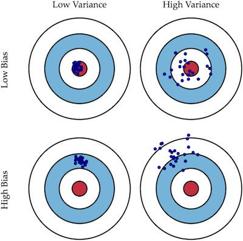
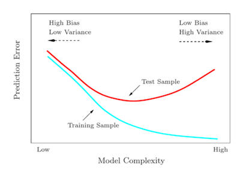

## Intro to Machine Learning

### 1. 什么是机器学习

* 机器学习是自动从数据中提取某种模式(patterns)的过程
* 机器学习是通过计算机使用 **example data** or **past experience** 来优化一个**perfirmance criterion**的过程
* 通常来说, 机器学习就是建立一个或多个**学习算法** 使得**输入数据(units)**映射到**输出数据(units)**
* 学习算法(learning algorthm) : 可以从数据中学习的算法, 通常包括: 优化器, 损失函数, 模型, 数据集.
* 模型可以用来**预测新数据(predictive), 描述现有数据(descriptive)** or both

### 2. 通常的机器学习分类

#### 2.1 监督学习(Supervised learning)

学习者利用有**标签的训练数据**去训练模型, 然后预测没有见过的数据

e.g. 分类, 回归, **ranking**, ...

#### 2.2 无监督学习(Unsupervised learning)

学习者利用有**没有标签的训练数据**去训练模型, 然后预测没有见过的数据

e.g. 聚类 ...

#### 2.3 半监督学习(Semi-supervised learning)

学习者的训练数据同时存在**有标签数据**, **无标签数据**. 且标签数据 >> 有标签数据. 且有标签数据的获得过程非常expensive

#### 2.4 转导推理(Transductive inference)

和半监督学习类似

#### 2.5 在线学习(on-line learning)

在一个模型训练好的情况下, 有新的数据不断的过来, 这时训练模型**不断的修正, 优化**. 而不需要抛弃老的模型之后再重新训练.

相应的, 传统的模型训练是在所有的离线训练数据上训练一个模型, 如果有新的数据, 需要将新的数据和老的数据重新合在一起训练

#### 2.6 强化学习(Reinforcement learning)

训练和测试阶段混合, 学习者和环境不断的互动从而收集相应的信息, 从而立即获得每一个行动的奖励(reword), **目标是是随着时间的推移获得最大还的奖励**

#### 2.7 主动学习(Active learning)

属于半监督学习, 在主动学习的过程中, **用于数据集中标签数据较少的情况**, 先使用有标记的样本去训练出一个模型, 然后根据模型去预测未标签的数据, 然后询问用户预测结果中最不确定的数据给用户贴标签,从而提高模型的性能 

目标是获得和标准的监督学习获得相当的性能

### 3. Learning Task 的一些例子

#### 3.1分类问题(classification)

分类问题的输出数据是属于K个分类的数据集, 需要找到一个模型

**x 是可以代表输入数据的属性(features)**

输入x可以输出这个数据所在分类, 当然可以是x属于各个分类的概率

#### 3.2 回归问题(Regression)

**需要用给定的输入数据预测一个数字(numerical value)**

相比于分类问题, 不同的仅是输入的不再是特定的分类类型(离散的 discrete), 而是连续的数字

#### 3.3 排名问题(Ranking)

#### 3.4 聚类(Clustering)

### 4. 衡量一个模型的好坏(Performance)

我们必须选择一个task-specific 的参数去衡量一个模型的好坏, 且选择的参数需要和模型匹配:

#### 4.1 分类

* Accuracy 

  ACC = $\frac{预测正确的数量}{所有数量}$

  这种表示方法有时候非常不准确, 因为在数据分布不平衡的情况下, 这个数值会显得没有多少意义. 比如一个二分类的问题, 如果有1000个样本, 其中1个正, 999个负, 那么当模型全预测一边的情况下, 准确率也可以到达999%%, 没有多大意义

* Error rate

  和准确率相反, 描述了预测错误数量的比例, 可以计算为: 1 - ACC

* sensitive(灵敏度)

  定义为其中一类的的准确的概率: S = $\frac{类一预测对的数量}{类一所有的数量}$

* Precision (准确率)

  定义为所有被分为该类,和实际该类的比例:
  P = $\frac{实际类一的数量}{所有被预测为类一的数量}$

* Recall (召回率) 

  和灵敏度一样

* Etc.

#### 4.2 回归

* MAE

* MSE (mean square error)

  以一个简单的线性回归问题举例, y = w$^t$x, 数据集分为 test 和 training

  test数据集的MSE就可以用来横量这个模型的好坏 MSE$_{test}$=$\frac{1}{N_(test)}\sum_{i}(y'^{test} - y^{test})^2$

  train数据集的MSE可以用于求出最好的系数w

### 5. 模型的泛化能力(Generlization)

* Generlization: 是描述一个模型对**unseen data**的预测能力的描述

通常, 我们用train data去训练一个模型, 然后用test data去衡量它, 所以我们希望, 通过train data训练出来的模型对 test data的预测也同样准确. 

影响一个学习算法的因素有以下两点

* 需要使得训练error很小
* 需要使得gap between train error 和 test error 很小

所有引出了一下几个描述概念:

#### Underfitting

train error 很大 

#### Overfitting 

gap 很大, 可以通过增加train data数量的方法来避免overfitting的发生

可能的导致因素 :

* 当训练的数据过少, 数据量于噪声是成反比的, 少量的数据导致噪声很大

* 特征数目过多导致模型过于复杂 e.g.这个例子中, 明明中间的模型可以有很大的泛化能力, 但是当特征数目过多的时候, 第三个就变得非常复杂, 虽然可以很好的fit训练数据集, 但是对于Unseen数据就有**很差的预测能力**

  

  ​	

### 方差偏差权衡(Bias-Variance Tradeoff)

#### 以一般化的视角来看

Bias-Variance 权衡是针对于模型的泛化能力来说的. 一般来说, 一个模型的泛化误差(Generalization error)可以细分为三种 : Random error , Bias , Vacriacne

* Random error : 是数据本身的噪声带来的, 是不可避免的.

真正可以描述我们的学习模型和真实模型之间的差距的是**Bias, Variance** 这两个因素

* Bias : 就是**同一数据集**的预测结果和真实结果之间的差距 (强调和真实结果的准确性)
* Variance : 就是**不同数据集**的预测结果的差距 (强调预测结果的稳定性)

在实际的系统中,**Bias和Variance是不兼得的, 如果要降低模型的Bias就会在一定的程度上提高模型的Variance, 反正亦然.**

* 减少模型的**Bias会失去一定的泛化能力**, 从而造成Overfitting
* 加大模型的**Variance会失去一定的准确性**, 而可能造成Underfitting

#### 以训练结果的视角来看

**横轴代表了模型的复杂度 (并非训练的次数)** , 一般而言就是输入数据集特征变量的数目

* Bias : 代表了Trainning sample和 X = 0 (横轴) 的距离
* Variance : 代表了 Training Sample 和 Test Sample 的距离

所以

当模型的复杂度上升的时候, **Bias会下降, 但是Variance会增加, 导致 Overfitting**

当模型的复杂度不够的时候, **模型的准确度很差, 虽然Variance很低 但是有Underfitting**

所以需要找到一个权衡(Bias-Variance Tradeoff)的点
