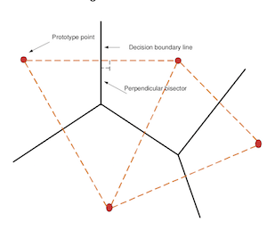
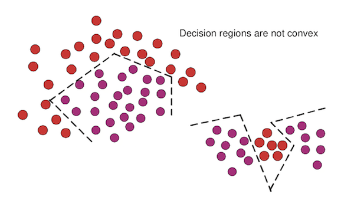

##分类(classification)

基于生成模型

* Bayes-decision-rule

基于判别模型

* intro 什么是判别模型
* minimun-distance-classifier

## Bayes decision rule

### 什么是贝叶斯公式

已知事件A,B发生的概率分别为 P(A), P(B), 那么两者的相互的条件概率(conditional probability)分别可以表示为: P(A|B) , P(B|A).

P(A|B) =    得出 P(A & B)  = P(A|B) * P(B)

P(B|A) =    得出 P(A & B)  = P(B|A) * P(A)

所以可以推出 =>  P(A|B) * P(B) = P(B|A) * P(A) 稍加变形就是**贝叶斯公式** :

#### P(A|B)  = 

### 贝叶斯公式的小例子

**假设以硬币举例** 

- 假设已知硬币正面, 反面朝上的概率分别为 P(正)  P(反) 叫做 **先验概率((Priori Probabilities)**
- 在已知先验概率的情况下, 求在硬币为某一属性 *X* 下, 正面的概率为 : P( 正 | 硬币 = X) 叫做后验概率(**posterior probability**)

例如, 我们现在抛硬币, 且知道硬币有三种类型(数据属性) c$_1$ = 大 ,  c$_2$ = 中 , c$_3$ =  小 , 得到的结果为正, 反(输出类型), 其中30次反面, 70次正面. 在反面时, 小硬币出现6次. 正面时, 小硬币出现7次

所以我们的任务就是求的后验概率 **当观察到硬币为小硬币, 其结果分贝为正反的概率**, 根据贝叶斯公式 : 

P(正 | 硬币 = 小) = {P(硬币 = 小| 正面) * P(正面) / P(硬币 = 小)

P(硬币 = 小) =  = 0.13

P(硬币 = 小 | 正) =  = 0.1

P(正)  =   

所以可以求出概率 = 0.54 , 说明**当硬币是小硬币的情况下, 它抛出正面的概率为0.54** 

### 贝叶斯方法在机器学习分类中的应用

这种方法假设我们已经完全知道了每个分类的 **先验概率(Priori Probabilities)** , 即我们知道如果结果有 *C* 类, 那么P(c$_1$) , ... , P(c$_c$) 我们都知道.

**这种方法应用到机器学的分类中本质就是需要: 根据先验概率(建模时获得), 在观察到新的数据的属性X时候, 求的它的后验概率(posterior probability)的过程**

#### bayes 算出所有类的后验概率

即对于所有的 

然后根据所有的后验概率找到最大的那一个 Max P(c$_w$ | X), 记为该数据属性的分类 c$_w$

P(c$_i$ | X) = 

其中 P(X) 的概率都一样 : P(X) = 

所以有了结论, **我们将X归于类c$_i$当且仅当** (Bayes' rule minimum error):

#### &space;p(x|c_k)&space;*&space;P(c_k)&space;k&space;=&space;1,&space;...,&space;w&space;k\neq&space;i" title="P(x|c_i) * P(c_i) > p(x|c_k) * P(c_k) k = 1, ..., w k\neq i" />

### Bayes 方法优缺点

#### 优点

- **贝叶斯决策理论是最优的**, 因为只要观测到数据属性为 *X* , 然后选择后验概率最大的结果, 就可以**最小化预测错误的概率(Bayes decision rule for minimum risk)可以证明. **这个结论对所有的观测值 *X* $\in$ All_features 都成立 , 从而可以保证预测错误的概率最小, 从而达到最优.	
- **可以调节先验概率和观测现象之间的平衡**, 即有了Bayes方法可以使得预测结果不仅仅依赖于先验概率, 还一部分取决于观测的现象(数据属性 *X*)

#### 缺点

- 我们通常是无法获得先验概率(prior class), 条件概率(conditional densities)等计算要件. 要获得只有从数据中进行估算(比如上面抛硬币的例子), 所有肯定和真实的概率分布有误差.
- 往往在实际中, 要观察的特征不知一个(不仅仅为大中小), 可能会面临成百上千个特征属性. 所以在计算的时候, 会遇到**维度灾难(the curse of dimensionality)**, 时候计算的数值很不稳定. 所以才会发展出**朴素贝叶斯方法的平滑(smoothing)**去解决这个问题

## Intro to 判别模型 (Discrimitive Model)

判别模型中, **不用去考虑联合概率分布**, 条件概率分布 等等.  而仅仅是依靠了**判别式(Discirmitive function)去根据我们输入的特征向量去引导一个判别规则**

即 :**判别式技术依赖于判别方程而不是数据本身的分布**, 且判别式(主要参数)的形成依赖于training procedure

### 利用判别模型的例子

#### 二分类

假如应对一个二分类的问题 **two-class problem**, 我们的判别方程为(Discirmitive function)

假定 x 是我们输入数据的特征向量.

给定一个判别方程 h(x) :

h(x) > k => x $\in$ c$_1$  

h(x) < k => x $\in c_2$

(k 是一个常数)

#### 多分类

如果是**多分类的问题**, 我们可以将*x*归于类$c_i$当:

g$_i$ (x) > g$_j$(x) => x $\in c_i$ j = 1,...,C; j$\neq$ i	(即给予判别式算出来的值是最大了便可以归为这一类)

### 线性判别式 (Linear discriminant function)

判别式是线性模型的可以称为线性判别式 , 例如输入属性为 *x* = [x1, x2, ... , x$_n$] 

g(x) = wT*X*  + $w_0$ 

利用线性判别式的分类器可以称为 *Linear machines*

## 最小距离分类器(minimun-distance classifier)

### 原理

利用了 *Nearest-neighbour decision rule* 的思想 : 假定现在有n类 $c_i$  

给每一个类可以选出一个 **类代表** (可以是每一个类的中位数(the mean of class) etc. ) , 对应的记为 

这里的 $P_i$ 维度必须和**输入数据的属性维度一样**, 既可以看作可输入数据一样的在**坐标轴上的一个个的点**, 这些点就分别代表了他们各自的类

现在Classifier的思想就是 : **输入一个数据 *X* , 分别计算这个数据和各个点 $P_i$ 的距离$^{[1]}$, 取距离最近的那一类归位这个点的类**

<small>[1] : 这个距离可以为 **欧式距离, 曼哈顿距离, etc.**, 但是一般在坐标轴上就是欧式距离</small>

### 实现公式

假设输入点为 *X*  = [x1, x2, ... , x$_n$] , 点$P_i$为 P = [p1, p2, ..., p$_n$] 

那么这两点的距离可以记为 : Dis(X, P$_i$) = |X - P$_i$|$^2$  = $X^TX$ - 2$X^TP_i$  + $P_i^TP_i$

因此我们只需要一次计算 X 和 各个 P$_i$ 之间的取最小的距离即可 

Min$_i$ Dis(X, P$_i$)  i $\in$ 1, 2, .... n (number of classes), 其实观察之后可以发现每个距离的第一项 $X^TX$ 等相等, 则可以不用计算, 式子变为 : 

**The class assigned to is :**

$w_i$  = min$_i$(- 2$X^TP_i$  + $P_i^TP_i$)   = max$_i$($X^TP_i$  - $\frac{1}{2}P_i^TP_i$)

结合到我们线性分类器的公式中 :

### 图示

- 可以看到经过最小距离形成的决策界就是两点(prototype)连线之间的垂线(perpendicular)
- 且这个线性分类决策区域是 **always convex** 的

### 分段线性判别式 (Piece-wise linear discriminant function)

- 线性机器很简单, 但是有一个问题就是他们形成的决策界有一个问题就是, **决策界是凸的 convex**

  从而解决不了一些复杂的分类问题 (如下图的问题用简单的线性机器就解决不了)

  

对于分段的线性判别式, 我们的思想就是对于: **每一个类, 我们可以安排多个Prototype**

- Suppose there are n$_i$ prototypes in class $w_i$  which is 	

- 然后我们将 *X* 归位类 $w_i$ 当且仅当:

  g$_i$(x) = max$_{j=1,...,n_i}$ $g_i^j$ (x)

