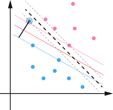
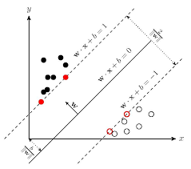
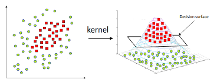
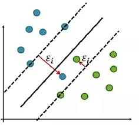
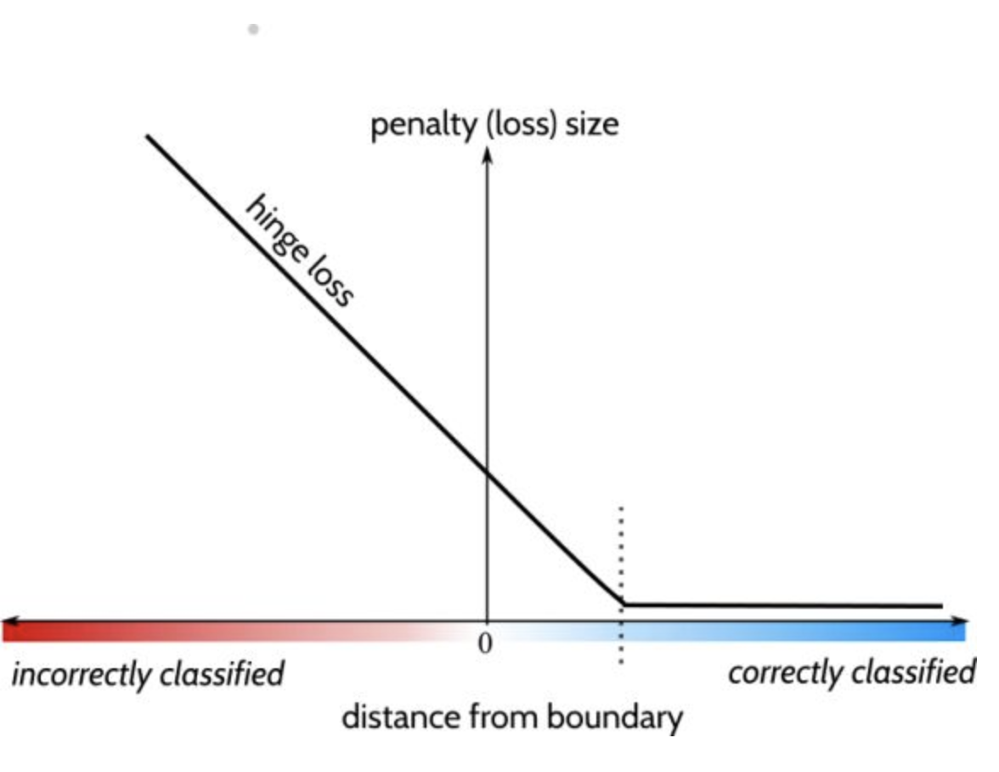

## 支持向量机(SVM)

> [李宏毅 SVM](<https://www.youtube.com/watch?v=QSEPStBgwRQ>)

### 什么是SVM

Support Vector Machine 一般而言是解决**分类问题**的,属于**监督学习**的一种. 

通俗的说SVM就是在分类问题中那个可以 **完美区分** 不同类的线(二维). 所以何为完美区分? 以一个二维的二分图为例:

图中这条线的完美在于: **它恰好在两个类的中间, 且其与两个类中最近点的距离相等** . 也就是说, SVM旨在**最大化决策界和最接近决策界的点之间的距离**. 即, 这个决策界的位置和最靠近它的点有关, 如图**左右的红点**. 这些点即叫做**Support Vector**

* Support Vectors : 是可以划分的最小子训练数据集, 是这个子数据集最决定了决策界的位置. (不同于MLP, MLP的权重依赖于整个数据集)
* 这个模型拥有非常好的鲁棒性, 对于局部扰动的容忍性非常好, 对于未见的数据**泛化**特性很好

#### SVM 分类:

SVM 的 **形式以及求解过程** 可以分为以下几种情况:

* 线性可分的SVM
* 线性不可分但是可**通过高维映射**线性可分 (Kernel核函数)
* 无论哪种高维映射都不可分 (软间隔)

### 线性可分的SVM

#### 线性SVM基本形推导

假设一个**二分类问题** ,  给定一个数据集 : . 且label标签属于{-1, +1}

假设数据记具有n个属性构成, 即  那么我么的超平面(haperplane)可以线性表示为 : 

 (其中w是n维的向量)

所以线性可分的SVM : **意味着我们可以利用这个线性表示的超平面可以将两个数据集完美的分开!!!** , 所以在线性可分的SVM中.**我们的优化目标 :  就是找到这个 w, b 其中这个超平面距离两个数据集最近的点有最大的距离[1]** , 接下来我们便开始求这个超平面 (w, b).

首先可知如下结论 :

* 任意一个数据点 (xi, yi) 离这个超平面的距离为 :  (点到线的距离公式)
* 超平面的法向量 W 可以表示为 (w1, w2, ... , wn)

那么如果这**两个数据集是几个是线性可分的**, 那么**一定存在如下的(w, b)**使得 support vectors满足如下关系:

</a>	 在图像上可以描述为一定存在一个(w, b)使得两个数据集的support vector 可以刚好在离超平面左右距离为1的平移超平面上(**证明见本节末**), 如图: 

由于两个集合的支持向量到超平面的距离相等, **有两边支持向量到超平面的距离和为 : 2/|w| (即为Margin)** 

从而我们有了我们的**优化的目标函数** :

且需要满足限制条件如下 :

**简单来说, 要找最优的w,b满足其和支持向量的距离最大, 且可以正确的分类**

为了求解过程的方便, 我们将这个求最大值问题转化为求最小值问题, 其上述问题和下面等价:

 s.t. 

**至此我们得到了SVM问题的基本型**

#### 线性SVM目标函数求解方式

##### 1. 凸二次规划(convex quadratic programing)的方式求解

对于 下面的式子和限制条件, 我们可以直接用**优化计算包**来实现计算

 s.t. 

##### 2. 拉格朗日乘子(lagrange multipliers)方法求解

* **拉格朗日乘子的方法可以将 n 个变量, m个限制条件的问题, 转化为 m + n 个变量的无限制条件的问题**

在这个方法中, 我们必须 **给每个限制条件加一个拉格朗日乘子** , 假设我们的数据集有m个, 那么我们的限制条件就有m个(保证我们所有的点都可以被正确分类), 从而加入拉格朗日乘子后, 新的目标函数如下 :

之后我们再分别对各个变量求偏导数, 另其为0 可得 :

从而我们将这两个约束条件可以带入L(w, b, alpha)从而得出我们原来优化函数的**对偶问题(dual Problem)**即为 **新的目标优化函数** : 

	

Subject to:

 

**解出alpha之后, 便可以解出我们的 w, b从而得到模型**

其中

	其中便是其中一个支持向量的值[2], 带入即可

<small>[1] 何为最大距离 ?  想象一下数轴两点间 A, B, 有一个点C离这两个点有着最大的距离 : 这个点C必为A,B中间</small>

<small>[2] 因为支持向量就在这个超平面左右平移1的超平面上, 所以得到w后找一个支持向量带入即可</small>

#### 证明 : 支持向量为什么是在这个左右平移1的超平面上

已知任意点到超平面的距离为 :

    

所以我们假设需要两边集合的点还是要距离这个超平面有一定的距离, 而不是刚好在超平面[1]上. 假设期望的距离设置为 d 根据点到线的距离公式我们有:

既然d>0, 那么我们在等号的两边同时乘以d, 等到:

这个式子里面的Wd, bd 就可以看为新的W, b. 只不过是经过缩放的结果

<small>[1] 如果刚好在超平面上, 则线性可分的前提条件就不满足.</small>

### 高维才可分的SVM

还是考虑二分类问题, 很多时候在二维平面上, 我们的两类数据记并不是线性可分的, 但是**映射到高维后, 便可以通过一个超平面分隔开来**, 这时候便要用到 **Kernel(核函数) Trick** 如下图:

结论 : **如果原始的空间是维度有点限, 即数据的属性有限, 那么一定存在一个高维特征空间可以将样本可分**
假设我们样本点 x 映射到高纬度空间表示为  所以利用Kernel Trick的思想步骤如下 :

1. 在将样本点进行高维映射后, 我们的模型可以写为:

2. 用映射函数替换我们的线性SVM的目标函数可以得到在Kernel Trick下的目标函数:

     <a href="https://www.codecogs.com/eqnedit.php?latex=s.t.&space;\quad&space;y_i(1&space;-&space;(w^t\phi(x)&space;&plus;&space;b))&space;>&space;0" target="_blank">&space;0" title="s.t. \quad y_i(1 - (w^t\phi(x) + b)) > 0" /></a>

3. 从而其拉格朗日乘子法下的对偶问题为 : 

   

    s.t. 

4. 到这一步我们不需要求出数据集各自在高维空间的映射然后再求相互的内积(inner product), 而可以直接子原样本集合上通过 **核函数(Kernel)** 直接得到高维度上的高维映射后的内积, 此种函数我们叫做核函数 :

   K(x, y)  = <$\phi(x)$ , $\phi(y)$> = $\phi(x)^t\phi(y)$

5. **最后的模型可以写为, 注意此时不是先求w了**

   

### 	找不到高维可分的超平面的SVM

#### 加入Soft Margin的基本形

前面的问题中, 我们一直假定两个数据集是线性可分的, 又或者是高维度后线性可分的, **但是事实上我们很难找到相应的超平面** , 这种情况下我们就需要一定的容错机制了, 从而我们引入**软间隔(Soft margin)** 的概念 

这种情况下, 我们允许有一定的不满足线性束缚的样本点出现, 但是当然要越少越好, 如图可观察到有两个点不满足于线性约束:

从而在这个想法上,我们在目标函数可以加入一项可以约束最少的点可以不满足要求, 从而我们的**目标函数可以改写为 :** 

其中这个Loss函数为 “0/1损失函数” : L(x) =1 if x <0 ; L(x) = 0 otherwise;

从而新加的一项为统计表示 **分类不对的点的个数**

但是这个"0/1损失函数"的数学特性很差, 非凸, 非连续, 所以我们经常用这个函数的**替代函数(Upper Bound)**来进行我们的Minium工作, 通常有以下几种: 

* Hinge 损失
* 指数损失 (Exponential loss)
* 对率损失 (Logistic loss)

#### Hinge Loss

我们决策界记为f(x). 那么我们肯定希望,

* **当标签为 +1 的时候, 我们的f(x)越大越好, 因为f(x) > 0 的预测结果就是 +1**
* **当标签为 -1 的时候,  我们的f(x)越小越好, 因为f(x) < 0 的预测结果就是 -1 **

所以我们引入**第n**个样本的 label 和 f(x) 乘积.描述loss. 即 y*f(x) 为正数, 说明预测正确. 即 y\*f(x) 越大, 然后希望此时的L(y\*f(x))越小越好

 :  对于的图像如下 (横轴为y\*f(x)), 纵轴为loss)

可以看到, 在正确分类的情况下, **这个模型不要求 y\*f(x) 的乘积有多大. 而是在某个值(+1)将Loss一律的归位0** , 这个就是这个模型的要点, 其中有如下解释 :

* y * f(x)[2] 乘积远大于 0 说明 : **模型已经将这个点正确分类, 且这个点离决策界非常的远**
* 在 y * f(x) 大于一定值(+1)的时候, loss直接都被归于0, 说明分类正确且离决策界一个设定margin的点, 是会被当为**完美点**的, 这些点就不会影响到决策界了. 

##### Tips for Hinge Loss:

- Hinge loss比较**不怕异常点 (Outliers)**
- Hinge Loss 是凸(convex)的, 所以对于梯度下降很容易优化, 在某些点不是可微分的. 但是**还是可以用梯度下降方法.**

##### 通过Hinge Loss 改写我们的SVM损失函数

引入了Hinge Loss 后, 我们的用它替换我们的"0/1损失函数", 得到如下的目标函数 :

我们将后面这一项用一个松弛变量  >= 0 代替, 从而我们有了下面的式子 : 

	(**这便是常用的软间隔支持向量机**)

这个松弛变量最直观的含义就是, 允许我们的样本点不需要严格的在**超平面左右平移1的超平面外, 而是允许有一段容忍距离为  ** 用式子描述即为 :

