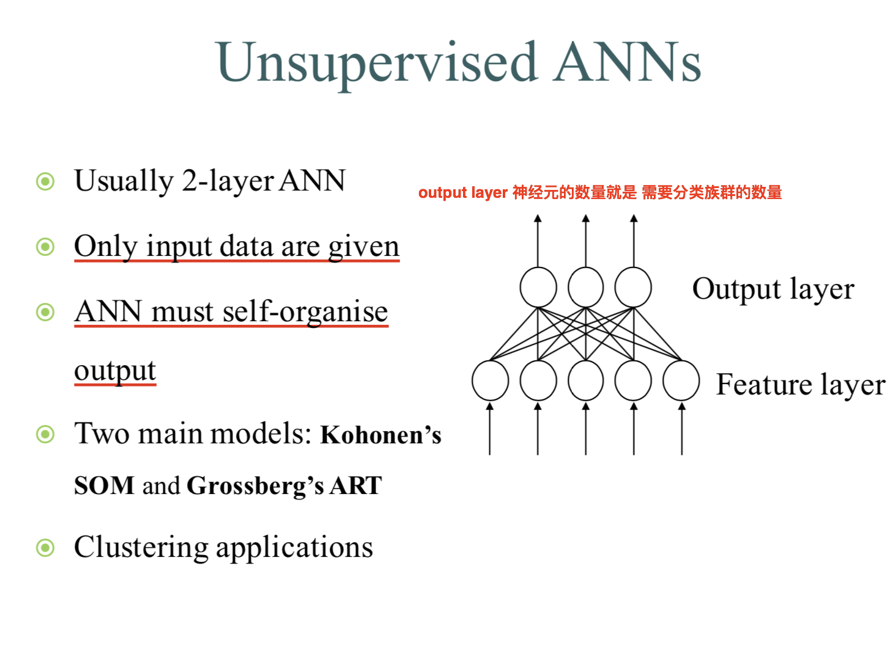
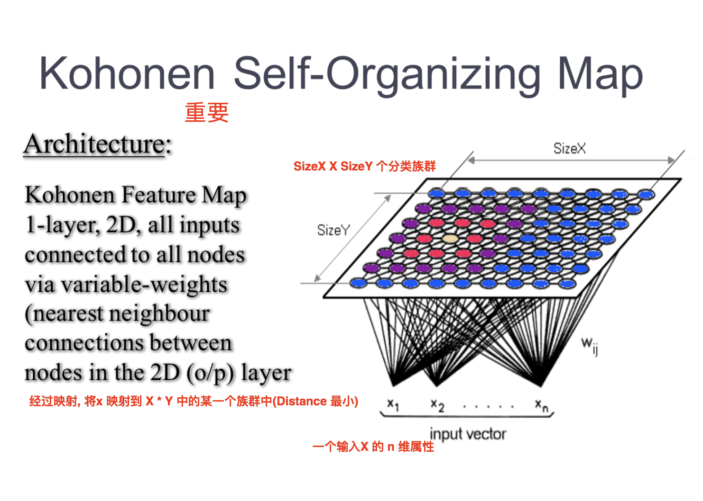

## 非监督学习的ANN

### Intro to 非监督学习ANN

* 属于非监督学习的ANN, 通常涉及到聚类(clustering)的过程
* 可以用于**降低分类的过程的输入数据的维度**

**一般的非监督学习ANN的结构如下 :**

**一般只有两层网络, 即输入输出层, 是聚类的一直应用**

非监督学习ANN 一般有如下两种方法 :

* SOM
* ART

### SOM

#### SOM的基本目标

* **Store a large set of input vectors x** by finding a smaller set of prototypes w so as to provide a good approximation to  the original input space 

* **可以将高维的输入数据映射到低纬空间, 可以将高维空间中相似(in distance terms)的样本点, 映射到输出层的邻近**

* 也是受到了**人类的大脑结构, 特别是局部活动结构的启发** , 更加具体的说, SOM基于人类大脑使用了空间映射的方式去处理复杂data

* 我们可以认为SOM是竞争学习(Competitive Learning)的一个扩展(Extension), 其中输出unit以某种方式排序.
* 输出的ordering是由用户去选取的, 由用户去定义每个神经元的邻居. 这些ordering在训练过程中一直保持不变. 

#### SOM的结构图

* 如图 SizeX , SizeY 是用户预定义的
* 输出层的每一个node, 都会和输入层数据的所有featrues全链接, 从而每一个node有着它的给自的Weight, 且这个Weight的维度和输出数据的维度一样(因为是全链接)
* 每个node的邻居就是图上的几何邻居

### SOM的学习算法

#### 学习算法

-- 初始的时候, 所有的node都被randomly组织 ,但后最后输出的时候, 会形成一个self-organized feature map

-- 输入数据需要给输出层的每一个node比较计算距离, 然后选出一个**Minimun distance**, 作为这个输出数据的映射数据

#### 更新策略

在每一次映射数据的时候, 都会让输出层相应点的权值更新(并不是所有的都更新). 

##### 策略1

公式可以写为 : wj(t+1) = wj(t) +g(t)hj,i(x)[x(t) - wj(t)]

* 每次更新的时候, 不仅更新激活节点j, 而且更新j临近的节点, 这个邻近节点就是用hj, i(x) 函数(一般就是**高斯函数**)算出来的, 离激活节点j越近, 其改变的权值越多
* 简单来说, 就是使得激活节点, 及其周围的节点更加的像输入节点, 从而之后更加的吸引和该输入类似的节点
* g(t) 是一个 gain term, 应该随着时间越来越少

##### 策略 2 “winner-take-all”

就是只更新激活点

### Bayesian Classifiers

根据priori (before) probability 计算  posteriori (after) probabilities, 一般默认priori分布是高斯

### Vector Quantization

要看, 很难

LVQcanbeviewedasaformof Competitive Learning, which forces the nodes to focus on **boundaries between classes**

w(t+1) = w(t) +/- h(t) [x(t) - w(t)]

