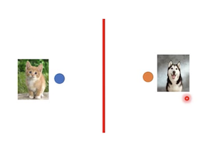
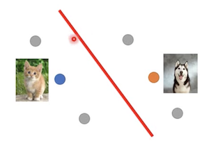
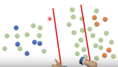
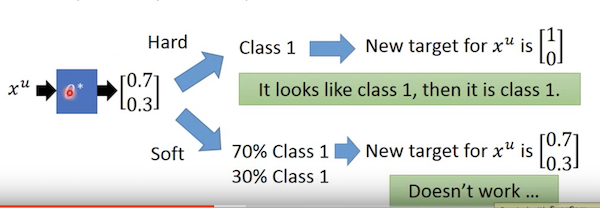
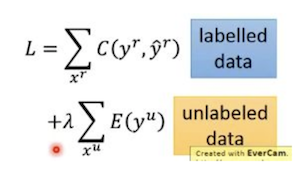
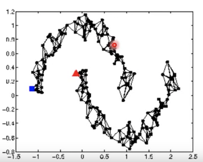
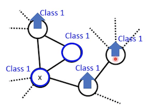

半监督学习(Semi-supervised learning)

半监督学习的Classification问题

>[李宏毅教授半监督学习视频](<https://www.youtube.com/watch?v=fX_guE7JNnY>)
>
>[知乎半监督学习笔记](https://zhuanlan.zhihu.com/p/34459160)

### 1. intro

#### 1.1 半监督学习数据集分类

* 同时有两种数据集 : **带标签的和不带标签的**
* 数据集的数量上**不带标签的数据  >> 集带标签的**

#### 1.2 半监督学习分类

半监督学习又可以分为两种 :

1. Transductive learing : unlabeled data is the testing data

**注意只用testing set的feature而没有用testing set的label**

2. Inductive leanring : unlabeled data is not the testing data

#### 1.3 为什么我们要用半监督学习?

因为我们收集数据其实很简单, 但是收集一些带有'label'的数据却 expensive, 如果只用有label的数据集, 则数据集的数据很可能达不到机器学习训练数据集的标准.

#### 1.4 为什么半监督学习helps?

* The distribution of the unlabeled data tells us somethings. 虽然没有标签, 但是也告诉了我们一些信息!

只考虑有label data的数据集时我们的分类界

考虑了unlabeled data(灰色的点)的时候, 我们会调整我们的分类界

### 2. Generative Model "生成模型"

首先复习一下什么在**监督学习里面生成模型是怎么作用的**

### 3. Low-density Separation "非黑即白"

* Assumption : 此种方式基于的假设是, **在两个class的交接处是不会出现data的, 即data量很低**

如图, **在两个class中间很容易区别**, 且如果利用unlabeled data会得到跟好的决策界

#### 3.1 Self-training 方法(很常用的方法)

可以概括为以下的几个步骤: 

1. 利用已经有**label的dataset中训练出一个模型 : f** , 训练的方法可以是任意的机器学习的方法.

2. 将没有label的数据至于模型 f 中, 得到相应的标签 这里的数据集称为**Pseudo-label**

3. 然后从刚刚训练的Pseudo-label数据集中**拿出一些数据加到label set**
4. 形成新的数据集重复以上步骤

**注意这种方法只能用在分类的问题上, 回归的没有任何作用的**

以**神经网络作为训练模型举例** : 

用已经训练好的模型去预测一个无标签的数据, 得到的向量为[0.7, 0.3], 即0.7概率在class1, 0.3概率在class2. 此时用self-training的方法和generative model的方法变产生了分歧

* self-training : 用**Hard label**(低密度的思想) ==>即此时将数据归位class1, 即将该数据投入训练的标签为[1, 0]
* generative model : 用 **soft label** ==> 还是用[0.7, 0.3]的标签去投入训练从而没有任何作用

##### 3.3.1 entropy-based Regularization

**利用Hard-label的self-training的提高进阶版**

**引出问题** : 由于利用hard-label的太过武断, 如果碰到两边class概率相差不多的情况下, 就直接归位其中略高的一类可能会产出归类错误.

从而引入了**分布熵(distribution entropy)**的概念来表示输出的分布的分散程度. 明显, 我们基于Low-density的是**希望一个unlabel数据的输出的概率分布越集中越好**.

如下举例子 : 

输出的概率分布集中在class1

输出的概率分布集中在class5

输出的概率分散于5个class

显然在**基于非黑即白的**假设中, 前两个是我们希望的.而最后一个输出的结果为[0.2, 0.2, 0.2, 0.2, 0.2]明显是非常差的结果

这种**输出的概率分布的分散程度, 我们可以entropy来表示** : 描述一个分布的分散程度的信息熵得公式为:

E(y$^u$)  = - $\sum_{m-1}^{5}y_{m}^{u}ln(y_{m}^{u})$

**$y_{m}^{u}$ 为这个u这个unlabel数据的归位m类的概率**, 我们可以计算以上几种分布的信息熵

E(FirstOne) = E(SecondOne) = 0

E(ThirdOne) = ln(5) 

总结来说 : **信息熵越低的分布越集中**, 这也是我们想要的结果

Based above : 我们可以在模型的Loss function中加入信息熵这一项, 从而得到新的Loss Function

加入信息熵的损失函数

基于这种方式, 由于这个式子依然是可以微分的, 所以我们依然可以用梯度下降的方法来优化这个函数

### 4. Smoothness Assumption "近朱者赤 , 近墨者黑"

* Assumption : 如果两个数据, 有相似的x, 那么它们的label y 也会相似.

* More precisely : unlabeled 数据不是均匀分布的(x is not uniform), 如果两个数据的 x 在**高密度的区域**是相近的, 那么他们的标签y就是一样的.

显然在更加精确的描述下更为合理, 如下图:

三个unlabeled点的分布和它们附近区域的分布

在这种假设下, x$^1$ 和 x$^2$ 在高密度的区域临近, 所以得出结论:

*  x$^1$ 和 x$^2$ 是一类
*  x$^3$ 和 x$^2$ 不是一类

**这种假设方法在image识别中可能不是太有用**

#### 4.1Cluster and then label 的方法

这种方式很容易实现, 假设我们只有两个分类class

两个class的分布图

1. 首先我们需要将所有的数据(包活label 和 unlabeled)进行聚类
2. 划分出相应的**高密度的区域**
3. 根据每一个不同高密度区域的**已知的label数据给这一整个数据区域的所有数据标上label**
4. 将标完数据label的数据视为有标签的数据进行模型训练

#### 4.2 Graph-based Approach

##### 4.2.1 Build a graph

**核心点就是** : How to know x$^1$ and x$^2$ are close in a high density region ?

所有的数据表示为图中的点

这种方法的思想就是 : 用**图的方式**去表示这些data points, **如果不同的数据点在图中相连, 则归位一类. 否则无论它们距离有多近, 都不能算为一类**

难点在于, 如果去建立一个图:

* 有些时候, Graph representation is nature to get sometimes E.g. Hyperlink of webpages(网页之间可以用超链接来表示亮点之间的连通), citation of papers (同理, 论文可以用Reference的方式表示)

* 一些时候只有自己凭借经验去建立这个Graph Representation. 通常是根据以下的流程

  1. Define the **similarity** s(x$^i$, x$^j$) between x$^i$, x$^j$ 即算出点之间的相似度 

  2. Add edge (算出相似度之后就可以画出graph) 建立graph也有以下几种方法:

     * K Nearest Neighbor : 选取一个点周围的最近的三个点连接
       

     * e-Neighborhood  选取一个点附近小于 e 的点连接

**Tips计算相似度常用的方法为 Gaussian Radial basis Function :**

S(x$^i$ , x$^j$) = exp(-$\alpha$ |x$^i$ - x$^j$|$^2$)

##### 4.2.1 建立图后给unlabeled数据贴标签

在建立了一个图之后, **我们给已知的标签的数据其相邻的数据 其属于class1的概率会增加**, 同理这个过程会传递给所有相连的数据

##### 4.2.3 以定量的思想去定义点的Smoothness

为图的节点不同分类计算顺滑度

我们可以定义的 图的顺滑度为 S(G) = 1/2 $\sum w_{i, j}(y^i - y^j)^2$ 前面的系数不重要, 通俗来说顺滑度就是所有相邻节点的label差的平方乘它们的权值 的合. **Smaller means Smoother**

对于左图 : S = 0.5 

对于右图 : S = 3

**计算出来明显左图的顺滑度更高, 所以更符合要求**

##### 4.2.4 给模型添加有S项的损失函数

**简化S函数** : 

 S(G) = 1/2 $\sum w_{i, j}(y^i - y^j)^2$ = y$^T$L y  

其中 L (Graph Laplacian) = D - W

以上图为例 : 

上图的L求解

W 就是这个图的连接矩阵, D 就是 **W每一行的和放在了对角线的位置**

从而定义 L = D - W

从而可以给我们的模型的损失函数loss function添加一项 s: 

New_loss = old_loss + $\alpha$S 从而将此方法应用到我们的模型训练中

