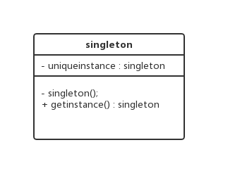

[TOC]

# 一. 概述

设计模式是 **解决问题的方案**，学习现有的设计模式可以做到经验复用。

拥有设计模式词汇，在沟通时就能用更少的词汇来讨论，并且不需要了解底层细节。

# 单例 (Singleton)

## 意图

确保一个类只有一个实例, 且提供这个实例的全局访问点

## UML 设计图

* 私有的 构造函数, 可以使得该类不被外界构造
* 私有的 静态变量
* 共有的 静态函数 : 只能通过公有静态函数返回唯一的私有静态变量

## 应用以及线程安全问题

* 饿汉式
* 懒汉式

**1. 饿汉式**

~~~java
/*
	饿汉式
*/
class Single{
    private static final s = new Single();
    private Single(){}
    public static Single getInstance(){
        return s;
    }
}

~~~

共享数据 s 使用只有一行代码. 饿汉式 是线程安全的

**2. 懒汉式**

~~~java
/*    
	懒汉式
*/
class Single{  
    private static s = null;    
    private Single(){}    
    // 用的时候才实例化     
    public static Single getInstance(){          
        if(!s){           
            s = new Single();        
         }        
        return s;   
    }
}
~~~

**懒汉式不是线程安全的**

原因 : 实例化 s 的时候 ,可能进来多个线程, 从而实例二个及以上的 单例实例. 从而不符合单例设计思想

**懒汉式改进 I**

~~~java
/*    
	懒汉式 线程安全改进 I
*/
class Single{  
    private static s = null;    
    private Single(){}       
    /*
    	用的时候才实例化  
    	加入同步函数的方法
    	使得每次获取实例的时候, 都要检测一次
    	使得程序效率较低
    */
    public static synchronized Single getInstance(){   
        if(s == null){
            if(!s){           
                s = new Single();        
            }        
        }
        return s;   
    }
}
~~~

**懒汉式改进 II**

~~~java
/*    
	懒汉式 线程安全改进 I
*/
class Single{  
    private static s = null;    
    private Single(){}    
    // 用的时候才实例化     
    public static Single getInstance(){   
        
        /*
        	检测 s 是否等于 null
        	是为了提高安全性检测的效率
        */
        
        if(s == null){
            
            // 加入 线程安全同步
            synchronized(Single.class){
                if(!s){           
                    s = new Single();        
                 }        
            }
            
        }
        return s;   
    }
}
~~~

# 装饰者

在不修改原来代码的情况下, 对原来代码功能的代码进行增强, 那么新类就叫做 **装饰者** 

注意 装饰者 **是一个新类** , 而不是原来代码的装饰类

~~~java
class Person{
    void eatFood(){
        s.o.p ("eat food");
    }
}

/*
	我们 建立一个新类 去增强这个 Person 的 eatFood 方法
	这种设计, 叫做 装饰者 思想
*/
class NewPerson{
    
    private Person p;
    
    NewPerson(Person p){
        this.p = p;
    }
    
    /*
    	装饰者方法, 增强了 eatFood 方法
    */
    void eatFood(){
        S.o.p("Drink Coffee");
		p.eatFood();
        S.o.p("Eat cookies");
    }
}
~~~

## 装饰者 和 继承设计的区别

通过观察上面的 装饰者类, 我们也可以通过继承 Person 的方法去扩展 eatFood 方法, 那么两者有什么区别

* 如果每次要改进一个类的功能, 那么都要继承这个类而产生继承关系, 会导致这样的继承体系会非常的臃肿, 不够灵活
* 所以我们 直接 设计一个类, 然后在 类里的构造函数和 要修饰的类进行关联. **从而更加灵活**

# 模版方法

